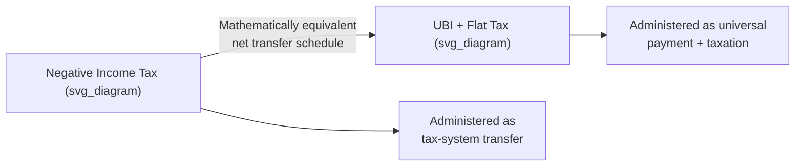
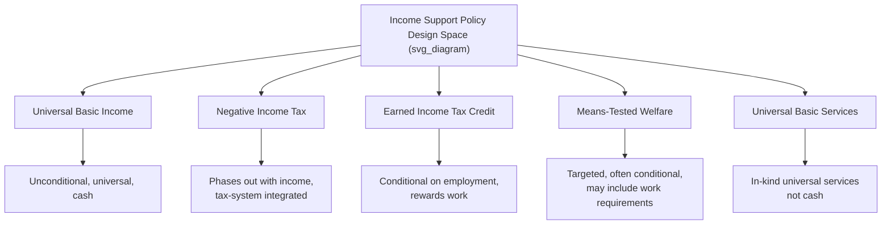

## Universal Basic Income Debates

### Introduction and Scope

Universal Basic Income (UBI) is a proposed policy under which the government provides a regular, unconditional cash payment to all individuals (or all citizens/residents) regardless of income, employment status, or need. This topic examines UBI's theoretical foundations in welfare economics, its design variants, the economic arguments for and against it, empirical evidence from pilot programs, and its position relative to alternative social welfare architectures.

### Defining Characteristics

**Key Points**

A policy is typically classified as "true" UBI if it satisfies four core criteria, distinguishing it from adjacent but distinct programs:

| Criterion | Description | Contrast |
| --- | --- | --- |
| Universality | Paid to all members of a defined population, not means-tested | vs. targeted transfers (e.g., SNAP, TANF) |
| Unconditionality | No work requirement or behavioral condition attached | vs. workfare or conditional cash transfers |
| Periodicity | Paid on a regular, recurring basis (e.g., monthly) | vs. one-time payments |
| Cash (not in-kind) | Recipients have full discretion over spending | vs. food stamps, housing vouchers |

Policies satisfying only some of these criteria are often labeled with adjacent terms: a **Negative Income Tax (NIT)** phases out with income (violating strict universality in net terms though often structurally equivalent above a threshold); a **Universal Basic Services (UBS)** model provides in-kind services rather than cash; a **Guaranteed Minimum Income** may be means-tested and conditional.

### Theoretical Foundations

**Welfare Economics Rationale**

- UBI can be framed as a direct response to **poverty traps** created by high effective marginal tax rates in means-tested welfare systems, where benefit withdrawal as earned income rises can create disincentives to work at the margin of eligibility ("welfare cliffs").
- Standard consumer theory suggests unconditional cash transfers are **weakly welfare-superior to in-kind transfers of equal cost**, since cash allows recipients to reach a preferred point on their own budget constraint, whereas in-kind transfers may constrain choice below the recipient's optimal allocation (assuming no externality or paternalistic rationale for restricting choice).

$$U(x^*) \geq U(x_{in\text{-}kind}) \quad \text{for equal-cost transfers, under standard non-satiation and rational choice assumptions}$$

- Critics of the pure welfare-economics framing note that in-kind restrictions (e.g., housing vouchers, SNAP) may be deliberately paternalistic or designed to address externalities and information asymmetries (e.g., protecting children's nutrition), meaning the "cash is always weakly better" result does not automatically settle the policy debate. [Inference: this is a standard economic caveat rather than a resolved empirical claim about optimal transfer design]

**The Negative Income Tax Equivalence**

Milton Friedman's Negative Income Tax proposal is mathematically related to UBI combined with a flat tax:

$$T(y) = t \cdot y - G$$

Where $T(y)$ is net tax liability at income $y$, $t$ is the marginal tax rate, and $G$ is the guaranteed minimum income (grant). When $T(y) < 0$, the individual receives a net payment from government.

A UBI of amount $G$ combined with a flat tax rate $t$ on all income (including the UBI itself) produces an equivalent net transfer schedule to an NIT with the same parameters — a key theoretical link connecting the two policy families, though implementation, administrative visibility, and political framing differ substantially.

### Economic Arguments in Favor

**Key Points**

- **Poverty and inequality reduction**: A sufficiently large UBI mechanically raises the income floor, directly reducing measured poverty rates (holding funding mechanism aside), and can reduce inequality depending on how it is financed.
- **Administrative simplicity**: Removing means-testing eliminates the administrative costs and compliance burdens of eligibility verification, and reduces the "welfare cliff" disincentive structure inherent in phased-withdrawal programs.
- **Response to automation and labor market disruption**: A prominent contemporary argument holds that accelerating automation and AI-driven displacement may structurally reduce labor demand for a growing share of workers, and UBI is proposed as an income floor decoupled from employment status to address this. [Speculation: the magnitude and timeline of AI/automation-driven structural unemployment is genuinely contested among labor economists, and UBI's necessity as a response depends on empirical questions about labor market adjustment that remain unresolved]
- **Increased bargaining power and reduced labor market coercion**: Proponents argue a guaranteed income floor could improve individual bargaining position in low-wage labor markets, reducing exploitative arrangements workers might otherwise accept out of necessity.
- **Support for unpaid and non-market labor**: UBI could recognize and support care work, volunteering, and other socially valuable but currently uncompensated activities.

### Economic Arguments Against

**Key Points**

- **Fiscal cost**: A UBI set at a meaningful income-replacement level is extremely expensive in aggregate; providing even a modest per-person payment to an entire national population multiplies quickly against population size, often exceeding the cost of existing targeted programs at comparable poverty-reduction efficiency. [Inference: exact cost comparisons depend heavily on the specific UBI amount, population covered, and financing mechanism assumed — general claims about relative cost-efficiency require specifying these parameters]
- **Labor supply disincentive effects**: Standard labor-leisure tradeoff theory predicts an unconditional income effect could reduce labor supply at the margin (fewer hours worked, later re-entry into work after job loss), though empirical magnitude is disputed and appears smaller than critics initially feared in several studied pilots. [Unverified: labor supply effects vary by study design, population, and UBI generosity; findings from specific pilots should not be over-generalized to a permanent, universal, nationally-financed UBI, which differs structurally from time-limited pilot programs]
- **Inflationary risk**: Large-scale unconditional cash injections, particularly if financed through money creation rather than taxation or reallocation, could generate demand-pull inflationary pressure, especially in supply-constrained sectors (e.g., housing in tight rental markets). [Inference: the inflationary risk depends critically on financing mechanism and the state of aggregate supply; a UBI funded by reallocating existing transfer spending carries different inflation risk than one funded by deficit spending or monetary expansion]
- **Opportunity cost relative to targeted transfers**: Because UBI is paid to all, including high-income individuals who do not need it, critics argue it is a less cost-effective anti-poverty tool per dollar spent than means-tested transfers targeting the same fiscal envelope specifically at low-income households.
- **Effect on inflation-adjusted purchasing power of the poor**: If UBI displaces existing more generous means-tested benefits for some households (a live design question in many "UBI replacing welfare state" proposals), net effects on the poorest households could be negative depending on program design. [Inference: this depends entirely on specific policy design (UBI as a supplement vs. UBI as a replacement for existing programs) — the two design paths have materially different distributional implications]

### Financing Mechanisms

**Key Points**

| Mechanism | Description | Key Consideration |
| --- | --- | --- |
| Progressive income/wealth taxation | Higher marginal rates fund the transfer | Potential efficiency costs from higher marginal tax rates; distributional churn (taxing to fund payments to the same/similar households) |
| Consolidation of existing welfare programs | Replace multiple means-tested programs with single UBI | Risk of some current beneficiaries receiving less than under targeted programs |
| Carbon/resource dividends | Revenue from a Pigouvian tax (e.g., carbon tax) rebated as UBI | Ties payment size to environmental policy revenue, which may be volatile or declining as behavior shifts |
| Sovereign wealth fund returns | Investment returns fund payments (e.g., Alaska Permanent Fund model) | Requires substantial pre-existing capital base; payment size fluctuates with fund performance |
| Deficit financing / money creation | Government borrowing or monetary expansion | Raises debt sustainability and inflation concerns depending on macroeconomic conditions |

The **Alaska Permanent Fund Dividend** is frequently cited as the closest large-scale, long-running real-world analog to UBI, though it is a modest annual dividend funded by oil revenue investment returns rather than a full income-replacement UBI, and thus offers limited direct evidence about a fully-financed, poverty-line UBI's effects. [Inference: caution is warranted in generalizing from this specific, relatively small and revenue-source-specific program to broader UBI proposals]

### Empirical Evidence from Pilot Programs

**Key Points**

- Numerous UBI-adjacent pilots have been conducted globally, each with distinct designs, making cross-comparison difficult. Common empirical findings across several studied pilots include:
  - Limited reduction in overall labor supply/hours worked, with modest reductions concentrated among secondary earners and new parents in some studies.
  - Improvements in self-reported wellbeing, financial security, and reduced financial stress in several evaluated programs.
  - Mixed or inconclusive effects on broader outcomes such as health and employment quality across different studies.
- Notable evaluated programs include Finland's basic income experiment (2017–2018), Kenya's GiveDirectly long-term unconditional cash transfer study, and various U.S. city-level guaranteed income pilots. [Unverified: given the volume and ongoing nature of pilot research in this area, specific quantitative results from any individual study should be verified against the primary published study rather than assumed from general summaries, as findings are frequently updated, contested, or superseded by later publications]
- **Key methodological limitation**: nearly all pilots are time-limited, geographically bounded, and modestly sized relative to a national population — meaning behavioral responses to a temporary, localized guarantee may differ substantially from responses to a permanent, universal, economy-wide UBI (general equilibrium effects, price adjustments, and long-run behavioral adaptation are not well captured by pilot designs). [Inference: this external validity concern is widely acknowledged in the empirical UBI literature itself, not merely a critics' objection]

### UBI vs. Alternative Policy Designs

**Earned Income Tax Credit (EITC) Comparison**

- The EITC, in contrast to UBI, is explicitly conditional on earned income, phasing in as earnings rise from zero (creating a work *incentive* rather than a pure income effect over that range) before phasing out at higher incomes.
- This makes the EITC's labor supply prediction directionally opposite to UBI's over the phase-in range: standard theory predicts the EITC should *increase* labor force participation among eligible low-income workers at the extensive margin, while UBI's unconditional nature does not carry this same participation incentive. [Inference: this is a standard theoretical prediction from the labor-leisure model; realized empirical labor supply responses to either policy can diverge from theoretical predictions depending on context]

### Distributional and Macroeconomic Modeling Considerations

**Key Points**

- Economists modeling UBI proposals typically must specify and jointly analyze:
  - The **payment amount** and its relationship to the poverty line.
  - The **financing mechanism** (tax type, existing program consolidation, or deficit financing).
  - **General equilibrium effects**: how labor supply changes in aggregate might affect wages, prices, and output — effects generally not captured in small-scale pilots.
  - **Net distributional incidence**: combining both the benefit received and the tax burden imposed by financing across the income distribution determines whether a given household is a net beneficiary or net payer.
- A UBI financed by a progressive tax structure that funds a payment exceeding the tax increase for low-income households, while high earners pay more in additional tax than they receive in the transfer, is **distributionally progressive** in net terms even though the gross payment itself is universal and flat. This distinction between the **gross transfer (universal)** and **net effect (potentially progressive)** is a frequent source of confusion in public debate.

### Political Economy Considerations

**Key Points**

- UBI attracts support across an unusually broad ideological spectrum for distinct reasons: some libertarian-leaning proponents favor it as a simplified replacement for a complex welfare bureaucracy (reducing state discretion and administrative overhead), while some progressive proponents favor it as a tool for reducing inequality and decommodifying survival from labor market participation.
- This cross-ideological support is frequently accompanied by fundamentally divergent visions of the appropriate payment level, financing mechanism, and relationship to existing welfare programs (replacement vs. supplement) — meaning "UBI support" as a category can mask substantially different underlying policy proposals. [Inference: this observation about coalition heterogeneity is a matter of political economy characterization rather than an economic hypothesis subject to empirical testing]

### Related Topics

- Negative income tax and optimal taxation theory (Mirrlees model)
- Labor supply theory and the income-substitution effect decomposition
- Automation, AI, and the future of work
- Welfare state design and poverty trap economics
- Behavioral economics of cash transfers vs. in-kind transfers
- Pigouvian taxation and carbon dividend policy design
- Sovereign wealth funds and resource dividend models
- Comparative welfare state regimes (Esping-Andersen typology)
- Randomized controlled trials in development and welfare economics