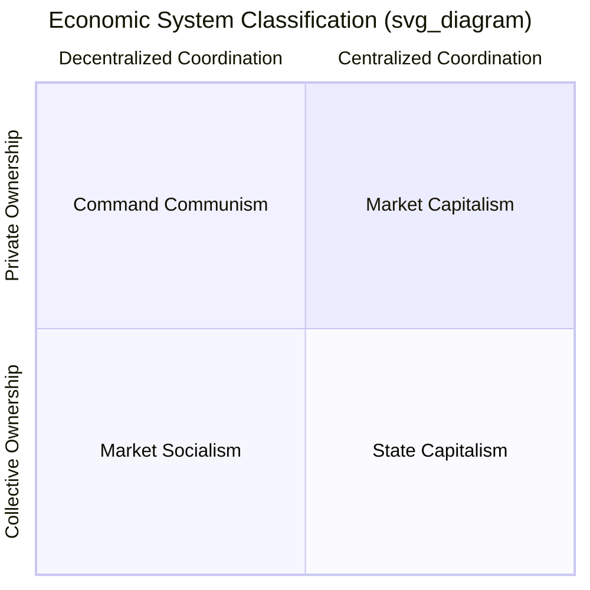
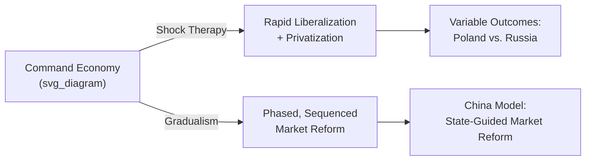

## Comparative Economic Systems in Practice

### Introduction and Scope

Comparative economic systems examines how different societies organize the fundamental economic questions of what to produce, how to produce it, and for whom, through varying arrangements of resource ownership, price coordination, and decision-making authority. This topic surveys the major system typologies, their institutional variants as practiced historically and currently, and the analytical frameworks economists use to evaluate their comparative performance.

### Foundational Classification Framework

**Key Points**

Economic systems are conventionally classified along two intersecting dimensions:

| Dimension | Spectrum |
| --- | --- |
| Resource ownership | Private property ↔ Collective/state ownership |
| Coordination mechanism | Decentralized markets ↔ Centralized planning |

- No real-world economy sits at a pure extreme; all observed systems are **mixed economies** combining market and non-market coordination in varying proportions, and combining private and state ownership across different sectors.
- The classification is best understood as identifying tendencies and institutional emphases rather than discrete, mutually exclusive categories.

### Market Capitalism

**Key Points**

- Characterized by predominantly private ownership of productive assets, price coordination through decentralized markets, and profit motive as the primary driver of production decisions.
- Theoretical foundation rests on the **First and Second Fundamental Welfare Theorems**: under specified conditions (perfect competition, complete markets, no externalities), competitive equilibrium is Pareto efficient, and any Pareto efficient allocation can be achieved via competitive markets given appropriate initial endowment redistribution.
- **Institutional variants** observed in practice differ substantially despite shared "capitalist" classification:
  - **Liberal market economies** (e.g., United States, United Kingdom): relatively lighter product/labor market regulation, shareholder-oriented corporate governance, market-based finance.
  - **Coordinated market economies** (e.g., Germany, Japan — per the Varieties of Capitalism framework of Hall and Soskice): stronger inter-firm coordination, bank-based finance, more extensive employer-employee coordination institutions (works councils, coordinated wage bargaining).
  - **Nordic model**: high market openness and private ownership combined with extensive welfare state redistribution, active labor market policy, and high union density — sometimes termed "flexicurity."

**Government Role in Market Economies**

Even predominantly market-based systems assign government substantial economic functions:

- Correcting market failures (externalities, public goods, information asymmetry, market power)
- Macroeconomic stabilization (monetary and fiscal policy)
- Redistribution via taxation and transfer programs
- Regulatory oversight (competition policy, financial regulation, consumer protection)

### Command/Planned Economies

**Key Points**

- Characterized by predominant state ownership of productive assets and centralized resource allocation via administrative planning rather than price mechanisms.
- The **Soviet material balance planning system** is the most extensively studied historical model: central planners set output targets for major goods, allocating inputs across enterprises to meet a comprehensive plan (typically five-year plans with annual operational targets), largely bypassing market-clearing prices as allocation signals.

**The Economic Calculation Problem**

- Ludwig von Mises and Friedrich Hayek's critique argues that central planners lack the dispersed, tacit, and constantly changing information held by individual market participants, making rational economic calculation (efficient resource allocation reflecting relative scarcities) impossible without market prices.
- Hayek's formulation emphasizes the **knowledge problem**: information relevant to economic decisions is inherently decentralized and often not explicitly articulable, meaning no central authority can aggregate it as effectively as a price system operating through voluntary exchange.
- This critique is widely regarded by economists across the ideological spectrum as identifying a genuine structural challenge for comprehensive central planning, though its full implications (e.g., whether it rules out any role for planning, or only comprehensive economy-wide planning without price signals) remain subject to ongoing theoretical debate. [Inference: the "genuine structural challenge" characterization reflects broad, though not universal, consensus; some economists have proposed decentralized or computationally-assisted planning models as partial responses, with contested practical viability]

**Documented Empirical Patterns in Historical Command Economies**

- Chronic **shortage economies** (per Kornai's analysis): persistent queuing, informal secondary markets, and enterprise-level soft budget constraints (state-owned enterprises facing limited bankruptcy risk, reducing efficiency incentives).
- Difficulty achieving allocative efficiency in consumer goods production relative to capital/military goods, reflecting planners' priorities and weaker feedback mechanisms for consumer preference signals compared to price-mediated demand revelation.
- [Inference: these patterns are extensively documented in the economic history and comparative systems literature regarding 20th-century Soviet-bloc economies specifically; generalization to any hypothetical planning system should be made cautiously, as specific institutional design choices affect outcomes]

### Market Socialism

**Key Points**

- Attempts to combine social/collective ownership of productive assets with market-based price coordination — a theoretical middle path addressing the calculation problem while retaining collective ownership.
- The **Lange-Lerner model** (Oskar Lange, Abba Lerner) proposed a "trial and error" mechanism: a Central Planning Board sets prices for capital goods, state-owned enterprise managers respond to these prices as if they were market signals (producing where price equals marginal cost), and the board adjusts prices iteratively based on observed shortages/surpluses, mimicking the tâtonnement process of Walrasian equilibrium.
- Hayek's rejoinder argued this proposal, even if mechanically plausible, still fails to replicate the dynamic, real-time, decentralized information generation of genuine market competition and entrepreneurial discovery, and underestimates the incentive problems facing planning board bureaucrats and enterprise managers absent genuine residual claimancy. [Inference: this remains a foundational and still-debated critique in comparative economic systems theory, not a fully settled dispute]
- **Yugoslav self-management socialism** (mid-20th century) represents a distinct historical implementation: worker-managed enterprises operated with substantial market autonomy under social (not state) ownership, offering an empirically studied — though ultimately economically troubled — real-world test of market-socialist principles, with documented issues including underinvestment incentives and regional inequality. [Unverified: causal attribution of Yugoslavia's later economic difficulties specifically to its self-management model versus other contemporaneous factors, such as external debt and macroeconomic mismanagement, remains debated among economic historians]

### Mixed Economies and the Welfare State

**Key Points**

- Nearly all contemporary developed economies are appropriately classified as mixed economies, differentiated primarily by the **scale and design of the welfare state** and the extent of market regulation, rather than by fundamental ownership structure (private ownership predominates in production across nearly all).

**Esping-Andersen's Welfare State Typology**

| Regime Type | Characteristics | Example Countries |
| --- | --- | --- |
| Liberal | Means-tested, modest benefits, market-reliant | United States, (historically) UK |
| Conservative/Corporatist | Status-preserving, employment-linked social insurance | Germany, France |
| Social Democratic | Universal, generous, de-commodifying benefits | Sweden, Denmark |

[Inference: this three-way typology is a highly influential and widely taught analytical framework, though subsequent scholarship has proposed additional categories (e.g., a Southern European or East Asian regime type) and noted that individual countries do not always fit neatly into a single category]

### Transition Economies

**Key Points**

- Refers to formerly centrally planned economies transitioning toward market-based coordination, primarily following the collapse of Soviet-bloc communism (1989–1991 onward), providing a rich empirical natural-experiment setting for comparative systems analysis.
- Two broad transition strategies were debated and variously implemented:
  - **"Shock therapy"** (rapid, simultaneous price liberalization, privatization, and macroeconomic stabilization) — associated with Poland's early 1990s reforms and, more contentiously, Russia's transition.
  - **Gradualism** (phased, sequenced liberalization) — associated with China's reform trajectory from 1978 onward.
- Empirical outcomes across transition economies varied substantially: several Central European economies (Poland, Czech Republic, Hungary) achieved relatively successful integration into market structures and eventual EU accession, while Russia's 1990s transition was accompanied by severe output collapse, hyperinflation episodes, and the emergence of oligarchic ownership concentration during rapid privatization. [Inference: the relative role of policy design choices versus initial institutional conditions (rule of law, property rights enforcement capacity) in explaining this variation remains an active area of research and is not fully settled]

### State Capitalism and China's Model

**Key Points**

- China's post-1978 reform economy is frequently classified as a distinct hybrid: substantial market coordination and private enterprise (particularly in export manufacturing and consumer sectors) combined with continued significant state ownership in strategic sectors (banking, energy, telecommunications) and strong Communist Party direction of overall economic strategy.
- This model is often termed **"state capitalism"** or a **"socialist market economy"** (the official Chinese Communist Party characterization), illustrating that market coordination mechanisms can be deployed under substantially different ownership and political-institutional arrangements than those found in Western liberal market economies.
- Key documented features include: extensive industrial policy (targeted state support for strategic sectors), state-owned enterprises operating alongside private firms, managed capital account and exchange rate policy (with the degree of management varying over time), and a distinct role for local government in driving regional economic competition. [Inference: characterizing the precise current balance between state and market coordination in China's economy is subject to ongoing debate among China-focused economists and changes over time with policy shifts; specific current-state claims should be checked against up-to-date sources]

### Comparative Performance Metrics and Methodological Challenges

**Key Points**

Economists comparing systems face several methodological difficulties:

- **Purchasing Power Parity (PPP) adjustment** is necessary for meaningful cross-system GDP comparisons given differing price structures, but PPP conversion itself involves significant measurement assumptions, particularly stark for historically planned economies where prices did not reflect market scarcity.
- **Non-market production and shadow economies**: informal/black market activity (historically significant in shortage economies, and in many developing/transition economies currently) is difficult to capture in official statistics, potentially biasing comparative output measures.
- **Quality and variety effects**: aggregate output measures can mask substantial differences in product quality, variety, and consumer choice — dimensions historically identified as comparatively weak in centrally planned systems but difficult to quantify rigorously.
- **Attribution problems**: differences in economic performance across systems reflect a bundle of confounded factors (natural resource endowments, historical institutional legacies, geopolitical context, human capital, initial conditions) beyond the ownership/coordination classification alone, complicating clean causal claims about "which system performs better." [Inference: this attribution challenge is a standard methodological caution in comparative economics and applies broadly across cross-country economic comparisons, not specific to any one system pairing]

### Institutional Economics Perspective

**Key Points**

- Contemporary comparative systems analysis increasingly draws on **New Institutional Economics** (Douglass North, Oliver Williamson), emphasizing that formal ownership/coordination classification alone is insufficient — the quality of underlying institutions (property rights enforcement, contract enforcement, rule of law, corruption levels) substantially shapes economic performance within any given nominal system type.
- This perspective helps explain why nominally similar systems (e.g., two market economies) can exhibit vastly different performance outcomes, and motivates comparative institutional quality indices (e.g., World Bank Governance Indicators, property rights indices) as complements to the traditional ownership/coordination typology.

### Related Topics

- Fundamental welfare theorems and general equilibrium theory
- The Hayek-Lange socialist calculation debate
- Varieties of Capitalism framework (Hall and Soskice)
- Transition economics and post-communist institutional reform
- New Institutional Economics (North, Williamson, property rights theory)
- Comparative welfare state analysis (Esping-Andersen typology)
- China's economic reform and industrial policy
- Development economics and the role of institutions in growth
- Soft budget constraints and enterprise reform (Kornai)