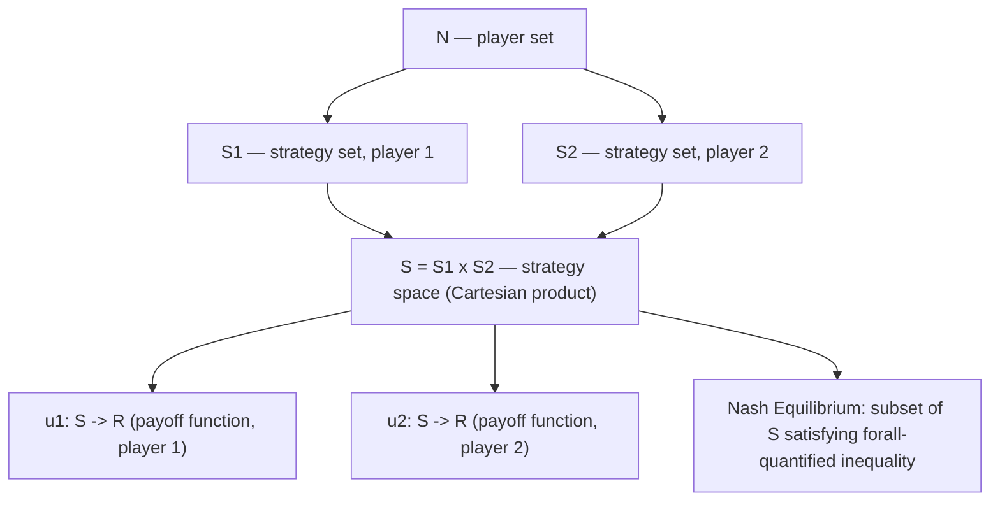

## Set Theory and Logic for Game Theory

### Overview

Set theory and formal logic provide the symbolic scaffolding on which game theory is built. Games are defined as tuples of sets (players, strategies, outcomes), preferences are relations on sets, and equilibrium concepts are logical statements quantified over those sets. Before any solution concept (Nash equilibrium, dominance, rationalizability) can be stated precisely, the underlying objects — strategy spaces, information sets, belief sets — must be defined set-theoretically, and the claims made about them must be expressible in first-order logic.

### Basic Set Theory

#### Sets and Membership

A **set** is a well-defined collection of distinct objects, called **elements**. Membership is written $x \in A$ ("$x$ is an element of $A$") and non-membership $x \notin A$.

Sets central to game theory:

- $N = \{1, 2, \dots, n\}$ — the set of **players**
- $S_i$ — the **strategy set** (or action set) of player $i$
- $S = S_1 \times S_2 \times \cdots \times S_n$ — the **strategy space** (joint strategy profiles)
- $\Theta_i$ — the set of possible **types** of player $i$ (in Bayesian games)
- $\Omega$ — the **state space** in games with incomplete information

#### Set Operations

| Operation | Notation | Definition | Game-theoretic use |
| --- | --- | --- | --- |
| Union | $A \cup B$ | elements in $A$ or $B$ | combining strategy sets across contingencies |
| Intersection | $A \cap B$ | elements in both $A$ and $B$ | common knowledge sets, intersection of best-response sets |
| Complement | $A^c$ | elements not in $A$ | "not choosing strategy $s$" |
| Difference | $A \setminus B$ | elements in $A$ not in $B$ | eliminating dominated strategies: $S_i \setminus D_i$ |
| Cartesian product | $A \times B$ | ordered pairs $(a,b)$, $a \in A, b \in B$ | constructing joint strategy space $S_1 \times S_2$ |
| Power set | $\mathcal{P}(A)$ | set of all subsets of $A$ | coalition structures in cooperative game theory |

**Example.** In a two-player game, $S_1 = \{U, D\}$ (Up, Down) and $S_2 = \{L, R\}$ (Left, Right). The strategy space is:

$$S = S_1 \times S_2 = \{(U,L), (U,R), (D,L), (D,R)\}$$

Each element of $S$ is a **strategy profile**, denoted $s = (s_1, s_2)$.

#### Relations and Functions

A **relation** $R$ on a set $A$ is a subset of $A \times A$. Preference relations are the primary use case:

- $\succeq_i$ (weak preference): $x \succeq_i y$ means player $i$ finds $x$ at least as good as $y$
- $\succ_i$ (strict preference): $x \succ_i y \iff x \succeq_i y \text{ and } y \not\succeq_i x$
- $\sim_i$ (indifference): $x \sim_i y \iff x \succeq_i y \text{ and } y \succeq_i x$

For $\succeq_i$ to admit a **utility representation** $u_i: S \to \mathbb{R}$ such that $x \succeq_i y \iff u_i(x) \geq u_i(y)$, the relation must satisfy:

1. **Completeness**: for all $x, y \in S$, either $x \succeq_i y$ or $y \succeq_i x$
2. **Transitivity**: $x \succeq_i y$ and $y \succeq_i z \implies x \succeq_i z$

[Confirmed] These two axioms are necessary; on a finite or countable set they are also sufficient for a utility representation to exist. On uncountable sets, an additional continuity axiom is required (Debreu's representation theorem).

A **function** $f: A \to B$ is a relation where each $a \in A$ maps to exactly one $b \in B$. The **payoff function** $u_i: S \to \mathbb{R}$ is the central function object of a game — it maps every strategy profile to a real-valued payoff for player $i$.

### Formal Definition of a Game Using Set Theory

A **normal-form game** is formally the tuple:

$$G = \langle N, (S_i)_{i \in N}, (u_i)_{i \in N} \rangle$$

where:

- $N$ is a finite set of players
- $S_i$ is the strategy set of player $i$, and $S = \prod_{i \in N} S_i$
- $u_i: S \to \mathbb{R}$ is player $i$'s payoff function

This is a purely set-theoretic object: a set of indices, an indexed family of sets, and an indexed family of functions on the product set. Every solution concept is a predicate (a logical statement) evaluated over this structure.

**Example (Prisoner's Dilemma as a set-theoretic object).**

$$N = \{1,2\}, \quad S_1 = S_2 = \{C, D\}, \quad S = \{(C,C),(C,D),(D,C),(D,D)\}$$

$$u_1(C,C) = -1,\ u_1(C,D) = -3,\ u_1(D,C) = 0,\ u_1(D,D) = -2$$

$u_1$ is a function from the 4-element set $S$ to $\mathbb{R}$, fully specified by these four pairs.

### Propositional Logic Essentials

Game theory statements are built from propositions combined with logical connectives:

| Symbol | Name | Meaning |
| --- | --- | --- |
| $\neg$ | negation | not |
| $\land$ | conjunction | and |
| $\lor$ | disjunction | or |
| $\implies$ | material conditional | if...then |
| $\iff$ | biconditional | if and only if |

**Example.** Strict dominance of $s_i$ over $s_i'$ can be written:

$$\forall s_{-i} \in S_{-i}: \; u_i(s_i, s_{-i}) > u_i(s_i', s_{-i})$$

Here $S_{-i} = \prod_{j \neq i} S_j$ denotes the strategy space of all players other than $i$ — a set-theoretic construction (product over the index set $N \setminus \{i\}$) that recurs throughout the theory.

### Quantifiers and Their Role in Solution Concepts

First-order logic's two quantifiers — $\forall$ (universal, "for all") and $\exists$ (existential, "there exists") — are the mechanism by which equilibrium concepts are stated. The order and nesting of quantifiers changes the meaning entirely, which is the single most common source of student error in formal game theory.

#### Nash Equilibrium

A strategy profile $s^* = (s_1^*, \dots, s_n^*)$ is a **Nash equilibrium** if:

$$\forall i \in N,\ \forall s_i \in S_i: \; u_i(s_i^*, s_{-i}^*) \geq u_i(s_i, s_{-i}^*)$$

Read: *for every player, and for every alternative strategy that player could deviate to, the equilibrium strategy is weakly better.* Note the quantifier structure: $\forall i, \forall s_i$ — no $\exists$ appears in the deviation clause, because Nash equilibrium requires robustness against *every* unilateral deviation, not just some.

#### Strict Dominant Strategy Equilibrium

$$\forall i \in N,\ \exists s_i^* \in S_i: \; \forall s_i' \in S_i \setminus \{s_i^*\},\ \forall s_{-i} \in S_{-i}: \; u_i(s_i^*, s_{-i}) > u_i(s_i', s_{-i})$$

Read: *for every player, there exists a strategy that beats every other strategy, against every possible opponent profile.* The $\exists$ before the inner $\forall$s signals this is a much stronger requirement than Nash equilibrium — it must hold regardless of what opponents do, not just at one fixed profile.

#### Rationalizability (conceptual quantifier structure)

$$s_i \text{ is rationalizable} \iff \exists \text{ belief } \mu_i \text{ over } S_{-i}: \; s_i \in \arg\max_{s_i' \in S_i} \mathbb{E}_{\mu_i}[u_i(s_i', s_{-i})]$$

combined with the recursive/fixed-point requirement that beliefs themselves be concentrated on rationalizable strategies of others. [Inference] Framing this as a nested nonempty-nested-set condition (à la Bernheim/Pearce) is a standard textbook simplification; the fully rigorous statement requires either infinite regress of belief hierarchies or a fixed-point argument over the strategy sets.

### Quantifier Order Matters — A Worked Contrast

Compare these two statements over $S_1 \times S_2$:

$$\text{(A)}\ \exists s_1 \in S_1,\ \forall s_2 \in S_2: \; u_1(s_1, s_2) \geq 0$$

$$\text{(B)}\ \forall s_2 \in S_2,\ \exists s_1 \in S_1: \; u_1(s_1, s_2) \geq 0$$

(A) says: *player 1 has one strategy that guarantees a non-negative payoff no matter what player 2 does* — this is the logical structure behind a **maximin/security strategy**.

(B) says: *for every strategy player 2 might choose, player 1 has some response (possibly different each time) yielding a non-negative payoff* — a much weaker claim, since it permits player 1's best response to vary with $s_2$.

(A) $\implies$ (B) always holds; the converse does not in general. This asymmetry is precisely why $\max\min \leq \min\max$ in zero-sum games, with equality characterizing games with a value (von Neumann's minimax theorem).

### Set-Theoretic Objects in Extensive-Form Games

Extensive-form games require additional set-theoretic machinery:

- **Game tree** $T$: a set of **nodes** with a partial order (the precedence/successor relation) forming a tree structure
- **Information sets** $\mathcal{I}_i$: a partition of the decision nodes belonging to player $i$ — each information set $I \in \mathcal{I}_i$ is itself a subset of nodes that $i$ cannot distinguish between
- **Partition axioms**: for $\mathcal{I}_i$ to be a valid information-set partition of node set $X_i$:
  1. $\bigcup_{I \in \mathcal{I}_i} I = X_i$ (covers all of $i$'s decision nodes)
  2. $I \cap I' = \emptyset$ for $I \neq I'$ (no overlap — sets are disjoint)

[Confirmed] These are exactly the two defining properties of a set partition from elementary set theory, applied to the specific domain of decision nodes.

**Example.** In a poker-like game where player 2 cannot see player 1's card, all nodes following player 1's different card draws — but preceding player 2's action — belong to a single information set $I \in \mathcal{I}_2$, formally modeling player 2's epistemic indistinguishability between those histories.

### Common Knowledge as a Set-Theoretic/Logical Construct

**Common knowledge** of an event $E$ (a subset of the state space $\Omega$) is defined recursively using the **meet** of players' information partitions:

$$E \text{ is common knowledge at } \omega \iff M(\omega) \subseteq E$$

where $M(\omega)$ is the cell of the **meet partition** (the finest common coarsening of all players' individual partitions) containing $\omega$. Equivalently, in logical terms:

$$\text{CK}(E) \iff E \land K_1(E) \land K_2(E) \land K_1 K_2(E) \land K_2 K_1(E) \land \cdots$$

where $K_i(E)$ denotes "player $i$ knows $E$," formalized as $K_i(E) = \{\omega : P_i(\omega) \subseteq E\}$ for $P_i(\omega)$ the information cell of player $i$ at state $\omega$. This infinite conjunction of iterated knowledge operators is the logical backbone of Aumann's formalization of common knowledge, and it is what underlies results such as the "agreeing to disagree" impossibility theorem and the electronic mail game.

### Illustration: Nested Quantifier Structure (svg_diagram)

<svg xmlns="http://www.w3.org/2000/svg" viewBox="0 0 720 300">
\<style\>
.lbl { font-family: monospace; font-size: 14px; fill: #1a1a1a; }
.title { font-family: sans-serif; font-size: 15px; fill: #1a1a1a; font-weight: bold; }
.box { fill: none; stroke: #333; stroke-width: 1.5; }
.arrow { stroke: #555; stroke-width: 1.5; marker-end: url(#arrowhead); }
\</style\>
<text x="20" y="25" class="title">Quantifier Nesting: Nash Equilibrium vs. Dominant Strategy (svg_diagram)</text>
<rect x="20" y="50" width="330" height="90" class="box" />
<text x="35" y="75" class="lbl">Nash Equilibrium</text>
<text x="35" y="100" class="lbl">∀i ∀sᵢ:</text>
<text x="35" y="120" class="lbl">u(s*) ≥ u(sᵢ, s*₋ᵢ)</text>
<rect x="370" y="50" width="330" height="90" class="box" />
<text x="385" y="75" class="lbl">Dominant Strategy Eq.</text>
<text x="385" y="100" class="lbl">∀i ∃sᵢ* ∀sᵢ' ∀s₋ᵢ:</text>
<text x="385" y="120" class="lbl">u(sᵢ*,s₋ᵢ) &gt; u(sᵢ',s₋ᵢ)</text>
<line x1="350" y1="95" x2="370" y2="95" class="arrow" />
<text x="330" y="170" class="lbl" text-anchor="middle">weaker</text>
<text x="450" y="170" class="lbl" text-anchor="middle">stronger (implies Nash)</text>

<text x="20" y="210" class="title">Reading order (left to right = outer to inner quantifier)</text>

<text x="20" y="235" class="lbl">∀ fixed first → binds over all players/opponents</text>

<text x="20" y="255" class="lbl">∃ after ∀ → choice may depend on preceding ∀-bound variable</text>

<text x="20" y="275" class="lbl">∃ before ∀ → single choice must work for ALL later ∀-bound variables</text>

</svg>

### Illustration: Set Relationships in a Game

### Worked Example: Verifying Nash Equilibrium via Logical Predicate

Given the game:

|  | L | R |
| --- | --- | --- |
| **U** | 3, 3 | 0, 5 |
| **D** | 5, 0 | 1, 1 |

Check whether $(U, L)$ is a Nash equilibrium by evaluating the predicate for each player:

- Player 1: does $\exists s_1' \in \{U,D\}$ with $u_1(s_1', L) > u_1(U, L) = 3$? Check $D$: $u_1(D,L) = 5 > 3$. **Yes** — deviation exists, so $\forall s_1$ clause fails.
- Conclusion: $(U,L)$ **is not** a Nash equilibrium, since the negation of the required universal statement is witnessed by $D$.

Checking $(D, R)$: $u_1(D,R)=1$; deviate to $U$: $u_1(U,R) = 0 < 1$, no improvement. $u_2(D,R) = 1$; deviate to $L$: $u_2(D,L) = 0 < 1$, no improvement. Both $\forall$-clauses hold with no witnessing counterexample $\implies (D,R)$ **is** a Nash equilibrium.

### Common Pitfalls

- **Confusing $\subseteq$ with $\in$**: an information set $I$ is a subset of nodes, not a single node; $\omega \in I$ but $I \subseteq X_i$.
- **Swapping quantifier order**: treating $\exists s_1 \forall s_2 (\dots)$ as equivalent to $\forall s_2 \exists s_1(\dots)$ — these are logically distinct (see worked contrast above) and correspond to different solution concepts (security strategy vs. best response correspondence).
- **Treating $\succeq$ as automatically transitive**: transitivity is an *assumption* (rationality axiom), not a logical necessity of preference relations in general; games with non-transitive preferences (e.g., some social choice contexts) violate it deliberately.
- **Conflating power set with strategy space**: $\mathcal{P}(S_i)$ (all subsets, used for mixed strategies as probability measures over $S_i$) is a different object from $S_i$ itself or $S = \prod_i S_i$.

**Related Topics:**

- Probability Theory and Random Variables for Game Theory (mixed strategies, Bayesian games)
- Linear Algebra and Optimization Foundations (best-response correspondences, matrix games)
- Extensive-Form Games and Game Trees
- Bayesian Games and Incomplete Information
- Common Knowledge and Epistemic Game Theory
- Fixed-Point Theorems (Brouwer, Kakutani) and Existence of Nash Equilibrium