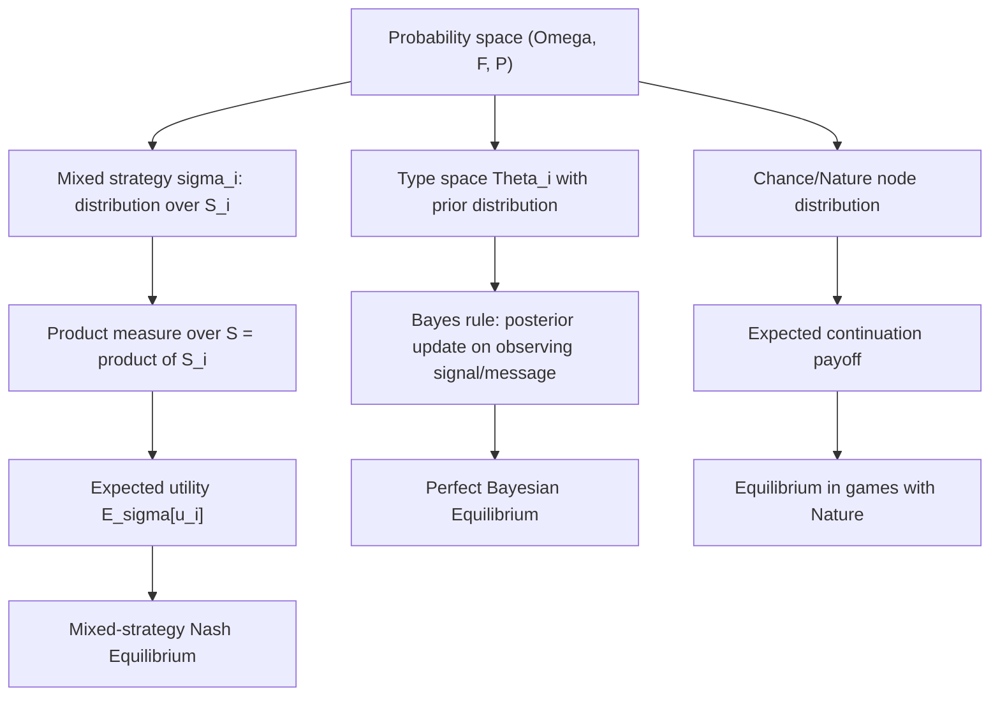

## Probability Theory and Random Variables

### Overview

Probability theory supplies the mathematical language for mixed strategies, beliefs under uncertainty, Bayesian updating, and expected-utility payoffs — the machinery needed whenever players randomize, face incomplete information, or reason about opponents' hidden types. Every solution concept beyond pure-strategy Nash equilibrium (mixed-strategy equilibrium, Bayesian Nash equilibrium, sequential equilibrium) is defined in terms of probability measures over strategy sets or type spaces, and expectations of payoff functions with respect to those measures.

### Probability Spaces

A **probability space** is a triple $(\Omega, \mathcal{F}, P)$:

- $\Omega$ — the **sample space**, the set of all possible outcomes
- $\mathcal{F}$ — a **$\sigma$-algebra** on $\Omega$: a collection of subsets of $\Omega$ (called **events**) closed under complement and countable union, containing $\Omega$ itself
- $P: \mathcal{F} \to [0,1]$ — a **probability measure** satisfying:
  1. $P(\Omega) = 1$
  2. $P(E) \geq 0$ for all $E \in \mathcal{F}$
  3. **Countable additivity**: for disjoint $E_1, E_2, \dots \in \mathcal{F}$, $P\left(\bigcup_i E_i\right) = \sum_i P(E_i)$

[Confirmed] These three properties are the Kolmogorov axioms and are the standard foundation for all of measure-theoretic probability.

**Game-theoretic instantiation.** For a player $i$ choosing a mixed strategy over a finite strategy set $S_i = \{s_i^1, \dots, s_i^k\}$, the relevant probability space has $\Omega = S_i$, $\mathcal{F} = \mathcal{P}(S_i)$ (the full power set, since $S_i$ is finite), and $P = \sigma_i$, the mixed strategy itself.

### Mixed Strategies as Probability Distributions

A **mixed strategy** $\sigma_i$ for player $i$ is a probability distribution over $S_i$:

$$\sigma_i: S_i \to [0,1], \qquad \sum_{s_i \in S_i} \sigma_i(s_i) = 1$$

The set of all mixed strategies is the **simplex** over $S_i$:

$$\Delta(S_i) = \left\{ \sigma_i \in \mathbb{R}^{|S_i|} : \sigma_i(s_i) \geq 0 \ \forall s_i, \ \sum_{s_i} \sigma_i(s_i) = 1 \right\}$$

**Example.** In Matching Pennies with $S_i = \{H, T\}$, the mixed strategy $\sigma_i = (0.5, 0.5)$ assigns probability $\tfrac{1}{2}$ to each pure strategy. $\Delta(S_i)$ here is the line segment from $(1,0)$ to $(0,1)$ in $\mathbb{R}^2$ — a 1-simplex.

For $n$ players choosing independently, the joint mixed strategy profile induces a **product measure** on $S = \prod_i S_i$:

$$P(s_1, \dots, s_n) = \prod_{i=1}^n \sigma_i(s_i)$$

[Confirmed] Independence across players is a standard modeling assumption in non-cooperative game theory (players randomize independently); correlated strategies relax this and are handled instead via **correlated equilibrium**, which uses a single joint distribution over $S$ not necessarily factorizable into a product.

### Random Variables

A **random variable** $X: \Omega \to \mathbb{R}$ is a measurable function mapping outcomes to real numbers. In game theory, the payoff realized under a mixed strategy profile is itself a random variable:

$$X = u_i(s_1, \dots, s_n), \qquad (s_1, \dots, s_n) \sim P$$

#### Expected Value

$$\mathbb{E}[X] = \sum_{\omega \in \Omega} X(\omega) P(\omega) \quad \text{(discrete case)}$$

Applied to expected utility under a mixed strategy profile $\sigma = (\sigma_1, \dots, \sigma_n)$:

$$\mathbb{E}_\sigma[u_i] = \sum_{s \in S} u_i(s) \prod_{j=1}^n \sigma_j(s_j)$$

This expectation is the object players are assumed to maximize under **expected utility theory** (von Neumann–Morgenstern), and it is what makes a **mixed-strategy Nash equilibrium** well-defined: $\sigma^*$ is an equilibrium if no player can increase $\mathbb{E}_{\sigma^*}[u_i]$ by unilaterally deviating to any $\sigma_i \in \Delta(S_i)$.

**Worked example.** Matching Pennies payoff matrix (row player's payoff shown):

|  | H | T |
| --- | --- | --- |
| **H** | 1, -1 | -1, 1 |
| **T** | -1, 1 | 1, -1 |

Let player 1 play $\sigma_1 = (p, 1-p)$ and player 2 play $\sigma_2 = (q, 1-q)$. Player 1's expected payoff:

$$\mathbb{E}[u_1] = pq(1) + p(1-q)(-1) + (1-p)q(-1) + (1-p)(1-q)(1)$$

Simplifying:

$$\mathbb{E}[u_1] = 4pq - 2p - 2q + 1$$

For player 1 to be indifferent between H and T (a necessary condition at a mixed equilibrium), set the coefficient structure so that player 1's payoff from choosing H equals that from choosing T, which yields $q = \tfrac12$. By symmetry, $p = \tfrac12$. This recovers the well-known equilibrium $\sigma_1^* = \sigma_2^* = (\tfrac12, \tfrac12)$.

#### Variance

$$\text{Var}(X) = \mathbb{E}[(X - \mathbb{E}[X])^2] = \mathbb{E}[X^2] - (\mathbb{E}[X])^2$$

[Inference] Variance itself is not part of the standard vNM expected-utility maximization objective; it becomes relevant only when modeling **risk aversion** explicitly through a concave utility function, or in mean-variance-style extensions to game-theoretic models (e.g., portfolio games), which are a distinct modeling choice from expected-utility maximization over a linear payoff.

### Conditional Probability and Bayes' Rule

$$P(A \mid B) = \frac{P(A \cap B)}{P(B)}, \qquad P(B) > 0$$

**Bayes' Rule**:

$$P(A \mid B) = \frac{P(B \mid A) P(A)}{P(B)}$$

This is the formal engine behind **belief updating** in Bayesian games and signaling games: after observing a signal or move, a player updates beliefs about opponents' types.

**Example (Bayesian updating in a signaling game).** Suppose a sender's type $\theta \in \{\text{Strong}, \text{Weak}\}$ has prior $P(\text{Strong}) = 0.3$. The sender's message $m \in \{\text{Aggressive}, \text{Passive}\}$ is chosen according to type-dependent strategies: $P(m = A \mid \theta = S) = 0.9$, $P(m = A \mid \theta = W) = 0.2$. The receiver, upon observing $m = A$, updates:

$$P(\theta = S \mid m = A) = \frac{P(m=A\mid S)P(S)}{P(m=A\mid S)P(S) + P(m=A\mid W)P(W)} = \frac{0.9 \times 0.3}{0.9 \times 0.3 + 0.2 \times 0.7} = \frac{0.27}{0.41} \approx 0.659$$

This posterior belief is exactly what the receiver plugs into their own expected-utility maximization to choose an action — the core mechanic of **Perfect Bayesian Equilibrium**.

### Independence

Events $A, B$ are **independent** if $P(A \cap B) = P(A)P(B)$, equivalently $P(A \mid B) = P(A)$.

Random variables $X, Y$ are independent if their joint distribution factors: $P(X = x, Y = y) = P(X=x)P(Y=y)$ for all $x, y$.

[Confirmed] Independence of players' randomization devices is the standard assumption distinguishing a (fully mixed, independent) Nash equilibrium from a **correlated equilibrium**, where a public or private correlating signal can induce statistical dependence between players' actions without requiring communication after the signal is observed.

### Discrete vs. Continuous Random Variables

|  | Discrete | Continuous |
| --- | --- | --- |
| Distribution | probability mass function (PMF) $p(x) = P(X=x)$ | probability density function (PDF) $f(x)$, $P(X=x)=0$ |
| Expectation | $\sum_x x\, p(x)$ | $\int x f(x)\, dx$ |
| Game theory use | finite strategy sets, discrete type spaces | continuous type spaces (e.g. valuations in auctions), continuous action spaces (e.g. Cournot quantities) |

**Example (continuous type space — first-price auction).** In the independent private values model, each bidder's valuation $v_i$ is drawn i.i.d. from a continuous distribution, commonly $v_i \sim U[0,1]$ with PDF $f(v) = 1$ on $[0,1]$. Bidder $i$'s expected payoff from bidding $b$ given valuation $v_i$ and $n-1$ opponents bidding according to strategy $\beta(\cdot)$:

$$\mathbb{E}[\pi_i] = (v_i - b) \cdot P(\text{win} \mid b) = (v_i - b) \cdot F(\beta^{-1}(b))^{n-1}$$

where $F$ is the CDF of the valuation distribution. Solving the first-order condition for this expectation yields the symmetric equilibrium bidding function $\beta(v) = \frac{n-1}{n}v$. [Confirmed] This is the standard textbook result for the symmetric independent-private-value first-price auction with uniformly distributed valuations.

### Random Variables in Extensive-Form Games: Chance Nodes

Extensive-form games with **nature/chance moves** introduce a distinguished player (often labeled $c$ or Nature) whose "strategy" is a fixed, exogenous probability distribution over available actions at chance nodes — not a strategic choice. This converts a subtree's outcome into a random variable whose distribution is determined by nature's move probabilities, and players compute expected continuation values by integrating (or summing) over nature's randomization.

**Example.** In a simple entry-deterrence game with an uncertain incumbent type, nature moves first, selecting the incumbent's type "Tough" with probability $\pi$ and "Weak" with probability $1-\pi$. The entrant's expected payoff to "Enter" is:

$$\mathbb{E}[u_{\text{entrant}}(\text{Enter})] = \pi \cdot u(\text{Enter} \mid \text{Tough}) + (1-\pi)\cdot u(\text{Enter} \mid \text{Weak})$$

### Illustration: Probability Machinery Flow in Game-Theoretic Models

### Illustration: Simplex of Mixed Strategies for a 2-Action Game (svg_diagram)

<svg xmlns="http://www.w3.org/2000/svg" viewBox="0 0 500 260">
\<style\>
.lbl { font-family: monospace; font-size: 13px; fill: #1a1a1a; }
.title { font-family: sans-serif; font-size: 15px; fill: #1a1a1a; font-weight: bold; }
.axis { stroke: #333; stroke-width: 1.5; }
.pt { fill: #b33; }
\</style\>
<text x="15" y="22" class="title">Delta(S_i) for |S_i| = 2 (svg_diagram)</text>
<line x1="60" y1="220" x2="440" y2="220" class="axis" />
<circle cx="60" cy="220" r="4" class="pt" />
<text x="45" y="240" class="lbl">(1,0) pure: H</text>
<circle cx="440" cy="220" r="4" class="pt" />
<text x="390" y="240" class="lbl">(0,1) pure: T</text>
<circle cx="250" cy="220" r="4" class="pt" />
<text x="200" y="200" class="lbl">(0.5, 0.5) mixed eq.</text>

<text x="60" y="80" class="lbl">Every point on the segment is a valid</text>

<text x="60" y="100" class="lbl">mixed strategy sigma_i = (p, 1-p),</text>

<text x="60" y="120" class="lbl">p in [0,1]. Endpoints = pure strategies.</text>

<text x="60" y="150" class="lbl">Equilibrium mixing probability found by</text>

<text x="60" y="170" class="lbl">indifference condition, not by symmetry alone.</text>

</svg>

### Common Pitfalls

- **Confusing a player's own mixed strategy with beliefs about opponents**: $\sigma_i \in \Delta(S_i)$ is what player $i$ *does*; $\mu_i \in \Delta(S_{-i})$ is what player $i$ *believes* others will do. At a Nash equilibrium these coincide in a rational-expectations sense, but they are conceptually and notationally distinct objects.
- **Assuming independence when correlation is intended**: correlated equilibrium payoffs can Pareto-dominate every Nash equilibrium payoff (e.g., in games like Chicken); computing $\mathbb{E}[u_i]$ using a product measure when the true joint distribution is correlated gives the wrong answer.
- **Treating expected utility as risk-neutral by default**: expected utility maximization is compatible with risk aversion or risk-seeking — the risk attitude is encoded in the *curvature* of $u_i$, not in the expectation operator itself.
- **Using discrete formulas (summations) on continuous type spaces**: continuous valuation/type models (auctions, continuous Bayesian games) require integrals and density functions, not sums and mass functions; the two are structurally different objects requiring different equilibrium-derivation techniques (e.g., differential equations from first-order conditions in auction theory).

**Related Topics:**

- Set Theory and Logic for Game Theory
- Expected Utility Theory and Risk Preferences
- Mixed-Strategy Nash Equilibrium
- Bayesian Games and Incomplete Information
- Correlated Equilibrium
- Auction Theory (First-Price, Second-Price, Common Value)
- Signaling Games and Perfect Bayesian Equilibrium