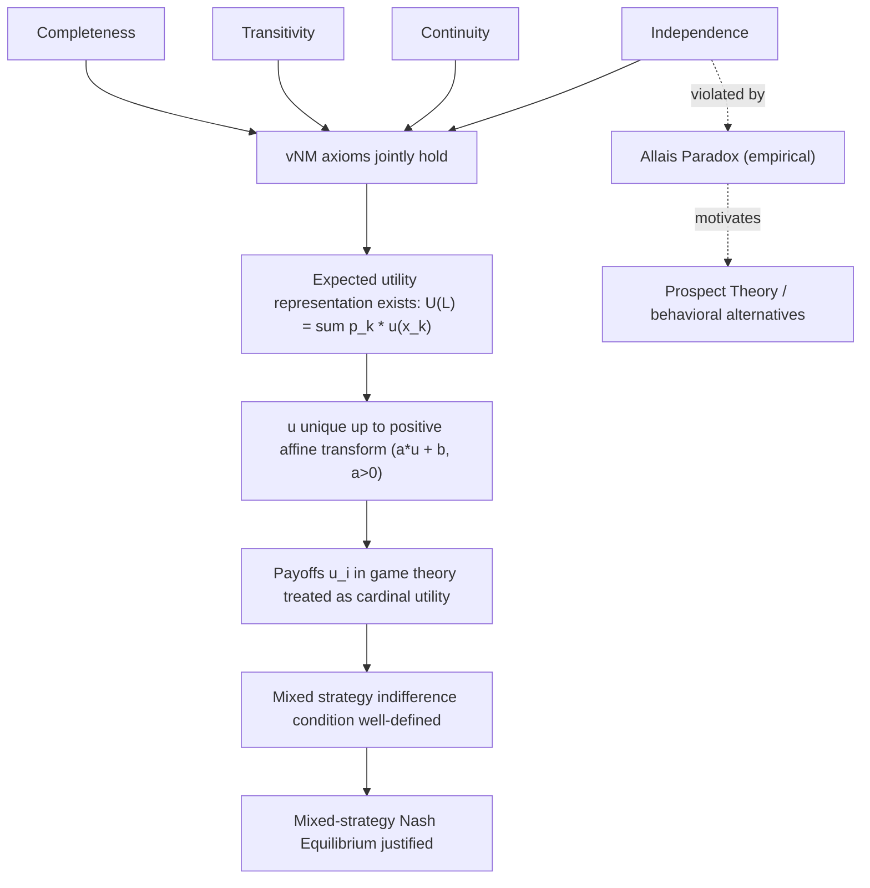

## Expected Utility Theory

### Overview

Expected utility theory (EUT) formalizes rational choice under uncertainty. It provides the normative foundation for how a game-theoretic player is assumed to evaluate lotteries over outcomes — including the outcomes induced by opponents' mixed strategies — and it is the reason payoff functions $u_i$ can be combined with probability distributions via a simple expectation operator, as used throughout mixed-strategy and Bayesian equilibrium analysis. Without EUT, there would be no principled justification for writing $\mathbb{E}_\sigma[u_i]$ as the object players maximize.

### Lotteries as the Objects of Choice

A **lottery** (or **prospect**) over a finite outcome set $X = \{x_1, \dots, x_n\}$ is a probability distribution:

$$L = (p_1, p_2, \dots, p_n), \qquad p_k \geq 0, \quad \sum_{k=1}^n p_k = 1$$

interpreted as "outcome $x_k$ occurs with probability $p_k$."

**Compound lotteries** are lotteries whose outcomes are themselves lotteries: $L = \alpha L_1 + (1-\alpha) L_2$ denotes the lottery that yields $L_1$ with probability $\alpha$ and $L_2$ with probability $1-\alpha$. A **reduced lottery** is the equivalent simple lottery obtained by multiplying through the compound probabilities.

**Example.** In a game, if player 1 plays mixed strategy $\sigma_1 = (0.5\, U, 0.5\, D)$ against player 2's mixed strategy $\sigma_2 = (0.3\, L, 0.7\, R)$, the induced lottery over the four outcome cells $(U,L), (U,R), (D,L), (D,R)$ has probabilities $0.15, 0.35, 0.15, 0.35$ respectively — a reduced lottery over the payoff outcomes.

### The von Neumann–Morgenstern (vNM) Axioms

A preference relation $\succeq$ over the set of lotteries $\mathcal{L}$ admits an expected-utility representation if and only if it satisfies four axioms:

1. **Completeness**: for any two lotteries $L, L' \in \mathcal{L}$, either $L \succeq L'$ or $L' \succeq L$ (or both).
2. **Transitivity**: $L \succeq L'$ and $L' \succeq L'' \implies L \succeq L''$.
3. **Continuity**: for any $L \succ L' \succ L''$, there exists $\alpha \in (0,1)$ such that $L' \sim \alpha L + (1-\alpha) L''$.
4. **Independence (the substitution axiom)**: for any $L, L', L''$ and $\alpha \in (0,1]$:

   $$L \succeq L' \iff \alpha L + (1-\alpha) L'' \succeq \alpha L' + (1-\alpha) L''$$

[Confirmed] These four axioms constitute the standard von Neumann–Morgenstern axiom set, and together they are necessary and sufficient for the existence of a utility representation with the expected-utility (linear-in-probabilities) functional form.

#### The vNM Expected Utility Theorem

If $\succeq$ satisfies axioms 1–4, then there exists a function $u: X \to \mathbb{R}$ such that for any two lotteries $L = (p_1,\dots,p_n)$ and $L' = (p_1',\dots,p_n')$:

$$L \succeq L' \iff \sum_{k=1}^n p_k\, u(x_k) \;\geq\; \sum_{k=1}^n p_k'\, u(x_k)$$

Moreover, $u$ is **unique up to a positive affine transformation**: if $u$ represents $\succeq$, so does $v = a\,u + b$ for any $a > 0, b \in \mathbb{R}$, and these are the *only* transformations that preserve the representation.

[Confirmed] The affine-uniqueness result (cardinal, not merely ordinal, utility) is a defining feature that distinguishes vNM utility from ordinal utility in standard consumer theory — it is what licenses comparing utility *differences* (needed for mixing lotteries), not merely utility *levels*.

### Why the Independence Axiom Is the Load-Bearing One

Completeness, transitivity, and continuity are shared with ordinal utility theory over certain outcomes. The **independence axiom** is what forces the representation to be *linear* in probabilities (an expectation), rather than allowing arbitrary nonlinear transformations of probabilities. It states that mixing two lotteries with a common third lottery in the same proportion should not reverse the original preference — the common part "cancels out" in comparison.

**Example (why independence pins down linearity).** Consider $L = (1, 0, 0)$ (certainty of $x_1$) and $L' = (0, 1, 0)$ (certainty of $x_2$), with $L \succ L'$. Independence requires that for any $L''$ and $\alpha \in (0,1]$:

$$\alpha L + (1-\alpha)L'' \succ \alpha L' + (1-\alpha)L''$$

This must hold *regardless* of what $L''$ is — a strong cancellation property that rules out utility functions that treat "how a lottery is mixed" as intrinsically important beyond its effect on final-outcome probabilities.

### The Allais Paradox — A Documented Violation

[Confirmed] The Allais paradox is a well-documented empirical violation of the independence axiom, first presented by Maurice Allais in 1953.

Consider two pairs of lotteries over outcomes $\{0, \$1\text{M}, \$5\text{M}\}$:

**Pair 1:**

- $A$: $\$1\text{M}$ with certainty
- $B$: $\$5\text{M}$ w.p. $0.10$, $\$1\text{M}$ w.p. $0.89$, $\$0$ w.p. $0.01$

**Pair 2:**

- $C$: $\$1\text{M}$ w.p. $0.11$, $\$0$ w.p. $0.89$
- $D$: $\$5\text{M}$ w.p. $0.10$, $\$0$ w.p. $0.90$

[Confirmed] Empirically, most subjects choose $A \succ B$ in Pair 1 but $D \succ C$ in Pair 2. This combination violates the independence axiom: both pairs can be constructed as a mixture of a common lottery with $\{0, \$1M\}$-type lotteries in the same proportion $(0.89, 0.11)$, so consistent vNM preferences require choosing $A \succ B \iff C \succ D$ — the empirically common pattern $A \succ B$ and $D \succ C$ is logically inconsistent with any single expected-utility function.

[Inference] This is presented in the literature as evidence that human decision-making systematically departs from vNM axioms under certain probability structures (particularly near certainty, the "certainty effect"), motivating alternative frameworks like prospect theory. Whether such departures matter for a *given* game-theoretic model is a modeling choice, not a mathematical necessity — most non-cooperative game theory retains vNM expected utility as the working assumption unless explicitly using behavioral extensions.

### Risk Attitudes and the Shape of $u(\cdot)$

Given a vNM utility function $u$ over monetary outcomes, risk attitude is characterized by concavity:

| Risk attitude | Shape of $u$ | Condition |
| --- | --- | --- |
| Risk averse | concave | $u(\mathbb{E}[X]) \geq \mathbb{E}[u(X)]$ (Jensen's inequality) |
| Risk neutral | linear | $u(\mathbb{E}[X]) = \mathbb{E}[u(X)]$ |
| Risk seeking | convex | $u(\mathbb{E}[X]) \leq \mathbb{E}[u(X)]$ |

The **certainty equivalent** $CE$ of a lottery $L$ is the sure amount satisfying $u(CE) = \mathbb{E}[u(X)]$; the **risk premium** is $\mathbb{E}[X] - CE$, positive for risk-averse agents.

Common parametric forms used in applied game theory:

- **CARA** (constant absolute risk aversion): $u(x) = -e^{-\alpha x}$, $\alpha > 0$
- **CRRA** (constant relative risk aversion): $u(x) = \dfrac{x^{1-\rho}}{1-\rho}$, $\rho \neq 1$ (or $\ln x$ if $\rho = 1$)

[Confirmed] These functional forms are standard closed-form specifications used throughout economics and applied game theory (e.g., auction theory with risk-averse bidders) because their risk-aversion coefficients are constant, simplifying comparative statics.

**Example (risk aversion changing a game's equilibrium).** In a first-price sealed-bid auction with risk-neutral bidders, the symmetric equilibrium bid is $\beta(v) = \frac{n-1}{n}v$ (uniform valuations, as derived under Probability Theory). [Confirmed] Under CRRA risk aversion with parameter $\rho \in (0,1)$, the standard result is that risk-averse bidders shade their bids *less* — bidding closer to their true valuation than risk-neutral bidders — because a higher bid trades a small utility loss for a higher, utility-valued probability of winning; this is a well-established comparative-static result in auction theory.

### Application: Why Expected Utility Justifies Mixed-Strategy Equilibrium

For a mixed-strategy Nash equilibrium to be a *meaningful* solution concept — not merely a mathematical convenience — players must be indifferent (in *utility* terms, not merely payoff-number terms) between all pure strategies in the support of their equilibrium mix. This indifference condition,

$$u_i(s_i, \sigma_{-i}) = u_i(s_i', \sigma_{-i}) \quad \text{for all } s_i, s_i' \in \text{supp}(\sigma_i^*)$$

relies on $u_i$ already being a vNM utility index (unique up to positive affine transformation), so that "expected utility" is a well-defined, comparable quantity across the different pure strategies being mixed. If $u_i$ were merely an ordinal payoff ranking, taking a probability-weighted average of it would be meaningless — this is precisely the gap that the vNM theorem closes.

### Illustration: Structure of the vNM Representation Theorem

### Illustration: Concave vs. Linear vs. Convex Utility (svg_diagram)

<svg xmlns="http://www.w3.org/2000/svg" viewBox="0 0 520 300">
\<style\>
.lbl { font-family: monospace; font-size: 12px; fill: #1a1a1a; }
.title { font-family: sans-serif; font-size: 15px; fill: #1a1a1a; font-weight: bold; }
.axis { stroke: #333; stroke-width: 1.5; }
.curve { fill: none; stroke-width: 2; }
\</style\>
<text x="15" y="22" class="title">Risk Attitude via Utility Curvature (svg_diagram)</text>
<line x1="60" y1="260" x2="480" y2="260" class="axis" />
<line x1="60" y1="260" x2="60" y2="30" class="axis" />
<text x="440" y="278" class="lbl">wealth x</text>
<text x="30" y="40" class="lbl">u(x)</text>
<path d="M 60 250 Q 270 60 480 40" class="curve" stroke="#2266cc" />
<text x="330" y="70" class="lbl" fill="#2266cc">Concave: risk-averse</text>
<line x1="60" y1="250" x2="480" y2="60" class="curve" stroke="#228833" />
<text x="330" y="145" class="lbl" fill="#228833">Linear: risk-neutral</text>
<path d="M 60 250 Q 270 240 480 40" class="curve" stroke="#cc3333" />
<text x="330" y="230" class="lbl" fill="#cc3333">Convex: risk-seeking</text>
</svg>

### Common Pitfalls

- **Treating payoff numbers as ordinal in a mixed-strategy context**: once mixing is involved, payoff *magnitudes* matter, not just their ranking — doubling all payoffs via a non-affine transformation (e.g., squaring) changes the mixed-strategy equilibrium, whereas positive affine transformations do not.
- **Assuming risk neutrality by default**: many textbook game-theory payoff matrices are presented as raw monetary amounts, which implicitly assumes risk neutrality ($u(x) = x$); this is a modeling simplification, not a logical requirement of the theory.
- **Applying expected utility to non-vNM-consistent preferences without acknowledgment**: if empirical or behavioral considerations suggest independence-axiom violations are material to the analysis (e.g., certainty effects near probability 0 or 1), using plain EUT without flagging this as a simplification can mischaracterize predicted behavior.
- **Confusing expected value with expected utility**: $\mathbb{E}[X] \neq \mathbb{E}[u(X)]$ in general whenever $u$ is nonlinear; equilibrium and welfare comparisons must be done in utility terms, not raw monetary/outcome terms, once risk attitudes are non-neutral.

**Related Topics:**

- Set Theory and Logic for Game Theory
- Probability Theory and Random Variables
- Risk Aversion and Certainty Equivalents in Strategic Settings
- Mixed-Strategy Nash Equilibrium
- Prospect Theory and Behavioral Game Theory
- Auction Theory with Risk-Averse Bidders