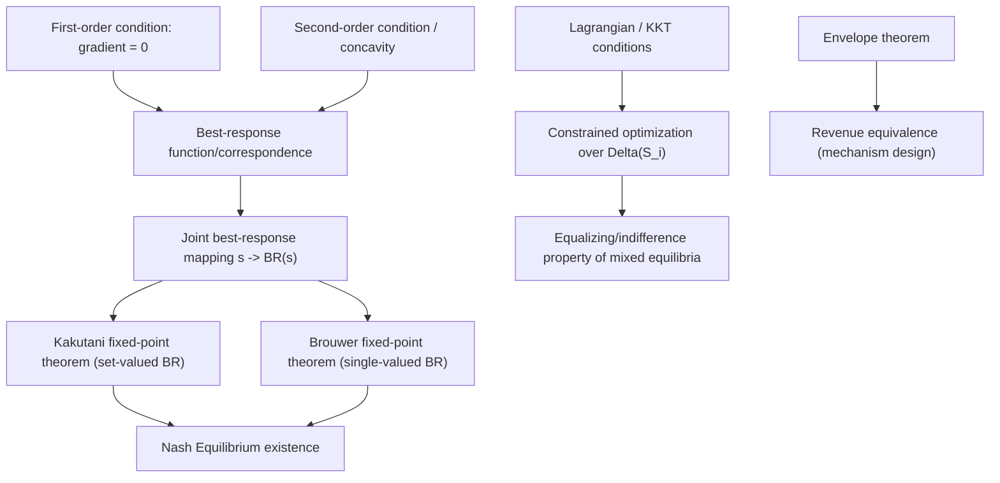

## Optimization and Calculus Foundations

### Overview

Optimization and calculus provide the machinery for finding best responses, characterizing equilibria in continuous strategy spaces, and proving existence results. Where earlier foundations (set theory, probability, expected utility) define the *objects* of a game, calculus and optimization define *how a player chooses* — via derivatives, first-order conditions, and constrained maximization — and provide the analytical toolkit (fixed-point theorems, concavity, the envelope theorem) that underlies existence and characterization of Nash equilibria in continuous games.

### Univariate Optimization

For a differentiable payoff function $u_i: \mathbb{R} \to \mathbb{R}$ over a continuous action $s_i \in \mathbb{R}$, an interior maximum $s_i^*$ satisfies:

**First-order condition (FOC):**

$$\frac{du_i}{ds_i}\bigg|_{s_i = s_i^*} = 0$$

**Second-order condition (SOC), sufficient for a local max:**

$$\frac{d^2 u_i}{ds_i^2}\bigg|_{s_i = s_i^*} < 0$$

If $u_i$ is **concave** on its domain, any point satisfying the FOC is a **global** maximum — this is why concavity assumptions are so common in game-theoretic payoff specifications: they convert a merely local, first-order condition into a global optimality guarantee.

**Example — Cournot duopoly.** Two firms choose quantities $q_1, q_2 \geq 0$. Market price is $P(Q) = a - Q$ where $Q = q_1 + q_2$, and marginal cost is $c$. Firm 1's profit:

$$\pi_1(q_1, q_2) = q_1 \left[ a - (q_1+q_2) - c \right]$$

FOC with respect to $q_1$:

$$\frac{\partial \pi_1}{\partial q_1} = a - 2q_1 - q_2 - c = 0 \implies q_1 = \frac{a - c - q_2}{2}$$

This is firm 1's **best-response function** $BR_1(q_2)$. Solving the symmetric system $q_1 = BR_1(q_2)$, $q_2 = BR_2(q_1)$ gives the Cournot–Nash equilibrium:

$$q_1^* = q_2^* = \frac{a-c}{3}$$

[Confirmed] This is the standard textbook Cournot duopoly solution under linear demand and constant marginal cost.

### Multivariate Optimization and Best-Response Functions

For a player with an $m$-dimensional continuous strategy $s_i \in \mathbb{R}^m$, the FOC is the vector equation:

$$\nabla_{s_i} u_i(s_i, s_{-i}) = \mathbf{0}$$

and the SOC for a local max requires the **Hessian** matrix $\nabla^2_{s_i} u_i$ to be negative semi-definite at the critical point.

A **best-response function** (or correspondence, when multivalued) is:

$$BR_i(s_{-i}) = \arg\max_{s_i \in S_i} u_i(s_i, s_{-i})$$

A **Nash equilibrium** in a continuous game is precisely a **fixed point** of the joint best-response mapping:

$$s_i^* = BR_i(s_{-i}^*) \quad \forall i \in N$$

This reframes Nash equilibrium existence as a fixed-point problem — the reason **Brouwer's** and **Kakutani's fixed-point theorems** are central to existence proofs (Nash's original 1950 proof uses Kakutani's theorem; Nash's 1951 proof uses Brouwer's, applied to a derived mapping).

### Constrained Optimization: Lagrange Multipliers and KKT Conditions

Many strategic problems involve constraints — budget limits, non-negativity of quantities, probability-simplex constraints on mixed strategies. The general constrained problem:

$$\max_{x} f(x) \quad \text{subject to} \quad g_j(x) \leq 0,\ j = 1,\dots,m \quad \text{and} \quad h_k(x) = 0,\ k=1,\dots,p$$

The **Lagrangian**:

$$\mathcal{L}(x, \lambda, \mu) = f(x) - \sum_j \lambda_j g_j(x) - \sum_k \mu_k h_k(x)$$

**Karush–Kuhn–Tucker (KKT) conditions** (necessary for a local max under standard constraint qualifications):

1. Stationarity: $\nabla_x \mathcal{L} = 0$
2. Primal feasibility: $g_j(x) \leq 0$, $h_k(x) = 0$
3. Dual feasibility: $\lambda_j \geq 0$
4. Complementary slackness: $\lambda_j g_j(x) = 0$

**Example (mixed strategy as constrained optimization).** Finding a best response within $\Delta(S_i)$ — the simplex constraint $\sum_k \sigma_i(s_i^k) = 1$, $\sigma_i(s_i^k) \geq 0$ — is exactly a constrained optimization problem. The KKT stationarity condition here directly explains the **equalizing property** of mixed-strategy equilibria: for any two pure strategies with strictly positive equilibrium probability (i.e., the non-negativity constraint is *not* binding, so complementary slackness forces $\lambda = 0$ for those), the FOC forces their expected payoffs to be exactly equal — precisely the indifference condition central to computing mixed Nash equilibria.

### Concavity, Convexity, and Quasi-Concavity

| Property | Definition | Relevance |
| --- | --- | --- |
| Concave | $f(\alpha x + (1-\alpha)y) \geq \alpha f(x) + (1-\alpha) f(y)$ | guarantees FOC gives global max |
| Convex | reverse inequality | typical of cost functions, not payoffs directly |
| Quasi-concave | upper contour sets $\{x : f(x) \geq c\}$ are convex | weaker condition sufficient for many existence theorems |

[Confirmed] **Debreu–Glicksberg–Fan** existence theorem: a Nash equilibrium in pure strategies exists in a game with continuous strategy spaces if each $S_i$ is a nonempty, compact, convex subset of a Euclidean space and each $u_i$ is continuous in $s$ and **quasi-concave** in $s_i$ for fixed $s_{-i}$. Quasi-concavity, not full concavity, is the precise condition needed — a materially weaker and more general requirement, since it only constrains the shape of upper contour sets rather than the function's curvature everywhere.

### The Envelope Theorem

For a value function $V(\theta) = \max_{x} f(x, \theta)$ with optimizer $x^*(\theta)$:

$$\frac{dV}{d\theta} = \frac{\partial f}{\partial \theta}\bigg|_{x = x^*(\theta)}$$

This states that, at an optimum, the total derivative of the value function with respect to a parameter equals the *partial* derivative — the indirect effect through $x^*(\theta)$ vanishes because $\partial f/\partial x = 0$ at the optimum (envelope condition).

**Application.** In auction theory and mechanism design, the envelope theorem is used to derive the **revenue equivalence theorem**: differentiating a bidder's equilibrium expected payoff with respect to their own type, holding the optimal bidding strategy fixed at its optimum, yields a clean expression for expected payments independent of the specific auction format (first-price, second-price, etc.), provided the same allocation rule and participation constraints apply. [Inference] This is a standard derivation technique in mechanism design textbooks; the full revenue equivalence result requires additional regularity conditions (e.g., monotonicity of the allocation rule) beyond the envelope theorem alone.

### Fixed-Point Theorems (Bridge to Existence Proofs)

| Theorem | Statement (informal) | Used for |
| --- | --- | --- |
| **Brouwer** | A continuous function $f: X \to X$ on a compact, convex $X \subset \mathbb{R}^n$ has a fixed point | Nash's 1951 existence proof (applied to a best-response-based mapping) |
| **Kakutani** | A upper-hemicontinuous correspondence $F: X \rightrightarrows X$ with nonempty, compact, convex values on compact convex $X$ has a fixed point | Nash's original 1950 proof (applied directly to best-response correspondences) |

**Why Kakutani, not Brouwer, applies directly to best responses.** Best-response correspondences $BR_i(s_{-i})$ can be *set-valued* — multiple strategies can tie for optimal — so the mapping $s \mapsto \prod_i BR_i(s_{-i})$ is generally a correspondence, not a function, requiring Kakutani's generalization rather than Brouwer's theorem for functions. [Confirmed] This is precisely why Nash's 1950 paper uses Kakutani's fixed-point theorem.

### Illustration: From Calculus Tool to Equilibrium Concept

### Illustration: Best-Response Curves and Cournot Equilibrium (svg_diagram)

<svg xmlns="http://www.w3.org/2000/svg" viewBox="0 0 480 340">
\<style\>
.lbl { font-family: monospace; font-size: 12px; fill: #1a1a1a; }
.title { font-family: sans-serif; font-size: 15px; fill: #1a1a1a; font-weight: bold; }
.axis { stroke: #333; stroke-width: 1.5; }
.curve { fill: none; stroke-width: 2; }
.pt { fill: #b33; }
\</style\>
<text x="15" y="22" class="title">Cournot Best-Response Functions (svg_diagram)</text>
<line x1="60" y1="300" x2="440" y2="300" class="axis" />
<line x1="60" y1="300" x2="60" y2="30" class="axis" />
<text x="400" y="318" class="lbl">q1</text>
<text x="35" y="40" class="lbl">q2</text>
<line x1="60" y1="60" x2="380" y2="300" class="curve" stroke="#2266cc" />
<text x="300" y="270" class="lbl" fill="#2266cc">BR2(q1)</text>
<line x1="60" y1="300" x2="300" y2="60" class="curve" stroke="#cc3333" />
<text x="220" y="90" class="lbl" fill="#cc3333">BR1(q2)</text>
<circle cx="200" cy="200" r="5" class="pt" />
<text x="210" y="195" class="lbl">Nash Eq: q1*=q2*=(a-c)/3</text>
</svg>

### Common Pitfalls

- **Applying FOC alone without checking SOC/concavity**: a stationary point is not automatically a maximum; without concavity (or quasi-concavity), FOC solutions may be saddle points or minima, and multiple local optima can exist.
- **Ignoring boundary/corner solutions**: interior FOC analysis silently assumes an interior optimum; in games with non-negativity constraints (e.g., $q_i \geq 0$), corner solutions ($q_i^* = 0$) require checking KKT conditions rather than blindly solving $\partial u_i/\partial s_i = 0$.
- **Treating best-response correspondences as always single-valued functions**: when payoffs are only quasi-concave (not strictly concave), best responses can be a *set* rather than a point, and the fixed-point argument must use Kakutani's theorem rather than Brouwer's.
- **Misapplying the envelope theorem when the optimizer itself is discontinuous**: the clean envelope result assumes $x^*(\theta)$ varies smoothly enough (typically requiring interior solutions and appropriate differentiability); at points where the optimal choice jumps discretely, the simple envelope formula can fail to apply directly.

**Related Topics:**

- Set Theory and Logic for Game Theory
- Probability Theory and Random Variables
- Expected Utility Theory
- Existence of Nash Equilibrium (Nash's Theorem)
- Continuous-Strategy Games (Cournot, Bertrand, Hotelling)
- Mechanism Design and Revenue Equivalence