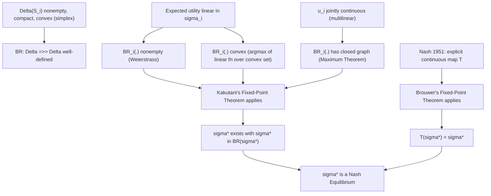

## Fixed Point Theorems

### Overview

Fixed-point theorems are the mathematical engine behind equilibrium *existence* proofs in game theory. A Nash equilibrium is, by construction, a fixed point of the joint best-response mapping — this topic isolates and develops that machinery in depth: the precise statements of Brouwer's and Kakutani's theorems, the technical conditions (compactness, convexity, continuity/upper-hemicontinuity) they require, and how Nash's two original proofs (1950 and 1951) instantiate them.

### Fixed Points: The Basic Concept

A **fixed point** of a function $f: X \to X$ is a point $x^* \in X$ such that:

$$f(x^*) = x^*$$

For a **correspondence** (set-valued map) $F: X \rightrightarrows X$, a fixed point is a point $x^*$ such that:

$$x^* \in F(x^*)$$

**Why this matters for games.** Define the **joint best-response correspondence** $BR: S \rightrightarrows S$ by:

$$BR(s) = \big(BR_1(s_{-1}), BR_2(s_{-2}), \dots, BR_n(s_{-n})\big)$$

A strategy profile $s^*$ is a Nash equilibrium **if and only if** $s^* \in BR(s^*)$ — that is, Nash equilibrium existence is logically equivalent to the existence of a fixed point of $BR$. This equivalence is exact and definitional, not an approximation: it follows directly from the definition of Nash equilibrium (no profitable unilateral deviation) applied componentwise.

### Brouwer's Fixed-Point Theorem

**Statement.** Let $X \subset \mathbb{R}^n$ be nonempty, compact, and convex. If $f: X \to X$ is continuous, then $f$ has at least one fixed point $x^* \in X$ with $f(x^*) = x^*$.

[Confirmed] This is the standard statement of Brouwer's fixed-point theorem (1911), one of the foundational results of algebraic/differential topology.

**Necessity of each hypothesis** (each can be violated to produce a counterexample):

| Hypothesis dropped | Counterexample | No fixed point because |
| --- | --- | --- |
| Compactness | $f(x) = x+1$ on $X = \mathbb{R}$ | $X$ unbounded, no fixed point exists |
| Convexity | $f$ = rotation by $90°$ on a circular *ring* (annulus) | domain has a "hole"; rotation has no fixed point |
| Continuity | $f(x) = 1$ for $x < 0.5$, $f(x)=0$ for $x \geq 0.5$ on $[0,1]$ | jump discontinuity skips over the diagonal |

**Example (1-dimensional intuition).** For $X = [0,1]$ and continuous $f: [0,1] \to [0,1]$, define $g(x) = f(x) - x$. Since $f(0) \geq 0 \implies g(0) \geq 0$ and $f(1) \leq 1 \implies g(1) \leq 0$, by the Intermediate Value Theorem there exists $x^*$ with $g(x^*) = 0$, i.e., $f(x^*) = x^*$. [Confirmed] This is the standard elementary proof of Brouwer's theorem in one dimension; the general $n$-dimensional proof requires genuinely topological tools (e.g., degree theory or Sperner's lemma) and does not reduce to a simple IVT argument.

### Kakutani's Fixed-Point Theorem

**Statement.** Let $X \subset \mathbb{R}^n$ be nonempty, compact, and convex. Let $F: X \rightrightarrows X$ be a correspondence such that:

1. $F(x)$ is nonempty for every $x \in X$
2. $F(x)$ is convex for every $x \in X$
3. $F$ has a **closed graph** (equivalently, is **upper hemicontinuous** with closed values, given compactness)

Then $F$ has a fixed point: there exists $x^* \in X$ with $x^* \in F(x^*)$.

[Confirmed] This is the standard statement of Kakutani's fixed-point theorem (1941), a generalization of Brouwer's theorem to set-valued maps, and it is the theorem Kakutani himself developed partly to give a simpler proof of von Neumann's minimax theorem.

#### Upper Hemicontinuity, Defined

A correspondence $F: X \rightrightarrows Y$ is **upper hemicontinuous (uhc)** at $x_0$ if for every open set $V \supseteq F(x_0)$, there exists a neighborhood $U$ of $x_0$ such that $F(x) \subseteq V$ for all $x \in U$. Equivalently (given $Y$ compact), $F$ has a **closed graph**: if $x_n \to x_0$, $y_n \in F(x_n)$, and $y_n \to y_0$, then $y_0 \in F(x_0)$.

Intuition: the correspondence cannot "suddenly balloon outward" as $x$ changes — its values change in a controlled, sequentially closed manner.

### Applying Kakutani's Theorem to Prove Nash Equilibrium Existence

**Setup.** Consider a finite normal-form game $G = \langle N, (S_i), (u_i) \rangle$. Extend each finite $S_i$ to its mixed-strategy simplex $\Delta(S_i)$, and let $\Delta = \prod_i \Delta(S_i)$, the joint mixed-strategy space.

**Step 1 — domain conditions.** $\Delta(S_i)$ is nonempty (assuming $S_i$ nonempty), compact (a closed, bounded subset of $\mathbb{R}^{|S_i|}$), and convex (it is a simplex, the convex hull of unit vectors). The product $\Delta$ inherits these properties.

**Step 2 — define the best-response correspondence.**

$$BR_i(\sigma_{-i}) = \arg\max_{\sigma_i \in \Delta(S_i)} \mathbb{E}_{\sigma_i, \sigma_{-i}}[u_i]$$

$$BR(\sigma) = BR_1(\sigma_{-1}) \times BR_2(\sigma_{-2}) \times \cdots \times BR_n(\sigma_{-n})$$

**Step 3 — verify Kakutani's hypotheses for $BR$:**

- **Nonempty**: $\mathbb{E}_{\sigma_i, \sigma_{-i}}[u_i]$ is continuous and linear in $\sigma_i$; $\Delta(S_i)$ is compact; a continuous function on a nonempty compact set attains a maximum (Weierstrass), so $BR_i(\sigma_{-i}) \neq \emptyset$.
- **Convex**: expected utility is *linear* in $\sigma_i$ (since $S_i$ is finite, $\mathbb{E}[u_i] = \sum_{s_i} \sigma_i(s_i) u_i(s_i, \sigma_{-i})$), so the set of maximizers of a linear function over a convex set is itself convex (any two maximizers achieve the same maximum value, and any mixture of them, by linearity, achieves that same value too).
- **Closed graph / uhc**: $u_i$ is continuous in $(\sigma_i, \sigma_{-i})$ (again by the multilinearity of expected utility in finite games), which — combined with compactness of $\Delta(S_i)$ — is a standard sufficient condition (via the **Maximum Theorem** / Berge's theorem) for $BR_i$ to have a closed graph.

**Step 4 — apply Kakutani.** Since $BR: \Delta \rightrightarrows \Delta$ satisfies all of Kakutani's hypotheses, there exists $\sigma^* \in \Delta$ with $\sigma^* \in BR(\sigma^*)$ — a mixed-strategy Nash equilibrium.

[Confirmed] This is the standard structure of Nash's 1950 proof (*Equilibrium Points in N-Person Games*), which relies on exactly this application of Kakutani's fixed-point theorem to the mixed-strategy best-response correspondence of a finite game.

### Nash's Alternative 1951 Proof via Brouwer

Nash's 1951 paper (*Non-Cooperative Games*) gives a second proof using **Brouwer's** theorem directly, by constructing an explicit continuous function (rather than working with the possibly set-valued best-response correspondence). A standard construction defines, for each player $i$ and pure strategy $s_i^k \in S_i$, a "gain function":

$$\gamma_i^k(\sigma) = \max\big\{0,\ u_i(s_i^k, \sigma_{-i}) - u_i(\sigma_i, \sigma_{-i})\big\}$$

measuring the payoff improvement from switching entirely to pure strategy $s_i^k$. A continuous map $T: \Delta \to \Delta$ is then built that shifts probability mass toward strategies with positive gain:

$$T_i^k(\sigma) = \frac{\sigma_i(s_i^k) + \gamma_i^k(\sigma)}{1 + \sum_{j} \gamma_i^j(\sigma)}$$

[Confirmed] $T$ is continuous (as a composition/ratio of continuous functions with a strictly positive denominator) and maps the compact convex set $\Delta$ into itself, so Brouwer's theorem guarantees a fixed point $\sigma^*$ of $T$. [Inference] Showing that a fixed point of $T$ must have all gain functions equal to zero (and hence be a genuine Nash equilibrium) requires an additional short algebraic argument, standard in textbook expositions of this proof but often condensed or omitted in casual treatments.

### Comparing the Two Existence Proofs

| Aspect | 1950 (Kakutani) | 1951 (Brouwer) |
| --- | --- | --- |
| Object mapped | Best-response *correspondence* (set-valued) | Explicit *function* $T$ (single-valued) |
| Key convexity argument | Convexity of $\arg\max$ set under linear objective | Built directly into the construction of $T$ |
| Continuity requirement | Closed graph / upper hemicontinuity | Ordinary continuity of $T$ |
| Conceptual clarity | Most naturally tied to "equilibrium = fixed point of BR" | More self-contained; avoids correspondence machinery |

Both proofs establish the same result — existence of a mixed-strategy Nash equilibrium in any finite game — via mathematically distinct but closely related fixed-point arguments.

### Extension: Existence in Continuous Games

For games with continuous (not finite) strategy spaces, the relevant existence result is due to **Debreu, Glicksberg, and Fan** (independently, 1952), extending Kakutani's approach:

**Theorem (informal).** If each $S_i \subset \mathbb{R}^m$ is nonempty, compact, and convex, and each $u_i(s_i, s_{-i})$ is continuous in $s = (s_i, s_{-i})$ jointly and **quasi-concave** in $s_i$ for every fixed $s_{-i}$, then a pure-strategy Nash equilibrium exists.

[Confirmed] Quasi-concavity here plays the same structural role that linearity of expected utility played in the finite-game proof: it guarantees the best-response correspondence $BR_i(s_{-i}) = \arg\max_{s_i} u_i(s_i,s_{-i})$ has convex values, which is precisely the hypothesis Kakutani's theorem requires.

### Illustration: Logical Structure of the Existence Argument

### Illustration: Brouwer's Theorem in One Dimension (svg_diagram)

<svg xmlns="http://www.w3.org/2000/svg" viewBox="0 0 460 320">
\<style\>
.lbl { font-family: monospace; font-size: 12px; fill: #1a1a1a; }
.title { font-family: sans-serif; font-size: 15px; fill: #1a1a1a; font-weight: bold; }
.axis { stroke: #333; stroke-width: 1.5; }
.diag { stroke: #888; stroke-width: 1; stroke-dasharray: 4,4; }
.curve { fill: none; stroke: #2266cc; stroke-width: 2; }
.pt { fill: #b33; }
\</style\>
<text x="15" y="22" class="title">f: [0,1] -&gt; [0,1] must cross the diagonal (svg_diagram)</text>
<line x1="50" y1="270" x2="410" y2="270" class="axis" />
<line x1="50" y1="270" x2="50" y2="30" class="axis" />
<text x="390" y="288" class="lbl">x</text>
<text x="25" y="40" class="lbl">f(x)</text>
<line x1="50" y1="270" x2="410" y2="30" class="diag" />
<text x="360" y="60" class="lbl">y = x (diagonal)</text>
<path d="M 50 200 C 150 60, 300 250, 410 100" class="curve" />
<text x="120" y="230" class="lbl" fill="#2266cc">f(x), continuous</text>
<circle cx="185" cy="160" r="5" class="pt" />
<text x="195" y="150" class="lbl">fixed point: f(x*) = x*</text>
<circle cx="330" cy="145" r="5" class="pt" />
<text x="270" y="185" class="lbl">another crossing (fixed points need not be unique)</text>
</svg>

### Common Pitfalls

- **Applying Brouwer's theorem to a set-valued best-response map**: when best responses are not unique (ties in the argmax), the mapping is a correspondence, not a function, and Brouwer's theorem — which requires a single-valued continuous function — does not directly apply; Kakutani's theorem must be used instead.
- **Forgetting the convexity requirement on the domain**: applying either theorem to a non-convex strategy space (e.g., a discrete finite pure-strategy set $S_i$ itself, rather than its simplex $\Delta(S_i)$) is invalid — this is precisely why pure-strategy Nash equilibria need not exist in finite games (Matching Pennies), while mixed-strategy equilibria always do once the domain is convexified into $\Delta(S_i)$.
- **Treating quasi-concavity and convexity of the best-response set as interchangeable with concavity of the payoff function**: quasi-concavity of $u_i$ in $s_i$ is what is actually needed for convex-valued best responses; full concavity is a stronger, unnecessary condition for this particular purpose (though it is useful for other things, such as guaranteeing FOC-based characterization).
- **Assuming Kakutani/Brouwer give uniqueness**: fixed-point theorems guarantee *existence*, never uniqueness — games routinely have multiple Nash equilibria (see the 1-dimensional illustration above), and establishing uniqueness requires separate arguments (e.g., strict concavity, contraction mappings, or dominance-solvability).

**Related Topics:**

- Set Theory and Logic for Game Theory
- Probability Theory and Random Variables
- Expected Utility Theory
- Optimization and Calculus Foundations
- Existence and Uniqueness of Nash Equilibrium
- Mixed-Strategy Nash Equilibrium
- Continuous-Strategy Games (Cournot, Bertrand, Hotelling)