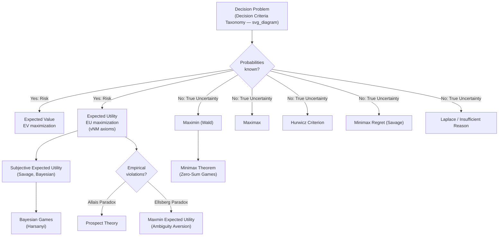

## Decision Theory Under Uncertainty

### Overview

Decision theory under uncertainty studies how a rational agent should choose among actions when the consequences of those actions depend on unknown or probabilistic states of the world. It forms a mathematical prerequisite to game theory because every game-theoretic equilibrium concept assumes players are individually rational decision-makers who evaluate uncertain outcomes (opponents' strategies, nature's moves, mixed-strategy realizations) according to well-defined preference rules. Where game theory studies strategic interaction between multiple agents, decision theory studies the single-agent problem of choosing under uncertainty, and provides the utility machinery that game theory then builds on.

Three nested settings are traditionally distinguished:

- **Decision-making under certainty**: outcomes of each action are known with certainty.
- **Decision-making under risk**: outcomes are uncertain but governed by known probability distributions.
- **Decision-making under (true) uncertainty**: outcomes are possible but no known, objective probability distribution exists over them (Knightian uncertainty).

---

### The Formal Decision Problem

A decision problem is typically represented by the tuple:

$$(A, S, O, u)$$

- $A$: the set of available actions (or acts) $a_1, a_2, \ldots, a_n$
- $S$: the set of possible states of the world (or states of nature) $s_1, s_2, \ldots, s_m$
- $O$: the set of possible outcomes, determined by a function $g: A \times S \to O$
- $u$: a utility function $u: O \to \mathbb{R}$ assigning a real-valued payoff to each outcome

The agent does not control which state $s$ occurs; the state is either random (risk) or simply unknown (uncertainty). The agent's task is to select $a \in A$ to optimize some criterion applied to the induced distribution over outcomes.

**Decision matrix representation**

A standard way to display a decision problem is a payoff matrix with actions as rows and states as columns:

|  | $s_1$ | $s_2$ | $\cdots$ | $s_m$ |
| --- | --- | --- | --- | --- |
| $a_1$ | $u(g(a_1,s_1))$ | $u(g(a_1,s_2))$ | $\cdots$ | $u(g(a_1,s_m))$ |
| $a_2$ | $u(g(a_2,s_1))$ | $u(g(a_2,s_2))$ | $\cdots$ | $u(g(a_2,s_m))$ |
| $\vdots$ |  |  | $\ddots$ |  |
| $a_n$ | $u(g(a_n,s_1))$ | $u(g(a_n,s_2))$ | $\cdots$ | $u(g(a_n,s_m))$ |

This matrix is structurally identical to a single row-player's payoff matrix in a two-player game against "Nature," which is precisely why decision theory is the natural predecessor to game theory: a game can be seen as a decision problem where the "state" is generated by another rational agent rather than by an indifferent Nature.

---

### Decision Criteria Under Risk (Known Probabilities)

When a probability distribution $p(s_i)$ over states is known, several criteria are used.

**Expected Value (EV) criterion**

$$EV(a_i) = \sum_{j=1}^{m} p(s_j) \cdot g(a_i, s_j)$$

Choose the action maximizing $EV(a_i)$. This criterion is risk-neutral: it does not distinguish between a certain payoff and a risky gamble with the same mean.

**Expected Utility (EU) criterion**

$$EU(a_i) = \sum_{j=1}^{m} p(s_j) \cdot u(g(a_i, s_j))$$

Choosing to maximize expected *utility* rather than expected *value* allows the decision-maker's risk attitude (risk-averse, risk-neutral, risk-seeking) to be encoded in the curvature of $u(\cdot)$. This is the foundation of Expected Utility Theory (below), and is the standard rationality assumption underlying Nash equilibrium in mixed strategies and Bayesian games.

---

### Expected Utility Theory (von Neumann–Morgenstern)

**Key Points**

- Developed by John von Neumann and Oskar Morgenstern (1944) as the axiomatic foundation of *Theory of Games and Economic Behavior*.
- A lottery $L$ is a probability distribution over outcomes: $L = (p_1 \circ o_1, p_2 \circ o_2, \ldots, p_k \circ o_k)$ with $\sum p_i = 1$.
- The theorem states that if a preference relation $\succeq$ over lotteries satisfies four axioms, then there exists a utility function $u$ such that lotteries are ranked by expected utility:

$$L_1 \succeq L_2 \iff \sum_i p_i \, u(o_i) \geq \sum_j q_j \, u(o_j)$$

**The von Neumann–Morgenstern (vNM) Axioms**

1. **Completeness**: For any two lotteries $L_1, L_2$, either $L_1 \succeq L_2$, $L_2 \succeq L_1$, or both (indifference).
2. **Transitivity**: If $L_1 \succeq L_2$ and $L_2 \succeq L_3$, then $L_1 \succeq L_3$.
3. **Continuity (Archimedean axiom)**: If $L_1 \succ L_2 \succ L_3$, there exists $\alpha \in (0,1)$ such that the agent is indifferent between $L_2$ and the compound lottery $\alpha L_1 + (1-\alpha) L_3$.
4. **Independence**: If $L_1 \succeq L_2$, then for any $L_3$ and $\alpha \in (0,1]$:

   $$\alpha L_1 + (1-\alpha) L_3 \succeq \alpha L_2 + (1-\alpha) L_3$$

   This axiom states that mixing two lotteries with a third, irrelevant lottery does not reverse the original preference ordering.

A utility function satisfying this representation is called a **vNM utility function**, and it is unique up to a positive affine transformation ($u' = a \cdot u + b$, $a > 0$) — meaning only the ranking and the *ratios of utility differences* are meaningful, not the absolute scale.

**Why this matters for game theory**: Nash's proof of equilibrium existence in mixed strategies relies on players evaluating randomized strategies via expected utility. Without vNM utility, the concept of a "mixed strategy equilibrium" would be meaningless, since comparing lotteries over outcomes requires exactly the linear-in-probabilities representation the theorem provides.

---

### Risk Attitudes and Utility Curvature

The shape of $u(\cdot)$ over monetary outcomes $x$ encodes risk attitude:

- **Risk-averse**: $u$ is concave ($u'' < 0$). The agent prefers a certain payoff to a fair gamble with the same expected value. Example: $u(x) = \sqrt{x}$.
- **Risk-neutral**: $u$ is linear ($u'' = 0$). The agent is indifferent between a certain payoff and a fair gamble of equal expected value. Example: $u(x) = x$.
- **Risk-seeking**: $u$ is convex ($u'' > 0$). The agent prefers the gamble to the certain equivalent. Example: $u(x) = x^2$.

**Certainty Equivalent (CE)** and **Risk Premium (RP)**

For a lottery $L$ with expected value $EV(L)$:

$$u(CE) = EU(L) \quad \Rightarrow \quad CE = u^{-1}(EU(L))$$

$$RP = EV(L) - CE$$

A risk-averse agent has $CE < EV(L)$, so $RP > 0$: they are willing to sacrifice expected value for certainty.

**Arrow–Pratt measures of risk aversion**

- Absolute risk aversion: $A(x) = -\dfrac{u''(x)}{u'(x)}$
- Relative risk aversion: $R(x) = -x \cdot \dfrac{u''(x)}{u'(x)}$

These measures quantify local curvature and are used to compare risk attitudes across agents or across wealth levels (e.g., constant absolute risk aversion vs. constant relative risk aversion utility families).

**Example**

Suppose $u(x) = \sqrt{x}$ and a lottery offers $100 with probability 0.5 and $0 with probability 0.5.

$$EV(L) = 0.5(100) + 0.5(0) = 50$$

$$EU(L) = 0.5\sqrt{100} + 0.5\sqrt{0} = 0.5(10) + 0 = 5$$

$$CE = u^{-1}(5) = 5^2 = 25$$

$$RP = 50 - 25 = 25$$

The agent values this gamble as if it were a certain $25, despite its expected value of $50 — a direct numerical illustration of risk aversion.

---

### Decision Criteria Under True Uncertainty (Unknown Probabilities)

When no objective probability distribution over states exists, several non-probabilistic decision rules are used. Consider a generic payoff matrix with actions as rows and states as columns.

**Maximin (Wald) Criterion**

Choose the action that maximizes the worst-case (minimum) payoff:

$$a^* = \arg\max_{a_i} \; \min_{s_j} \; g(a_i, s_j)$$

This is a pessimistic, risk-averse rule. It is the direct ancestor of the **minimax** concept central to zero-sum game theory: in a two-player zero-sum game, the maximin value for the row player and the minimin (from the row player's loss perspective) for the column player converge under the Minimax Theorem (von Neumann, 1928) at the value of the game.

**Maximax Criterion**

Choose the action that maximizes the best-case (maximum) payoff:

$$a^* = \arg\max_{a_i} \; \max_{s_j} \; g(a_i, s_j)$$

An optimistic rule, the polar opposite of maximin.

**Hurwicz Criterion (Optimism–Pessimism Index)**

A weighted combination of the best and worst outcomes, parameterized by $\alpha \in [0,1]$ (the "optimism coefficient"):

$$H(a_i) = \alpha \cdot \max_{s_j} g(a_i, s_j) + (1-\alpha) \cdot \min_{s_j} g(a_i, s_j)$$

Choose $a^* = \arg\max_{a_i} H(a_i)$. When $\alpha = 1$, this reduces to maximax; when $\alpha = 0$, it reduces to maximin.

**Minimax Regret (Savage) Criterion**

Define the regret matrix first. For each state $s_j$, compute the best payoff achievable across all actions:

$$M(s_j) = \max_{a_k} g(a_k, s_j)$$

Then the regret of action $a_i$ in state $s_j$ is:

$$R(a_i, s_j) = M(s_j) - g(a_i, s_j)$$

Choose the action minimizing the maximum regret:

$$a^* = \arg\min_{a_i} \; \max_{s_j} \; R(a_i, s_j)$$

This criterion is notable because it depends on the entire matrix (via $M(s_j)$), not just on the row corresponding to the action under consideration.

**Laplace (Principle of Insufficient Reason) Criterion**

If there is no information favoring any state over another, assign a uniform probability $p(s_j) = 1/m$ to each state and maximize expected payoff:

$$a^* = \arg\max_{a_i} \; \frac{1}{m}\sum_{j=1}^{m} g(a_i, s_j)$$

**Example: Comparing Criteria**

|  | $s_1$ | $s_2$ | $s_3$ | Row min | Row max |
| --- | --- | --- | --- | --- | --- |
| $a_1$ | 10 | 8 | 2 | 2 | 10 |
| $a_2$ | 6 | 6 | 6 | 6 | 6 |
| $a_3$ | 0 | 4 | 12 | 0 | 12 |
| Col max ($M(s_j)$) | 10 | 8 | 12 |  |  |

- **Maximin**: row minima are 2, 6, 0 → choose $a_2$ (best worst-case = 6).
- **Maximax**: row maxima are 10, 6, 12 → choose $a_3$ (best best-case = 12).
- **Laplace**: averages are $20/3 \approx 6.67$, $6$, $16/3 \approx 5.33$ → choose $a_1$.
- **Regret matrix**: $R(a_1,\cdot) = (0,0,10)$, $R(a_2,\cdot)=(4,2,6)$, $R(a_3,\cdot)=(10,4,0)$. Max regrets are 10, 6, 10 → choose $a_2$ (minimax regret = 6).
- **Hurwicz** with $\alpha = 0.5$: $H(a_1) = 0.5(10)+0.5(2)=6$, $H(a_2)=6$, $H(a_3)=0.5(12)+0.5(0)=6$ → all tied in this particular instance.

This example shows the criteria can disagree sharply, which is itself an important qualitative lesson: under true uncertainty, "rational" choice is criterion-dependent rather than uniquely determined, unlike under risk where expected utility maximization gives a single answer given a fixed utility function.

---

### Subjective Expected Utility and Bayesian Decision Theory

Savage (1954) extended vNM theory to settings without objective probabilities by showing that if preferences over acts (functions from states to outcomes) satisfy a further set of axioms (including the **Sure-Thing Principle**), then there exists both a subjective probability measure $p(\cdot)$ over states and a utility function $u(\cdot)$ such that acts are ranked by subjective expected utility:

$$SEU(a_i) = \sum_{j} p(s_j) \, u(g(a_i, s_j))$$

This unifies risk and uncertainty: the agent constructs personal (subjective) probabilities even when no objective frequencies exist, and then applies ordinary expected utility maximization. This Bayesian decision-theoretic framework underlies:

- **Bayesian games** (Harsanyi, 1967–68), where players hold subjective beliefs (types) over opponents' private information.
- **Belief updating via Bayes' rule** during sequential and repeated games, and in perfect Bayesian equilibrium / sequential equilibrium refinements.

**Bayes' Rule** (belief updating given new evidence $E$):

$$p(s_j \mid E) = \frac{p(E \mid s_j)\, p(s_j)}{\sum_{k} p(E \mid s_k)\, p(s_k)}$$

---

### Allais Paradox and Departures from Expected Utility

Maurice Allais (1953) constructed a pair of choice problems that many people answer in a way inconsistent with the Independence axiom, revealing a systematic empirical violation of vNM expected utility theory.

**Problem 1**: Choose between

- $A$: $1,000,000 with certainty
- $B$: $5,000,000 with probability 0.10, $1,000,000 with probability 0.89, $0 with probability 0.01

**Problem 2**: Choose between

- $C$: $1,000,000 with probability 0.11, $0 with probability 0.89
- $D$: $5,000,000 with probability 0.10, $0 with probability 0.90

Empirically, most people choose $A$ over $B$ (preferring certainty) but also choose $D$ over $C$ (preferring the higher prize when both are uncertain). This combination violates the Independence axiom, since both problems are constructed by mixing the same two underlying lotteries with a common event. [Unverified: the exact percentages of subjects choosing each combination vary across replications and are not a fixed, universal constant.]

This paradox motivated several generalizations of expected utility, including:

- **Prospect Theory** (Kahneman & Tversky, 1979): replaces objective probabilities with subjective decision weights $\pi(p)$ (typically overweighting small probabilities and underweighting large ones) and replaces the utility function over final wealth with a value function $v(\cdot)$ defined over gains/losses relative to a reference point, exhibiting loss aversion ($v$ steeper for losses than gains) and diminishing sensitivity (concave for gains, convex for losses).
- **Rank-Dependent Utility** and **Cumulative Prospect Theory**, which apply probability weighting to the cumulative distribution rather than to individual outcome probabilities to avoid violations of first-order stochastic dominance.

These behavioral departures are why classical game theory (built on vNM/Savage rationality) is distinguished from **behavioral game theory**, which incorporates prospect-theoretic or bounded-rationality decision rules into equilibrium analysis.

---

### Ellsberg Paradox and Ambiguity Aversion

Daniel Ellsberg (1961) demonstrated a related but distinct phenomenon: people prefer known ("risky") probabilities to unknown ("ambiguous") ones even when expected monetary values are identical, violating Savage's subjective expected utility framework (specifically, it implies no single well-defined subjective probability can rationalize the choices).

**Classic setup**: An urn contains 90 balls: 30 red, and 60 that are black or yellow in unknown proportion.

- Bet on Red (known 1/3 probability) vs. Bet on Black (unknown probability, could be 0 to 60): most subjects prefer betting on Red.
- Bet on Red-or-Yellow (unknown) vs. Bet on Black-or-Yellow (unknown): most subjects prefer Black-or-Yellow.

This pattern cannot be rationalized by any single subjective probability distribution over the urn's composition, revealing genuine **ambiguity aversion** distinct from risk aversion. This motivated non-Bayesian decision models such as:

- **Maxmin Expected Utility** (Gilboa & Schmeidler, 1989): the agent has a *set* of priors $\mathcal{P}$ and evaluates acts by $\min_{p \in \mathcal{P}} E_p[u(a)]$ — effectively a Bayesian generalization of the maximin criterion under true uncertainty.
- **Choquet Expected Utility**, using non-additive probability measures (capacities).

Ambiguity aversion is directly relevant to games with **incomplete information** where players may not have well-defined priors over opponents' types, motivating robust and ambiguity-averse equilibrium refinements in some modern literature.

---

### Diagram: Taxonomy of Decision Criteria

---

### Diagram: Expected Utility vs. Certainty Equivalent (Concave Utility)

<svg xmlns="http://www.w3.org/2000/svg" viewBox="0 0 640 420" font-family="sans-serif">
<text x="320" y="26" text-anchor="middle" font-size="16" font-weight="bold" fill="#1a1a1a">Risk-Averse Utility Curve: EV vs. CE (svg_diagram)</text>

<line x1="70" y1="360" x2="600" y2="360" stroke="#333" stroke-width="2" />
<line x1="70" y1="360" x2="70" y2="40" stroke="#333" stroke-width="2" />
<text x="335" y="395" text-anchor="middle" font-size="13" fill="#333">Wealth (x)</text>
<text x="30" y="200" text-anchor="middle" font-size="13" fill="#333" transform="rotate(-90 30 200)">Utility u(x)</text>

<path d="M 70 360 Q 200 140 600 70" fill="none" stroke="#2563eb" stroke-width="2.5" />
<text x="480" y="90" font-size="12" fill="#2563eb" font-weight="bold">u(x) concave</text>

<circle cx="150" cy="300" r="4" fill="#dc2626" />
<circle cx="560" cy="80" r="4" fill="#dc2626" />
<line x1="150" y1="300" x2="560" y2="80" stroke="#dc2626" stroke-width="1.5" stroke-dasharray="5,4" />
<text x="570" y="75" font-size="11" fill="#dc2626">o2</text>
<text x="130" y="295" font-size="11" fill="#dc2626">o1</text>

<line x1="355" y1="360" x2="355" y2="190" stroke="#16a34a" stroke-width="1.5" stroke-dasharray="4,3" />
<circle cx="355" cy="190" r="4" fill="#16a34a" />
<text x="330" y="375" font-size="12" fill="#16a34a" font-weight="bold">EV(L)</text>
<text x="365" y="185" font-size="11" fill="#16a34a">EU(L) = 0.5u(o1)+0.5u(o2)</text>

<line x1="70" y1="190" x2="355" y2="190" stroke="#7c3aed" stroke-width="1.5" stroke-dasharray="4,3" />
<line x1="255" y1="360" x2="255" y2="190" stroke="#7c3aed" stroke-width="1.5" stroke-dasharray="4,3" />
<circle cx="255" cy="190" r="4" fill="#7c3aed" />
<text x="200" y="375" font-size="12" fill="#7c3aed" font-weight="bold">CE</text>

<line x1="255" y1="345" x2="355" y2="345" stroke="#ea580c" stroke-width="2" />
<text x="270" y="340" font-size="11" fill="#ea580c" font-weight="bold">Risk Premium</text>

<text x="80" y="55" font-size="11" fill="#555">u(x): concave utility (risk-averse agent)</text>

<text x="80" y="70" font-size="11" fill="#555">Chord: linear interpolation between two outcomes' utilities</text>

</svg>

---

### Relevance to Game Theory: The Bridge

**Key Points**

- **Mixed strategies as lotteries**: A mixed strategy in a game is formally a probability distribution over pure strategies. Players are assumed to rank mixed strategies by expected utility over the resulting outcome lotteries — this is a direct application of vNM theory, without which Nash's existence theorem (which relies on fixed-point arguments over mixed strategy simplices, with payoffs linear in probabilities) would not have a coherent behavioral interpretation.
- **Zero-sum games and maximin**: The maximin decision rule under uncertainty becomes, in a two-player zero-sum game, the security-level strategy each player can guarantee regardless of the opponent's action. Von Neumann's Minimax Theorem shows that in finite two-player zero-sum games with mixed strategies, the maximin value equals the minimax value, which equals the value of the game.
- **Bayesian games**: Harsanyi's framework for games of incomplete information directly imports Savage's subjective expected utility apparatus, modeling each player's uncertainty about opponents' payoffs/types as a subjective probability distribution, updated via Bayes' rule as the game progresses (in dynamic settings, giving rise to Bayesian Nash Equilibrium and Perfect Bayesian Equilibrium).
- **Behavioral game theory**: Departures from expected utility (Allais-type violations, ambiguity aversion) motivate equilibrium concepts incorporating prospect-theoretic value/weighting functions or ambiguity-averse (maxmin) preferences, used to explain deviations from classical Nash predictions observed in experimental game theory.

---

### Common Pitfalls and Clarifications

- Confusing **expected value** and **expected utility**: EV maximization is risk-neutral by construction; only EU maximization (with a nonlinear $u$) captures risk attitudes. [Behavior may vary depending on how a specific textbook or course defines "rational" choice — some treatments use EV and EU interchangeably in early expositions before introducing risk aversion formally.]
- The vNM theorem does **not** claim people are risk-neutral; risk aversion/seeking is fully compatible with expected utility maximization via the shape of $u$.
- Uniqueness of vNM utility is only up to **positive affine transformation** — comparing utility *levels* across different scalings, or across different individuals (interpersonal utility comparison), is not meaningful within the theory.
- Maximin and other non-probabilistic criteria are not "wrong" — they are appropriate exactly when no credible probability distribution over states can be justified, distinguishing decision-making under **risk** from decision-making under **(Knightian) uncertainty**.
- The Allais and Ellsberg paradoxes are **descriptive** critiques of expected utility as a positive (predictive) theory of actual human choice; they do not invalidate expected utility as a **normative** benchmark for rational choice, which remains widely used in mechanism design and equilibrium analysis.

---

**Related Topics**

- Von Neumann–Morgenstern Utility Theorem (formal proof and construction)
- Zero-Sum Games and the Minimax Theorem
- Mixed Strategy Nash Equilibrium
- Bayesian Games and Harsanyi Transformation
- Prospect Theory and Behavioral Game Theory
- Arrow's Impossibility Theorem (social choice under preference aggregation)
- Stochastic Dominance (first-order and second-order)
- Robust Optimization and Ambiguity-Averse Equilibrium Concepts
- Sequential Decision Theory and Dynamic Programming (Bellman equations)
- Cooperative Game Theory and the Shapley Value (as a contrast to individual decision theory)