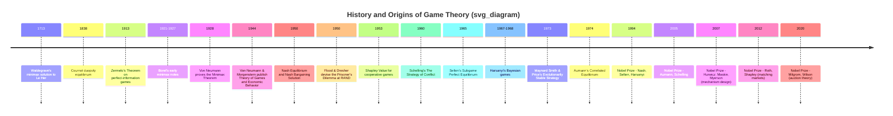

## History and Origins of Game Theory

### Overview

Game theory is the mathematical study of strategic interaction among rational decision-makers whose outcomes depend jointly on their own and others' choices. Its history spans early probabilistic analyses of parlor games, a foundational axiomatization in the 1920s–1940s, a rapid expansion of solution concepts during the Cold War era (much of it funded through military-strategic research), and successive broadenings into economics, biology, computer science, and political science. Understanding this history clarifies why certain concepts (minimax, Nash equilibrium, Bayesian games) emerged in the order they did, and why game theory today is inseparable from decision theory, mechanism design, and computational complexity.

---

### Early Precursors (17th–19th Century)

- **James Waldegrave (1713)**: In correspondence about the card game *Le Her*, Waldegrave proposed what is recognized as the first known minimax mixed-strategy solution to a two-person game, predating formal game theory by over two centuries. [Unverified: the precise mathematical completeness of Waldegrave's solution, as judged by modern standards, is debated among historians of mathematics.]
- **Antoine Augustin Cournot (1838)**: In *Recherches sur les Principes Mathématiques de la Théorie des Richesses*, Cournot analyzed a duopoly model in which two firms choose output quantities simultaneously, each best-responding to the other's expected output. This is widely regarded as the first explicit "equilibrium" concept in a strategic setting — a precursor to Nash equilibrium restricted to a specific economic model, nearly a century before Nash's general formulation.
- **Francis Ysidro Edgeworth (1881)**: Extended Cournot-style reasoning with the concept of the **contract curve** in bilateral exchange, an early forerunner of the game-theoretic **core** in cooperative games.
- **Ernst Zermelo (1913)**: Proved what is now known as **Zermelo's Theorem**, showing that in finite two-player games of perfect information (such as chess), one of the following must hold: the first player can force a win, the second player can force a win, or both players can force at least a draw. This is the first rigorous existence result for optimal strategies in an extensive-form game.

---

### Émile Borel and the Minimax Concept (1921–1927)

Émile Borel published a series of notes (1921, 1924, 1927) exploring games of strategy, introducing the idea of a mixed strategy (a probability distribution over pure actions) and conjecturing results resembling the minimax theorem for small cases. Borel was skeptical that a general minimax theorem could be proven for games with more than a small, fixed number of strategies. [Unverified: some historical accounts describe Borel as explicitly doubting the general existence of minimax solutions, while others frame his position more narrowly as unresolved rather than skeptical — the record is not fully settled.] This skepticism set the stage for von Neumann's more general proof.

---

### John von Neumann and the Minimax Theorem (1928)

John von Neumann's 1928 paper *"Zur Theorie der Gesellschaftsspiele"* ("On the Theory of Parlor Games") proved the **Minimax Theorem**: in any finite, two-player, zero-sum game, there exists a mixed-strategy equilibrium in which each player's maximin value equals the other's minimax value, i.e., a well-defined **value of the game** exists.

$$\max_{p} \min_{q} \; p^\top A q \; = \; \min_{q} \max_{p} \; p^\top A q \; = \; v$$

where $A$ is the payoff matrix, $p$ and $q$ are mixed strategies (probability vectors) for the row and column players respectively, and $v$ is the value of the game. This result is foundational because it guarantees the existence of a rational, stable solution to any finite zero-sum conflict — resolving the question Borel had left open — and it did so using a fixed-point/convexity argument that would later generalize into much of modern equilibrium theory.

---

### Von Neumann and Morgenstern: The Founding Text (1944)

The publication of ***Theory of Games and Economic Behavior*** (1944) by John von Neumann and economist Oskar Morgenstern is conventionally treated as the formal birth of game theory as a distinct field. Its major contributions:

- **Expected utility theory**: the vNM axioms (completeness, transitivity, continuity, independence) establishing that rational preferences over lotteries can be represented by maximizing expected utility — providing the behavioral foundation needed to reason about mixed strategies as genuine objects of choice, not merely mathematical artifacts.
- **Extensive generalization of the minimax theorem** to arbitrary finite zero-sum games, with rigorous proofs.
- **Cooperative game theory**: introduction of the characteristic function form $v(S)$ for coalitions $S$, and early solution concepts such as the **core** and **stable sets**, launching the study of coalition formation and payoff division.
- Application of the framework to economic behavior, arguing that competitive markets, oligopoly, and bargaining could all be modeled as games.

The book's scope was limited primarily to **zero-sum games** and **cooperative games with transferable utility**; a general theory of non-zero-sum, non-cooperative games remained unresolved — this became the central problem John Nash addressed six years later.

---

### John Nash and General Equilibrium (1950–1951)

John Forbes Nash Jr., in his 1950 doctoral dissertation at Princeton (supervised by Albert W. Tucker) and two associated papers — *"Equilibrium Points in n-Person Games"* (1950, *PNAS*) and *"Non-Cooperative Games"* (1951, *Annals of Mathematics*) — proved that **every finite game with any number of players, in which players may use mixed strategies, has at least one equilibrium point**, now called the **Nash Equilibrium**.

**Formal statement**: A strategy profile $\sigma^* = (\sigma_1^*, \ldots, \sigma_n^*)$ is a Nash equilibrium if for every player $i$:

$$u_i(\sigma_i^*, \sigma_{-i}^*) \geq u_i(\sigma_i, \sigma_{-i}^*) \quad \text{for all } \sigma_i$$

Nash's proof used **Kakutani's fixed-point theorem** (a generalization of Brouwer's fixed-point theorem to set-valued mappings), demonstrating existence via topological rather than combinatorial argument. This generalized von Neumann's minimax result (which applied only to two-player zero-sum games) to arbitrary $n$-player, general-sum games — arguably the single most consequential theoretical extension in the field's history, since it made game theory applicable to essentially any strategic-form interaction, not just strictly competitive ones.

Nash also contributed the **Nash Bargaining Solution** (1950, *Econometrica*), an axiomatic solution to two-person bargaining problems satisfying Pareto efficiency, symmetry, invariance to affine transformations, and independence of irrelevant alternatives.

---

### Institutional Context: RAND Corporation and Cold War Research (1948–1960s)

Much of game theory's early development after 1944 was institutionally concentrated at the **RAND Corporation**, a US Air Force–funded think tank established in 1948, where researchers explored applications to nuclear strategy, deterrence, and arms-race modeling.

- **Merrill Flood and Melvin Dresher** (RAND, 1950) devised the game later formalized and named by **Albert W. Tucker** as the **Prisoner's Dilemma**, illustrating how individually rational choices can produce a Pareto-inferior outcome for both players — a structure that became the single most-cited paradigm in the social sciences for problems of cooperation and defection.
- **Lloyd Shapley** developed the **Shapley Value** (1953), a solution concept for fairly dividing payoffs among coalition members in cooperative games, based on a player's average marginal contribution across all possible coalition orderings.
- Research on repeated games and the strategic logic of nuclear deterrence (later popularized by **Thomas Schelling**'s *The Strategy of Conflict*, 1960) extended game-theoretic reasoning into international relations and foreign policy analysis — introducing concepts like commitment, credible threats, and focal points.

---

### Extensive-Form Refinements and Repeated Games (1950s–1970s)

- **Reinhard Selten** introduced **Subgame Perfect Equilibrium** (1965) to rule out Nash equilibria supported by non-credible threats in sequential (extensive-form) games, and later **Trembling-Hand Perfect Equilibrium** (1975) to further refine equilibrium selection under the possibility of small mistakes.
- **Robert Aumann** formalized **Correlated Equilibrium** (1974), a generalization of Nash equilibrium in which players may condition their strategies on a shared signal, and contributed foundational work on **repeated games** and the **Folk Theorem**, which characterizes the wide set of payoffs sustainable as equilibria when a stage game is repeated indefinitely with sufficient patience.
- **John Harsanyi** developed **Bayesian games** (1967–1968) to formally model games of **incomplete information**, where players hold private information ("types") and subjective probabilistic beliefs about opponents, resolving a major gap in the theory's ability to handle asymmetric information.

For these contributions, Nash, Selten, and Harsanyi jointly received the **1994 Sveriges Riksbank Prize in Economic Sciences in Memory of Alfred Nobel** ("Nobel Memorial Prize in Economics") "for their pioneering analysis of equilibria in the theory of non-cooperative games."

---

### Evolutionary Game Theory (1970s)

**John Maynard Smith and George R. Price** introduced the concept of an **Evolutionarily Stable Strategy (ESS)** (1973), reinterpreting game-theoretic equilibrium not as the result of conscious rational choice, but as the outcome of natural selection acting on a population of organisms with fixed, heritable strategies. This branch removed the assumption of individual rationality altogether, replacing it with a dynamic, population-level stability criterion, and became foundational in theoretical biology, later feeding back into economics via models of bounded rationality and learning dynamics (e.g., replicator dynamics).

---

### Formalization of Mechanism Design and Later Recognitions

From the 1970s onward, the theory expanded into **mechanism design** ("reverse game theory"): given a desired social outcome, design the rules of a game (the mechanism) such that self-interested agents' equilibrium behavior produces that outcome. Leonid Hurwicz, Eric Maskin, and Roger Myerson formalized the field's core concepts (incentive compatibility, the revelation principle), receiving the **2007 Nobel Memorial Prize in Economic Sciences** for this work. Subsequent Nobel recognitions of game-theoretic contributions include:

- **2005**: Robert Aumann and Thomas Schelling, for enhancing understanding of conflict and cooperation through game-theory analysis.
- **2012**: Alvin Roth and Lloyd Shapley, for the theory of stable allocations and market design (matching markets, e.g., school choice and kidney exchange).
- **2020**: Paul Milgrom and Robert Wilson, for improvements to auction theory and the invention of new auction formats.

---

### Diagram: Historical Timeline of Key Milestones

---

### Diagram: Conceptual Lineage of Solution Concepts

<svg xmlns="http://www.w3.org/2000/svg" viewBox="0 0 700 480" font-family="sans-serif">
<text x="350" y="26" text-anchor="middle" font-size="16" font-weight="bold" fill="#1a1a1a">Conceptual Lineage of Game-Theoretic Solution Concepts (svg_diagram)</text>

<rect x="270" y="50" width="160" height="40" rx="6" fill="#dbeafe" stroke="#2563eb" stroke-width="1.5" />
<text x="350" y="75" text-anchor="middle" font-size="12" font-weight="bold" fill="#1e3a8a">Borel (1921-27)</text>
<rect x="270" y="115" width="160" height="40" rx="6" fill="#dbeafe" stroke="#2563eb" stroke-width="1.5" />
<text x="350" y="140" text-anchor="middle" font-size="12" font-weight="bold" fill="#1e3a8a">von Neumann (1928)<tspan x="350" dy="14" font-weight="normal">Minimax Theorem</tspan></text>
<rect x="270" y="195" width="160" height="45" rx="6" fill="#dbeafe" stroke="#2563eb" stroke-width="1.5" />
<text x="350" y="215" text-anchor="middle" font-size="12" font-weight="bold" fill="#1e3a8a">von Neumann and Morgenstern (1944)</text>
<text x="350" y="230" text-anchor="middle" font-size="11" fill="#1e3a8a">Expected Utility + Cooperative Games</text>
<rect x="80" y="280" width="160" height="45" rx="6" fill="#dcfce7" stroke="#16a34a" stroke-width="1.5" />
<text x="160" y="300" text-anchor="middle" font-size="12" font-weight="bold" fill="#14532d">Nash (1950-51)</text>
<text x="160" y="315" text-anchor="middle" font-size="11" fill="#14532d">Nash Equilibrium</text>
<rect x="460" y="280" width="160" height="45" rx="6" fill="#fef3c7" stroke="#d97706" stroke-width="1.5" />
<text x="540" y="300" text-anchor="middle" font-size="12" font-weight="bold" fill="#78350f">Shapley (1953)</text>
<text x="540" y="315" text-anchor="middle" font-size="11" fill="#78350f">Shapley Value</text>
<rect x="20" y="360" width="150" height="45" rx="6" fill="#ede9fe" stroke="#7c3aed" stroke-width="1.5" />
<text x="95" y="380" text-anchor="middle" font-size="11" font-weight="bold" fill="#4c1d95">Selten (1965/75)</text>
<text x="95" y="395" text-anchor="middle" font-size="10" fill="#4c1d95">Subgame Perfect / Trembling Hand</text>
<rect x="185" y="360" width="150" height="45" rx="6" fill="#ede9fe" stroke="#7c3aed" stroke-width="1.5" />
<text x="260" y="380" text-anchor="middle" font-size="11" font-weight="bold" fill="#4c1d95">Harsanyi (1967-68)</text>
<text x="260" y="395" text-anchor="middle" font-size="10" fill="#4c1d95">Bayesian Games</text>
<rect x="350" y="360" width="150" height="45" rx="6" fill="#ede9fe" stroke="#7c3aed" stroke-width="1.5" />
<text x="425" y="380" text-anchor="middle" font-size="11" font-weight="bold" fill="#4c1d95">Aumann (1974)</text>
<text x="425" y="395" text-anchor="middle" font-size="10" fill="#4c1d95">Correlated Equilibrium</text>
<rect x="515" y="360" width="150" height="45" rx="6" fill="#fee2e2" stroke="#dc2626" stroke-width="1.5" />
<text x="590" y="380" text-anchor="middle" font-size="11" font-weight="bold" fill="#7f1d1d">Maynard Smith (1973)</text>
<text x="590" y="395" text-anchor="middle" font-size="10" fill="#7f1d1d">Evolutionarily Stable Strategy</text>
<rect x="230" y="435" width="240" height="35" rx="6" fill="#f3f4f6" stroke="#4b5563" stroke-width="1.5" />
<text x="350" y="457" text-anchor="middle" font-size="11" font-weight="bold" fill="#111827">Mechanism Design (1970s-)</text>

<line x1="350" y1="90" x2="350" y2="115" stroke="#333" stroke-width="1.5" marker-end="url(#arrow)" />
<line x1="350" y1="155" x2="350" y2="195" stroke="#333" stroke-width="1.5" marker-end="url(#arrow)" />
<line x1="320" y1="240" x2="180" y2="280" stroke="#333" stroke-width="1.5" marker-end="url(#arrow)" />
<line x1="380" y1="240" x2="520" y2="280" stroke="#333" stroke-width="1.5" marker-end="url(#arrow)" />
<line x1="140" y1="325" x2="100" y2="360" stroke="#333" stroke-width="1.5" marker-end="url(#arrow)" />
<line x1="170" y1="325" x2="255" y2="360" stroke="#333" stroke-width="1.5" marker-end="url(#arrow)" />
<line x1="200" y1="325" x2="410" y2="360" stroke="#333" stroke-width="1.5" marker-end="url(#arrow)" />
<line x1="530" y1="325" x2="580" y2="360" stroke="#333" stroke-width="1.5" marker-end="url(#arrow)" />
<line x1="260" y1="405" x2="330" y2="435" stroke="#333" stroke-width="1.5" marker-end="url(#arrow)" />
<line x1="425" y1="405" x2="390" y2="435" stroke="#333" stroke-width="1.5" marker-end="url(#arrow)" />
</svg>

---

### Common Pitfalls and Clarifications

- Von Neumann's 1928 minimax theorem is often conflated with the full 1944 book; the theorem itself predates and is narrower than the vNM framework, which added expected utility theory and cooperative game solution concepts.
- Nash's contribution is frequently misdescribed as "inventing game theory" — game theory as a field predates Nash by at least two decades (von Neumann and Morgenstern, 1944; arguably Cournot, 1838, and Zermelo, 1913, far earlier). Nash's specific and pivotal contribution was generalizing equilibrium existence to $n$-player, non-zero-sum games.
- The Prisoner's Dilemma is commonly misattributed solely to Tucker; Tucker gave it its canonical name and illustrative story, but the underlying payoff structure was devised by Flood and Dresher at RAND.
- "Nobel Prize in Economics" is, strictly, the Sveriges Riksbank Prize in Economic Sciences in Memory of Alfred Nobel — a distinct prize instituted in 1968, not one of the original five Nobel Prizes established in Alfred Nobel's 1895 will. [Unverified/Speculation: whether this distinction matters is a matter of institutional convention rather than game-theoretic substance, but it is a frequently corrected point of historical accuracy.]

---

**Related Topics**

- The Minimax Theorem and Zero-Sum Games
- Nash Equilibrium: Definition, Existence, and Computation
- The Prisoner's Dilemma and Iterated Variants
- Cooperative Game Theory and the Shapley Value
- Bayesian Games and Games of Incomplete Information
- Subgame Perfect Equilibrium and Backward Induction
- Evolutionary Game Theory and Evolutionarily Stable Strategies
- Mechanism Design and the Revelation Principle
- The Folk Theorem in Repeated Games
- Auction Theory and Matching Markets