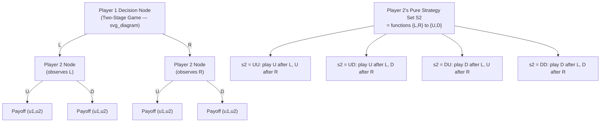

## Defining Players, Strategies, and Payoffs

### Overview

Every game-theoretic model, regardless of representation (normal form, extensive form, characteristic function form), is built from three primitive components: **players** (the decision-makers), **strategies** (the complete plans of action available to each player), and **payoffs** (the numerical representation of each player's preferences over outcomes). Precisely defining these three primitives is the first formal step in modeling any strategic situation, and ambiguity or error at this stage propagates into every downstream solution concept (Nash equilibrium, dominance, backward induction). This item establishes the formal vocabulary used throughout the rest of the course.

---

### Players

**Definition**

A **player** is a decision-making entity capable of choosing among available actions and possessing preferences over the resulting outcomes. The set of players is denoted:

$$N = \{1, 2, \ldots, n\}$$

Players may be individuals, firms, governments, algorithms, or, in evolutionary game theory, entire populations or organism types (in which case individual "rationality" is replaced by selection pressure rather than deliberate choice).

**Key Points**

- **Rationality assumption**: unless otherwise specified, each player is assumed to be a rational, self-interested expected-utility maximizer (per von Neumann–Morgenstern axioms), aware of the game's structure.
- **Common knowledge**: in the baseline (complete information) setting, the game's structure — the player set, the strategy sets, and the payoff functions — is **common knowledge**: every player knows it, knows that every other player knows it, knows that every player knows that every player knows it, and so on ad infinitum. Relaxing this assumption leads to **games of incomplete information** (Bayesian games), where players hold private information ("types") about payoffs or about other players.
- **Nature as a pseudo-player**: in games involving randomness (e.g., a chance move or an unknown state), it is common to model the random process as generated by a fictitious, non-strategic player called **Nature**, whose "choices" follow a fixed, exogenous probability distribution rather than optimization.
- A player is distinguished from a **person**: in coalition or team settings, multiple people may act as one player if they share a single objective function and act as a unified decision-maker.

---

### Strategies

**Definition (Pure Strategy)**

A **pure strategy** for player $i$ is a complete, deterministic plan of action specifying exactly what player $i$ will do in every situation where they must move — including situations that, given earlier choices, may never actually arise in a particular play of the game. The set of pure strategies available to player $i$ is denoted $S_i$, and a specific strategy choice is denoted $s_i \in S_i$.

A **strategy profile** is a vector listing one strategy for each player:

$$s = (s_1, s_2, \ldots, s_n) \in S_1 \times S_2 \times \cdots \times S_n = S$$

It is standard notation to write $s_{-i} = (s_1, \ldots, s_{i-1}, s_{i+1}, \ldots, s_n)$ for the strategies of all players *other than* $i$, so that $s = (s_i, s_{-i})$.

**Crucial distinction: Strategy vs. Action**

In a **single-move (static) game**, a strategy and an action coincide — a player simply picks one action.

In a **multi-stage (dynamic/extensive-form) game**, a strategy is a far richer object than an action: it is a **complete contingency plan** specifying an action at *every* decision node (information set) belonging to that player, including nodes that will never be reached if earlier moves go a certain way. This is a frequent source of confusion for newcomers.

**Example**: Consider a two-stage game where Player 1 moves first (Left or Right), and Player 2 observes Player 1's move and then chooses (Up or Down). Player 2's action set at each node is $\{U, D\}$, but Player 2's **strategy set** must specify a response to *both* of Player 1's possible moves. A full pure strategy for Player 2 is a function:

$$s_2 : \{L, R\} \to \{U, D\}$$

giving four possible strategies: $(L \to U, R \to U)$, $(L \to U, R \to D)$, $(L \to D, R \to U)$, $(L \to D, R \to D)$ — often written compactly as $UU$, $UD$, $DU$, $DD$. Even though only one branch of the game tree is ever realized in actual play, the strategy must be fully specified in advance for solution concepts like Nash equilibrium (defined over the normal-form representation) to be well-posed.

**Definition (Mixed Strategy)**

A **mixed strategy** $\sigma_i$ for player $i$ is a probability distribution over player $i$'s pure strategy set $S_i$:

$$\sigma_i \in \Delta(S_i), \quad \sigma_i(s_i) \geq 0 \; \forall s_i \in S_i, \quad \sum_{s_i \in S_i} \sigma_i(s_i) = 1$$

Mixed strategies are interpreted, per expected utility theory, as genuine randomization devices players may rationally employ — most importantly to make themselves **unpredictable** in competitive settings (e.g., choosing Rock/Paper/Scissors with probability $1/3$ each). The evaluation of a mixed strategy profile requires computing **expected payoffs**:

$$u_i(\sigma_i, \sigma_{-i}) = \sum_{s \in S} \left( \prod_{j=1}^{n} \sigma_j(s_j) \right) u_i(s)$$

**Definition (Behavioral Strategy)**

In extensive-form games, a **behavioral strategy** specifies, at each information set independently, a probability distribution over the actions available there — as opposed to a mixed strategy, which is a single probability distribution over entire pure strategies (whole contingency plans). Kuhn's Theorem (1953) establishes that in games of **perfect recall** (players never forget information they once knew), behavioral strategies and mixed strategies are outcome-equivalent, meaning any mixed strategy has a behaviorally equivalent counterpart and vice versa — an important technical result that justifies using the more tractable behavioral-strategy representation in dynamic games.

**Strategy Space Cardinality**

For a player with $k$ information sets, each offering $m$ possible actions, the number of distinct pure strategies is $m^k$ (not $m \times k$) — this combinatorial explosion is a key motivation for solving dynamic games via **backward induction** on the game tree rather than by full enumeration of the normal-form strategy space.

---

### Payoffs

**Definition**

A **payoff function** for player $i$ assigns a real number to every strategy profile, representing player $i$'s von Neumann–Morgenstern utility (not merely a raw monetary amount) from that outcome:

$$u_i : S_1 \times S_2 \times \cdots \times S_n \to \mathbb{R}$$

The full collection $(u_1, u_2, \ldots, u_n)$ together with the player set $N$ and strategy sets $(S_1, \ldots, S_n)$ constitutes the **normal-form (strategic-form) representation** of a game:

$$G = \langle N, (S_i)_{i \in N}, (u_i)_{i \in N} \rangle$$

**Key Points**

- **Payoffs are utilities, not raw outcomes**: Because payoffs must support expected-value comparisons across mixed strategies, they are assumed to already encode the player's full risk preferences via a vNM utility function — two players receiving the "same" dollar amount may have different payoff values if their utility functions (risk attitudes) differ.
- **Cardinal vs. ordinal payoffs**: For **pure-strategy** solution concepts (e.g., pure Nash equilibrium, dominance in pure strategies), only the **ordinal ranking** of payoffs matters — payoffs can be rescaled by any strictly increasing transformation without changing the solution. For **mixed-strategy** solution concepts, payoffs must be **cardinal** (vNM utilities, unique only up to positive affine transformation $u' = au+b$, $a>0$), because computing expected utility requires meaningful utility *differences*, not just rankings.
- **Interdependence**: A defining feature of a payoff function in game theory (as opposed to an ordinary decision problem) is that player $i$'s payoff depends on the **entire strategy profile** $s$, not merely on $s_i$ — this formalizes strategic interdependence, the core subject matter of the field.
- **Common payoff matrix representation**: For two-player games, payoffs are conventionally displayed as an $m \times n$ bimatrix, with each cell showing $(u_1, u_2)$ for the corresponding strategy pair.

**Example: A Complete Normal-Form Specification**

Consider a simple advertising game between two firms choosing High or Low ad spending.

|  | Firm 2: High | Firm 2: Low |
| --- | --- | --- |
| **Firm 1: High** | $(3, 3)$ | $(6, 1)$ |
| **Firm 1: Low** | $(1, 6)$ | $(4, 4)$ |

Here:

- $N = \{\text{Firm 1}, \text{Firm 2}\}$
- $S_1 = S_2 = \{\text{High}, \text{Low}\}$
- $u_1(\text{High}, \text{Low}) = 6$, $u_2(\text{High}, \text{Low}) = 1$, and so on for each cell.

This single table fully specifies the game: every strategy profile in $S_1 \times S_2$ has a defined, complete payoff vector — the essential requirement for a well-posed normal-form game.

---

### Diagram: From Extensive Form to Strategy Sets

---

### Diagram: Anatomy of a Normal-Form Game

<svg xmlns="http://www.w3.org/2000/svg" viewBox="0 0 640 380" font-family="sans-serif">
<text x="320" y="26" text-anchor="middle" font-size="16" font-weight="bold" fill="#1a1a1a">Anatomy of a Normal-Form Game G = &lt;N, (Si), (ui)&gt; (svg_diagram)</text>

<rect x="40" y="60" width="150" height="50" rx="6" fill="#dbeafe" stroke="#2563eb" stroke-width="1.5" />
<text x="115" y="82" text-anchor="middle" font-size="12" font-weight="bold" fill="#1e3a8a">Players N</text>
<text x="115" y="98" text-anchor="middle" font-size="11" fill="#1e3a8a">{1, 2, ..., n}</text>

<rect x="245" y="60" width="150" height="50" rx="6" fill="#dcfce7" stroke="#16a34a" stroke-width="1.5" />
<text x="320" y="82" text-anchor="middle" font-size="12" font-weight="bold" fill="#14532d">Strategy Sets Si</text>
<text x="320" y="98" text-anchor="middle" font-size="11" fill="#14532d">pure / mixed / behavioral</text>

<rect x="450" y="60" width="150" height="50" rx="6" fill="#fef3c7" stroke="#d97706" stroke-width="1.5" />
<text x="525" y="82" text-anchor="middle" font-size="12" font-weight="bold" fill="#78350f">Payoff Functions ui</text>
<text x="525" y="98" text-anchor="middle" font-size="11" fill="#78350f">ui: S to R (vNM utility)</text>
<line x1="190" y1="85" x2="245" y2="85" stroke="#333" stroke-width="1.5" marker-end="url(#arrow2)" />
<line x1="395" y1="85" x2="450" y2="85" stroke="#333" stroke-width="1.5" marker-end="url(#arrow2)" />

<rect x="150" y="150" width="340" height="60" rx="6" fill="#ede9fe" stroke="#7c3aed" stroke-width="2" />
<text x="320" y="175" text-anchor="middle" font-size="13" font-weight="bold" fill="#4c1d95">Normal-Form Game</text>
<text x="320" y="195" text-anchor="middle" font-size="12" fill="#4c1d95">G = &lt;N, (Si)i in N, (ui)i in N&gt;</text>
<line x1="115" y1="110" x2="280" y2="150" stroke="#333" stroke-width="1.5" marker-end="url(#arrow2)" />
<line x1="320" y1="110" x2="320" y2="150" stroke="#333" stroke-width="1.5" marker-end="url(#arrow2)" />
<line x1="525" y1="110" x2="360" y2="150" stroke="#333" stroke-width="1.5" marker-end="url(#arrow2)" />

<text x="320" y="250" text-anchor="middle" font-size="12" font-weight="bold" fill="`#1a1a1a`">Bimatrix Representation (2-player example)</text>

<rect x="220" y="265" width="90" height="35" fill="none" stroke="#333" />

<rect x="310" y="265" width="90" height="35" fill="none" stroke="#333" />

<rect x="220" y="300" width="90" height="35" fill="none" stroke="#333" />

<rect x="310" y="300" width="90" height="35" fill="none" stroke="#333" />

<text x="265" y="286" text-anchor="middle" font-size="11">(u1,u2)</text>

<text x="355" y="286" text-anchor="middle" font-size="11">(u1,u2)</text>

<text x="265" y="321" text-anchor="middle" font-size="11">(u1,u2)</text>

<text x="355" y="321" text-anchor="middle" font-size="11">(u1,u2)</text>

</svg>

---

### Common Pitfalls and Clarifications

- **Conflating action and strategy** in dynamic games is the single most common early error: a strategy is a full contingency plan across *all* decision points, not the single move a player actually ends up making in one play-through.
- **Treating payoffs as raw money** rather than utilities: this leads to incorrect predictions whenever players are not risk-neutral. Standard practice in most introductory examples implicitly assumes risk-neutrality (so payoffs $\approx$ money) for simplicity, but this is a modeling simplification, not a requirement of the theory. [Behavior may vary: some textbooks state this assumption explicitly, others leave it implicit, which can cause confusion about whether "payoff" means "money" or "utility."]
- **Assuming ordinal payoffs suffice everywhere**: ordinal payoffs are sufficient for identifying pure-strategy dominance and pure-strategy Nash equilibria, but any analysis involving mixed strategies (including computing equilibrium mixing probabilities) strictly requires cardinal, vNM-consistent payoffs.
- **Miscounting strategy space size**: for a player with multiple information sets, the strategy count grows multiplicatively ($m^k$), not additively — a frequent source of error when manually enumerating strategies in even modestly sized game trees.
- **Confusing mixed and behavioral strategies**: these coincide in outcome only under **perfect recall** (Kuhn's Theorem); in games without perfect recall, the two can yield different sets of achievable outcome distributions.

---

**Related Topics**

- Normal-Form vs. Extensive-Form Representations
- Dominant and Dominated Strategies
- Nash Equilibrium in Pure and Mixed Strategies
- Kuhn's Theorem and Perfect Recall
- Information Sets and Imperfect Information
- Von Neumann–Morgenstern Expected Utility Theory
- Backward Induction and Subgame Perfection
- Bayesian Games and Player Types
- Zero-Sum vs. General-Sum Games
- Common Knowledge and Epistemic Game Theory