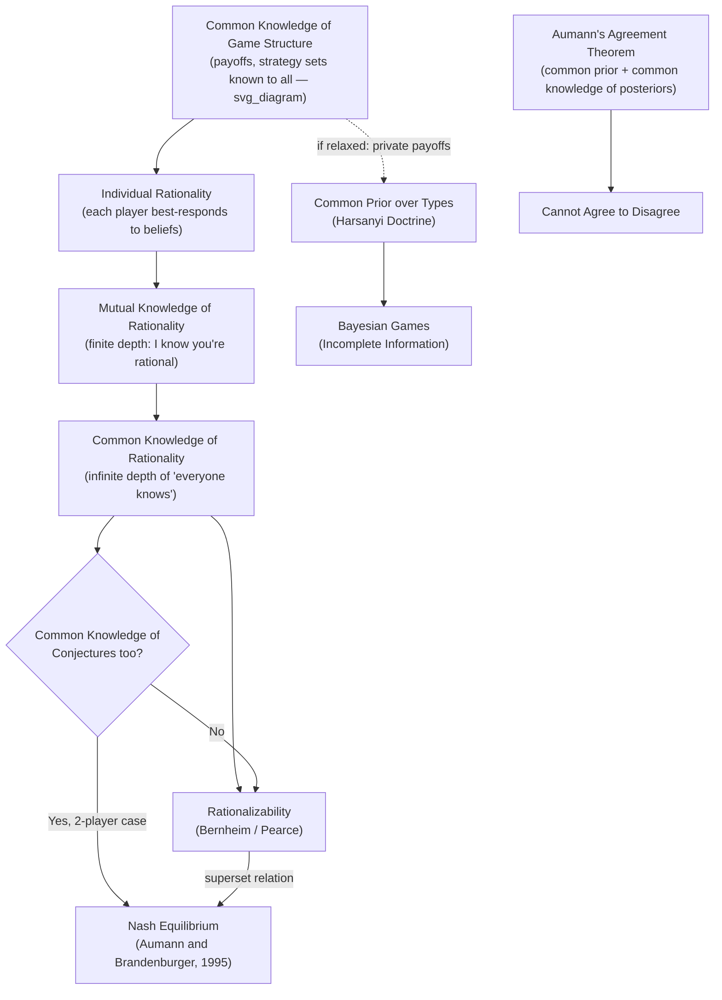

## Common Knowledge and Rationality Assumptions

### Overview

Game-theoretic solution concepts do not merely assume that each player is individually rational; they typically assume that rationality, and the entire structure of the game itself, is transparent to all players in a very specific and demanding epistemic sense called **common knowledge**. This item formalizes the epistemic foundations underlying standard solution concepts: what it means for players to be rational, what it means for information to be "common knowledge" as opposed to merely "mutual knowledge," and how varying these epistemic assumptions changes which solution concepts are justified. These foundations, developed largely by Robert Aumann and colleagues in **epistemic game theory**, explain *why* concepts like iterated elimination of dominated strategies or Nash equilibrium are valid predictions only under specific, explicit epistemic conditions — not as free-standing behavioral laws.

---

### Rationality Assumptions

**Definition (Individual Rationality)**

A player is **rational** in the standard game-theoretic sense if they:

1. Have well-defined preferences over outcomes satisfying the von Neumann–Morgenstern axioms (completeness, transitivity, continuity, independence), and
2. Choose an action (or strategy) that maximizes their expected utility given their beliefs about the strategies or types of other players.

Formally, player $i$ is rational at strategy profile $s$ if there exists no alternative strategy $s_i' \in S_i$ such that:

$$u_i(s_i', s_{-i}) > u_i(s_i, s_{-i})$$

given player $i$'s beliefs about $s_{-i}$ (which may be a point belief under certainty, or a probability distribution under uncertainty about opponents' play).

**Levels of Rationality Assumptions**

- **First-order rationality**: player $i$ best-responds to their beliefs about others' strategies.
- **Rationality is mutual knowledge**: every player knows every other player is rational (a "first level" of shared epistemic structure).
- **Rationality is common knowledge**: every player is rational, every player knows every player is rational, every player knows that every player knows every player is rational, and so on, infinitely.

The strength of the solution concept being justified determines which of these levels is required. As shown below, this distinction is not academic — it directly determines whether Nash equilibrium, or only a weaker solution concept, is the epistemically justified prediction.

---

### Common Knowledge: Formal Definition

**Mutual Knowledge vs. Common Knowledge**

- A fact $\phi$ is **mutual knowledge** among a group if every member of the group knows $\phi$.
- A fact $\phi$ is **common knowledge** (Lewis, 1969; formalized game-theoretically by Aumann, 1976) if:
  - Everyone knows $\phi$,
  - Everyone knows that everyone knows $\phi$,
  - Everyone knows that everyone knows that everyone knows $\phi$,
  - ...and so on, for all finite levels of iteration, without end.

**Aumann's Formal Model (1976)**

Robert Aumann formalized common knowledge using an **information partition** structure. Let $\Omega$ be a set of possible states of the world, and let $P_i$ be player $i$'s information partition of $\Omega$ (a partition representing what player $i$ can distinguish at each state). Define the **meet** $P^* = P_1 \wedge P_2 \wedge \cdots \wedge P_n$ as the finest common coarsening of all players' partitions (the partition generated by the union of all individual partition cells, iteratively merged wherever they overlap).

An event $E \subseteq \Omega$ is **common knowledge at state $\omega$** if the cell of the meet partition $P^*(\omega)$ containing $\omega$ is entirely contained in $E$:

$$P^*(\omega) \subseteq E$$

This elegant formalization captures the infinite regress ("I know, you know I know, I know you know I know, ...") using a single, finite, checkable condition on the meet partition — a major technical contribution because it makes common knowledge a tractable, verifiable mathematical object rather than an unwieldy infinite conjunction.

**Aumann's Agreement Theorem (1976)**

A striking implication: if two Bayesian rational agents share a common prior probability distribution, and their posterior beliefs about some event (after receiving private information) are **common knowledge**, then those posteriors must be **equal** — colloquially, "rational agents with common priors cannot agree to disagree" once their differing opinions become common knowledge. [Unverified: the practical empirical relevance of this theorem is debated, since it relies on the strong and often unrealistic assumption of a shared common prior.]

---

### Why Common Knowledge Matters for Solution Concepts

**Iterated Elimination of Strictly Dominated Strategies (IESDS)**

The epistemic justification for IESDS requires:

- Rationality is **common knowledge** among players.
- Each round of elimination corresponds to one additional level of the "everyone knows that everyone knows..." hierarchy: eliminating strategies that are never a best response for *any* belief about the *undominated* strategies of others requires knowing that the others are rational, knowing that they know each other are rational, and so on for as many rounds as elimination proceeds.

This is a precise illustration of why common knowledge (not merely first-order rationality) is required: a strategy might only be eliminable in round $k$ because it is dominated *given* that opponents will not play strategies eliminated in rounds $1$ through $k-1$ — which itself presumes opponents are rational, and that this fact is known at the appropriate depth.

**Nash Equilibrium**

A foundational epistemic result (Aumann and Brandenburger, 1995) shows that for a **two-player** game, common knowledge of rationality plus common knowledge of the players' conjectures (beliefs about each other's strategy) about each other is sufficient to imply a Nash equilibrium. Importantly, common knowledge of rationality *alone*, without common priors/conjectures about actual play, is generally **not** sufficient to guarantee Nash equilibrium play, especially in games with more than two players — it guarantees only that surviving strategies are **rationalizable** (see below), a weaker requirement.

**Rationalizability**

**Rationalizable strategies** (Bernheim, 1984; Pearce, 1984) are exactly the strategies that survive iterated elimination of strategies that are never a best response to *any* possible (correlated) belief about opponents' rationalizable strategies. Rationalizability is the solution concept whose epistemic foundation requires *only*:

- Common knowledge of rationality, and
- Common knowledge of the game structure (payoffs and strategy sets),

**without** requiring common knowledge (or even correctness) of players' actual conjectures about one another. This makes rationalizability the epistemically "minimal" solution concept: every Nash equilibrium strategy is rationalizable, but not every rationalizable strategy is part of a Nash equilibrium — rationalizability is generally a superset.

$$\text{Nash Equilibrium Strategies} \;\subseteq\; \text{Rationalizable Strategies}$$

**Common Knowledge of the Game Structure**

Distinct from common knowledge of rationality, most static solution concepts also assume the game's structure itself is common knowledge: every player knows the full player set, strategy sets, and payoff functions of *every* player (not just their own), and this fact is itself common knowledge. Relaxing common knowledge of *payoffs* specifically (allowing private information about payoffs) is precisely what motivates **Bayesian games** (Harsanyi, 1967–68), where a player's "type" encodes private information, and beliefs about others' types are represented by a common prior over the type space (per the **Harsanyi doctrine**).

---

### Example: Common Knowledge and the Electronic Mail Game

Ariel Rubinstein's **Electronic Mail Game** (1989) is a canonical illustration of how the *absence* of common knowledge — even when mutual knowledge is high — can drastically change equilibrium predictions.

**Setup**: Two players must coordinate on one of two actions, "Attack" or "Not Attack." A payoff-relevant state (whether an opportunity exists) is initially known only to Player 1. Player 1 sends an automated confirmation message to Player 2 upon observing the opportunity; Player 2 automatically sends an acknowledgment back; and so on, but each message has a small, positive probability $\epsilon > 0$ of being lost, and the message-passing protocol stops silently when a message is lost (each player only knows the count of messages sent, not whether the *last* one arrived).

**Result**: Even as $\epsilon \to 0$ (messages become extremely reliable), and even after an arbitrarily large but finite number of confirmations have been exchanged (so that the event is known with very high *mutual* knowledge), the event that "an opportunity exists" never becomes **common knowledge** — because there is always a positive probability that the *very last* message sent was lost, and this cannot be eliminated by exchanging more messages. In the unique equilibrium of this game, both players choose "Not Attack" regardless of how many confirmations were exchanged, illustrating that a large finite number of mutual-knowledge iterations is fundamentally different from actual common knowledge, and that this difference can flip the equilibrium prediction entirely. [Inference: the discontinuity here — from "attack coordinates successfully under true common knowledge" to "no attack under near-common but not-quite-common knowledge" — is the central qualitative lesson of the model, though the exact quantitative equilibrium characterization depends on the specific payoff parameters chosen.]

---

### Diagram: Hierarchy of Epistemic Assumptions and Solution Concepts

---

### Diagram: Aumann's Information Partition Model of Common Knowledge

<svg xmlns="http://www.w3.org/2000/svg" viewBox="0 0 680 420" font-family="sans-serif">
<text x="340" y="26" text-anchor="middle" font-size="16" font-weight="bold" fill="#1a1a1a">Information Partitions and the Meet (svg_diagram)</text>

<rect x="60" y="55" width="560" height="120" fill="none" stroke="#333" stroke-width="1.5" rx="4" />
<text x="80" y="70" font-size="11" fill="#555">State space Ω</text>

<rect x="70" y="80" width="120" height="80" fill="#dbeafe" stroke="#2563eb" stroke-width="1.5" opacity="0.55" />
<rect x="200" y="80" width="120" height="80" fill="#bfdbfe" stroke="#2563eb" stroke-width="1.5" opacity="0.55" />
<rect x="330" y="80" width="140" height="80" fill="#dbeafe" stroke="#2563eb" stroke-width="1.5" opacity="0.55" />
<rect x="480" y="80" width="130" height="80" fill="#bfdbfe" stroke="#2563eb" stroke-width="1.5" opacity="0.55" />
<text x="340" y="95" text-anchor="middle" font-size="11" fill="#1e3a8a" font-weight="bold">Player 1's partition P1 (blue cells)</text>

<rect x="70" y="120" width="180" height="35" fill="#fef3c7" stroke="#d97706" stroke-width="1.5" opacity="0.5" />
<rect x="250" y="120" width="200" height="35" fill="#fde68a" stroke="#d97706" stroke-width="1.5" opacity="0.5" />
<rect x="450" y="120" width="160" height="35" fill="#fef3c7" stroke="#d97706" stroke-width="1.5" opacity="0.5" />
<text x="340" y="150" text-anchor="middle" font-size="11" fill="#78350f" font-weight="bold">Player 2's partition P2 (amber cells, offset)</text>

<circle cx="260" cy="105" r="4" fill="#dc2626" />
<text x="270" y="108" font-size="11" fill="#dc2626" font-weight="bold">ω (true state)</text>

<text x="340" y="205" text-anchor="middle" font-size="12" font-weight="bold" fill="`#1a1a1a`">Meet Partition P* = P1 ∧ P2 (finest common coarsening)</text>

<rect x="70" y="220" width="180" height="45" fill="`#dcfce7`" stroke="`#16a34a`" stroke-width="2" />

<rect x="250" y="220" width="200" height="45" fill="`#a7f3d0`" stroke="`#16a34a`" stroke-width="2" />

<rect x="450" y="220" width="160" height="45" fill="`#dcfce7`" stroke="`#16a34a`" stroke-width="2" />

<text x="350" y="247" text-anchor="middle" font-size="11" fill="`#14532d`" font-weight="bold">P*(ω) — this cell must lie fully inside E</text>

<text x="340" y="300" text-anchor="middle" font-size="12" fill="#333">Event E is common knowledge at ω iff P*(ω) ⊆ E</text>

<rect x="150" y="320" width="400" height="60" fill="none" stroke="`#7c3aed`" stroke-width="2" stroke-dasharray="6,4" rx="6" />

<text x="350" y="355" text-anchor="middle" font-size="12" fill="`#4c1d95`" font-weight="bold">Event E (e.g., "opportunity exists")</text>

</svg>

---

### Common Pitfalls and Clarifications

- **Conflating mutual knowledge with common knowledge**: knowing that everyone knows a fact (even at many finite levels) is categorically different from true common knowledge (infinite levels); the Electronic Mail Game is the standard demonstration that this distinction has real behavioral consequences, not merely philosophical ones.
- **Assuming rationality alone yields Nash equilibrium**: common knowledge of rationality (without further assumptions about common conjectures) generally yields only **rationalizability**, a weaker and typically larger solution set than Nash equilibrium.
- **Treating "rational" as "moral" or "cooperative"**: rationality in this technical sense means consistent expected-utility maximization given beliefs — it says nothing about whether the resulting behavior is prosocial, fair, or cooperative (the Prisoner's Dilemma is the standard counterexample, where mutually rational play produces a jointly worse outcome).
- **Assuming common knowledge of the game structure is realistic**: many real strategic settings involve private information about others' payoffs or preferences, which is why Bayesian games (relaxing common knowledge of payoffs specifically, replacing it with a common prior over types) are the standard model for asymmetric-information settings, not an exotic special case.
- **Over-applying Aumann's Agreement Theorem**: the theorem's conclusion depends critically on a shared common prior; if players' priors genuinely differ (not just their private information), rational agents *can* persistently disagree even under common knowledge of posteriors — behavior may vary substantially depending on which underlying assumption (common prior vs. private information only) is adopted in a given model.

---

**Related Topics**

- Iterated Elimination of Dominated Strategies
- Rationalizability (Bernheim and Pearce)
- Nash Equilibrium: Definition, Existence, and Computation
- Bayesian Games and the Harsanyi Doctrine
- Aumann's Agreement Theorem and No-Trade Theorems
- Epistemic Game Theory and Interactive Belief Systems
- Correlated Equilibrium
- Rubinstein's Electronic Mail Game
- Expected Utility Theory and Rational Choice
- Signaling Games and Information Asymmetry