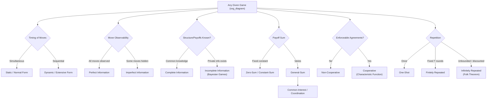

## Classifying Games by Structure

### Overview

Games can be classified along several independent structural dimensions: the timing of moves, the information available to players, whether payoffs sum to a constant, whether binding agreements are possible, whether the game is played once or repeated, and whether the player set and rules are themselves fixed or symmetric. These classifications are not mutually exclusive — a real-world game is typically located simultaneously along all these axes — but each dimension determines which representation and which solution concepts are appropriate. This item surveys the standard taxonomy used to categorize games before applying any specific equilibrium analysis.

---

### Classification by Timing of Moves

**Static (Simultaneous-Move) Games**

Players choose actions without observing each other's choices — either literally at the same time, or effectively simultaneously because no player observes others' choices before acting. Represented in **normal form** (strategic form): a tuple of player sets, strategy sets, and payoff functions, typically displayed as a payoff matrix for small cases.

**Dynamic (Sequential-Move) Games**

Players move in a defined temporal order, with at least some players able to observe (some of) the earlier moves before choosing their own action. Represented in **extensive form**: a game tree with decision nodes, branches (actions), information sets, and terminal nodes bearing payoff vectors.

**Key Points**

- The same underlying strategic situation can often be represented in *either* form (any extensive-form game induces a corresponding normal-form game via full strategy enumeration), but the extensive form preserves timing and information structure that the normal form discards — which matters for solution concepts like subgame perfection that rely explicitly on the sequential structure.
- Solution concepts differ by form: **Nash equilibrium** is defined on the normal form (or the induced normal form of an extensive game); **backward induction** and **subgame perfect equilibrium** are defined directly on the extensive form and exploit sequential structure to rule out non-credible threats.

---

### Classification by Information Structure

**Perfect Information**

A game has **perfect information** if every player, at every point where they must move, knows the complete history of all previous moves made by every player (including any moves by "Nature"), and every information set is a singleton (contains exactly one node). Chess, checkers, and Tic-Tac-Toe are canonical examples.

**Imperfect Information**

A game has **imperfect information** if at least one information set contains more than one node — i.e., at least one player, at some point, cannot distinguish between two or more histories that could have led to their current decision point. Simultaneous-move games are always games of imperfect information when represented in extensive form (neither player observes the other's simultaneous choice), as are card games with private hands (e.g., Poker) and games with simultaneous or hidden moves at any stage.

**Complete Information**

A game has **complete information** if the entire structure of the game — the player set, the strategy sets available to every player, and the payoff functions of every player — is **common knowledge**. Every player knows not only their own payoffs but everyone's payoffs, and knows that everyone knows this, recursively.

**Incomplete Information**

A game has **incomplete information** if at least one player has private information relevant to payoffs (their own or others') that is not common knowledge — for example, a firm's true production costs, or a bidder's private valuation of an auctioned item. Harsanyi's (1967–68) framework models incomplete information by introducing player **types** $\theta_i \in \Theta_i$ drawn according to a common prior distribution, transforming the game into a **Bayesian game**.

**Critical distinction**: "Perfect/imperfect information" concerns whether *moves* are observed as the game unfolds; "complete/incomplete information" concerns whether the game's *structure and payoffs* are known at the outset. These two dimensions are independent — a game can have complete but imperfect information (e.g., simultaneous Prisoner's Dilemma, where payoffs are known to all but moves are hidden), or incomplete but perfect information (e.g., sequential bargaining where the order of offers is fully observed but one party's valuation is private).

|  | Perfect Information | Imperfect Information |
| --- | --- | --- |
| **Complete Information** | Chess, Tic-Tac-Toe | Simultaneous Prisoner's Dilemma, Matching Pennies |
| **Incomplete Information** | Sequential bargaining with private valuation | Poker, sealed-bid auctions |

---

### Classification by Payoff Structure

**Zero-Sum (Strictly Competitive) Games**

A game is **zero-sum** if, for every strategy profile $s$, the sum of all players' payoffs is a fixed constant:

$$\sum_{i=1}^{n} u_i(s) = c \quad \text{for all } s \in S$$

(Conventionally normalized so $c=0$.) In a two-player zero-sum game, one player's gain is exactly the other's loss; the players' interests are diametrically opposed, with no scope for mutually beneficial cooperation. Von Neumann's Minimax Theorem applies specifically to this class, guaranteeing a well-defined value of the game.

**Constant-Sum Games**

A generalization where payoffs sum to any fixed constant $c$ (not necessarily zero); strategically equivalent to a zero-sum game via an affine rescaling of payoffs, since only the constant, not its value, matters for strategic analysis.

**General-Sum (Non-Zero-Sum) Games**

Games in which the sum of payoffs varies across strategy profiles, meaning players' interests are neither perfectly aligned nor perfectly opposed. Most economically and socially realistic strategic situations (oligopoly, public goods provision, bargaining, the Prisoner's Dilemma) fall into this category, since they involve *both* competitive and cooperative elements, allowing for outcomes where all players can simultaneously do better or worse (as opposed to zero-sum settings, where the total "pie" is fixed).

**Common-Interest (Coordination) Games**

A special case of general-sum games where players' interests are fully aligned: there exists a strategy profile that is a best response for *every* player simultaneously and that all players unanimously prefer. Pure coordination games (e.g., choosing which side of the road to drive on) are the polar opposite of zero-sum games along this dimension.

---

### Classification by Cooperation and Enforceability

**Non-Cooperative Games**

Players cannot make **binding, externally enforceable agreements**; any cooperation that arises must be self-enforcing, sustained by the players' own incentives (e.g., via repeated interaction and credible threats/punishments). The vast majority of standard game theory — including all Nash equilibrium analysis — falls under this heading, despite the fact that the *outcomes* of non-cooperative games can sometimes still be "cooperative" in a colloquial sense (e.g., mutual cooperation sustained by trigger strategies in a repeated Prisoner's Dilemma).

**Cooperative Games**

Players *can* make binding, externally enforceable commitments — typically modeled abstractly via a **characteristic function** $v: 2^N \to \mathbb{R}$, specifying the total payoff (or "worth") achievable by each possible coalition $S \subseteq N$ acting together, independent of the specific actions used to achieve it. Cooperative game theory studies how the coalition's total worth $v(N)$ should be **divided** among members, via solution concepts such as the **core** (payoff divisions no coalition can profitably deviate from), the **Shapley value** (a unique division based on average marginal contributions), and the **nucleolus**.

---

### Classification by Repetition and Duration

**One-Shot (Single-Stage) Games**

The game is played exactly once, with no future interaction between the same players; there is no scope for reputation-building or repeated-game punishment strategies.

**Repeated Games**

The same stage game is played multiple times by the same players, who can condition their play in later rounds on the observed history of earlier rounds. Divided further into:

- **Finitely repeated games**: a fixed, known, finite number of repetitions $T$. Notably, in many finitely repeated games with a unique stage-game Nash equilibrium (e.g., the Prisoner's Dilemma), backward induction implies that the **unique subgame perfect equilibrium** is to defect (play the stage-game Nash equilibrium) in *every* round, including the first — a striking and somewhat counterintuitive result driven entirely by the certainty of the final round unraveling all cooperation backward through the tree.
- **Infinitely repeated games** (or games with an uncertain end, modeled via a constant continuation probability $\delta$): a much richer set of equilibrium payoffs becomes sustainable, formally characterized by the **Folk Theorem**, which shows that (under mild conditions and sufficiently patient players, i.e., discount factor $\delta$ close enough to 1) almost any individually rational and feasible payoff vector can be supported as a subgame perfect equilibrium outcome, typically via strategies like **Grim Trigger** or **Tit-for-Tat**.

**Stochastic (Markov) Games**

A generalization of repeated games in which the stage game itself can change over time according to a state that evolves stochastically, partly as a function of players' actions — bridging game theory with Markov decision processes and reinforcement learning.

---

### Classification by Player-Set Structure

**Symmetric Games**

A game is **symmetric** if all players have identical strategy sets and the payoff structure is invariant under relabeling of players — i.e., payoffs depend only on the strategy played and the *multiset* of others' strategies, not on players' specific identities. Most textbook examples (Prisoner's Dilemma, Matching Pennies, Stag Hunt, Battle of the Sexes when payoffs are made symmetric) are symmetric two-player games.

**Asymmetric Games**

Players have different strategy sets, different payoff functions, or the payoff structure genuinely depends on player identity (e.g., a Stackelberg leader-follower game, where the two players have structurally different roles).

**$n$-Player Games**

While two-player games dominate introductory pedagogy for tractability, most real applications (auctions with many bidders, public goods games, oligopoly with several firms, voting) involve $n > 2$ players, which can qualitatively change equilibrium behavior (e.g., enabling coalition formation, free-riding dynamics, and more complex correlated/mixed equilibria not present in the two-player case).

---

### Diagram: Overview of Classification Dimensions

---

### Diagram: Two-Dimensional Map — Information vs. Payoff Structure

<svg xmlns="http://www.w3.org/2000/svg" viewBox="0 0 660 420" font-family="sans-serif">
<text x="330" y="26" text-anchor="middle" font-size="16" font-weight="bold" fill="#1a1a1a">Game Classification Grid: Timing x Payoff Structure (svg_diagram)</text>

<line x1="180" y1="60" x2="180" y2="380" stroke="#333" stroke-width="1.5" />
<line x1="420" y1="60" x2="420" y2="380" stroke="#333" stroke-width="1.5" />
<line x1="60" y1="140" x2="620" y2="140" stroke="#333" stroke-width="1.5" />
<line x1="60" y1="260" x2="620" y2="260" stroke="#333" stroke-width="1.5" />

<text x="120" y="95" text-anchor="middle" font-size="12" font-weight="bold" fill="`#1e3a8a`">Static</text>

<text x="300" y="95" text-anchor="middle" font-size="12" font-weight="bold" fill="`#1e3a8a`">Dynamic, Perfect Info</text>

<text x="520" y="95" text-anchor="middle" font-size="12" font-weight="bold" fill="`#1e3a8a`">Dynamic, Imperfect Info</text>

<text x="60" y="120" font-size="12" font-weight="bold" fill="`#78350f`">Zero-Sum</text>

<rect x="60" y="140" width="120" height="120" fill="`#fee2e2`" stroke="`#dc2626`" opacity="0.4" />

<text x="120" y="205" text-anchor="middle" font-size="11" fill="`#7f1d1d`">Matching Pennies</text>

<rect x="180" y="140" width="240" height="120" fill="#fee2e2" stroke="#dc2626" opacity="0.25" />
<text x="300" y="205" text-anchor="middle" font-size="11" fill="#7f1d1d">Chess</text>
<rect x="420" y="140" width="200" height="120" fill="#fee2e2" stroke="#dc2626" opacity="0.15" />
<text x="520" y="205" text-anchor="middle" font-size="11" fill="#7f1d1d">Poker (zero-sum variant)</text>

<text x="60" y="245" font-size="12" font-weight="bold" fill="`#78350f`">General-Sum</text>

<rect x="60" y="260" width="120" height="120" fill="`#dcfce7`" stroke="`#16a34a`" opacity="0.4" />

<text x="120" y="325" text-anchor="middle" font-size="11" fill="`#14532d`">Prisoner's Dilemma</text>

<rect x="180" y="260" width="240" height="120" fill="#dcfce7" stroke="#16a34a" opacity="0.25" />
<text x="300" y="325" text-anchor="middle" font-size="11" fill="#14532d">Sequential Bargaining</text>
<rect x="420" y="260" width="200" height="120" fill="#dcfce7" stroke="#16a34a" opacity="0.15" />
<text x="520" y="325" text-anchor="middle" font-size="11" fill="#14532d">Sealed-Bid Auction</text>
</svg>

---

### Common Pitfalls and Clarifications

- **Conflating "perfect information" with "complete information"**: these are independent dimensions (see the table above); a game can be complete-but-imperfect (Prisoner's Dilemma) or incomplete-but-perfect (sequential game with a privately known type but publicly observed moves).
- **Assuming zero-sum implies "no equilibrium exists in pure strategies"**: zero-sum games frequently lack pure-strategy equilibria (e.g., Matching Pennies), but the Minimax Theorem guarantees a mixed-strategy value regardless — the classification determines *which* theorem applies, not whether an equilibrium exists at all (Nash's theorem guarantees mixed-strategy equilibrium existence far more generally, for any finite game).
- **Assuming "cooperative" games are simply games where players choose to cooperate**: in the technical taxonomy, "cooperative" specifically refers to the availability of **binding, third-party-enforceable agreements** (e.g., via contracts); mutual cooperation arising endogenously from repeated-game incentives in a non-cooperative game (e.g., sustained cooperation via Grim Trigger in an infinitely repeated Prisoner's Dilemma) is still classified as a non-cooperative-game outcome.
- **Ignoring the finitely-repeated-game unraveling result**: students often incorrectly assume that repetition alone sustains cooperation; the backward-induction unraveling argument shows that a *known, finite* horizon with a unique stage-game equilibrium eliminates the cooperative equilibrium entirely — only genuine uncertainty about the end date, or an infinite/indefinite horizon, restores the Folk Theorem's richer equilibrium set. [Behavior may vary: this unraveling result depends on the stage game having a *unique* Nash equilibrium; with multiple stage-game equilibria, finitely repeated games can support cooperation via equilibrium-switching punishments, per Benoit and Krishna (1985).]

---

**Related Topics**

- Normal-Form vs. Extensive-Form Representations
- The Minimax Theorem and Zero-Sum Games
- Bayesian Games and Harsanyi's Type Space
- Subgame Perfect Equilibrium and Backward Induction
- The Folk Theorem in Repeated Games
- Cooperative Game Theory: The Core and Shapley Value
- Coordination Games and Focal Points
- Stochastic (Markov) Games
- Auction Theory and Mechanism Design
- Signaling and Screening Games