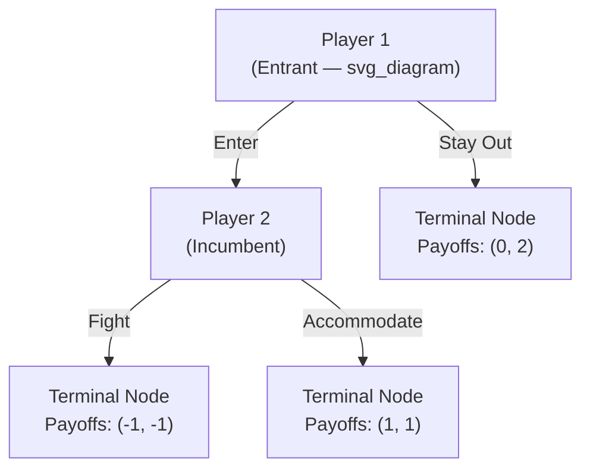

## Normal Form and Extensive Form Representations

### Overview

Every game must be encoded in a formal representation before any solution concept can be applied to it. The two canonical representations — **normal form** (also called **strategic form**) and **extensive form** — capture the same underlying strategic situation from different vantage points: the normal form abstracts away timing and displays only the mapping from complete strategy profiles to payoffs, while the extensive form preserves the sequential structure, information availability, and branching of decisions as a game tree. Understanding the formal translation between these two representations, and knowing which solution concepts are native to which form, is a prerequisite for all subsequent equilibrium analysis.

---

### Normal Form (Strategic Form) Representation

**Definition**

The normal-form representation of a game is the tuple:

$$G = \langle N, (S_i)_{i \in N}, (u_i)_{i \in N} \rangle$$

where $N$ is the player set, $S_i$ is player $i$'s full strategy set, and $u_i : S_1 \times \cdots \times S_n \to \mathbb{R}$ assigns a payoff to every strategy profile. Critically, each $s_i \in S_i$ is a **complete contingency plan** (see below), not merely a single action — so even a multi-stage dynamic game can be fully encoded in normal form once each player's full strategy set is enumerated.

**Key Points**

- For two-player games with finite strategy sets, the normal form is conventionally displayed as a **bimatrix**: rows indexed by Player 1's strategies, columns by Player 2's, and each cell containing the ordered pair $(u_1, u_2)$.
- The normal form is the native representation for **Nash equilibrium**, **dominant/dominated strategy analysis**, and **rationalizability** — these solution concepts are defined purely in terms of strategy profiles and payoffs, without reference to timing.
- The normal form **discards information** about the order of moves and what each player observed at the time of choosing — two extensive-form games with very different tree structures and information sets can induce *identical* normal forms, which is precisely why some Nash equilibria of the normal form can rely on non-credible threats that are only exposed by returning to the extensive form (see Subgame Perfect Equilibrium).

**Example: Bimatrix for the Prisoner's Dilemma**

|  | Player 2: Cooperate | Player 2: Defect |
| --- | --- | --- |
| **Player 1: Cooperate** | $(-1, -1)$ | $(-3, 0)$ |
| **Player 1: Defect** | $(0, -3)$ | $(-2, -2)$ |

This single table fully specifies $N = \{1,2\}$, $S_1 = S_2 = \{C, D\}$, and both payoff functions — sufficient to compute dominance and Nash equilibria without any reference to timing, since both moves are simultaneous.

---

### Extensive Form Representation

**Definition**

The extensive form represents a game as a **finite rooted tree** $\Gamma = (X, \to, N, \iota, H, A, u)$, where informally:

- $X$: the set of **nodes**, partitioned into decision nodes and terminal nodes.
- $\to$: the tree's branching (successor) relation; a **root node** has no predecessor.
- $\iota: X_{\text{decision}} \to N \cup \{c\}$: assigns each decision node to the player who moves there (or to "Nature," denoted $c$, for chance nodes).
- $H$: a partition of each player's decision nodes into **information sets** — nodes a player cannot distinguish between when choosing an action.
- $A$: the set of actions available at each node (or information set).
- $u: X_{\text{terminal}} \to \mathbb{R}^n$: assigns a payoff vector to each terminal node (leaf).

**Information Sets**

An **information set** $h \in H_i$ for player $i$ is a set of decision nodes among which player $i$, upon reaching any node in $h$, cannot distinguish which one they are actually at. Formally, all nodes within a single information set must offer player $i$ the *same set of available actions* (otherwise player $i$ could infer their location from the menu of choices alone — a standard well-formedness requirement).

- If every information set is a **singleton** (a single node), the game has **perfect information**.
- If at least one information set contains multiple nodes, the game has **imperfect information** — this is how simultaneous moves are represented in a tree: Player 2's node(s), reached after Player 1's move, are grouped into one information set so Player 2 cannot tell which action Player 1 took.

**Perfect Recall**

A game exhibits **perfect recall** if no player ever forgets information they previously possessed — formally, along any path through the tree, if two decision nodes belong to the same information set for player $i$, then all of player $i$'s own past actions along the paths to those two nodes must have been identical. Perfect recall is the condition under which **Kuhn's Theorem** guarantees mixed and behavioral strategies are outcome-equivalent.

**Example: Extensive Form of a Simple Entry-Deterrence Game**

An entrant (Player 1) decides whether to Enter or Stay Out of a market; if it Enters, the incumbent (Player 2) decides whether to Fight or Accommodate.

This tree has perfect information (every information set is a singleton: Player 2 observes Player 1's move before acting). Its induced normal form requires enumerating Player 2's full strategy set as a function of Player 1's move: $S_2 = \{FF, FA, AF, AA\}$ is not quite right here since Player 2 only moves after "Enter" — in this particular tree, $S_2 = \{\text{Fight}, \text{Accommodate}\}$ since Player 2 has only one information set (reached only if Player 1 enters); the "Stay Out" branch never reaches Player 2 at all.

---

### Translating Between Representations

**Extensive Form → Normal Form**

Any extensive-form game can be converted to its normal form by:

1. For each player $i$, enumerating every possible pure strategy — a complete function from each of $i$'s information sets to an available action at that information set.
2. Computing, for every combination of strategies across all players, the resulting terminal node reached by following the tree, and reading off the payoff vector there.

This conversion is always possible and unique, but as previously noted, is potentially **lossy**: two structurally different trees (e.g., differing in which non-credible threats are available) can produce identical induced normal forms.

**Normal Form → Extensive Form**

Converting the other direction is **not unique** — a single normal-form game can be represented by multiple different extensive forms (e.g., differing in which player moves "first" in the tree even though moves are actually simultaneous, using an information set to hide the first mover's action from the second). This non-uniqueness is precisely why solution concepts sensitive to timing (subgame perfection) cannot be recovered from the normal form alone; the modeler must specify a particular extensive form to capture the intended sequential structure.

---

### Subgames and Their Role

**Definition**

A **subgame** of an extensive-form game is a subset of the tree that:

1. Begins at a single decision node (which therefore must be a singleton information set on its own),
2. Includes **all** nodes that follow it in the tree (no node is left out), and
3. Does not "cut through" any information set — no information set can have some of its nodes inside the subgame and others outside.

Subgames are the objects over which **Subgame Perfect Equilibrium** is defined: a strategy profile is subgame perfect if it induces a Nash equilibrium in *every* subgame of the original game, not merely in the game as a whole. This requirement rules out equilibria that rely on threats which would not actually be carried out if the corresponding subgame were reached — the central technical motivation for insisting on the extensive-form representation rather than analyzing the induced normal form alone.

**Key distinction**: In a game of **imperfect information**, entire branches following a non-singleton information set generally do **not** constitute valid subgames (since a subgame cannot cut through an information set), which is why concepts like **sequential equilibrium** and **perfect Bayesian equilibrium** were developed to extend backward-induction-style reasoning to games where genuine subgames are scarce or nonexistent beyond the whole game itself.

---

### Diagram: Normal Form vs. Extensive Form — Same Game, Two Views

<svg xmlns="http://www.w3.org/2000/svg" viewBox="0 0 700 460" font-family="sans-serif">
<text x="350" y="26" text-anchor="middle" font-size="16" font-weight="bold" fill="#1a1a1a">Same Strategic Situation: Two Representations (svg_diagram)</text>

<text x="175" y="55" text-anchor="middle" font-size="13" font-weight="bold" fill="`#1e3a8a`">Extensive Form (Game Tree)</text>

<circle cx="175" cy="90" r="5" fill="`#2563eb`" />

<text x="150" y="80" font-size="11" fill="`#1e3a8a`">P1</text>

<line x1="175" y1="90" x2="90" y2="160" stroke="#333" stroke-width="1.5" />
<line x1="175" y1="90" x2="260" y2="160" stroke="#333" stroke-width="1.5" />
<text x="115" y="120" font-size="10" fill="#333">Enter</text>
<text x="240" y="120" font-size="10" fill="#333">Stay Out</text>
<circle cx="90" cy="165" r="5" fill="#16a34a" />
<text x="65" y="155" font-size="11" fill="#14532d">P2</text>
<rect x="245" y="160" width="30" height="12" fill="none" stroke="#333" />
<text x="260" y="195" text-anchor="middle" font-size="10" fill="#333">(0,2)</text>
<line x1="90" y1="165" x2="40" y2="230" stroke="#333" stroke-width="1.5" />
<line x1="90" y1="165" x2="140" y2="230" stroke="#333" stroke-width="1.5" />
<text x="35" y="200" font-size="10" fill="#333">Fight</text>
<text x="130" y="200" font-size="10" fill="#333">Accom.</text>
<text x="40" y="250" text-anchor="middle" font-size="10" fill="#333">(-1,-1)</text>
<text x="140" y="250" text-anchor="middle" font-size="10" fill="#333">(1,1)</text>

<line x1="350" y1="50" x2="350" y2="420" stroke="#999" stroke-width="1" stroke-dasharray="4,4" />
<text x="350" y="440" text-anchor="middle" font-size="12" fill="#555">translate via strategy enumeration</text>

<text x="530" y="55" text-anchor="middle" font-size="13" font-weight="bold" fill="`#78350f`">Induced Normal Form (Bimatrix)</text>

<rect x="420" y="90" width="110" height="40" fill="#f3f4f6" stroke="#333" />
<text x="475" y="114" text-anchor="middle" font-size="11">P2: Fight</text>
<rect x="530" y="90" width="130" height="40" fill="#f3f4f6" stroke="#333" />
<text x="595" y="114" text-anchor="middle" font-size="11">P2: Accommodate</text>
<rect x="330" y="130" width="90" height="40" fill="#f3f4f6" stroke="#333" />
<text x="375" y="154" text-anchor="middle" font-size="11">P1: Enter</text>
<rect x="420" y="130" width="110" height="40" fill="#fee2e2" stroke="#333" />
<text x="475" y="154" text-anchor="middle" font-size="11">(-1, -1)</text>
<rect x="530" y="130" width="130" height="40" fill="#dcfce7" stroke="#333" />
<text x="595" y="154" text-anchor="middle" font-size="11">(1, 1)</text>
<rect x="330" y="170" width="90" height="40" fill="#f3f4f6" stroke="#333" />
<text x="375" y="194" text-anchor="middle" font-size="11">P1: Stay Out</text>
<rect x="420" y="170" width="110" height="40" fill="#fef3c7" stroke="#333" />
<text x="475" y="194" text-anchor="middle" font-size="11">(0, 2)</text>
<rect x="530" y="170" width="130" height="40" fill="#fef3c7" stroke="#333" />
<text x="595" y="194" text-anchor="middle" font-size="11">(0, 2)</text>

<text x="500" y="240" text-anchor="middle" font-size="11" fill="`#7f1d1d`">Note: "Stay Out" rows are identical</text>

<text x="500" y="255" text-anchor="middle" font-size="11" fill="`#7f1d1d`">regardless of P2's strategy — P2 never actually moves</text>

<text x="500" y="270" text-anchor="middle" font-size="11" fill="`#7f1d1d`">on that branch, but the normal form still requires</text>

<text x="500" y="285" text-anchor="middle" font-size="11" fill="`#7f1d1d`">specifying P2's full contingency plan.</text>

</svg>

---

### Common Pitfalls and Clarifications

- **Assuming the normal form fully captures a dynamic game**: it captures the *outcomes* correctly but discards the sequential/informational structure, which is precisely why some Nash equilibria of the induced normal form (e.g., "Fight" as part of an equilibrium supported by an empty threat) are not subgame perfect — this can only be detected by returning to the extensive form and checking behavior in every subgame.
- **Confusing "information set" with "node"**: a decision node is a specific point in the tree; an information set is a *set* of nodes the player cannot distinguish. In games of perfect information every information set happens to be a singleton, so the distinction collapses, but this is a special case, not the general rule.
- **Miscounting subgames in imperfect-information games**: a common error is treating any node as the root of a valid subgame; recall a subgame cannot split an information set, so nodes inside a non-singleton information set (other than the very root of the whole tree) typically cannot start a subgame at all.
- **Treating normal-form to extensive-form conversion as unique**: it is not — the same bimatrix can arise from multiple different trees with different timing/information assumptions, meaning payoff-matrix information alone is generally insufficient to reconstruct the "true" sequential story without additional modeling assumptions.
- **Forgetting perfect recall as a background assumption**: most standard results connecting mixed and behavioral strategies (Kuhn's Theorem) implicitly assume perfect recall; games explicitly modeling forgetfulness or absentmindedness (e.g., the "Absent-Minded Driver" problem) require separate treatment. [Unverified: whether behavioral strategies alone suffice as a solution concept in absentmindedness settings remains an active and somewhat unsettled topic in the literature.]

---

**Related Topics**

- Nash Equilibrium: Definition, Existence, and Computation
- Subgame Perfect Equilibrium and Backward Induction
- Information Sets and Imperfect Information
- Kuhn's Theorem and Perfect Recall
- Defining Players, Strategies, and Payoffs
- Sequential vs. Simultaneous Games
- Bayesian Games and Type Spaces
- Sequential Equilibrium and Perfect Bayesian Equilibrium
- Classifying Games by Structure
- Game Trees and Zermelo's Theorem