## Normal Form Game Representation

### Overview

The normal-form (strategic-form) representation is the foundational encoding used for static, simultaneous-move analysis in game theory. It abstracts away timing entirely and reduces a game to three objects: the players, their available strategies, and the payoffs generated by every possible combination of choices. This item provides the formal construction of the normal form in depth — its notation, its bimatrix visualization for two-player games, its generalization to $n$ players, and the conventions used to read and manipulate it — as the working representation for the dominance and best-response analysis that follows in this chapter.

---

### Formal Definition

The normal-form representation of a game is the tuple:

$$G = \langle N, (S_i)_{i \in N}, (u_i)_{i \in N} \rangle$$

- $N = \{1, 2, \ldots, n\}$: the finite set of players.
- $S_i$: the strategy set (pure strategies) available to player $i$; a strategy profile lies in the Cartesian product $S = S_1 \times S_2 \times \cdots \times S_n$.
- $u_i : S \to \mathbb{R}$: player $i$'s payoff (von Neumann–Morgenstern utility) as a function of the **entire** strategy profile, not just player $i$'s own choice.

A specific strategy profile is written $s = (s_1, s_2, \ldots, s_n)$, and it is standard to isolate player $i$'s choice from the rest via the notation:

$$s = (s_i, s_{-i}), \qquad s_{-i} = (s_1, \ldots, s_{i-1}, s_{i+1}, \ldots, s_n)$$

so that $u_i(s_i, s_{-i})$ denotes player $i$'s payoff when they choose $s_i$ while the remaining players collectively choose $s_{-i}$.

**Key Points**

- The normal form treats a "strategy" as a complete, atomic choice object — even when the underlying situation is dynamic and $s_i$ is really a full contingency plan across multiple decision points (see Normal Form and Extensive Form Representations), the normal form flattens this into a single element of $S_i$.
- The representation says nothing about *when* choices are made or what anyone observed beforehand; it is purely an input-output mapping from strategy profiles to payoff vectors.
- Because payoffs are vNM utilities, the normal form supports both **ordinal** analysis (ranking outcomes, sufficient for pure-strategy dominance and pure Nash equilibria) and **cardinal** analysis (expected-value computations, required for mixed-strategy equilibria).

---

### Two-Player Bimatrix Representation

For two players with finite strategy sets $S_1 = \{s_1^1, \ldots, s_1^m\}$ and $S_2 = \{s_2^1, \ldots, s_2^k\}$, the normal form is displayed as an $m \times k$ **bimatrix**: rows indexed by Player 1's strategies, columns by Player 2's, with each cell containing the ordered payoff pair $(u_1(s_1^i, s_2^j),\, u_2(s_1^i, s_2^j))$.

**Convention**: By universal convention, Player 1 (the "row player") lists strategies down the rows, and Player 2 (the "column player") lists strategies across the columns; the first number in each cell is always the row player's payoff, the second the column player's.

**Example: Battle of the Sexes**

|  | Player 2: Opera | Player 2: Football |
| --- | --- | --- |
| **Player 1: Opera** | $(2, 1)$ | $(0, 0)$ |
| **Player 1: Football** | $(0, 0)$ | $(1, 2)$ |

Here $N = \{1,2\}$, $S_1 = S_2 = \{\text{Opera}, \text{Football}\}$, and the four cells fully specify both $u_1$ and $u_2$ across all of $S_1 \times S_2$. This bimatrix alone is sufficient to identify both pure-strategy Nash equilibria (Opera, Opera) and (Football, Football), and to compute the mixed-strategy equilibrium, without any reference to a game tree.

---

### $n$-Player Generalization

For $n > 2$ players, a single flat bimatrix is no longer adequate, since payoffs depend jointly on all $n$ choices. Two standard conventions extend the representation:

**Matrix of Matrices (Sliced Representation)**

Fix all but two players' strategies and display the resulting bimatrix as one "slice"; repeat this for every combination of the remaining players' strategies. For example, with three players, one typically displays a sequence of Player-1-vs-Player-2 bimatrices, one slice for each of Player 3's possible strategies.

**Example: A Three-Player Coordination Game**

Player 3 chooses between two "modes," each of which selects a different Player-1-vs-Player-2 bimatrix:

*If Player 3 plays Mode A:*

|  | P2: Left | P2: Right |
| --- | --- | --- |
| **P1: Up** | $(3, 3, 3)$ | $(0, 0, 1)$ |
| **P1: Down** | $(0, 0, 1)$ | $(1, 1, 1)$ |

*If Player 3 plays Mode B:*

|  | P2: Left | P2: Right |
| --- | --- | --- |
| **P1: Up** | $(1, 1, 1)$ | $(0, 0, 1)$ |
| **P1: Down** | $(0, 0, 1)$ | $(3, 3, 3)$ |

Each cell now carries a length-3 payoff vector $(u_1, u_2, u_3)$, and the full game requires both slices to be fully specified — Player 3's incentive to choose Mode A or B depends on what Player 1 and Player 2 are expected to do in each slice.

**Payoff Function (Tensor) Notation**

More generally and more compactly, for arbitrary $n$, the normal form is written abstractly as the tuple of functions $(u_i)_{i \in N}$ without attempting a full visual matrix, since the payoff structure is really an $n$-dimensional array (tensor) indexed by one strategy per player — visual bimatrix slicing becomes impractical beyond 3 or 4 players and formal analysis instead proceeds directly with the functional notation $u_i(s_i, s_{-i})$.

---

### Reading Payoffs Off the Normal Form

**Best Response Correspondence**

Given the normal form, player $i$'s **best response** to a specific profile of the others' strategies $s_{-i}$ is:

$$BR_i(s_{-i}) = \{ s_i \in S_i : u_i(s_i, s_{-i}) \geq u_i(s_i', s_{-i}) \; \text{for all } s_i' \in S_i \}$$

This is read directly off the matrix by, for each fixed column (or fixed combination of others' strategies), scanning down the corresponding entries for player $i$ and marking the maximal one(s) — the standard "underlining" technique used to visually locate pure-strategy Nash equilibria (a cell where *both* players' payoffs are simultaneously best-response-marked).

**Example: Locating a Pure Nash Equilibrium by Underlining**

Revisiting Battle of the Sexes, underline Player 1's best payoff in each column and Player 2's best payoff in each row:

- Column "Opera": Player 1 compares $2$ (Opera) vs $0$ (Football) → underline $2$.
- Column "Football": Player 1 compares $0$ (Opera) vs $1$ (Football) → underline $1$.
- Row "Opera": Player 2 compares $1$ (Opera) vs $0$ (Football) → underline $1$.
- Row "Football": Player 2 compares $0$ (Opera) vs $2$ (Football) → underline $2$.

A cell where both entries are underlined is a pure-strategy Nash equilibrium: $(2,\underline{1})$ becomes $(\underline{2},\underline{1})$ at (Opera, Opera), and $(\underline{1}, 2)$ becomes $(\underline{1}, \underline{2})$ at (Football, Football) — confirming both are pure Nash equilibria directly from the matrix, with no need to consult any extensive-form tree.

---

### Mixed Strategies on the Normal Form

A mixed strategy $\sigma_i \in \Delta(S_i)$ is a probability distribution over player $i$'s rows (or columns). Expected payoff under a mixed profile $\sigma = (\sigma_1, \ldots, \sigma_n)$ is computed by summing over every cell, weighted by the joint probability of reaching it:

$$u_i(\sigma) = \sum_{s \in S} \left( \prod_{j=1}^n \sigma_j(s_j) \right) u_i(s)$$

**Example**: In Battle of the Sexes, suppose Player 1 plays Opera with probability $p$ and Player 2 plays Opera with probability $q$. Player 1's expected payoff is:

$$u_1(p, q) = pq(2) + p(1-q)(0) + (1-p)q(0) + (1-p)(1-q)(1)$$

Simplifying:

$$u_1(p,q) = 2pq + (1-p)(1-q)$$

Solving $\partial u_1/\partial p = 0$ after substituting Player 2's indifference condition yields the mixed-strategy equilibrium probabilities — a computation that depends entirely on reading the payoffs directly from the normal-form bimatrix, with no tree required.

---

### Diagram: Anatomy of a Bimatrix Cell

<svg xmlns="http://www.w3.org/2000/svg" viewBox="0 0 620 340" font-family="sans-serif">
<text x="310" y="26" text-anchor="middle" font-size="16" font-weight="bold" fill="#1a1a1a">Anatomy of a Normal-Form Bimatrix (svg_diagram)</text>

<rect x="220" y="60" width="150" height="35" fill="#f3f4f6" stroke="#333" />
<text x="295" y="83" text-anchor="middle" font-size="12" font-weight="bold">P2: Strategy A</text>
<rect x="370" y="60" width="150" height="35" fill="#f3f4f6" stroke="#333" />
<text x="445" y="83" text-anchor="middle" font-size="12" font-weight="bold">P2: Strategy B</text>

<rect x="70" y="95" width="150" height="60" fill="#f3f4f6" stroke="#333" />
<text x="145" y="130" text-anchor="middle" font-size="12" font-weight="bold">P1: Strategy X</text>
<rect x="70" y="155" width="150" height="60" fill="#f3f4f6" stroke="#333" />
<text x="145" y="190" text-anchor="middle" font-size="12" font-weight="bold">P1: Strategy Y</text>

<rect x="220" y="95" width="150" height="60" fill="#dbeafe" stroke="#333" stroke-width="1.5" />
<text x="295" y="120" text-anchor="middle" font-size="13" fill="#1e3a8a" font-weight="bold">(u1, u2)</text>
<text x="260" y="140" text-anchor="middle" font-size="10" fill="#2563eb">Row player's payoff (left)</text>
<rect x="370" y="95" width="150" height="60" fill="#f3f4f6" stroke="#333" stroke-width="1.5" />
<text x="445" y="130" text-anchor="middle" font-size="13">(u1, u2)</text>
<rect x="220" y="155" width="150" height="60" fill="#f3f4f6" stroke="#333" stroke-width="1.5" />
<text x="295" y="190" text-anchor="middle" font-size="13">(u1, u2)</text>
<rect x="370" y="155" width="150" height="60" fill="#dcfce7" stroke="#333" stroke-width="1.5" />
<text x="445" y="180" text-anchor="middle" font-size="13" fill="#14532d" font-weight="bold">(u1, u2)</text>
<text x="410" y="200" text-anchor="middle" font-size="10" fill="#16a34a">Column player's payoff (right)</text>

<text x="295" y="250" text-anchor="middle" font-size="12" fill="`#7c3aed`" font-weight="bold">Cell at (Strategy X, Strategy A) = payoff pair for profile s = (X, A)</text>

<line x1="295" y1="155" x2="295" y2="260" stroke="`#7c3aed`" stroke-width="1" stroke-dasharray="4,3" />

<text x="310" y="300" text-anchor="middle" font-size="11" fill="#555">Rows = Player 1's strategy set S1; Columns = Player 2's strategy set S2</text>

<text x="310" y="318" text-anchor="middle" font-size="11" fill="#555">Each cell = u1(s), u2(s) for the strategy profile s defined by its row and column</text>

</svg>

---

### Diagram: From Game to Normal Form to Analysis

```mermaid
flowchart TD
    A["Strategic Situation (svg_diagram)"] --> B["Identify Players N"]
    B --> C["Identify Strategy Sets Si<br/>(pure strategies, full contingency plans if dynamic)"]
    C --> D["Assign Payoffs ui(s)<br/>for every profile s in S1 x ... x Sn"]
    D --> E["Normal Form G = &#60;N, (Si), (ui)&#62;"]
    E --> F["Bimatrix (2-player)<br/>or Matrix-of-Matrices (n-player)"]
    F --> G["Best Response Analysis<br/>(underlining technique)"]
    F --> H["Dominance Analysis<br/>(IESDS)"]
    F --> I["Pure Nash Equilibrium<br/>(both payoffs underlined)"]
    F --> J["Mixed Strategy Analysis<br/>(expected payoff computation)"]
```

---

### Common Pitfalls and Clarifications

- **Forgetting that a "strategy" may already encode a full contingency plan**: when the normal form is derived from an underlying dynamic game, each $s_i \in S_i$ represents an entire plan across all of player $i$'s information sets, not a single move — omitting this can lead to an incorrectly small or malformed strategy set.
- **Mislabeling rows and columns**: while the row-player/column-player convention (first payoff = row player) is nearly universal, always confirm labeling explicitly when reading an unfamiliar bimatrix, since inconsistent labeling is a common source of misreading external examples.
- **Applying ordinal reasoning where cardinal payoffs are required**: pure-strategy dominance and pure Nash equilibrium identification depend only on payoff *rankings* within a row/column, but any mixed-strategy computation (expected payoffs, equilibrium mixing probabilities) requires that payoffs be genuine cardinal vNM utilities, not merely an arbitrary ordinal scale.
- **Assuming the bimatrix scales cleanly to many players**: beyond 3–4 players, the "matrix of matrices" visualization becomes impractical; formal analysis for $n$-player games typically proceeds with functional notation $u_i(s_i, s_{-i})$ rather than an explicit visual grid.
- **Losing timing information silently**: the normal form is a legitimate and complete representation for the purposes of Nash equilibrium and dominance, but any game derived from an extensive-form original loses the sequential/informational structure needed for backward induction or subgame perfection — the normal form is the wrong representation to reach for if the question concerns credibility of threats or sequential rationality.

---

**Related Topics**

- Normal Form and Extensive Form Representations
- Dominant and Dominated Strategies
- Iterated Elimination of Strictly Dominated Strategies
- Best Response Correspondences
- Nash Equilibrium in Pure and Mixed Strategies
- The Underlining Method for Locating Equilibria
- Von Neumann–Morgenstern Expected Utility Theory
- Zero-Sum vs. General-Sum Games
- Battle of the Sexes and Coordination Games
- $n$-Player Games and Tensor Payoff Structures