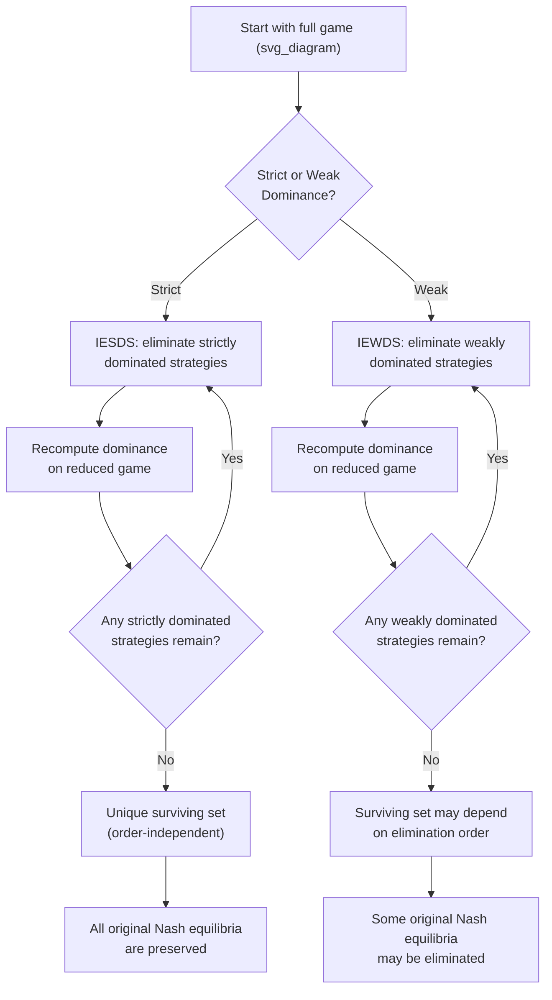

## Strictly and Weakly Dominated Strategies

### Overview

Dominance reasoning identifies strategies that a rational player would never choose, regardless of what other players do — the most basic and least demanding form of strategic reasoning, requiring no assumptions about coordination or common conjectures beyond individual rationality. Distinguishing **strict** from **weak** dominance is essential because the two forms behave very differently under iterated elimination: strict dominance elimination is robust and order-independent, while weak dominance elimination can eliminate legitimate Nash equilibria and depends on the order of elimination. This item formalizes both concepts, their associated elimination procedures, and their precise relationship to rationality and common knowledge.

---

### Strict Dominance

**Definition**

Strategy $s_i' \in S_i$ **strictly dominates** strategy $s_i \in S_i$ if, for every possible strategy profile of the other players $s_{-i} \in S_{-i}$:

$$u_i(s_i', s_{-i}) > u_i(s_i, s_{-i}) \quad \text{for all } s_{-i} \in S_{-i}$$

A strategy $s_i$ is **strictly dominated** if there exists some (possibly mixed) strategy that strictly dominates it. A rational player should never play a strictly dominated strategy under **any** belief about opponents' play, since $s_i'$ yields a strictly higher payoff no matter what — this makes strict dominance the strongest and least ambiguous form of dominance reasoning.

**Domination by a Mixed Strategy**

Critically, a pure strategy may fail to be strictly dominated by any *other pure* strategy, yet still be strictly dominated by a **mixed** strategy — a distinction with no analogue in the definitions of Nash equilibrium existence, but essential for correctly identifying all dominated strategies.

**Example: Domination by a Mixed Strategy**

|  | L | R |
| --- | --- | --- |
| **Top** | $3, -$ | $0, -$ |
| **Middle** | $1, -$ | $1, -$ |
| **Bottom** | $0, -$ | $3, -$ |

Middle is not strictly dominated by Top ($3>1$ but $0<1$) nor by Bottom ($0<1$ but $3>1$). However, a mixed strategy playing Top and Bottom each with probability $1/2$ yields expected payoff $1.5$ against both $L$ and $R$, strictly exceeding Middle's payoff of $1$ in both columns — so Middle **is** strictly dominated, but only by this mixture, not by any single pure strategy.

---

### Weak Dominance

**Definition**

Strategy $s_i' \in S_i$ **weakly dominates** strategy $s_i \in S_i$ if:

$$u_i(s_i', s_{-i}) \geq u_i(s_i, s_{-i}) \quad \text{for all } s_{-i} \in S_{-i}$$

with **strict** inequality holding for **at least one** $s_{-i} \in S_{-i}$. A strategy $s_i$ is **weakly dominated** if some strategy weakly dominates it in this sense — it is never strictly worse, and sometimes strictly better.

**Key distinction from strict dominance**: A weakly dominated strategy can still be a legitimate best response against *some* specific opponent strategy (namely, the one(s) where the two strategies tie); it is only ruled out as a best response against the *particular* strategy(-ies) where the dominating strategy does strictly better.

**Example: Weak Dominance**

|  | L | R |
| --- | --- | --- |
| **Top** | $2, -$ | $1, -$ |
| **Bottom** | $2, -$ | $0, -$ |

Top weakly dominates Bottom: both yield $2$ against $L$ (tied), but Top yields $1 > 0$ against $R$ (strictly better). Bottom is never strictly better than Top against either column, so it is weakly (but not strictly) dominated.

---

### Iterated Elimination Procedures

**Iterated Elimination of Strictly Dominated Strategies (IESDS)**

The procedure repeatedly removes strictly dominated strategies from the game, recomputing dominance relationships at each round (since a strategy may only become dominated *after* other strategies have already been removed), until no further strategies can be eliminated.

**Key Properties of IESDS**

- **Order independence**: The final set of surviving strategies is **identical regardless of the order** in which strictly dominated strategies are removed at each round. This is a crucial robustness property — the outcome of IESDS is a well-defined, unique object, not an artifact of the elimination sequence chosen.
- **Preserves all Nash equilibria**: Every Nash equilibrium of the original game survives IESDS; no legitimate equilibrium is ever eliminated by removing strictly dominated strategies.
- **Epistemic foundation**: IESDS is exactly justified by **common knowledge of rationality** (see Common Knowledge and Rationality Assumptions) — round $k$ of elimination requires that opponents' rationality (and the fact that they know each other are rational, recursively to depth $k-1$) be known at the appropriate depth.
- If IESDS reduces the game to a **single strategy profile**, that profile is called a **dominant strategy equilibrium**, and it is automatically the unique Nash equilibrium of the game (the Prisoner's Dilemma is the canonical example: (Defect, Defect) survives IESDS uniquely).

**Iterated Elimination of Weakly Dominated Strategies (IEWDS)**

The analogous procedure using weak dominance. IEWDS behaves substantially differently:

- **Order dependence**: Unlike IESDS, the **set of surviving strategies can depend on the order of elimination** — different elimination sequences can yield different final reduced games. This is the single most important technical caveat distinguishing weak from strict dominance elimination.
- **Can eliminate legitimate Nash equilibria**: Because weakly dominated strategies can still be genuine best responses (against the "tying" opponent strategy), removing them can inadvertently eliminate strategy profiles that were valid Nash equilibria of the original game.
- **Weaker epistemic justification**: IEWDS is generally **not** justified by common knowledge of rationality alone in the same clean way IESDS is; its epistemic foundations are considerably more delicate and remain a topic of some technical subtlety in the literature. [Unverified: the precise minimal epistemic conditions that fully justify IEWDS are a more specialized and less settled area than the corresponding IESDS result.]

**Example: Order Dependence of IEWDS**

|  | L | R |
| --- | --- | --- |
| **Top** | $1, 1$ | $0, 0$ |
| **Bottom** | $1, 1$ | $1, 2$ |

Here, comparing rows for Player 1: Top and Bottom tie against L ($1=1$) and Bottom strictly beats Top against R ($1>0$), so Top is weakly dominated by Bottom — eliminating Top leaves only Bottom, after which Player 2 strictly prefers R ($2>1$), yielding $(Bottom, R)$ with payoff $(1,2)$. But if instead Player 2's columns are examined first for weak dominance and a different elimination path is taken, a different surviving profile can result depending on the specific payoff structure chosen — illustrating why the *order* of weak elimination must be specified and justified, unlike with strict dominance where any order gives the same answer.

---

### Relationship to Best Responses and Rationalizability

**Never a Best Response**

A strategy that is strictly dominated is **never a best response** to *any* belief (probability distribution) a player could hold about opponents' play — this equivalence (strict dominance $\iff$ never-a-best-response, for finite games) is precisely what connects dominance to the broader concept of **rationalizability**: rationalizable strategies are exactly those that survive iterated elimination of strategies that are never a best response to any (correlated) belief about opponents' rationalizable strategies, of which IESDS is a specific, tractable special case.

**Weakly dominated strategies can still be best responses**: A weakly dominated strategy remains a best response against the specific opponent strategy (or strategies) that produce a tie — meaning weak dominance does **not** have the same clean "never-a-best-response" characterization that strict dominance does.

---

### Dominant Strategy Equilibrium

A strategy $s_i^*$ is a (weakly or strictly) **dominant strategy** for player $i$ if it dominates every other strategy in $S_i$. If every player has a dominant strategy, the resulting profile is a **dominant strategy equilibrium** — an unusually strong and robust solution concept, since no player needs to form any belief about others' play at all; the dominant strategy is optimal unconditionally.

**Example: Prisoner's Dilemma**

|  | Cooperate | Defect |
| --- | --- | --- |
| **Cooperate** | $-1, -1$ | $-3, 0$ |
| **Defect** | $0, -3$ | $-2, -2$ |

Defect strictly dominates Cooperate for both players ($0 > -1$ and $-2 > -3$), so (Defect, Defect) is a dominant strategy equilibrium — and, as guaranteed by the theory, it is also the unique Nash equilibrium of the game.

---

### Diagram: IESDS vs. IEWDS Comparison

---

### Diagram: Strict vs. Weak Dominance Payoff Comparison

<svg xmlns="http://www.w3.org/2000/svg" viewBox="0 0 660 380" font-family="sans-serif">
<text x="330" y="26" text-anchor="middle" font-size="16" font-weight="bold" fill="#1a1a1a">Strict vs. Weak Dominance: Payoff Profiles (svg_diagram)</text>

<text x="330" y="55" text-anchor="middle" font-size="12" fill="#555">Comparing dominating strategy s_i' vs dominated strategy s_i across opponent choices</text>

<text x="160" y="90" text-anchor="middle" font-size="13" font-weight="bold" fill="`#1e3a8a`">Strict Dominance</text>

<line x1="70" y1="270" x2="70" y2="110" stroke="#333" stroke-width="1.5" />

<line x1="70" y1="270" x2="260" y2="270" stroke="#333" stroke-width="1.5" />

<text x="120" y="290" font-size="10" fill="#333">Opp. Strategy A</text>

<text x="200" y="290" font-size="10" fill="#333">Opp. Strategy B</text>

<line x1="110" y1="200" x2="220" y2="150" stroke="#2563eb" stroke-width="2.5" />
<circle cx="110" cy="200" r="4" fill="#2563eb" />
<circle cx="220" cy="150" r="4" fill="#2563eb" />
<text x="225" y="145" font-size="10" fill="#2563eb" font-weight="bold">s_i' (dominating)</text>
<line x1="110" y1="250" x2="220" y2="230" stroke="#dc2626" stroke-width="2.5" stroke-dasharray="5,3" />
<circle cx="110" cy="250" r="4" fill="#dc2626" />
<circle cx="220" cy="230" r="4" fill="#dc2626" />
<text x="225" y="235" font-size="10" fill="#dc2626" font-weight="bold">s_i (dominated)</text>
<text x="160" y="310" text-anchor="middle" font-size="10" fill="#555">s_i' strictly above s_i everywhere</text>

<text x="500" y="90" text-anchor="middle" font-size="13" font-weight="bold" fill="`#78350f`">Weak Dominance</text>

<line x1="410" y1="270" x2="410" y2="110" stroke="#333" stroke-width="1.5" />

<line x1="410" y1="270" x2="600" y2="270" stroke="#333" stroke-width="1.5" />

<text x="460" y="290" font-size="10" fill="#333">Opp. Strategy A</text>

<text x="540" y="290" font-size="10" fill="#333">Opp. Strategy B</text>

<line x1="450" y1="230" x2="560" y2="150" stroke="#2563eb" stroke-width="2.5" />
<circle cx="450" cy="230" r="4" fill="#2563eb" />
<circle cx="560" cy="150" r="4" fill="#2563eb" />
<text x="565" y="145" font-size="10" fill="#2563eb" font-weight="bold">s_i' (dominating)</text>
<line x1="450" y1="230" x2="560" y2="230" stroke="#dc2626" stroke-width="2.5" stroke-dasharray="5,3" />
<circle cx="450" cy="230" r="4" fill="#dc2626" />
<circle cx="560" cy="230" r="4" fill="#dc2626" />
<text x="565" y="235" font-size="10" fill="#dc2626" font-weight="bold">s_i (dominated)</text>
<text x="500" y="310" text-anchor="middle" font-size="10" fill="#555">Tied at Strategy A, strictly worse at Strategy B</text>
</svg>

---

### Common Pitfalls and Clarifications

- **Checking only pure-strategy domination**: as shown in the Middle-strategy example above, a pure strategy can fail to be dominated by any single pure strategy yet still be strictly dominated by a mixture — a full dominance check must consider mixed dominating strategies, not just pure ones.
- **Assuming IEWDS is order-independent like IESDS**: this is one of the most consequential errors in applying dominance reasoning; weak dominance elimination genuinely depends on the sequence chosen, and different valid orderings can yield different final predictions.
- **Assuming a weakly dominated strategy can never be part of a Nash equilibrium**: it can — a weakly dominated strategy remains a legitimate best response against the opponent strategy that produces the tie, so weakly dominated strategies can and do appear in Nash equilibria (this is precisely why IEWDS can eliminate genuine equilibria, an important cautionary property).
- **Conflating dominant strategy equilibrium with Nash equilibrium generality**: every dominant strategy equilibrium is a Nash equilibrium, but the converse is false — most games (including many with unique Nash equilibria) have no dominant strategy for any player at all; dominant strategies are a special and comparatively rare structural feature.
- **Misapplying the "never a best response" equivalence to weak dominance**: this clean equivalence (dominated $\iff$ never a best response to any belief) holds for **strict** dominance in finite games, but does not hold in the same form for weak dominance, since weakly dominated strategies remain best responses against specific (non-generic) beliefs.

---

**Related Topics**

- Normal Form Game Representation
- Rationalizability (Bernheim and Pearce)
- Nash Equilibrium in Pure and Mixed Strategies
- Common Knowledge and Rationality Assumptions
- Best Response Correspondences
- The Prisoner's Dilemma and Dominant Strategy Equilibrium
- Order Independence in Elimination Procedures
- Trembling-Hand Perfect Equilibrium (as a refinement addressing weak dominance issues)
- Mixed Strategy Domination
- Correlated Equilibrium