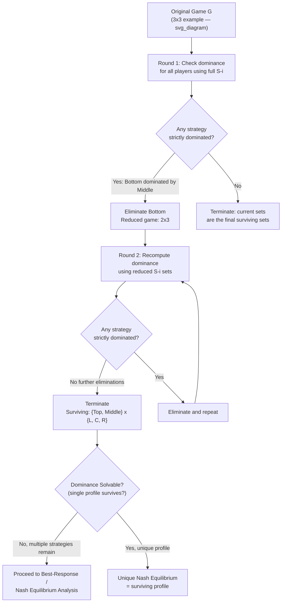

## Iterated Elimination of Dominated Strategies

### Overview

Iterated Elimination of Dominated Strategies (IEDS) is a procedure that repeatedly removes strategies a rational player would never use, recomputing the dominance relationships after each round, until no further strategy can be eliminated. It is the most basic solution technique in strategic-form analysis, requiring only successive applications of dominance logic rather than a fixed-point argument, and it serves as a computational and conceptual stepping stone toward Nash equilibrium and rationalizability. This item details the full algorithmic procedure, its formal properties (order-(in)dependence, equilibrium preservation), and worked examples covering both the strict and weak variants introduced previously.

---

### The General Procedure

**Algorithm**

Given a normal-form game $G = \langle N, (S_i)_{i \in N}, (u_i)_{i \in N} \rangle$, IEDS proceeds as follows:

1. **Round 0**: Set $S_i^0 = S_i$ for every player $i$ (the full original strategy sets).
2. **Round $k \to k+1$**: For each player $i$, identify any strategy $s_i \in S_i^k$ that is dominated (strictly or weakly, depending on the variant) **relative to the current reduced strategy sets** $S_{-i}^k$ of the other players — i.e., dominance is checked only against the opponents' *currently surviving* strategies, not their original full sets. Remove all such dominated strategies to form $S_i^{k+1} \subseteq S_i^k$.
3. **Termination**: Repeat step 2 until a round produces no further eliminations for any player. The resulting sets $S_i^\infty = \bigcap_k S_i^k$ are the game's **surviving strategies**.

**Key Point — Why Iteration Is Necessary**

A strategy may not be dominated in the original game, yet become dominated once other strategies (belonging to *other* players) are removed — because removing an opponent's strategy shrinks the set of profiles $s_{-i}$ that must be considered when checking dominance for player $i$. This is precisely why a *single* pass of elimination is generally insufficient, and the procedure must be repeated until convergence.

---

### Worked Example: Full IESDS Reduction

Consider the following three-strategy, two-player game:

|  | L | C | R |
| --- | --- | --- | --- |
| **Top** | $4, 3$ | $2, 7$ | $0, 4$ |
| **Middle** | $2, 4$ | $4, 0$ | $5, 3$ |
| **Bottom** | $1, 5$ | $3, 6$ | $3, 5$ |

**Round 1 — Check Player 2's strategies (columns) first**

Compare column payoffs for Player 2: L gives $(3,4,5)$, C gives $(7,0,6)$, R gives $(4,3,5)$. No column strictly dominates another across all three rows simultaneously (C is best against Top and Bottom's row, but worst against Middle) — so no column is eliminated yet by simple pairwise comparison. [Checking systematically confirms none of L, C, R strictly dominates another over all three rows in this initial pass.]

**Round 1 — Check Player 1's strategies (rows)**

Compare Bottom vs Middle: Bottom gives $(1,3,3)$ against $(L,C,R)$; Middle gives $(2,4,5)$ against $(L,C,R)$. Middle strictly dominates Bottom ($2>1$, $4>3$, $5>3$). **Eliminate Bottom.**

**Round 2 — Reduced game (Bottom removed)**

|  | L | C | R |
| --- | --- | --- | --- |
| **Top** | $4, 3$ | $2, 7$ | $0, 4$ |
| **Middle** | $2, 4$ | $4, 0$ | $5, 3$ |

Recompute Player 2's dominance using only the surviving rows (Top, Middle): L gives $(3,4)$, C gives $(7,0)$, R gives $(4,3)$. Now compare R vs L: R gives $(4,3)$, L gives $(3,4)$ — neither dominates. Compare C vs R: C gives $(7,0)$, R gives $(4,3)$ — neither dominates (C better against Top, worse against Middle). No column dominance yet.

Compare C vs L for Player 2 across (Top, Middle): C gives $(7,0)$, L gives $(3,4)$ — neither dominates.

At this point, no further strict dominance exists in either direction. **IESDS terminates** with surviving strategies $S_1^\infty = \{\text{Top}, \text{Middle}\}$, $S_2^\infty = \{L, C, R\}$. Further analysis (best-response / Nash equilibrium computation) would proceed on this smaller $2 \times 3$ reduced game rather than the original $3 \times 3$ game — illustrating the practical value of IESDS as a pre-processing step that shrinks the search space before applying more demanding solution concepts.

---

### Formal Properties

**Order Independence (Strict Dominance)**

For **strict** dominance, a foundational theorem guarantees that the final surviving strategy sets $S_i^\infty$ are **identical no matter the order** in which dominated strategies are removed at each round — whether one eliminates all dominated strategies simultaneously each round, or removes them one at a time in any sequence, the process converges to the same unique reduced game. This robustness is what makes "the IESDS-reduced game" a well-defined object worth naming, rather than merely one possible outcome among several.

**Order Dependence (Weak Dominance)**

For **weak** dominance, this order-independence guarantee **fails**: different elimination sequences can converge to different reduced games with different surviving strategy sets. Practitioners applying IEWDS must therefore either fix and justify a specific elimination order, or explicitly note that the result is one of potentially several valid reductions.

**Preservation of Nash Equilibria**

Every Nash equilibrium of the original game $G$ remains a Nash equilibrium of any game obtained via IESDS at any intermediate round — strict dominance elimination never destroys a legitimate equilibrium. The analogous guarantee does **not** hold for IEWDS: weakly dominated strategies can be part of genuine Nash equilibria (against opponent strategies that produce the relevant tie), so IEWDS can eliminate strategies that were part of valid equilibria of the original game.

**Termination**

For any **finite** game, IEDS (strict or weak) terminates in a finite number of rounds, since each round either removes at least one strategy or the process halts — bounded above trivially by $\sum_i |S_i|$ rounds in the worst case.

**Dominance Solvability**

A game is called **dominance solvable** if IESDS reduces it to a single strategy profile — i.e., exactly one surviving strategy per player. A dominance-solvable game has a **unique** Nash equilibrium, given precisely by the surviving profile; the Prisoner's Dilemma is the canonical dominance-solvable game. Most games, however, are **not** dominance solvable — IESDS often terminates with multiple surviving strategies per player (as in the worked example above), requiring further solution techniques (best-response analysis, Nash equilibrium computation) to proceed.

---

### Relationship to Rationalizability

IESDS and **rationalizability** (Bernheim, 1984; Pearce, 1984) are closely related but not identical procedures:

- **In two-player games**, the set of rationalizable strategies **coincides exactly** with the set of strategies surviving IESDS.
- **In games with three or more players**, IESDS and rationalizability can diverge: rationalizability eliminates a strategy if it is never a best response to *any* (possibly correlated across opponents) belief, whereas IESDS only checks dominance against the product structure of opponents' *independent* strategy sets. This subtle difference means, in general $n$-player games, rationalizability can eliminate strictly more strategies than IESDS, since a strategy might never be a best response to any belief without being strictly dominated in the IESDS sense.

$$\text{IESDS surviving strategies} \;\supseteq\; \text{Rationalizable strategies} \quad (\text{equality when } n=2)$$

---

### Diagram: Round-by-Round Reduction Process

---

### Diagram: IESDS vs. Rationalizability Set Relationship

<svg xmlns="http://www.w3.org/2000/svg" viewBox="0 0 640 380" font-family="sans-serif">
<text x="320" y="26" text-anchor="middle" font-size="16" font-weight="bold" fill="#1a1a1a">Nested Solution Concept Sets (svg_diagram)</text>

<ellipse cx="320" cy="210" rx="260" ry="150" fill="#dbeafe" stroke="#2563eb" stroke-width="2" />
<text x="320" y="90" text-anchor="middle" font-size="13" font-weight="bold" fill="#1e3a8a">IESDS-Surviving Strategies</text>

<ellipse cx="320" cy="230" rx="190" ry="105" fill="#dcfce7" stroke="#16a34a" stroke-width="2" />
<text x="320" y="150" text-anchor="middle" font-size="13" font-weight="bold" fill="#14532d">Rationalizable Strategies</text>

<ellipse cx="320" cy="250" rx="115" ry="65" fill="#fef3c7" stroke="#d97706" stroke-width="2" />
<text x="320" y="240" text-anchor="middle" font-size="12" font-weight="bold" fill="#78350f">Nash Equilibrium</text>
<text x="320" y="258" text-anchor="middle" font-size="12" font-weight="bold" fill="#78350f">Strategies</text>

<text x="320" y="350" text-anchor="middle" font-size="11" fill="#555">In 2-player games: IESDS set = Rationalizable set</text>

<text x="320" y="368" text-anchor="middle" font-size="11" fill="#555">In n-player (n greater than 2) games: IESDS set can strictly contain Rationalizable set</text>

</svg>

---

### Common Pitfalls and Clarifications

- **Checking dominance only once**: the single most common procedural error — failing to recompute dominance against the *reduced* opponent strategy sets after each round, which can cause a modeler to stop prematurely and miss strategies that only become dominated after earlier eliminations.
- **Mixing strict and weak elimination without noting it**: combining strict and weak dominance steps within a single "IEDS" pass without flagging which type of dominance justified each elimination obscures whether the resulting reduced game retains the order-independence and equilibrium-preservation guarantees (which hold cleanly only for the all-strict case).
- **Assuming every game is dominance solvable**: most games terminate IESDS with multiple surviving strategies per player, not a unique profile; dominance solvability is a special property, not the generic case, and reaching a non-singleton reduced game is a normal, expected outcome requiring further analysis (not a sign of an error in the procedure).
- **Assuming rationalizability and IESDS always coincide**: this equivalence is guaranteed only for **two-player** games; for three or more players, the two procedures can diverge because rationalizability permits beliefs correlated across opponents while IESDS's independent-strategy-set dominance check does not directly capture that flexibility.
- **Applying the equilibrium-preservation guarantee to weak dominance**: only IESDS carries the guarantee that all original Nash equilibria survive; IEWDS carries no such guarantee, and can eliminate legitimate equilibria along the way — a critical caveat when choosing which elimination variant to apply to a given problem.

---

**Related Topics**

- Strictly and Weakly Dominated Strategies
- Rationalizability (Bernheim and Pearce)
- Common Knowledge and Rationality Assumptions
- Nash Equilibrium in Pure and Mixed Strategies
- Dominant Strategy Equilibrium
- Best Response Correspondences
- Normal Form Game Representation
- Order Independence in Elimination Procedures
- The Prisoner's Dilemma and Dominance Solvability
- Correlated Equilibrium