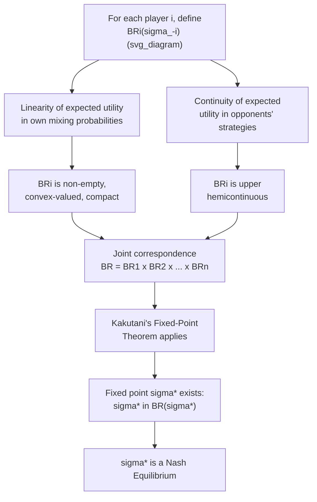

## Best Response Correspondences

### Overview

The best response correspondence formalizes, for each player, the set of strategies that maximize that player's payoff given a specific belief or profile of the other players' strategies. It is the central analytical object connecting dominance reasoning, Nash equilibrium, and equilibrium computation: a Nash equilibrium is precisely a strategy profile in which every player's chosen strategy lies in their own best response correspondence evaluated at the others' equilibrium strategies. This item formalizes the correspondence for both pure and mixed strategies, its key mathematical properties (upper hemicontinuity, convex-valuedness), and its role as the fixed-point object underlying Nash's existence theorem.

---

### Formal Definition: Pure-Strategy Best Response

**Definition**

Given a normal-form game $G = \langle N, (S_i)_{i \in N}, (u_i)_{i \in N} \rangle$, player $i$'s **best response correspondence** maps each possible profile of opponents' strategies $s_{-i} \in S_{-i}$ to the set of player $i$'s strategies that maximize $i$'s payoff against it:

$$BR_i(s_{-i}) = \left\{ s_i \in S_i : u_i(s_i, s_{-i}) \geq u_i(s_i', s_{-i}) \; \text{for all } s_i' \in S_i \right\}$$

This is called a **correspondence** rather than a **function** because $BR_i(s_{-i})$ may contain more than one element — multiple strategies can tie for the maximum payoff against a given $s_{-i}$ — whereas a function, by definition, returns exactly one value per input.

**Key Points**

- $BR_i(s_{-i})$ is never empty for a finite game, since a finite strategy set always has at least one maximizer.
- The correspondence is defined **relative to a specific belief** about what the others will do; it says nothing on its own about whether that belief is correct or consistent with what the others would actually choose — that consistency requirement is exactly what Nash equilibrium adds.
- Reading $BR_i$ off a bimatrix is done via the **underlining method**: for each column (fixed $s_{-i}$), underline the maximal payoff(s) for the row player in that column; the underlined entries identify $BR_1(s_{-i})$ for that particular $s_{-i}$.

---

### Nash Equilibrium as a Fixed Point of Best Responses

**Definition via Best Response**

A strategy profile $s^* = (s_1^*, \ldots, s_n^*)$ is a **Nash equilibrium** if and only if every player's strategy is a best response to the others':

$$s_i^* \in BR_i(s_{-i}^*) \quad \text{for every } i \in N$$

This reformulation makes explicit that Nash equilibrium is a simultaneous **fixed point** of the collection of best response correspondences: no single player, examining the equilibrium profile, would want to unilaterally deviate, because their own chosen strategy already lies within their own best-response set given what everyone else is doing.

**Example: Locating Nash Equilibria via Best Response Underlining**

Consider the Battle of the Sexes bimatrix:

|  | Opera | Football |
| --- | --- | --- |
| **Opera** | $\underline{2}, \underline{1}$ | $0, 0$ |
| **Football** | $0, 0$ | $\underline{1}, \underline{2}$ |

For each column, Player 1's best response is underlined; for each row, Player 2's best response is underlined. A cell where **both** entries are underlined identifies a pure-strategy Nash equilibrium — here, (Opera, Opera) and (Football, Football) both qualify, since each player's strategy is simultaneously a best response to the other's.

---

### Mixed-Strategy Best Response Correspondence

**Definition**

Extending to mixed strategies, player $i$'s best response to a mixed profile of opponents $\sigma_{-i} \in \Delta(S_{-i})$ is the set of mixed strategies maximizing **expected** utility:

$$BR_i(\sigma_{-i}) = \left\{ \sigma_i \in \Delta(S_i) : u_i(\sigma_i, \sigma_{-i}) \geq u_i(\sigma_i', \sigma_{-i}) \; \text{for all } \sigma_i' \in \Delta(S_i) \right\}$$

**Key Property — Linearity in Own Mixing Probabilities**

Because expected utility is **linear** in a player's own mixing probabilities (for fixed opponents' strategies), a fundamental result follows: if a player has more than one pure strategy achieving the maximum expected payoff against a given $\sigma_{-i}$, then **every** mixture over exactly those maximizing pure strategies is also a best response (and no mixture involving a strictly worse pure strategy can be a best response). This means $BR_i(\sigma_{-i})$, viewed within the mixed-strategy simplex $\Delta(S_i)$, is always a **convex set** — either a single point (unique best pure strategy), a full face of the simplex (a player indifferent among a specific subset of pure strategies), or the entire simplex (indifferent among all).

**Indifference Principle**

A player is willing to **mix** between two or more pure strategies in equilibrium **only if** those strategies yield exactly equal expected payoffs against the opponents' equilibrium mixed strategy — this is often called the **indifference condition**, and it is the standard computational tool for solving for mixed-strategy Nash equilibria: set the expected payoffs of the strategies to be mixed equal to each other and solve for the opponent's mixing probabilities that create this indifference.

**Example: Computing a Mixed Best Response via Indifference**

In Matching Pennies, Player 1 chooses Heads or Tails, and Player 2 (who wants to mismatch Player 1) chooses Heads or Tails; Player 1 wins $+1$ on a match, loses $-1$ on a mismatch (with reversed signs for Player 2).

|  | Heads | Tails |
| --- | --- | --- |
| **Heads** | $1, -1$ | $-1, 1$ |
| **Tails** | $-1, 1$ | $1, -1$ |

Let Player 2 play Heads with probability $q$. Player 1's expected payoffs are:

$$u_1(\text{Heads}, q) = q(1) + (1-q)(-1) = 2q - 1$$

$$u_1(\text{Tails}, q) = q(-1) + (1-q)(1) = 1 - 2q$$

Player 1 is willing to mix (indifferent) exactly when $2q - 1 = 1 - 2q \implies q = 1/2$. For $q > 1/2$, Player 1's unique best response is pure Heads; for $q < 1/2$, pure Tails. This piecewise structure — a unique pure best response almost everywhere, collapsing to the entire mixed simplex at exactly one critical point — is the generic shape of best response correspondences in two-strategy games, and it is exactly this kind of correspondence whose fixed point (found by superimposing both players' correspondences) identifies the mixed Nash equilibrium.

---

### Mathematical Properties Required for Existence Proofs

**Upper Hemicontinuity**

The best response correspondence $BR_i(\cdot)$ is **upper hemicontinuous**: informally, if a sequence of opponent-strategy profiles $\sigma_{-i}^k \to \sigma_{-i}$ converges, and a sequence of best responses $\sigma_i^k \in BR_i(\sigma_{-i}^k)$ also converges to some $\sigma_i$, then $\sigma_i \in BR_i(\sigma_{-i})$ — the correspondence has no "jumps" that could hide a limiting best response. This property, together with...

**Convex-Valuedness**

...the fact that $BR_i(\sigma_{-i})$ is always a **non-empty, convex, compact** subset of the mixed-strategy simplex $\Delta(S_i)$ (established via the linearity argument above)...

...are exactly the two properties required by **Kakutani's Fixed-Point Theorem** to guarantee that the joint correspondence $BR(\sigma) = BR_1(\sigma_{-1}) \times \cdots \times BR_n(\sigma_{-n})$, mapping the compact convex product of simplices $\Delta(S_1) \times \cdots \times \Delta(S_n)$ to itself, has at least one **fixed point** $\sigma^*$ satisfying $\sigma^* \in BR(\sigma^*)$ — which is precisely a Nash equilibrium. This is the technical core of **Nash's 1950 existence theorem**: every finite game has at least one (possibly mixed) Nash equilibrium, proven entirely by verifying that the best response correspondence satisfies the hypotheses of Kakutani's theorem.

---

### Best Response Dynamics (Informal Learning Interpretation)

A related but distinct informal concept is **best response dynamics**: an iterative process in which players (or a single player at a time) repeatedly update their strategy to a best response against the current profile of others. While not itself a solution concept, this process is used to motivate and sometimes computationally locate Nash equilibria, and its convergence properties (or lack thereof) are studied in **evolutionary game theory** and **learning in games** — in some classes of games (e.g., games satisfying certain potential-function structures), best response dynamics provably converge to a Nash equilibrium; in others (e.g., games with cyclic best responses like Matching Pennies), the dynamics can cycle indefinitely without converging. [Unverified: convergence guarantees are highly game-class-dependent and should not be assumed to hold generically without checking the specific structural conditions required by the relevant convergence theorem.]

---

### Diagram: Best Response Correspondence Fixed Point (Mixed Strategies)

<svg xmlns="http://www.w3.org/2000/svg" viewBox="0 0 620 420" font-family="sans-serif">
<text x="310" y="26" text-anchor="middle" font-size="16" font-weight="bold" fill="#1a1a1a">Best Response Correspondences: Matching Pennies (svg_diagram)</text>

<line x1="80" y1="360" x2="80" y2="60" stroke="#333" stroke-width="1.5" />
<line x1="80" y1="360" x2="560" y2="360" stroke="#333" stroke-width="1.5" />
<text x="320" y="395" text-anchor="middle" font-size="12" fill="#333">q = P2's probability of Heads</text>
<text x="35" y="210" text-anchor="middle" font-size="12" fill="#333" transform="rotate(-90 35 210)">p = P1's probability of Heads</text>

<text x="80" y="375" font-size="10" fill="#333">0</text>

<text x="315" y="375" font-size="10" fill="#333">0.5</text>

<text x="555" y="375" font-size="10" fill="#333">1</text>

<text x="65" y="365" font-size="10" fill="#333">0</text>

<text x="65" y="215" font-size="10" fill="#333">0.5</text>

<text x="65" y="65" font-size="10" fill="#333">1</text>

<line x1="80" y1="360" x2="318" y2="360" stroke="#2563eb" stroke-width="3" />
<line x1="318" y1="360" x2="318" y2="60" stroke="#2563eb" stroke-width="2" stroke-dasharray="3,3" />
<line x1="318" y1="60" x2="560" y2="60" stroke="#2563eb" stroke-width="3" />
<text x="150" y="345" font-size="10" fill="#2563eb" font-weight="bold">P1 BR: p=0 (Tails)</text>
<text x="420" y="80" font-size="10" fill="#2563eb" font-weight="bold">P1 BR: p=1 (Heads)</text>

<line x1="80" y1="210" x2="560" y2="210" stroke="#dc2626" stroke-width="1" stroke-dasharray="4,3" opacity="0.5" />
<line x1="80" y1="360" x2="80" y2="212" stroke="#dc2626" stroke-width="3" />
<line x1="80" y1="212" x2="560" y2="212" stroke="#dc2626" stroke-width="2" stroke-dasharray="3,3" />
<line x1="560" y1="212" x2="560" y2="62" stroke="#dc2626" stroke-width="3" />
<text x="100" y="330" font-size="10" fill="#dc2626" font-weight="bold">P2 BR region (left)</text>
<text x="470" y="100" font-size="10" fill="#dc2626" font-weight="bold">P2 BR region (right)</text>

<circle cx="318" cy="211" r="7" fill="#16a34a" stroke="#14532d" stroke-width="2" />
<text x="330" y="200" font-size="12" fill="#14532d" font-weight="bold">Fixed Point:<tspan x="330" dy="14">Nash Equilibrium</tspan><tspan x="330" dy="14">(p=0.5, q=0.5)</tspan></text>
</svg>

---

### Diagram: From Best Response to Equilibrium Existence

---

### Common Pitfalls and Clarifications

- **Treating the best response correspondence as a function**: it is generally set-valued (a correspondence), not single-valued — ties are common and important, especially at the exact mixing probabilities that support a mixed-strategy equilibrium.
- **Forgetting the indifference principle when computing mixed equilibria**: a player is only willing to mix between strategies that yield **exactly equal** expected payoffs against the opponent's equilibrium strategy; setting up and solving these indifference equations (not maximizing directly) is the standard technique for finding mixed-strategy Nash equilibria by hand.
- **Assuming best response dynamics always converge**: convergence depends heavily on the game's structure (e.g., potential games, or games with strategic complementarities, tend to converge; games with cyclic best responses like Matching Pennies do not converge under naive best-response updating).
- **Confusing "best response to a specific pure profile" with "best response to a belief"**: the correspondence is most generally defined over the opponents' **mixed** strategies (or beliefs), of which a pure profile is only the degenerate special case — the more general mixed-strategy formulation is what is required for Nash's existence theorem to go through.
- **Assuming upper hemicontinuity and convex-valuedness are automatic**: these properties are consequences of specific features of the game (finiteness of pure strategy sets, linearity of expected utility) — they are the reason Nash's theorem is stated for finite games with mixed strategies, and do not automatically transfer to arbitrary or infinite strategy spaces without additional continuity/convexity assumptions on payoffs.

---

**Related Topics**

- Nash Equilibrium in Pure and Mixed Strategies
- Kakutani's Fixed-Point Theorem and Existence Proofs
- Strictly and Weakly Dominated Strategies
- The Indifference Principle for Mixed Strategy Equilibria
- Normal Form Game Representation
- Best Response Dynamics and Learning in Games
- Potential Games and Convergence Guarantees
- Matching Pennies and Zero-Sum Coordination Failure
- Evolutionary Game Theory and Replicator Dynamics
- Correlated Equilibrium