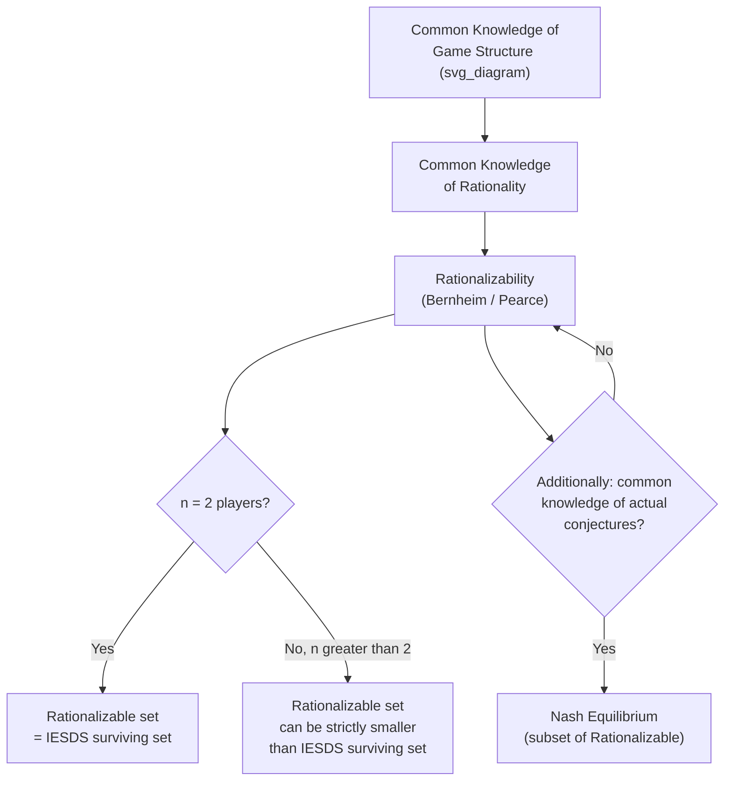

## Rationalizability

### Overview

Rationalizability is a solution concept that identifies the strategies a player could rationally choose given only the assumption that **rationality is common knowledge** — without requiring that players' beliefs about each other be correct, consistent, or mutually confirmed, as Nash equilibrium does. Introduced independently by Douglas Bernheim (1984) and David Pearce (1984), rationalizability sits between raw individual rationality and Nash equilibrium in epistemic demands: it is the weakest solution concept still fully justified by common knowledge of rationality alone, and it generally identifies a **larger** set of strategies than either Nash equilibrium or (in games with more than two players) IESDS. This item formalizes the definition, its iterative construction, its precise relationship to dominance and Nash equilibrium, and its distinct epistemic foundations.

---

### Motivation: What Nash Equilibrium Assumes That Rationalizability Does Not

Nash equilibrium requires that every player's strategy be a best response to the **actual** strategies of the other players — implicitly assuming that each player's beliefs about others are **correct**. This is a substantially stronger requirement than rationality alone: two rational players might each hold incorrect (but individually rational) beliefs about what the other will do, leading to play that is fully consistent with common knowledge of rationality yet is **not** a Nash equilibrium, because the beliefs happen not to coincide with actual play.

Rationalizability drops the requirement that beliefs be *correct*, retaining only the requirement that each player best-responds to **some** belief that is itself consistent with the other players also being rational (and so on, recursively) — this is exactly what "common knowledge of rationality" demands, no more and no less.

---

### Formal Definition

**Definition (Never a Best Response)**

A pure strategy $s_i \in S_i$ is a **best response to a belief** $\mu_i \in \Delta(S_{-i})$ (a probability distribution over the *joint*, possibly correlated, strategies of the other players) if:

$$\sum_{s_{-i}} \mu_i(s_{-i}) \, u_i(s_i, s_{-i}) \geq \sum_{s_{-i}} \mu_i(s_{-i}) \, u_i(s_i', s_{-i}) \quad \text{for all } s_i' \in S_i$$

A strategy is **never a best response** if no such belief $\mu_i$ (over any subset of the opponents' strategies) makes it optimal.

**Definition (Rationalizable Strategies)**

The set of rationalizable strategies is constructed by iterated elimination: at each round, remove any strategy that is never a best response to **any** belief over the opponents' **currently surviving** rationalizable strategies. A strategy survives (is **rationalizable**) if it survives this process at every round, infinitely.

Formally, define $R_i^0 = S_i$ for all $i$, and iteratively:

$$R_i^{k+1} = \left\{ s_i \in R_i^k \;:\; \exists\, \mu_i \in \Delta(R_{-i}^k) \text{ such that } s_i \in BR_i(\mu_i) \right\}$$

The rationalizable set is $R_i^\infty = \bigcap_{k=0}^{\infty} R_i^k$.

**Key Distinguishing Feature: Correlated Beliefs**

Critically, the belief $\mu_i$ is a probability distribution over the **joint** strategy profile of all other players $S_{-i}$ (allowing correlation across different opponents' choices) — not necessarily a product of independent distributions over each individual opponent's strategy. This is exactly the technical feature that allows rationalizability to differ from IESDS in games with three or more players (see below).

---

### Relationship to Dominance

**Equivalence Theorem: Two-Player Games**

$$\textbf{Theorem: } \text{A strategy is rationalizable} \iff \text{it survives IESDS} \qquad (n = 2 \text{ players only})$$

In a two-player game, there is only one opponent, so any belief $\mu_i \in \Delta(S_{-i})$ is automatically a distribution over a single player's strategies — there is no "correlation across opponents" to speak of, since there is only one opponent. This collapses the distinction between "never a best response to any belief" and "strictly dominated," making rationalizability and IESDS coincide exactly.

**Divergence in $n \geq 3$ Player Games**

With three or more players, a strategy can be **never a best response to any belief over the joint (possibly correlated) strategies of the other two or more players**, yet still fail to be **strictly dominated** in the IESDS sense — because IESDS dominance is checked against the full product set $S_{-i}$ (implicitly treating all combinations, including ones that would require the opponents' strategies to be uncorrelated in a specific sense), whereas rationalizability's "belief" allows arbitrary joint (correlated) distributions over $S_{-i}$. This means:

$$\text{Rationalizable Strategies} \subseteq \text{IESDS-Surviving Strategies} \qquad (n \geq 3, \text{ can be strict})$$

**Example illustrating divergence** (a stylized structure): Suppose player $i$'s payoff from strategy $A$ exceeds strategy $B$ against every *independent* combination of the other two players' strategies except one very specific *correlated* combination the other players might jointly (but not independently) coordinate on — in that scenario $B$ might not be strictly dominated by any single alternative when checked against all product-form opponent profiles, yet still never be a best response to any actual belief once correlated beliefs are permitted, causing $B$ to be eliminated by rationalizability but not by IESDS. [Inference: constructing a fully explicit numerical instance of this divergence requires a payoff table specifically engineered for the purpose; the qualitative structure of the divergence — driven by correlated versus independent beliefs over $\geq 2$ opponents — is the standard textbook explanation, though concrete worked numerical examples vary across sources.]

---

### Worked Example: Computing Rationalizable Strategies

Consider a two-player game (where rationalizability and IESDS coincide):

|  | L | M | R |
| --- | --- | --- | --- |
| **Top** | $3, 1$ | $0, 2$ | $1, 0$ |
| **Middle** | $1, 0$ | $2, 3$ | $0, 1$ |
| **Bottom** | $0, 2$ | $1, 0$ | $2, 1$ |

**Round 1**: Check whether Bottom is ever a best response for Player 1 against any belief $\mu_1 \in \Delta(\{L,M,R\})$. Bottom's payoffs are $(0, 1, 2)$ against $(L,M,R)$; Middle's are $(1,2,0)$; Top's are $(3,0,1)$. A mixture of Top and Middle can be checked: for any weight on $L$ pulling toward Top and any weight on $M$ pulling toward Middle, it turns out Bottom is dominated by some mixture of Top and Middle for a range of beliefs, but is a best response only against a belief heavily weighted on $R$ specifically (since Bottom's payoff of $2$ against $R$ exceeds Top's $1$ and Middle's $0$) — so **Bottom survives** as a best response to the belief "opponent plays $R$ with sufficiently high probability," and is therefore rationalizable (assuming no combination of Top/Middle beats it against that specific belief, which must be checked numerically for the exact mixture threshold). [Behavior may vary: the exact threshold belief and whether Bottom truly survives depends on precise indifference calculations across the full mixed-strategy space; this worked example is illustrative of the checking procedure rather than a fully exhaustive numerical verification.]

This example illustrates the core mechanical procedure: rationalizability is verified strategy-by-strategy by searching over the **entire belief simplex**, not merely checking against a finite list of pure opponent strategies — a strategy survives as long as **some** point in the belief simplex makes it optimal, however small the region of beliefs supporting it.

---

### Epistemic Foundations

**The Precise Epistemic Content of Rationalizability**

Rationalizability is exactly and only justified by:

1. **Common knowledge of rationality**: every player is rational, knows every player is rational, knows that they know, and so on infinitely.
2. **Common knowledge of the game structure**: the strategy sets and payoff functions are common knowledge.

Rationalizability requires **no** further assumption that beliefs be correct, consistent across players, or correspond to any actual equilibrium — this is precisely what distinguishes it from Nash equilibrium, whose epistemic foundations (per Aumann and Brandenburger, 1995) additionally require common knowledge of the players' actual conjectures about one another (at least in general $n$-player settings; in two-player games, common knowledge of rationality plus common knowledge of conjectures suffices for Nash equilibrium specifically, a stronger requirement than rationalizability's).

$$\text{Nash Equilibrium} \;\subseteq\; \text{Rationalizable Strategies}$$

Every Nash equilibrium strategy is rationalizable (since equilibrium beliefs, being correct, are in particular *some* consistent belief), but rationalizable strategies need not form or belong to any Nash equilibrium at all.

---

### Diagram: Epistemic Hierarchy from Rationality to Equilibrium

---

### Diagram: Set Relationships Across Solution Concepts

<svg xmlns="http://www.w3.org/2000/svg" viewBox="0 0 640 340" font-family="sans-serif">
<text x="320" y="26" text-anchor="middle" font-size="16" font-weight="bold" fill="#1a1a1a">Solution Concept Nesting (svg_diagram)</text>

<ellipse cx="320" cy="190" rx="270" ry="120" fill="#dbeafe" stroke="#2563eb" stroke-width="2" />
<text x="320" y="85" text-anchor="middle" font-size="13" font-weight="bold" fill="#1e3a8a">IESDS-Surviving Strategies</text>

<ellipse cx="320" cy="205" rx="195" ry="85" fill="#dcfce7" stroke="#16a34a" stroke-width="2" />
<text x="320" y="140" text-anchor="middle" font-size="13" font-weight="bold" fill="#14532d">Rationalizable Strategies</text>

<ellipse cx="320" cy="220" rx="115" ry="50" fill="#fef3c7" stroke="#d97706" stroke-width="2" />
<text x="320" y="225" text-anchor="middle" font-size="12" font-weight="bold" fill="#78350f">Nash Equilibrium</text>

<text x="320" y="300" text-anchor="middle" font-size="11" fill="#555">Equality of outer two sets holds exactly when n = 2 players</text>

<text x="320" y="318" text-anchor="middle" font-size="11" fill="#555">Nash subset relation always holds (any n)</text>

</svg>

---

### Common Pitfalls and Clarifications

- **Assuming rationalizability always equals IESDS**: this equivalence is guaranteed **only in two-player games**; in three-or-more-player games, rationalizability can be strictly smaller due to its allowance for correlated beliefs across the joint strategies of multiple opponents, a distinction IESDS's pairwise dominance checks do not capture.
- **Confusing "never a best response" with "strictly dominated"**: these are equivalent concepts in finite two-player games, but the equivalence is a theorem requiring the two-player restriction (or, more precisely, requiring beliefs to be over a single opponent's strategy set) — not a definitional identity that holds automatically in general.
- **Treating rationalizability as requiring correct beliefs**: it explicitly does not — a rationalizable strategy is optimal against *some* belief consistent with common knowledge of rationality, whether or not that belief turns out to match the opponents' actual play; this is precisely the feature that makes it strictly weaker (epistemically) than Nash equilibrium.
- **Assuming a unique rationalizable outcome always exists**: like IESDS, rationalizability frequently terminates with multiple surviving strategies per player, not a single unique profile — a game is only "rationalizability solvable" (uniquely predicted) in the special case where the iterative process converges to exactly one strategy for each player.
- **Overlooking the correlated-belief subtlety in applied examples**: many introductory textbook treatments implicitly work with two-player games where rationalizability and IESDS coincide, which can create the false impression that the two concepts are always identical — the divergence in $n \geq 3$ settings is a genuine, not merely notational, distinction.

---

**Related Topics**

- Iterated Elimination of Dominated Strategies
- Strictly and Weakly Dominated Strategies
- Common Knowledge and Rationality Assumptions
- Nash Equilibrium in Pure and Mixed Strategies
- Best Response Correspondences
- Correlated Equilibrium
- Epistemic Game Theory and Interactive Belief Systems
- Aumann and Brandenburger's Epistemic Conditions for Nash Equilibrium
- $n$-Player Games and Correlated Beliefs
- Dominance Solvability