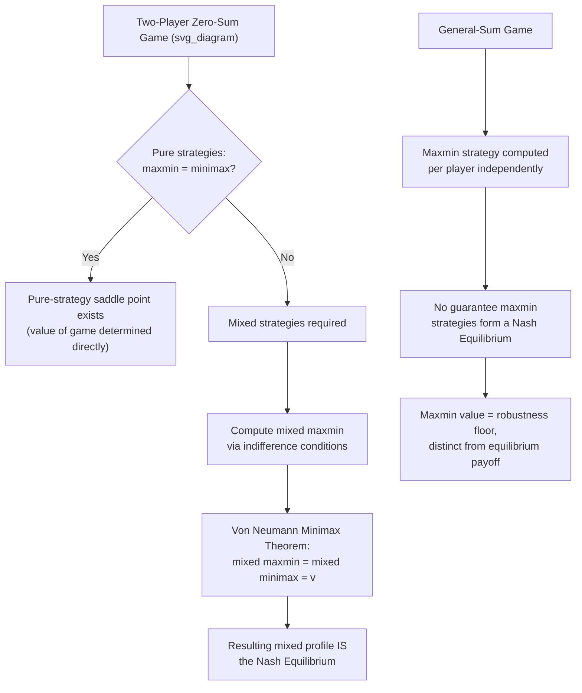

## Maxmin and Minimax Strategies

### Overview

Maxmin and minimax strategies formalize security-level reasoning: choosing an action that guarantees the best possible outcome under the worst-case assumption about what opponents will do, without relying on any belief about their rationality or intentions. This concept predates Nash equilibrium historically (it is the core object of von Neumann's 1928 Minimax Theorem) and remains central to zero-sum game analysis, robust decision-making, and as a lower bound on what any rational player can guarantee for themselves regardless of the game's other properties. This item formalizes the maxmin/minimax value in both pure and mixed strategies, the Minimax Theorem itself, and the precise relationship between maxmin strategies and Nash equilibrium.

---

### Pure-Strategy Maxmin Value

**Definition**

For player $i$ in a normal-form game, the **maxmin value** (also called the **security level** or **safety value**) is the highest payoff player $i$ can guarantee for themselves, assuming the worst possible response from the other players:

$$\underline{v}_i = \max_{s_i \in S_i} \; \min_{s_{-i} \in S_{-i}} \; u_i(s_i, s_{-i})$$

A strategy $s_i^*$ achieving this maximum is called a **maxmin strategy** (or **security strategy**) for player $i$. This is exactly the **Wald (maximin) criterion** from decision theory under uncertainty, applied to a strategic setting where the "state of nature" is replaced by the actions of an adversarial or unmodeled opponent.

**Interpretation**

The maxmin value represents the payoff player $i$ can guarantee **unilaterally**, without any assumption that the opponent is rational, or any belief about what the opponent will actually do — it is a **robust, worst-case guarantee**, valid even against an opponent who is actively hostile or behaves adversarially, not merely a self-interested rational maximizer.

**Example**

Consider the following two-player game (payoffs shown only for Player 1):

|  | L | R |
| --- | --- | --- |
| **Top** | $5$ | $0$ |
| **Middle** | $2$ | $3$ |
| **Bottom** | $-1$ | $4$ |

Row minima: Top gives $\min(5,0) = 0$; Middle gives $\min(2,3) = 2$; Bottom gives $\min(-1,4) = -1$. The maxmin value is $\max(0, 2, -1) = 2$, achieved by playing **Middle** — Player 1 can guarantee at least $2$ regardless of Player 2's choice, and no other pure strategy guarantees more.

---

### Minimax Value

**Definition**

The **minimax value** for a player is the lowest payoff the *other* player(s) can hold that player down to, assuming the player being minimized plays optimally against them:

$$\overline{v}_i = \min_{s_{-i} \in S_{-i}} \; \max_{s_i \in S_i} \; u_i(s_i, s_{-i})$$

Equivalently, in a **two-player zero-sum game**, the minimax value from Player 1's perspective is the value that Player 2 — trying to minimize Player 1's payoff (since it equals Player 2's loss) — can guarantee holding Player 1 to, assuming Player 1 responds optimally to Player 2's choice.

**General Relationship: Maxmin $\leq$ Minimax**

For any finite game (pure strategies), it is always true that:

$$\underline{v}_i \leq \overline{v}_i$$

Intuitively, the maxmin value is computed by the row player committing *first* (choosing before knowing the column player's response, hence hedging against the worst case), while the minimax value is computed as if the column player commits first (allowing the row player to respond optimally afterward) — moving second is (weakly) advantageous, so $\overline{v}_i$ is generally at least as large as $\underline{v}_i$ in pure strategies, with equality holding only in special cases.

---

### The Minimax Theorem (Two-Player Zero-Sum Games, Mixed Strategies)

**Statement**

Von Neumann's **Minimax Theorem** (1928) establishes that in any **finite, two-player, zero-sum game**, once **mixed strategies** are permitted, the maxmin and minimax values coincide exactly:

$$\max_{p \in \Delta(S_1)} \min_{q \in \Delta(S_2)} \; p^\top A q \;=\; \min_{q \in \Delta(S_2)} \max_{p \in \Delta(S_1)} \; p^\top A q \;=\; v$$

where $A$ is Player 1's payoff matrix, $p$ and $q$ are mixed strategies for the row and column players respectively, and $v$ is called the **value of the game**. This resolves, in mixed strategies, the pure-strategy gap ($\underline{v}_i \leq \overline{v}_i$) noted above — allowing randomization eliminates the first-mover/second-mover asymmetry that can otherwise separate the maxmin and minimax values.

**Key Consequence**

In a two-player zero-sum game, any mixed maxmin strategy for Player 1 (guaranteeing at least $v$ regardless of Player 2's play) and any mixed minimax strategy for Player 2 (guaranteeing Player 1 gets no more than $v$, equivalently guaranteeing Player 2 loses no more than $v$) together constitute a **Nash equilibrium** of the game, with equilibrium payoff exactly $(v, -v)$. This is one of the deepest and most useful results connecting security-level reasoning (maxmin) to equilibrium reasoning (Nash) — in the zero-sum case specifically, they coincide exactly, and either concept can be used interchangeably to solve the game.

---

### Worked Example: Solving a Zero-Sum Game via Minimax

Consider the zero-sum game (Player 1's payoff shown; Player 2's payoff is its negative):

|  | L | R |
| --- | --- | --- |
| **Top** | $4$ | $-1$ |
| **Bottom** | $-2$ | $3$ |

Check for a pure-strategy solution first: row minima are $-1$ (Top) and $-2$ (Bottom), so pure maxmin is $\max(-1,-2) = -1$. Column maxima are $4$ (L) and $3$ (R), so pure minimax is $\min(4,3) = 3$. Since $-1 \neq 3$, **no pure-strategy solution exists** — mixed strategies are required.

Let Player 1 play Top with probability $p$. Player 1's expected payoff against each of Player 2's pure strategies:

$$u_1(p, L) = 4p - 2(1-p) = 6p - 2$$

$$u_1(p, R) = -p + 3(1-p) = 3 - 4p$$

Player 2, minimizing Player 1's payoff, will choose whichever of $L, R$ gives the lower value; Player 1's optimal mixed maxmin strategy sets these equal (the indifference condition) so Player 2 cannot exploit either column:

$$6p - 2 = 3 - 4p \implies 10p = 5 \implies p = 0.5$$

Value of the game: $v = 6(0.5) - 2 = 1$. By the symmetric computation for Player 2's mixing probability $q$ (probability of playing L), setting Player 1 indifferent between Top and Bottom:

$$4q - 1(1-q) = -2q + 3(1-q) \implies 5q - 1 = 3 - 5q \implies 10q = 4 \implies q = 0.4$$

This gives the mixed Nash equilibrium $\left(p=0.5,\, q=0.4\right)$ with value $v=1$ — confirming the Minimax Theorem's guarantee that the maxmin and minimax values coincide once mixed strategies are used, and that the resulting mixed profile is exactly the game's (unique, in this case) Nash equilibrium.

---

### Maxmin Strategies in General-Sum Games

**Key Distinction**

Outside the two-player zero-sum setting, the tight connection between maxmin/minimax and Nash equilibrium **breaks down**. In a general-sum game:

- A player's maxmin (security) strategy need **not** be part of any Nash equilibrium.
- A Nash equilibrium strategy need **not** guarantee the maxmin value — equilibrium payoffs in general-sum games can, in principle, fall *below* what a player could guarantee unilaterally via their maxmin strategy (though not below it by construction in equilibrium against rational play; the point is that equilibrium reasoning and worst-case security reasoning are conceptually and mathematically distinct once the strict zero-sum assumption is dropped).
- Maxmin strategies remain useful in general-sum games specifically as a **robustness benchmark** — a floor on what a player can always secure regardless of whether opponents behave as predicted by any particular equilibrium concept, which is valuable precisely when there is uncertainty about whether opponents will actually play an equilibrium strategy at all.

This distinction is the direct generalization of the **decision theory under uncertainty** material: maxmin play is the appropriate response when a player cannot trust that opponents' behavior follows any specific probabilistic model (akin to "true uncertainty" rather than "risk" in the single-agent decision-theoretic classification), whereas Nash equilibrium presumes a specific, mutually consistent structure of beliefs and best responses.

---

### Diagram: Maxmin/Minimax Value Relationship

---

### Diagram: Pure-Strategy Maxmin vs. Minimax Gap

<svg xmlns="http://www.w3.org/2000/svg" viewBox="0 0 640 380" font-family="sans-serif">
<text x="320" y="26" text-anchor="middle" font-size="16" font-weight="bold" fill="#1a1a1a">Maxmin vs. Minimax: Row/Column Extrema (svg_diagram)</text>

<rect x="180" y="70" width="120" height="60" fill="#f3f4f6" stroke="#333" />
<text x="240" y="105" text-anchor="middle" font-size="13">4</text>
<rect x="300" y="70" width="120" height="60" fill="#fee2e2" stroke="#333" />
<text x="360" y="105" text-anchor="middle" font-size="13" fill="#dc2626" font-weight="bold">-1</text>
<rect x="180" y="130" width="120" height="60" fill="#fee2e2" stroke="#333" />
<text x="240" y="165" text-anchor="middle" font-size="13" fill="#dc2626" font-weight="bold">-2</text>
<rect x="300" y="130" width="120" height="60" fill="#f3f4f6" stroke="#333" />
<text x="360" y="165" text-anchor="middle" font-size="13">3</text>

<text x="240" y="60" text-anchor="middle" font-size="11">Col: L</text>

<text x="360" y="60" text-anchor="middle" font-size="11">Col: R</text>

<text x="130" y="105" text-anchor="middle" font-size="11">Row: Top</text>

<text x="130" y="165" text-anchor="middle" font-size="11">Row: Bottom</text>

<text x="440" y="105" font-size="11" fill="`#2563eb`" font-weight="bold">row min = -1</text>

<text x="440" y="165" font-size="11" fill="`#2563eb`" font-weight="bold">row min = -2</text>

<text x="440" y="135" font-size="11" fill="`#1e3a8a`" font-weight="bold">maxmin = max(-1,-2) = -1</text>

<text x="240" y="215" text-anchor="middle" font-size="11" fill="`#16a34a`" font-weight="bold">col max = 4</text>

<text x="360" y="215" text-anchor="middle" font-size="11" fill="`#16a34a`" font-weight="bold">col max = 3</text>

<text x="300" y="240" text-anchor="middle" font-size="11" fill="`#14532d`" font-weight="bold">minimax = min(4,3) = 3</text>

<text x="320" y="290" text-anchor="middle" font-size="13" fill="`#7c3aed`" font-weight="bold">Gap: maxmin (-1) ≠ minimax (3)</text>

<text x="320" y="310" text-anchor="middle" font-size="12" fill="`#7c3aed`">No pure-strategy saddle point exists</text>

<text x="320" y="330" text-anchor="middle" font-size="12" fill="`#7c3aed`">Mixed strategies required (Minimax Theorem)</text>

</svg>

---

### Common Pitfalls and Clarifications

- **Assuming pure-strategy maxmin always equals minimax**: this equality (a "saddle point") only holds for specific payoff matrices; when it fails (as in the worked example above), mixed strategies are required to restore the equality guaranteed by the Minimax Theorem.
- **Applying the maxmin-equals-Nash-equilibrium result outside zero-sum games**: this is the single most important scope restriction — the tight equivalence between mixed maxmin/minimax strategies and Nash equilibrium holds specifically and only for **two-player zero-sum** games; in general-sum games, maxmin strategies and Nash equilibrium strategies are generally distinct objects with no guaranteed relationship.
- **Confusing security-level (maxmin) reasoning with equilibrium (best-response) reasoning**: maxmin reasoning makes no assumption about the opponent's rationality or actual behavior — it is a robust worst-case guarantee; Nash equilibrium reasoning assumes opponents are rational and best-responding, and can prescribe different (sometimes strictly better in expectation, but less robust) play.
- **Miscomputing the value of the game**: the value $v$ is defined as Player 1's expected payoff at the mixed maxmin/minimax solution; a common arithmetic error is not verifying that both players' indifference conditions yield a *consistent* value — as a check, the value computed via Player 1's indifference calculation should match Player 2's, and does so exactly in the worked example above ($v=1$ from both directions).
- **Overlooking that maxmin remains meaningful (just decoupled from Nash equilibrium) in general-sum games**: maxmin/security strategies are not rendered useless outside the zero-sum case — they remain a valid and often-used robustness benchmark, especially when a player is uncertain whether opponents will actually behave as any specific equilibrium concept predicts.

---

**Related Topics**

- The Minimax Theorem and Zero-Sum Games
- Nash Equilibrium in Pure and Mixed Strategies
- Decision Theory Under Uncertainty (Wald/Maximin Criterion)
- Best Response Correspondences
- The Indifference Principle for Mixed Strategy Equilibria
- Value of a Game and Saddle Points
- Classifying Games by Structure (Zero-Sum vs. General-Sum)
- Robust Optimization and Ambiguity Aversion
- Correlated Equilibrium
- Evolutionary Game Theory and Security Strategies