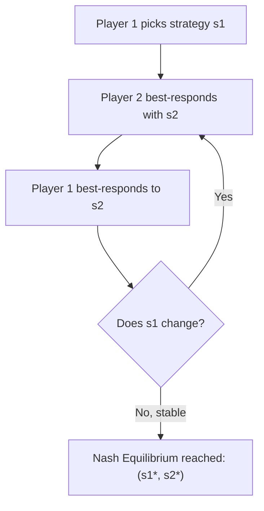

## Defining Nash Equilibrium

### Overview

A **Nash Equilibrium (NE)** is a solution concept in non-cooperative game theory named after John Forbes Nash Jr., who established its existence for finite games in his 1950 and 1951 papers. It describes a stable state of a game in which no player can improve their own payoff by unilaterally changing their strategy, given the strategies chosen by all other players.

The concept formalizes a notion of mutual best response: every player's strategy is optimal against what everyone else is doing, so no single player has an incentive to deviate.

### Formal Definition

Consider a game in **normal form** (strategic form) defined by the tuple $G = (N, S, u)$, where:

- $N = \{1, 2, \dots, n\}$ is the set of players
- $S_i$ is the strategy set available to player $i$, and $S = S_1 \times S_2 \times \cdots \times S_n$ is the set of strategy profiles
- $u_i: S \rightarrow \mathbb{R}$ is the payoff (utility) function for player $i$

A strategy profile $s^* = (s_1^*, s_2^*, \dots, s_n^*) \in S$ is a **Nash Equilibrium** if, for every player $i$ and every alternative strategy $s_i \in S_i$:

$$u_i(s_i^*, s_{-i}^*) \geq u_i(s_i, s_{-i}^*)$$

Here, $s_{-i}^*$ denotes the strategies of all players other than $i$. In words: given what everyone else is doing, no player $i$ can strictly increase their payoff by switching from $s_i^*$ to any other strategy $s_i$.

If the inequality above holds strictly (i.e., $u_i(s_i^*, s_{-i}^*) > u_i(s_i, s_{-i}^*)$ for all $s_i \neq s_i^*$), the equilibrium is called a **strict Nash Equilibrium**. If ties are allowed (as in the definition above), it is a **weak (non-strict) Nash Equilibrium**.

### Intuition: Mutual Best Response

Each player's strategy in a Nash Equilibrium is a **best response** to the strategies of all other players. Define the best response correspondence for player $i$:

$$BR_i(s_{-i}) = \{ s_i \in S_i : u_i(s_i, s_{-i}) \geq u_i(s_i', s_{-i}) \; \forall s_i' \in S_i \}$$

A strategy profile $s^*$ is a Nash Equilibrium if and only if:

$$s_i^* \in BR_i(s_{-i}^*) \quad \text{for all } i \in N$$

This is a **fixed point** condition — each player's strategy is simultaneously a best response to everyone else's, so the system of mutual responses is self-consistent and stable.

### Pure vs. Mixed Strategy Equilibria

- A **pure-strategy Nash Equilibrium** is one where every player selects a single deterministic strategy with certainty.
- A **mixed-strategy Nash Equilibrium** allows players to randomize over their available pure strategies according to a probability distribution. If $\sigma_i$ is a probability distribution over $S_i$, the equilibrium condition becomes:

$$u_i(\sigma_i^*, \sigma_{-i}^*) \geq u_i(\sigma_i, \sigma_{-i}^*) \quad \forall \sigma_i \in \Delta(S_i)$$

where $\Delta(S_i)$ is the set of all probability distributions over $S_i$, and $u_i$ is extended to expected utility over mixed profiles.

Not every finite game has a pure-strategy NE (e.g., Matching Pennies), but Nash proved that **every finite game with a finite number of players and finite strategy sets has at least one Nash Equilibrium**, possibly in mixed strategies.

### Worked Example: Prisoner's Dilemma

Two suspects are interrogated separately. Each can **Cooperate (C)** (stay silent) or **Defect (D)** (betray the other). Payoffs represent years of freedom lost (lower magnitude of loss is better; here shown as negative years, so higher numbers are better):

| Player 1 \ Player 2 | C | D |
| --- | --- | --- |
| **C** | $-1, -1$ | $-3, 0$ |
| **D** | $0, -3$ | $-2, -2$ |

**Finding the equilibrium:**

- If Player 2 plays $C$: Player 1 prefers $D$ ($0 > -1$)
- If Player 2 plays $D$: Player 1 prefers $D$ ($-2 > -3$)
- $D$ strictly dominates $C$ for Player 1. By symmetry, the same holds for Player 2.

The unique Nash Equilibrium is $(D, D)$ with payoff $(-2, -2)$, even though $(C, C)$ yielding $(-1, -1)$ is **Pareto superior** for both players. This illustrates a key insight: **Nash Equilibrium does not require efficiency or social optimality** — it only requires individual stability against unilateral deviation.

### Worked Example: Matching Pennies (Mixed Strategy)

A zero-sum game: each player shows Heads (H) or Tails (T). Player 1 wins if they match; Player 2 wins if they don't.

| P1 \ P2 | H | T |
| --- | --- | --- |
| **H** | $1, -1$ | $-1, 1$ |
| **T** | $-1, 1$ | $1, -1$ |

No pure-strategy NE exists here: for any pure profile, the losing player can flip their choice and win. The unique Nash Equilibrium is in mixed strategies, where each player plays $H$ and $T$ each with probability $0.5$. This makes the opponent **indifferent** between their own choices, which is the defining feature of a proper mixed-strategy equilibrium — each pure strategy in the support must yield equal expected payoff.

### Diagram: Best Response Convergence

### Existence: Nash's Theorem

**Theorem (Nash, 1950):** Every finite strategic-form game with a finite number of players, each having a finite set of pure strategies, possesses at least one Nash Equilibrium, possibly involving mixed strategies.

**Proof sketch (via Kakutani's Fixed-Point Theorem):**

1. Define the best-response correspondence $BR: \Delta(S) \to \Delta(S)$ mapping each mixed strategy profile to the product of each player's best-response sets.
2. $\Delta(S)$ (the space of mixed strategy profiles) is a non-empty, compact, convex subset of Euclidean space.
3. $BR$ is shown to be non-empty, convex-valued, and to have a closed graph (upper hemicontinuous).
4. Kakutani's Fixed-Point Theorem guarantees a fixed point $\sigma^*$ such that $\sigma^* \in BR(\sigma^*)$.
5. This fixed point is, by construction, a Nash Equilibrium.

This proof establishes **existence** but says nothing about **uniqueness** — many games have multiple Nash Equilibria (e.g., coordination games), and finding all of them or selecting among them is a separate problem addressed by **equilibrium refinement** concepts (e.g., subgame perfection, trembling-hand perfection).

### Key Points

- Nash Equilibrium is a profile of strategies where each strategy is a best response to the others; no player benefits from unilaterally deviating.
- It does not require cooperation, communication, or joint optimality — it is defined purely in terms of individual incentive compatibility.
- Every finite game has at least one Nash Equilibrium in mixed strategies (Nash's existence theorem).
- A game may have zero pure-strategy equilibria, exactly one, or multiple equilibria (pure and/or mixed).
- Nash Equilibria can be Pareto-inefficient, as demonstrated by the Prisoner's Dilemma.
- [Inference] The computational difficulty of finding a Nash Equilibrium in general games is significant: computing a Nash Equilibrium for general finite games is known to be PPAD-complete, meaning no efficient (polynomial-time) algorithm is currently known for the general case, though this depends on complexity-theoretic assumptions that remain areas of active research.

### Common Pitfalls

- **Confusing NE with Pareto optimality:** An equilibrium need not maximize joint welfare (see Prisoner's Dilemma).
- **Assuming uniqueness:** Many games (e.g., Battle of the Sexes, coordination games) have multiple equilibria, and the theory alone does not predict which one players will reach without additional assumptions (focal points, learning dynamics, communication).
- **Ignoring mixed strategies:** Searching only for pure-strategy equilibria can incorrectly conclude "no equilibrium exists" when a mixed one does.
- **Static vs. dynamic games:** The base Nash Equilibrium concept applies to simultaneous-move, one-shot games. Sequential/extensive-form games require refinements like **Subgame Perfect Nash Equilibrium (SPNE)** to rule out non-credible threats.

### Related Topics

- Best Response Functions and Correspondences
- Dominant and Dominated Strategies
- Mixed Strategy Equilibria and Indifference Conditions
- Existence Proofs: Kakutani's and Brouwer's Fixed-Point Theorems
- Multiple Equilibria and Equilibrium Selection (Focal Points, Schelling Points)
- Subgame Perfect Nash Equilibrium (Extensive-Form Games)
- Bayesian Nash Equilibrium (Games of Incomplete Information)
- Correlated Equilibrium
- Pareto Efficiency vs. Nash Equilibrium
- Computational Complexity of Equilibrium Computation (PPAD)