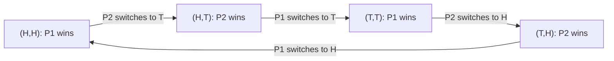

## Pure Strategy Nash Equilibrium

### Overview

A **Pure Strategy Nash Equilibrium (PSNE)** is a Nash Equilibrium in which every player commits to a single, deterministic strategy with probability 1, rather than randomizing across multiple strategies. It is the simplest and most intuitive form of Nash Equilibrium: a specific action profile where no player regrets their choice given what everyone else chose.

### Formal Definition

Given a normal-form game $G = (N, S, u)$ with players $N$, pure strategy sets $S_i$ for each player $i$, and payoff functions $u_i$, a strategy profile $s^* = (s_1^*, \dots, s_n^*) \in S$ is a **Pure Strategy Nash Equilibrium** if for every player $i \in N$ and every alternative pure strategy $s_i \in S_i$:

$$u_i(s_i^*, s_{-i}^*) \geq u_i(s_i, s_{-i}^*)$$

The distinguishing feature relative to the general NE definition is that $s_i^*$ and all deviations $s_i$ are drawn strictly from the **pure** (non-randomized) strategy set $S_i$, not from $\Delta(S_i)$, the set of probability distributions over $S_i$.

Equivalently, $s^*$ is a PSNE if and only if every $s_i^*$ lies in player $i$'s **best response set**:

$$s_i^* \in \arg\max_{s_i \in S_i} u_i(s_i, s_{-i}^*) \quad \forall i \in N$$

### Method: The Best Response / Underlining Technique

The standard manual technique for finding all PSNE in a finite game presented as a payoff matrix:

1. For each column (each strategy of Player 2), identify Player 1's best response(s) — the row(s) giving Player 1 the highest payoff — and underline/mark that payoff.
2. For each row (each strategy of Player 1), identify Player 2's best response(s) — the column(s) giving Player 2 the highest payoff — and underline/mark that payoff.
3. Any cell where **both** payoffs are marked (i.e., both players are simultaneously best-responding to each other) is a Pure Strategy Nash Equilibrium.

This method generalizes directly to $n$-player games by checking, for each player and each strategy profile of the others, whether the player's chosen strategy is payoff-maximizing.

### Worked Example: Coordination Game

Two firms choose which technology standard to adopt: Standard A or Standard B. Compatibility yields higher payoffs for both.

| Firm 1 \ Firm 2 | A | B |
| --- | --- | --- |
| **A** | $\underline{2}, \underline{2}$ | $0, 0$ |
| **B** | $0, 0$ | $\underline{3}, \underline{3}$ |

Applying the best-response method:

- If Firm 2 plays $A$: Firm 1's best response is $A$ (payoff 2 vs. 0)
- If Firm 2 plays $B$: Firm 1's best response is $B$ (payoff 3 vs. 0)
- If Firm 1 plays $A$: Firm 2's best response is $A$
- If Firm 1 plays $B$: Firm 2's best response is $B$

Both $(A, A)$ and $(B, B)$ have both payoffs marked — **two Pure Strategy Nash Equilibria exist**. This is characteristic of **coordination games**: multiple self-enforcing outcomes exist, and the theory alone does not predict which one players converge on without additional context (history, communication, focal points).

### Worked Example: Battle of the Sexes

A classic asymmetric coordination game. A couple wants to attend an event together but has different preferences: Player 1 prefers Opera (O), Player 2 prefers Football (F). Both prefer being together over being apart.

| P1 \ P2 | O | F |
| --- | --- | --- |
| **O** | $\underline{2}, \underline{1}$ | $0, 0$ |
| **F** | $0, 0$ | $\underline{1}, \underline{2}$ |

Two PSNE exist: $(O, O)$ and $(F, F)$. Neither is Pareto-dominant over the other from a purely individual standpoint, since each player prefers a different one of the two equilibria — illustrating that multiple PSNE can also embed a **distributional conflict**, not just a pure coordination problem.

### When No PSNE Exists

Some games have **zero** pure-strategy equilibria — a mixed-strategy equilibrium is required instead. The canonical example is **Matching Pennies**:

| P1 \ P2 | H | T |
| --- | --- | --- |
| **H** | $\underline{1}, -1$ | $-1, \underline{1}$ |
| **T** | $-1, \underline{1}$ | $\underline{1}, -1$ |

Checking every cell: in each of the four cells, exactly one player's payoff is underlined, never both simultaneously. No cell is a mutual best response, so **no PSNE exists** in this game. This is typical of strictly competitive (zero-sum) games with cyclical best responses.

### Diagram: Best Response Cycle (No PSNE Case)

The cycle never terminates at a stable cell, confirming the absence of a pure-strategy equilibrium — a hallmark of games requiring mixed strategies.

### Existence Conditions

Unlike general Nash Equilibria (guaranteed to exist in mixed strategies for all finite games by Nash's theorem), **Pure Strategy Nash Equilibria are not guaranteed to exist**. Known sufficient conditions for PSNE existence include:

- **Dominant strategy games:** If every player has a (weakly) dominant strategy, the profile of dominant strategies is a PSNE (e.g., Prisoner's Dilemma).
- **Supermodular games:** Games with strategic complementarities and compact lattice strategy spaces (per Topkis' theorem) guarantee PSNE existence.
- **Finite potential games:** Games that admit a potential function $\Phi$ such that changes in any player's payoff from a unilateral deviation match changes in $\Phi$ are guaranteed to have a PSNE (the maximizer of $\Phi$ over a finite strategy space).
- **Continuous games with quasi-concave payoffs:** In continuous strategy spaces, if strategy sets are compact and convex and payoff functions are continuous and quasi-concave in own strategy, a PSNE exists (Debreu-Glicksberg-Fan theorem).

### Key Points

- A PSNE is a strategy profile where every player deterministically plays one strategy, and no player can gain by unilaterally switching to a different pure strategy.
- Found via the best-response (underlining) method: a cell is a PSNE if and only if it is a best response for every player simultaneously.
- A game may have **zero, one, or multiple** PSNE.
- Multiple PSNE are common in coordination-type games; conflicting-preference variants (e.g., Battle of the Sexes) still yield multiple PSNE despite added distributional tension.
- Zero PSNE typically arises in games with cyclical, non-transitive best responses (e.g., Matching Pennies), which instead require a mixed-strategy equilibrium.
- [Inference] Whether a given large or complex game possesses a PSNE without exhaustive search often depends on structural properties (dominance, supermodularity, potential function existence); absent such structure, determining PSNE existence generally requires checking the best-response condition directly across the strategy space.

### Common Pitfalls

- **Assuming a PSNE always exists:** Not true in general — always verify via best-response analysis or check for structural guarantees (dominance, potential games) rather than assuming one.
- **Stopping after finding one PSNE:** Games can have multiple; the underlining method must be applied exhaustively across all cells to find all PSNE.
- **Confusing "best" with "unique best":** When a player is indifferent between two strategies given the others' choices, both should be marked as best responses — this can create additional PSNE in the same or adjacent cells.
- **Treating Battle-of-the-Sexes-style outcomes as resolved by the model:** The base PSNE concept identifies *which* profiles are equilibria, not *which one* rational players will actually reach; equilibrium selection requires additional theory (focal points, bargaining, repeated-game dynamics).

### Related Topics

- Mixed Strategy Nash Equilibrium
- Best Response Functions and the Underlining/Marking Method
- Dominant and Dominated Strategies
- Coordination Games and Equilibrium Selection
- Potential Games and Existence Guarantees
- Supermodular Games and Strategic Complementarities
- Battle of the Sexes and Anti-Coordination Games
- Zero-Sum Games and Non-Existence of PSNE
- Subgame Perfect Equilibrium (extending PSNE to extensive-form games)