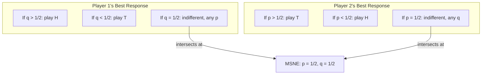

## Mixed Strategy Nash Equilibrium

### Overview

A **Mixed Strategy Nash Equilibrium (MSNE)** is a Nash Equilibrium in which one or more players randomize over their available pure strategies according to a specific probability distribution, rather than committing deterministically to a single action. MSNE generalizes the Nash Equilibrium concept to guarantee existence in games where no Pure Strategy Nash Equilibrium exists, and formalizes strategic unpredictability as a rational, calculated response rather than arbitrary behavior.

### Formal Definition

Given a normal-form game $G = (N, S, u)$, a **mixed strategy** for player $i$ is a probability distribution $\sigma_i \in \Delta(S_i)$ over their pure strategy set $S_i$, where $\Delta(S_i)$ denotes the set of all probability distributions over $S_i$. For a finite strategy set $S_i = \{s_{i1}, \dots, s_{ik}\}$:

$$\sigma_i = (p_1, p_2, \dots, p_k), \quad p_j \geq 0, \quad \sum_{j=1}^{k} p_j = 1$$

A mixed strategy profile $\sigma = (\sigma_1, \dots, \sigma_n)$ constitutes a **Mixed Strategy Nash Equilibrium** if, for every player $i$:

$$u_i(\sigma_i^*, \sigma_{-i}^*) \geq u_i(\sigma_i, \sigma_{-i}^*) \quad \forall \sigma_i \in \Delta(S_i)$$

where $u_i$ is the **expected utility** under the mixed profile:

$$u_i(\sigma) = \sum_{s \in S} \left( \prod_{j \in N} \sigma_j(s_j) \right) u_i(s)$$

A pure strategy is treated as a degenerate mixed strategy (probability 1 on one action), so PSNE is a special case of MSNE.

### The Indifference Principle

The central technique for computing MSNE rests on the **indifference condition**: in a mixed-strategy equilibrium, every pure strategy in a player's support (the set of strategies played with positive probability) must yield the **same expected payoff** against the opponents' equilibrium mixture. If one pure strategy yielded a strictly higher expected payoff than another, a rational player would place all probability on the higher-payoff strategy rather than randomizing, contradicting the mixed equilibrium.

Formally, if $\sigma_i^*$ has support $\text{supp}(\sigma_i^*) = \{s_i^1, s_i^2\}$, then:

$$u_i(s_i^1, \sigma_{-i}^*) = u_i(s_i^2, \sigma_{-i}^*)$$

This condition is what pins down the equilibrium probabilities: each player's mixing probabilities are chosen to make the **other** player indifferent, not to maximize their own payoff directly.

### Worked Example: Matching Pennies

Recall the zero-sum coordination-avoidance game:

| P1 \ P2 | H | T |
| --- | --- | --- |
| **H** | $1, -1$ | $-1, 1$ |
| **T** | $-1, 1$ | $1, -1$ |

Let Player 2 play $H$ with probability $q$ and $T$ with probability $1-q$. For Player 1 to be willing to mix, they must be indifferent between $H$ and $T$:

$$u_1(H) = q(1) + (1-q)(-1) = 2q - 1$$

$$u_1(T) = q(-1) + (1-q)(1) = 1 - 2q$$

Setting $u_1(H) = u_1(T)$:

$$2q - 1 = 1 - 2q \implies 4q = 2 \implies q = \frac{1}{2}$$

By the symmetric argument (Player 1's probability $p$ of playing $H$ must make Player 2 indifferent), $p = \frac{1}{2}$ as well. The unique MSNE is $\sigma_1^* = \sigma_2^* = \left(\frac{1}{2}, \frac{1}{2}\right)$, with expected payoff $0$ to both players.

### Worked Example: Battle of the Sexes (Mixed Equilibrium)

Beyond the two PSNE $(O,O)$ and $(F,F)$, Battle of the Sexes also has a mixed-strategy equilibrium:

| P1 \ P2 | O | F |
| --- | --- | --- |
| **O** | $2, 1$ | $0, 0$ |
| **F** | $0, 0$ | $1, 2$ |

Let Player 2 play $O$ with probability $q$. Player 1's indifference condition:

$$u_1(O) = 2q, \qquad u_1(F) = 1(1-q)$$

$$2q = 1 - q \implies q = \frac{1}{3}$$

Let Player 1 play $O$ with probability $p$. Player 2's indifference condition:

$$u_2(O) = 1 \cdot p, \qquad u_2(F) = 2(1-p)$$

$$p = 2 - 2p \implies p = \frac{2}{3}$$

The mixed MSNE is $\sigma_1^* = \left(\frac{2}{3}, \frac{1}{3}\right)$, $\sigma_2^* = \left(\frac{1}{3}, \frac{2}{3}\right)$, giving expected payoff $\frac{2}{3}$ to each player — lower than either pure equilibrium's payoff to the favored player, illustrating that mixed equilibria are often **payoff-dominated** by pure equilibria when both exist, which is one reason pure equilibria are often treated as more behaviorally plausible focal points when available.

### General Solution Procedure (2×2 Games)

1. Identify whether a PSNE exists (via underlining/best-response method); if the game has no PSNE, a fully mixed MSNE is guaranteed by Nash's existence theorem.
2. Assign a mixing probability variable to each player over their two strategies (e.g., $p$ and $1-p$ for Player 1; $q$ and $1-q$ for Player 2).
3. Write each player's expected payoff for each of their pure strategies as a function of the *opponent's* mixing probability.
4. Set the opponent-facing expected payoffs equal (indifference condition) and solve for the equilibrium probability.
5. Repeat symmetrically for the other player.
6. Verify $0 \leq p, q \leq 1$; if a computed probability falls outside $[0,1]$, no fully mixed equilibrium of that support exists and the analysis must consider other supports (including pure equilibria).

For games with more than two strategies per player, the same indifference logic applies but requires solving a system of equations over the support, and determining the correct support (which strategies have positive probability) becomes a combinatorial step — often approached via **support enumeration** or algorithms such as the **Lemke-Howson algorithm** for two-player games.

### Diagram: Best Response Correspondences and Mixed Equilibrium

### Interpreting Mixed Strategies

Two standard interpretations exist in the literature:

- **Deliberate randomization:** Each player literally randomizes using an explicit randomizing device (e.g., a coin flip) to select their action, particularly relevant in adversarial/competitive settings (sports, security, poker) where predictability is directly exploitable.
- **Purification / population interpretation** (Harsanyi, 1973): In games with slight, privately-known payoff perturbations across a large population of players, the mixed-strategy probabilities can be reinterpreted as the *fraction* of a population playing each pure strategy, or as the *probability* that a given type of player, facing idiosyncratic private information, finds one pure strategy optimal. This avoids the philosophical difficulty of assuming players literally randomize.

### Existence Guarantee

Nash's 1950 theorem guarantees that **every finite game (finite players, finite pure strategies per player) has at least one Nash Equilibrium in mixed strategies**, proven via Kakutani's fixed-point theorem applied to the best-response correspondence over the compact, convex space of mixed strategy profiles $\Delta(S_1) \times \cdots \times \Delta(S_n)$. This existence guarantee does **not** extend automatically to games with infinite or non-compact strategy spaces without additional continuity/compactness conditions (see Debreu-Glicksberg-Fan for the continuous-game analogue).

### Key Points

- A mixed strategy is a probability distribution over a player's pure strategies; MSNE requires each player's mixture to be a best response to the others' mixtures.
- The indifference principle is the core computational tool: in equilibrium, every pure strategy in a player's support must yield identical expected payoff against the opponent's mixture.
- Mixing probabilities are set to make the **opponent** indifferent, not to directly maximize one's own payoff — a frequently misunderstood aspect of the theory.
- MSNE guarantees existence in every finite game, covering cases (e.g., Matching Pennies) where no PSNE exists.
- A single game can have multiple equilibria of different types simultaneously (e.g., Battle of the Sexes has two PSNE and one fully mixed MSNE).
- [Inference] Mixed equilibria are sometimes considered less behaviorally robust as predictions of real play compared to pure equilibria, particularly when a Pareto-superior pure equilibrium coexists, though this remains a subject of ongoing experimental and behavioral game theory research rather than settled formal theory.

### Common Pitfalls

- **Computing mixing probabilities to maximize one's own payoff:** This is a common student error. Correct procedure sets probabilities to make the *opponent* indifferent, since a rational player is themselves indifferent across their support strategies at equilibrium (otherwise they wouldn't be willing to mix).
- **Forgetting to verify probabilities lie in $[0,1]$:** Solving the indifference equations can yield values outside the valid probability range, indicating that assumed support is incorrect.
- **Assuming MSNE payoffs match the best PSNE payoff:** Mixed equilibria frequently yield strictly lower expected payoffs than an available pure equilibrium.
- **Ignoring partially mixed equilibria in larger games:** In games with more than two strategies, equilibria may involve some players mixing over a subset of their strategies while others play pure strategies — full support enumeration is required to find all equilibria.

### Related Topics

- Pure Strategy Nash Equilibrium
- Best Response Correspondences and Fixed-Point Existence
- Zero-Sum Games and Minimax Theorem
- Lemke-Howson Algorithm and Equilibrium Computation
- Harsanyi's Purification Theorem and Bayesian Interpretations
- Correlated Equilibrium
- Evolutionary Game Theory and Evolutionarily Stable Strategies (ESS)
- Repeated Games and Mixed-Strategy Reputation Effects
- Behavioral Game Theory: Experimental Tests of Mixed Equilibrium Predictions