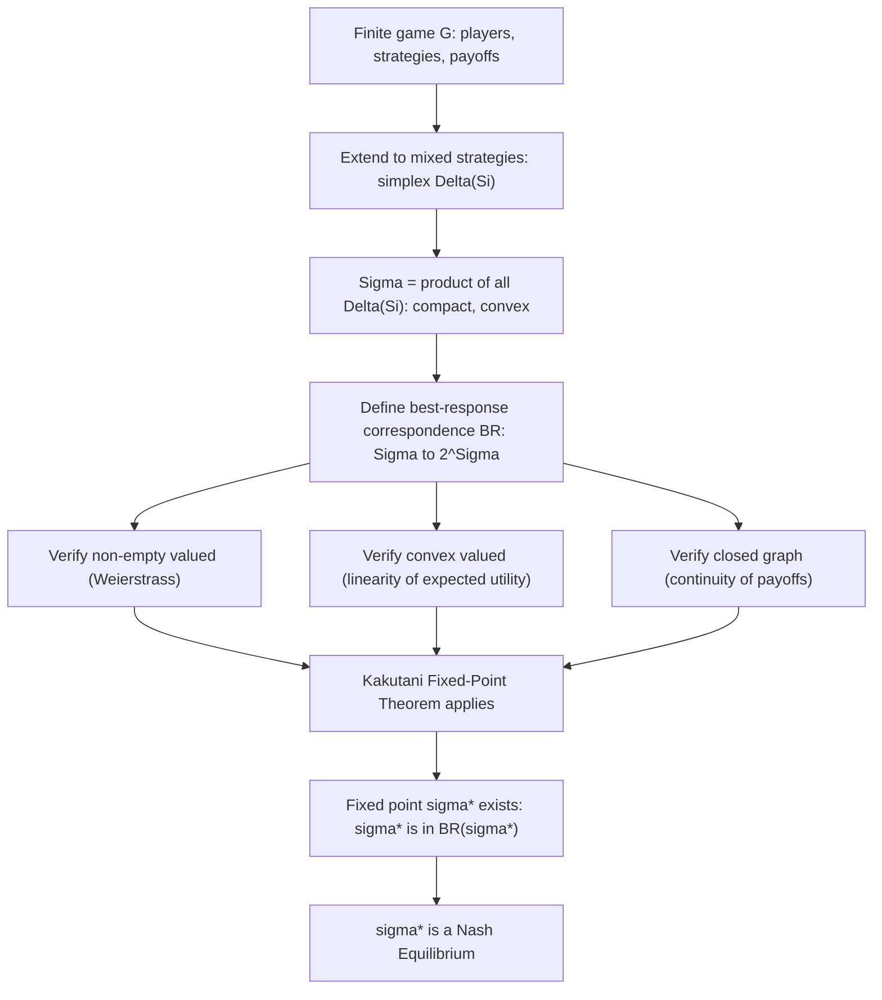

## Existence Theorems for Nash Equilibrium

### Overview

**Existence theorems** in game theory establish the mathematical conditions under which a Nash Equilibrium is guaranteed to exist for a given class of games. Because Nash Equilibrium is defined as a fixed point of the best-response correspondence, existence results rely on **fixed-point theorems** from topology — primarily Kakutani's and Brouwer's theorems for finite games, and their generalizations (Debreu-Glicksberg-Fan, Kakutani-Fan-Glicksberg) for games with continuous or infinite strategy spaces.

### Nash's Existence Theorem (1950)

**Theorem:** Every finite strategic-form game — with a finite number of players $N$, each having a finite pure strategy set $S_i$ — has at least one Nash Equilibrium, possibly requiring mixed strategies.

This is the foundational result of the field, published by John Nash in his 1950 PNAS paper and expanded in his 1951 *Annals of Mathematics* paper "Non-Cooperative Games." It guarantees existence unconditionally for any finite game, regardless of the specific payoff structure, by extending the strategy space from pure strategies $S_i$ to mixed strategies $\Delta(S_i)$.

### Proof via Kakutani's Fixed-Point Theorem

**Kakutani's Fixed-Point Theorem** states: Let $X$ be a non-empty, compact, convex subset of $\mathbb{R}^n$. Let $\phi: X \to 2^X$ be a set-valued correspondence such that:

1. $\phi(x)$ is non-empty for all $x \in X$
2. $\phi(x)$ is convex for all $x \in X$
3. $\phi$ has a **closed graph** (i.e., $\phi$ is upper hemicontinuous)

Then there exists $x^* \in X$ such that $x^* \in \phi(x^*)$.

**Application to Nash Equilibrium existence:**

1. **Construct the space:** Let $\Sigma = \Delta(S_1) \times \Delta(S_2) \times \cdots \times \Delta(S_n)$, the product of each player's mixed strategy simplex. Since each $S_i$ is finite, each $\Delta(S_i)$ is a compact, convex simplex in $\mathbb{R}^{|S_i|}$, so $\Sigma$ is compact and convex.
2. **Construct the correspondence:** Define the joint best-response correspondence $BR: \Sigma \to 2^\Sigma$ by:

   $$BR(\sigma) = BR_1(\sigma_{-1}) \times BR_2(\sigma_{-2}) \times \cdots \times BR_n(\sigma_{-n})$$

   where $BR_i(\sigma_{-i}) = \{\sigma_i \in \Delta(S_i) : u_i(\sigma_i, \sigma_{-i}) \geq u_i(\sigma_i', \sigma_{-i}) \; \forall \sigma_i' \in \Delta(S_i)\}$.
3. **Verify the three Kakutani conditions:**
   - **Non-empty:** Since $u_i$ is linear (hence continuous) in $\sigma_i$ and $\Delta(S_i)$ is compact, the Weierstrass Extreme Value Theorem guarantees a maximizer exists, so $BR_i(\sigma_{-i})$ is always non-empty.
   - **Convex-valued:** Because expected utility $u_i(\sigma_i, \sigma_{-i})$ is **linear** (hence both concave and convex) in $\sigma_i$, the set of maximizers $BR_i(\sigma_{-i})$ is a convex set (any mixture of two best responses is itself a best response).
   - **Closed graph:** $u_i$ is continuous in $(\sigma_i, \sigma_{-i})$ since it is a multilinear (polynomial) function of the probabilities, which ensures the best-response correspondence is upper hemicontinuous.
4. **Apply Kakutani:** Since all three conditions hold, there exists $\sigma^* \in \Sigma$ such that $\sigma^* \in BR(\sigma^*)$, i.e., $\sigma_i^* \in BR_i(\sigma_{-i}^*)$ for every player $i$. By definition, this fixed point **is** a Nash Equilibrium.

### Diagram: Structure of the Existence Proof

### Brouwer's Fixed-Point Theorem as an Alternative Route

**Brouwer's Fixed-Point Theorem** (the simpler, function-based precursor to Kakutani's correspondence-based version) states: any continuous function $f: X \to X$ on a non-empty, compact, convex set $X$ has a fixed point $x^* = f(x^*)$.

Nash's original 1951 proof (and subsequent alternative proofs) can also be constructed using Brouwer's theorem directly, by building an explicit continuous function (rather than a correspondence) that maps each strategy profile to an adjusted profile incorporating "gains from deviating." Nikaidô and Isoda (1955) formalized a widely used version of this approach. This route avoids the need for convex-valued correspondences but requires more care in explicitly constructing the continuous best-response-adjustment map, typically of the form:

$$f_i^j(\sigma) = \frac{\sigma_i^j + \max(0, g_i^j(\sigma))}{1 + \sum_k \max(0, g_i^k(\sigma))}$$

where $g_i^j(\sigma)$ represents the gain to player $i$ from shifting probability toward pure strategy $j$. Fixed points of $f$ coincide with Nash Equilibria.

### Extensions to Infinite and Continuous Games

Nash's original theorem applies only to **finite** games. Several generalizations extend existence to broader settings:

**Debreu-Glicksberg-Fan Theorem (1952, independently by Debreu, Glicksberg, and Fan):** For games with:

- Compact, convex strategy sets $S_i \subseteq \mathbb{R}^m$ (not necessarily finite — e.g., continuous action spaces like price or quantity choices)
- Continuous payoff functions $u_i$
- Payoff functions **quasi-concave** in the player's own strategy $s_i$ (holding others fixed)

a **pure-strategy** Nash Equilibrium is guaranteed to exist — without needing to extend to mixed strategies. This result underlies existence proofs in classical economic models such as Cournot competition (quantity choice) and Bertrand competition with certain cost structures, where strategy spaces are continuous intervals.

**Glicksberg's Theorem:** Generalizes Kakutani's approach to infinite-dimensional strategy spaces (compact metric spaces) using the **Kakutani-Fan-Glicksberg fixed-point theorem**, guaranteeing mixed-strategy equilibrium existence even when pure strategy spaces are infinite (but compact), relaxing the quasi-concavity requirement at the cost of moving to mixed strategies over the strategy space.

### Why Each Condition Matters (Necessity Illustrations)

- **Compactness:** Without compactness, a maximizer may not exist (e.g., an open, unbounded strategy space where payoff increases without limit has no best response, breaking non-emptiness of $BR$).
- **Convexity:** Without convex strategy sets/mixed extension, the best-response correspondence can fail to be convex-valued, and Kakutani's theorem does not apply — this is precisely why **pure**-strategy existence fails in games like Matching Pennies (a discrete, non-convex strategy set), motivating the extension to $\Delta(S_i)$.
- **Continuity of payoffs:** Discontinuous payoff functions can break upper hemicontinuity of the best-response correspondence, and equilibrium existence can fail even in seemingly well-behaved continuous strategy spaces (a classic pathological example being certain discontinuous-payoff Bertrand pricing games without appropriate tie-breaking rules).
- **Quasi-concavity (in the Debreu-Glicksberg-Fan setting):** Ensures the best-response set is convex without needing to mix, since a quasi-concave function's upper-level sets (and hence its arg-max set under linear constraints) are convex.

### Key Points

- Nash's 1950/1951 theorem guarantees at least one Nash Equilibrium (possibly mixed) exists in every finite game — this is unconditional for finite games.
- The standard proof uses Kakutani's Fixed-Point Theorem applied to the best-response correspondence over the compact, convex space of mixed strategy profiles.
- The three technical conditions verified in the proof — non-emptiness, convex-valuedness, and closed graph (upper hemicontinuity) — map directly onto properties of expected utility: continuity and linearity in own mixed strategy.
- Extending strategy spaces to mixed strategies is precisely what restores convexity of the best-response correspondence, which pure discrete strategy sets lack.
- For continuous-strategy games (e.g., Cournot, Bertrand), the Debreu-Glicksberg-Fan theorem gives **pure**-strategy existence under compactness, continuity, and own-strategy quasi-concavity, without needing to invoke mixed strategies.
- [Inference] Existence proofs establish that an equilibrium exists but provide no general algorithm for finding it efficiently; this gap connects to the computational complexity of equilibrium computation, which is a separate area of study (e.g., results characterizing Nash Equilibrium computation as PPAD-complete for general finite games).

### Common Pitfalls

- **Conflating existence with uniqueness:** Nash's theorem guarantees at least one equilibrium exists, not that it is unique — games frequently have multiple equilibria.
- **Assuming pure-strategy existence in finite games:** Nash's finite-game theorem guarantees a mixed-strategy equilibrium; pure-strategy existence in finite games requires additional structure (dominance, potential games, supermodularity), as covered under Pure Strategy Nash Equilibrium.
- **Misapplying Debreu-Glicksberg-Fan without checking quasi-concavity:** Continuous, compact, convex strategy spaces alone are insufficient for pure-strategy existence in continuous games — payoff quasi-concavity in one's own strategy is a necessary additional condition, and its failure (e.g., certain discontinuous-demand Bertrand setups) can eliminate pure-strategy equilibria entirely.
- **Treating the fixed-point proof as constructive:** The Kakutani-based proof is an *existence* proof, not a computational procedure; locating the equilibrium in practice requires separate algorithmic methods (e.g., Lemke-Howson for two-player games, or support enumeration).

### Related Topics

- Pure Strategy Nash Equilibrium and Mixed Strategy Nash Equilibrium
- Kakutani's Fixed-Point Theorem and Brouwer's Fixed-Point Theorem
- Debreu-Glicksberg-Fan Theorem (Continuous Games)
- Cournot and Bertrand Competition as Continuous-Strategy Applications
- Computational Complexity of Nash Equilibrium (PPAD-Completeness)
- Lemke-Howson Algorithm
- Potential Games and Supermodular Games (Structural Existence Guarantees)
- Upper Hemicontinuity and Correspondence Theory in Optimization