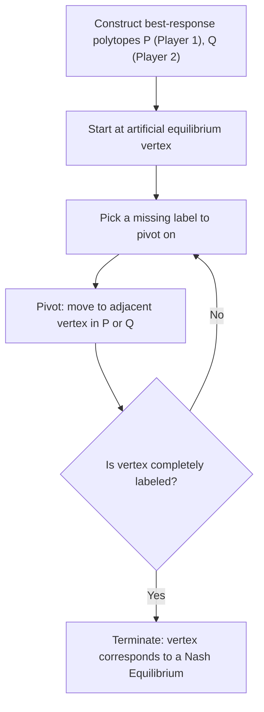

## Computing Nash Equilibria

### Overview

**Computing Nash Equilibria** concerns the algorithmic methods for actually locating equilibrium strategy profiles, as distinct from proving their existence. While Nash's theorem guarantees existence for finite games, it provides no constructive procedure. This has motivated a substantial body of algorithms ranging from manual techniques for small games to complexity-theoretic results establishing fundamental limits on efficient computation for larger ones.

### Manual Methods for Small Games

**Best Response / Underlining Method (Pure Strategies):** For finite games presented as payoff matrices, systematically mark each player's best response to every possible strategy of the opponent(s); cells where all players' payoffs are marked simultaneously are PSNE. This is exhaustive but computationally trivial to apply by hand for small ($2\times2$, $2\times3$) games.

**Iterated Elimination of Dominated Strategies (IEDS):** Before searching for equilibria, eliminate strategies that are **strictly dominated** — always yielding a strictly lower payoff than some other strategy, regardless of opponents' choices — since no dominated strategy can appear in any Nash Equilibrium. This reduces the effective size of the game and can sometimes uniquely determine the equilibrium outright (as in the Prisoner's Dilemma, solvable purely by IEDS). Iterated elimination of **weakly** dominated strategies is also used but can eliminate legitimate equilibria and is order-dependent, so it is applied with more caution.

**Indifference/Algebraic Method (Mixed Strategies, 2×2 games):** As covered under Mixed Strategy Nash Equilibrium, set up the indifference equations for each player's mixing probabilities and solve the resulting linear system directly.

### The Support Enumeration Approach

For games larger than $2\times2$, the standard exact method is **support enumeration**:

1. Choose a candidate **support** for each player — a subset of pure strategies assumed to be played with strictly positive probability.
2. Within the assumed support, write the indifference equations (every pure strategy in the support must yield equal expected payoff against the opponent's mixture) as a linear system.
3. Solve for the mixing probabilities; verify all probabilities are non-negative and sum to 1.
4. Verify no strategy **outside** the assumed support yields a strictly higher payoff than the (common) in-support payoff — this is the deviation-check step, since otherwise a player would prefer to deviate outside the assumed support.
5. Repeat across all combinatorially possible support pairs (for two players) or support tuples (for $n$ players) until all equilibria are found or the relevant ones are located.

This is exact and complete but scales combinatorially: for a two-player game with $m$ and $n$ pure strategies respectively, there are $(2^m - 1)(2^n - 1)$ possible support pairs to check in the worst case.

### The Lemke-Howson Algorithm

The **Lemke-Howson algorithm** (1964) is the classical constructive method for finding **one** Nash Equilibrium in a two-player, general-sum finite game (a "bimatrix game").

**Core idea:** The algorithm reformulates equilibrium-finding as a problem of following a path along the vertices of two polytopes defined by the players' payoff matrices, using a **pivoting** procedure structurally similar to the simplex method for linear programming.

**High-level mechanics:**

1. Construct best-response polytopes $P$ and $Q$ for the two players, where vertices correspond to strategies (pure or on the boundary of mixed supports) that are undominated best responses.
2. Start at a designated "artificial equilibrium" (fully labeled degenerate vertex).
3. Perform a sequence of pivots, alternating between the two polytopes, following a specific labeling rule (each pure strategy of each player is a "label"; a vertex is a Nash Equilibrium precisely when it is **completely labeled** — every label 0 through $m+n-1$ appears).
4. The path is guaranteed to terminate at a **second** completely labeled vertex distinct from the start, which corresponds to a genuine Nash Equilibrium (this termination guarantee is itself proven via a parity/index argument related to Sperner's Lemma, the combinatorial backbone underlying Brouwer's fixed-point theorem).

**Properties:**

- Guarantees finding **at least one** Nash Equilibrium for any finite two-player game.
- Does **not** find all equilibria; different starting labels/vertices can yield different equilibria, and finding the complete set generally requires running the algorithm from multiple starting points combined with support enumeration.
- Runs in worst-case exponential time in the size of the game (in the number of strategies), despite typically performing efficiently in practice — this exponential worst case is a known, well-documented property of the pivoting path length in adversarially constructed instances.

### Diagram: Lemke-Howson Path-Following Process

### Computational Complexity: PPAD-Completeness

A landmark result in algorithmic game theory (Daskalakis, Goldberg, and Papadimitriou, 2006, building on Chen and Deng) established that computing a Nash Equilibrium for **general finite games with three or more players** is **PPAD-complete** ("Polynomial Parity Argument on Directed graphs"), and subsequent work extended PPAD-completeness to the **two-player** case as well.

**What PPAD-completeness implies:**

- PPAD is a complexity class believed to sit strictly between P (efficiently solvable) and NP-complete problems, capturing problems whose solution is guaranteed to exist by a parity/fixed-point argument (like Nash Equilibrium's Sperner's Lemma / Brouwer-based existence proof) but for which no known polynomial-time algorithm exists.
- A PPAD-completeness result means finding a Nash Equilibrium is **"as hard as"** the hardest problems in PPAD; if a polynomial-time algorithm existed for general Nash Equilibrium computation, it would imply a polynomial-time algorithm for all PPAD problems.
- [Inference] Whether PPAD problems admit polynomial-time algorithms in general is an open question in complexity theory (analogous in spirit, though not identical, to the P vs. NP question); consequently, no efficient general-purpose algorithm for finding a single Nash Equilibrium in arbitrary finite games is currently known, and this is believed by most researchers in the field to reflect a genuine computational barrier rather than a temporary gap in algorithm design, though this belief is not a formal proof.
- This hardness result applies to finding **any one** Nash Equilibrium (not a specific "best" one); computing equilibria with additional desirable properties (e.g., welfare-maximizing, or equilibria in the support of a specific strategy set) is generally **at least as hard**, and results such as those on social-welfare-maximizing equilibrium selection are typically NP-hard.

### Special Structure That Restores Tractability

Despite general-case hardness, several important subclasses admit efficient computation:

- **Zero-sum two-player games:** Solvable in polynomial time via **linear programming**, since the minimax theorem (von Neumann) reduces equilibrium computation to a linear program (LP) — one player's maximin strategy is found by an LP whose dual gives the other player's minimax strategy. Standard LP solvers (simplex, interior-point methods) apply directly.
- **Potential games:** Since a potential game's Nash Equilibria coincide with local maxima of a potential function over a finite space, techniques from combinatorial optimization (e.g., local search / best-response dynamics, which is guaranteed to converge in potential games) can be used, though the exact maximization may itself be hard depending on structure.
- **Graphical games with sparse interaction structure:** Games where each player's payoff depends only on a small subset of other players ("neighbors") admit specialized algorithms (e.g., NashProp, based on belief-propagation-style message passing) that exploit the sparsity for improved scalability relative to the dense general case.
- **Symmetric games:** Games where all players share identical strategy sets and payoff structure often admit equilibria restricted to a lower-dimensional symmetric strategy space, reducing computational burden.

### Approximate Computation

Given the hardness of exact computation for general games, **approximate Nash Equilibria** ($\epsilon$-Nash Equilibria) are a widely used relaxation, where each player's strategy is within $\epsilon$ of a best response:

$$u_i(\sigma_i^*, \sigma_{-i}^*) \geq u_i(\sigma_i, \sigma_{-i}^*) - \epsilon \quad \forall \sigma_i \in \Delta(S_i)$$

Polynomial-time algorithms exist for finding $\epsilon$-Nash Equilibria for fixed, non-vanishing $\epsilon$ (e.g., the Tsaknakis-Spirakis algorithm achieves a guaranteed $\epsilon \approx 0.3393$ for two-player games), though achieving arbitrarily small $\epsilon$ in polynomial time remains subject to the same PPAD-hardness barrier.

**Learning-based / dynamic approaches** are also common in practice, particularly in applied and computational settings (including reinforcement-learning-based multi-agent systems):

- **Fictitious play:** Each player best-responds to the empirical historical frequency of opponents' past play; converges to a Nash Equilibrium in specific classes of games (e.g., zero-sum games, certain potential games) but not universally.
- **Regret matching / no-regret dynamics:** Players adjust strategies to minimize cumulative regret; the time-averaged play of no-regret dynamics converges to the (typically larger and more tractable) set of **coarse correlated equilibria**, a relaxation of Nash Equilibrium that is computable in polynomial time even in settings where Nash Equilibrium itself is PPAD-hard.

### Key Points

- No general polynomial-time algorithm is known for computing a Nash Equilibrium in arbitrary finite games; the problem is PPAD-complete for both two-player and $n$-player general-sum games.
- Support enumeration is the standard exact method for small/medium games, but scales combinatorially in the number of strategies.
- The Lemke-Howson algorithm is the classical constructive method for two-player games, guaranteed to find one equilibrium but with worst-case exponential running time.
- Zero-sum two-player games are a crucial tractable exception, solvable in polynomial time via linear programming through the minimax theorem.
- Approximate ($\epsilon$-Nash) equilibria and alternative solution concepts (coarse correlated equilibria via no-regret learning) offer tractable relaxations when exact Nash computation is prohibitively hard.
- [Inference] In applied/engineering contexts (e.g., multi-agent reinforcement learning systems), practitioners frequently target these tractable relaxations (correlated equilibria, approximate equilibria, or empirical convergence of learning dynamics) rather than exact Nash Equilibria, given the general computational hardness result.

### Common Pitfalls

- **Assuming Lemke-Howson finds all equilibria:** It is guaranteed to find only one equilibrium per run; enumerating all equilibria requires multiple runs from different starting labels combined with support enumeration, and even this is not guaranteed to be exhaustive without careful bookkeeping.
- **Applying LP methods outside zero-sum games:** The polynomial-time LP-based approach relies on the minimax theorem, which is specific to zero-sum (strictly competitive) games; general-sum games require different algorithms (Lemke-Howson, support enumeration, or approximation methods).
- **Confusing PPAD-completeness with NP-completeness:** These are distinct complexity classes with different structural properties; PPAD captures problems with a guaranteed-by-parity-argument solution (like Nash Equilibrium), which is a materially different computational landscape than NP-complete decision problems.
- **Treating fictitious play or no-regret dynamics as universally convergent to Nash Equilibrium:** Convergence guarantees for these learning dynamics are limited to specific game classes; in general games they need not converge to a Nash Equilibrium at all, though no-regret dynamics do converge to the (weaker) coarse correlated equilibrium set.

### Related Topics

- Pure Strategy Nash Equilibrium and Mixed Strategy Nash Equilibrium
- Existence Theorems for Nash Equilibrium
- Linear Programming and the Minimax Theorem for Zero-Sum Games
- Correlated Equilibrium and Coarse Correlated Equilibrium
- Fictitious Play and No-Regret Learning Dynamics
- Potential Games and Best-Response Dynamics
- Computational Complexity Theory: PPAD, P, and NP
- Multi-Agent Reinforcement Learning and Equilibrium Computation in Practice