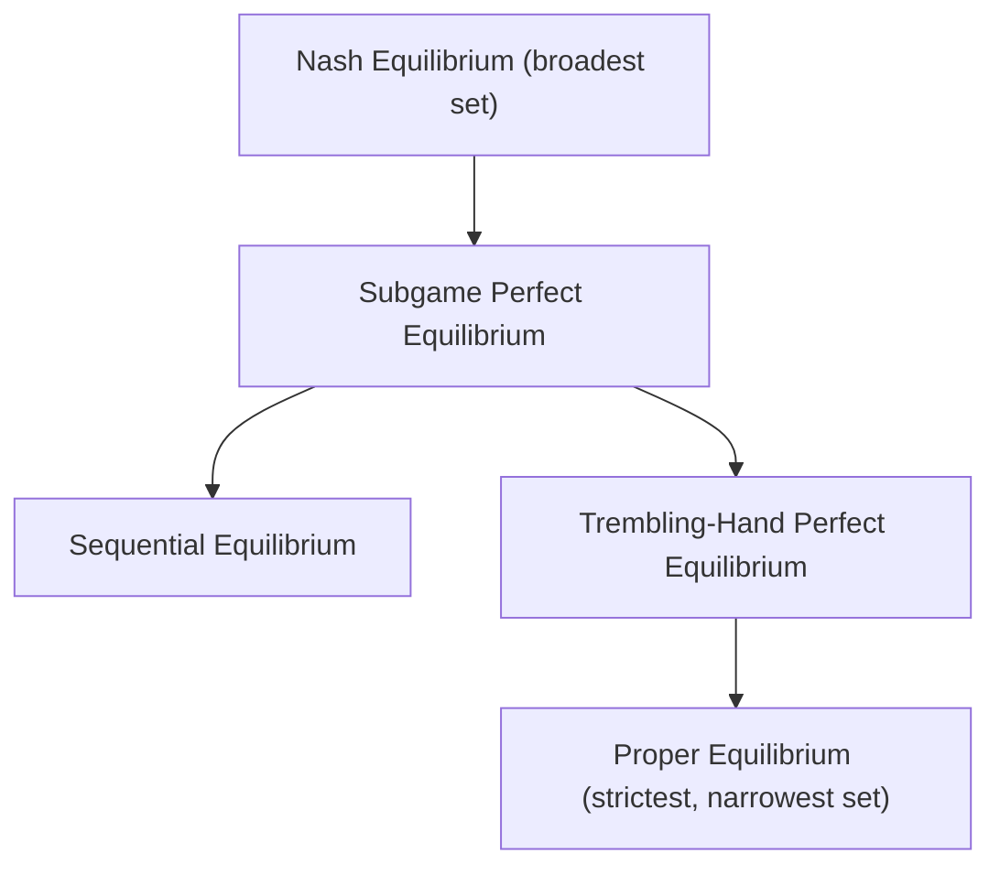

## Equilibrium Selection and Multiplicity

### Overview

**Equilibrium selection** addresses a fundamental gap left open by Nash's existence theorem: many games possess **multiple** Nash Equilibria, and the basic solution concept alone provides no criterion for predicting which one rational players will actually reach. **Multiplicity** refers to the underlying phenomenon — the coexistence of several self-enforcing strategy profiles in a single game — while equilibrium selection is the body of theory (refinement criteria, focal points, dynamic/evolutionary arguments) developed to narrow this set down to a more predictive subset.

### The Multiplicity Problem

Nash Equilibrium requires only that each player's strategy be a best response to the others' — a purely **individual rationality** condition. Nothing in the definition adjudicates between multiple profiles that each satisfy this condition simultaneously. Multiplicity arises naturally in several recurring game structures:

- **Pure coordination games:** Multiple PSNE with identical or near-identical payoffs (e.g., choosing which side of the road to drive on, which communication protocol to adopt).
- **Games with distributional conflict:** Multiple PSNE where players disagree on which is preferable (e.g., Battle of the Sexes, covered under Pure Strategy Nash Equilibrium).
- **Games combining pure and mixed equilibria:** A single game can have several PSNE plus one or more MSNE simultaneously (also illustrated by Battle of the Sexes).
- **Repeated and dynamic games:** The **Folk Theorem** results show that infinitely (or sufficiently long) repeated games typically support a very large — often continuum-sized — set of subgame-perfect equilibrium payoffs, making multiplicity the norm rather than the exception in dynamic settings.

### Worked Example: Stag Hunt

The **Stag Hunt** illustrates multiplicity combined with a **risk-dominance vs. payoff-dominance** tension. Two hunters can jointly hunt Stag (requiring cooperation, higher payoff) or individually hunt Hare (safe, lower payoff, no cooperation needed).

| P1 \ P2 | Stag | Hare |
| --- | --- | --- |
| **Stag** | $\underline{4}, \underline{4}$ | $0, 3$ |
| **Hare** | $3, 0$ | $\underline{3}, \underline{3}$ |

Two PSNE exist: $(Stag, Stag)$ and $(Hare, Hare)$.

- $(Stag, Stag)$ is **payoff-dominant** (Pareto superior — both players strictly prefer it).
- $(Hare, Hare)$ is **risk-dominant** — it has the larger "basin of attraction" under uncertainty about the opponent's choice, since Hare guarantees payoff 3 regardless of the opponent's action, while Stag risks payoff 0 if the opponent defects to Hare.

This tension between payoff-dominance and risk-dominance is central to equilibrium selection theory and has no universally "correct" resolution — different selection criteria yield different predictions.

### Formal Refinement Criteria

**Refinements** are additional conditions layered on top of the basic Nash Equilibrium definition to exclude equilibria considered implausible.

**Subgame Perfect Equilibrium (SPE):** In extensive-form (sequential) games, requires that the strategy profile induce a Nash Equilibrium in **every subgame**, not just the whole game — eliminating equilibria that rely on **non-credible threats** off the equilibrium path. Computed via **backward induction** in finite games of perfect information.

**Trembling-Hand Perfect Equilibrium (Selten, 1975):** Requires the equilibrium to remain a best response even under small, positive-probability "trembles" (mistakes) by all players — i.e., it must be robust to slight perturbations of the strategy space, ruling out equilibria that rely on opponents never making an error, including in strategies off the equilibrium path in weakly dominated ways.

**Proper Equilibrium (Myerson, 1978):** A refinement of trembling-hand perfection that additionally requires more costly mistakes to be made with proportionally smaller probability than less costly ones, providing a stricter robustness criterion.

**Sequential Equilibrium (Kreps and Wilson, 1982):** Extends subgame perfection to games with **imperfect information**, requiring strategies to be optimal given a consistent system of beliefs at each information set, updated via Bayes' rule where possible.

### Diagram: Refinement Hierarchy

### Non-Formal Selection Mechanisms

Beyond formal refinements (which eliminate equilibria based on internal consistency/robustness properties), several broader theories address **which** equilibrium among multiple equally valid ones is likely to be played:

**Focal Points (Schelling Points):** Thomas Schelling's (1960) concept that players often coordinate on a particular equilibrium due to salient features outside the formal payoff structure — cultural convention, historical precedent, symmetry-breaking labels, or shared framing — even when the game itself offers no payoff-based reason to prefer that equilibrium over others of identical value.

**Payoff Dominance (Pareto Criterion):** Selects the equilibrium that Pareto-dominates all others, if such an equilibrium exists (as with $(Stag, Stag)$ above). Harsanyi and Selten's (1988) general theory of equilibrium selection uses payoff dominance as a primary selection criterion when applicable.

**Risk Dominance:** Selects the equilibrium that is less risky under strategic uncertainty, typically formalized via the size of each equilibrium's "basin of attraction" — the region of beliefs about the opponent's play under which that equilibrium's strategy remains a best response. In $2\times2$ symmetric coordination games, risk dominance can be computed by comparing the product of "deviation losses" across strategies (the Harsanyi-Selten tracing procedure formalizes this more generally).

**Evolutionary and Learning-Based Selection:** Evolutionary game theory and learning models (e.g., replicator dynamics, best-response dynamics, fictitious play) study which equilibrium a population or repeated-interaction process converges to over time, given specified adjustment rules — often finding that risk-dominant equilibria are more robust attractors under stochastic evolutionary dynamics even when payoff-dominant equilibria exist (a result closely associated with Kandori, Mailath, and Rob, 1993, and Young, 1993).

**Cheap Talk and Pre-Play Communication:** Allowing non-binding communication before the game can help players coordinate on a mutually preferred equilibrium in pure coordination games (where communication is costless and truth-telling is itself an equilibrium), though this does not resolve games with conflicting interests (e.g., Battle of the Sexes) as cleanly, since cheap talk may not be credible when players benefit from misleading their counterpart.

### Repeated Games and the Folk Theorem

In **infinitely repeated games**, the **Folk Theorem** establishes that, provided players are sufficiently patient (their discount factor $\delta$ is close enough to 1), **any feasible and individually rational payoff vector** can be supported as a subgame-perfect equilibrium outcome of the repeated game. This dramatically compounds the multiplicity problem: a single stage game can generate an enormous — typically continuum-sized — set of repeated-game equilibria, since a wide range of cooperative and punishment-based strategies (e.g., grim trigger, tit-for-tat) can each be equilibrium-consistent depending on parameters. Selection theory in repeated games often turns to additional criteria such as **renegotiation-proofness** (ruling out equilibria that rely on punishments both players would jointly prefer to renegotiate away from) to further narrow the set.

### Key Points

- Nash Equilibrium existence is unconditional (per Nash's theorem), but uniqueness is not — multiplicity is common across many standard game structures.
- Refinement concepts (subgame perfection, trembling-hand perfection, sequential equilibrium) narrow the equilibrium set using internal robustness and credibility criteria, particularly relevant for extensive-form and imperfect-information games.
- Payoff dominance and risk dominance are the two principal criteria in Harsanyi and Selten's general equilibrium selection theory, and they can conflict, as illustrated by the Stag Hunt.
- Focal points, cheap talk, and evolutionary/learning dynamics offer complementary, less formally axiomatic approaches to predicting equilibrium selection in practice.
- The Folk Theorem shows that repeated games typically support a very large equilibrium payoff set, making equilibrium multiplicity especially pronounced in dynamic strategic settings.
- [Inference] There is no single, universally accepted resolution to the equilibrium selection problem across all game classes; which criterion (payoff dominance, risk dominance, focal points, or evolutionary stability) is most predictive appears to depend substantially on the specific strategic context, and this remains an active area of theoretical and experimental research rather than a settled question.

### Common Pitfalls

- **Assuming payoff-dominant equilibria are always selected:** Experimental evidence (e.g., classic Stag Hunt experiments) frequently shows subjects converging on risk-dominant rather than payoff-dominant equilibria, especially under uncertainty about the opponent's rationality or intentions.
- **Treating refinements as resolving all multiplicity:** Formal refinements (trembling-hand, sequential equilibrium) eliminate equilibria that fail robustness/consistency tests, but multiple equilibria frequently survive even the strictest standard refinements — refinements narrow, but do not generally eliminate, multiplicity.
- **Overgeneralizing focal point reasoning:** Focal points are inherently context-dependent (cultural, linguistic, historical) and are not derivable from the payoff matrix alone, making them difficult to formalize or predict outside specific, well-studied examples.
- **Ignoring the Folk Theorem's patience requirement:** The Folk Theorem's broad equilibrium-support result depends on the discount factor being sufficiently high; for low discount factors (impatient players or high probability of game termination), the supportable equilibrium set can be much smaller, sometimes collapsing toward the stage game's static Nash Equilibrium.

### Related Topics

- Pure Strategy Nash Equilibrium and Mixed Strategy Nash Equilibrium
- Subgame Perfect Equilibrium and Backward Induction
- Trembling-Hand Perfect and Sequential Equilibrium
- Repeated Games and the Folk Theorem
- Evolutionary Game Theory and Evolutionarily Stable Strategies
- Cheap Talk and Signaling Games
- Correlated Equilibrium (as a distinct broadening, rather than narrowing, of the solution concept)
- Behavioral and Experimental Game Theory on Equilibrium Selection