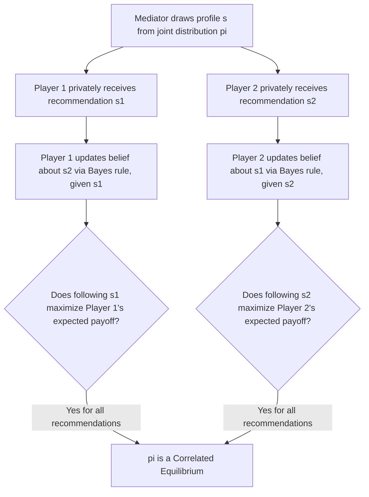

## Correlated Equilibrium

### Overview

**Correlated Equilibrium (CE)**, introduced by Robert Aumann (1974), is a solution concept that generalizes Nash Equilibrium by allowing players' strategies to be correlated through a shared, external randomizing device or signal, rather than requiring each player to randomize independently. Every Nash Equilibrium (including every mixed-strategy equilibrium, treated as a product of independent distributions) is a correlated equilibrium, but the reverse is not true — the set of correlated equilibria is generally larger and can support outcomes and payoffs unreachable by any Nash Equilibrium of the same game.

### Formal Definition

Consider a finite game $G = (N, S, u)$. A **correlated equilibrium** is a probability distribution $\pi$ over the set of pure strategy profiles $S = S_1 \times \cdots \times S_n$, together with a (conceptual) mediator or public randomizing device that draws a profile $s = (s_1, \dots, s_n)$ according to $\pi$ and privately recommends $s_i$ to each player $i$, such that **no player has an incentive to deviate from their recommendation**, given their belief about the others' recommendations conditional on their own.

Formally, $\pi$ is a correlated equilibrium if for every player $i$, every recommended strategy $s_i$ with $\pi(s_i) > 0$, and every alternative strategy $s_i' \in S_i$:

$$\sum_{s_{-i} \in S_{-i}} \pi(s_{-i} \mid s_i) \, u_i(s_i, s_{-i}) \geq \sum_{s_{-i} \in S_{-i}} \pi(s_{-i} \mid s_i) \, u_i(s_i', s_{-i})$$

This says: conditional on receiving recommendation $s_i$, and using Bayes' rule to infer the conditional distribution over others' recommendations $s_{-i}$, following the recommendation must be at least as good in expectation as any unilateral deviation.

**Key distinction from mixed-strategy Nash Equilibrium:** In an MSNE, each player's randomization is **independent** of the others' — $\pi(s) = \prod_i \sigma_i(s_i)$. In a correlated equilibrium, $\pi$ can be an **arbitrary joint distribution** over $S$, permitting statistical dependence between players' recommended actions without requiring either player to know the mechanism generating that dependence, only their own conditional beliefs.

### Worked Example: Battle of the Sexes with a Mediator

Recall Battle of the Sexes:

| P1 \ P2 | O | F |
| --- | --- | --- |
| **O** | $2, 1$ | $0, 0$ |
| **F** | $0, 0$ | $1, 2$ |

Nash Equilibria: $(O,O)$ with payoff $(2,1)$; $(F,F)$ with payoff $(1,2)$; and a mixed MSNE with expected payoff $\left(\frac{2}{3}, \frac{2}{3}\right)$.

Consider a **correlated equilibrium** where a mediator flips a fair coin and recommends $(O, O)$ with probability $\frac{1}{2}$ and $(F, F)$ with probability $\frac{1}{2}$ (i.e., $\pi$ places all probability mass on the diagonal, alternating between the two pure equilibria).

**Verifying incentive compatibility:** If Player 1 receives the recommendation "$O$," they know (by construction of $\pi$) that Player 2 was also recommended "$O$." Following the recommendation gives payoff 2; deviating to $F$ (while Player 2 plays $O$) gives payoff 0. Player 1 has no incentive to deviate. The symmetric argument holds for Player 2, and for the "$F$" recommendation branch.

**Resulting expected payoff:** $\frac{1}{2}(2,1) + \frac{1}{2}(1,2) = \left(\frac{3}{2}, \frac{3}{2}\right)$.

This payoff, $\left(\frac{3}{2}, \frac{3}{2}\right)$, is **strictly better for both players** than the mixed Nash Equilibrium payoff of $\left(\frac{2}{3}, \frac{2}{3}\right)$, and it achieves a fair, symmetric split between the two players' preferred outcomes — an outcome unreachable by any Nash Equilibrium of the underlying game (since the two PSNE favor one player each, and the unique MSNE gives a strictly lower payoff to both). This demonstrates the core value proposition of correlated equilibrium: **correlation can strictly improve efficiency and fairness** relative to what independent randomization allows.

### Diagram: Correlated Equilibrium Mechanism

### Relationship to Nash Equilibrium

- **Every Nash Equilibrium is a correlated equilibrium:** Given any (possibly mixed) Nash Equilibrium $\sigma^*$, the product distribution $\pi(s) = \prod_i \sigma_i^*(s_i)$ satisfies the correlated equilibrium condition — since under independence, conditioning on one's own recommendation reveals nothing new about others' play, reducing the CE incentive condition exactly to the standard Nash best-response condition.
- **Not every correlated equilibrium is a Nash Equilibrium:** As shown in the worked example, correlated equilibria can achieve payoff combinations, including convex combinations of Nash equilibrium payoffs and points strictly outside the Nash equilibrium payoff set, that no Nash Equilibrium of the game reaches.
- **The set of correlated equilibria is convex:** Unlike the Nash Equilibrium set (which need not be convex — e.g., a game may have exactly two isolated PSNE with no equilibrium payoff combination "between" them under Nash), the correlated equilibrium set is a convex polytope, since it is characterized by a system of linear inequalities in the probabilities $\pi(s)$. Any weighted average of two correlated equilibria is itself a correlated equilibrium (simply randomize over which one's mediator device to use).
- **Correlated equilibria can be computed via linear programming:** Because the defining incentive constraints are linear in $\pi$, finding a correlated equilibrium — or one that optimizes a linear objective such as total welfare — is a linear feasibility/optimization problem, solvable in polynomial time. This stands in sharp contrast to the PPAD-completeness of general Nash Equilibrium computation, making correlated equilibrium substantially more tractable computationally.

### Coarse Correlated Equilibrium

A further relaxation, **Coarse Correlated Equilibrium (CCE)**, only requires that a player not benefit from deviating **before** observing their recommendation (an ex-ante, unconditional deviation check), rather than after conditioning on the specific recommendation received:

$$\sum_{s \in S} \pi(s) \, u_i(s_i, s_{-i}) \geq \sum_{s \in S} \pi(s) \, u_i(s_i', s_{-i}) \quad \forall s_i' \in S_i$$

CCE is a strictly weaker (larger-set) concept than CE, which is in turn weaker than (a superset of) Nash Equilibrium:

$$\text{Nash Equilibria} \subseteq \text{Correlated Equilibria} \subseteq \text{Coarse Correlated Equilibria}$$

CCE is of particular importance in algorithmic game theory because it is exactly the solution concept to which **no-regret learning dynamics** (e.g., regret matching, multiplicative weights) provably converge in their time-average behavior, even in general-sum, many-player games — providing a natural, decentralized, computationally tractable justification for why correlated (rather than merely independent, mixed-strategy Nash) play might emerge from repeated interaction.

### The Price of Anarchy Connection

Correlated (and coarse correlated) equilibria are the standard solution concept used in many **Price of Anarchy** analyses in algorithmic game theory — bounding the ratio between the worst-case equilibrium social welfare and the socially optimal welfare. Because CCE is the natural convergence point of decentralized learning algorithms, and because many Price of Anarchy bounds (e.g., for congestion games, auctions) are proven to hold for the entire CCE set (not just Nash Equilibria), this broadens the practical relevance of such welfare-efficiency guarantees to a wider range of realistic, decentralized-learning-based play.

### Key Points

- Correlated Equilibrium generalizes Nash Equilibrium by allowing a shared correlating device to recommend (possibly statistically dependent) actions to players, who then have no incentive to deviate given their recommendation.
- Every Nash Equilibrium is a correlated equilibrium (via the independent product distribution), but correlated equilibria can achieve payoffs, including higher joint welfare and fairer outcomes, unreachable by any Nash Equilibrium.
- The correlated equilibrium set is a convex polytope, in contrast to the potentially non-convex Nash Equilibrium set, and is computable in polynomial time via linear programming.
- Coarse Correlated Equilibrium further relaxes the incentive condition to an ex-ante deviation check and is precisely the concept to which no-regret learning dynamics converge.
- The tractability of correlated (and coarse correlated) equilibria, contrasted with the PPAD-completeness of Nash Equilibrium computation, makes CE/CCE the practically dominant solution concepts in much of algorithmic game theory and mechanism design.
- [Inference] The practical relevance of correlated equilibrium is closely tied to whether a plausible correlating mechanism or shared signal (e.g., a public randomization device, commonly observed external event, or communication protocol) is actually available in the strategic setting being modeled; in settings with no natural correlating device, Nash Equilibrium (independent randomization) may remain the more directly applicable benchmark, though this is a modeling judgment rather than a strict theoretical requirement.

### Common Pitfalls

- **Assuming a correlated equilibrium requires a real external mediator:** Formally, the "mediator" is a conceptual device for defining the solution concept; in practice, correlation can arise from any commonly observed signal (sunspots, public announcements, shared history) that players can condition their behavior on, without requiring an actual enforcing third party.
- **Confusing correlated equilibrium with cooperative game theory:** CE remains a fully **non-cooperative** solution concept — no binding agreements or transfers are assumed; the only requirement is that following the recommendation be individually incentive-compatible given conditional beliefs.
- **Treating CE and CCE as interchangeable:** CCE is a strictly weaker condition (larger set) than CE; a coarse correlated equilibrium may fail to be a correlated equilibrium if a player would want to deviate after observing a specific recommendation, even though they wouldn't want to deviate unconditionally.
- **Overlooking non-convexity implications when working with Nash Equilibria:** Because the Nash Equilibrium set can be non-convex, some analyses mistakenly assume linear-programming techniques directly apply to Nash Equilibrium computation as they do for CE/CCE — this is not generally valid, which is part of why Nash Equilibrium computation is substantially harder.

### Related Topics

- Pure Strategy Nash Equilibrium and Mixed Strategy Nash Equilibrium
- Coarse Correlated Equilibrium and No-Regret Learning Dynamics
- Computing Nash Equilibria and PPAD-Completeness
- Price of Anarchy and Algorithmic Game Theory
- Mechanism Design and Bayesian Games
- Equilibrium Selection and Multiplicity
- Linear Programming Applications in Game Theory
- Aumann's Agreement Theorem and Common Knowledge