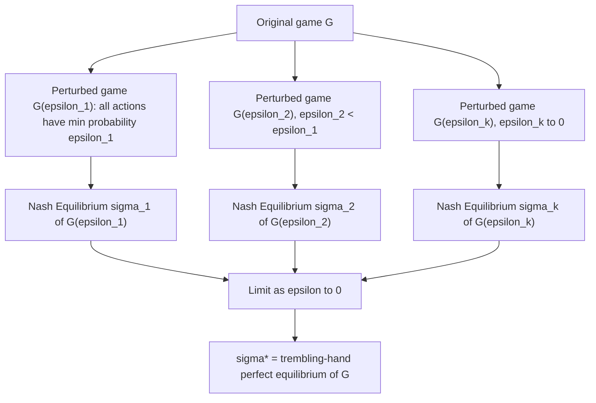

## Trembling Hand Perfection

### Overview

**Trembling Hand Perfect Equilibrium**, introduced by Reinhard Selten (1975), is a refinement of Nash Equilibrium designed to rule out equilibria that rely on implausible assumptions — specifically, equilibria that are only sustained because players are certain their opponents will never make a mistake. The concept models strategic robustness under the assumption that every player's "hand trembles": each has some small, vanishing probability of executing an unintended action, even off the equilibrium path. An equilibrium is trembling-hand perfect if it remains a best response even as these tremble probabilities shrink to zero.

### Motivation: Why Nash Equilibrium Is Insufficient

Standard Nash Equilibrium can be sustained by **weakly dominated strategies** that are only rational because a player assigns exactly zero probability to an opponent ever deviating from their equilibrium strategy — an assumption of perfect, error-free play that is often behaviorally and strategically implausible, especially in the presence of information sets that are reached only through some player's mistake.

**Illustrative example:**

| P1 \ P2 | L | R |
| --- | --- | --- |
| **U** | $1, 1$ | $1, 1$ |
| **D** | $1, 1$ | $0, 0$ |
| **M** | $0, 2$ | $2, 0$ |

Here $(U, L)$ and $(U, R)$ are both Nash Equilibria with payoff $(1,1)$, since Player 1's payoff from $U$ is 1 regardless of what Player 2 does. But $U$ **weakly dominates** $D$ for Player 1 (never worse, sometimes better), yet $U$ does not dominate $M$. If Player 2 assigns even a small probability to Player 1 playing $M$ by mistake, Player 2's best response depends critically on which mistake ($D$ or $M$) is more likely — the equilibrium $(U, R)$ can fail to be robust to certain tremble patterns even though it is a valid Nash Equilibrium, in a way $(U,L)$ might not, depending on the specific expected payoffs from possible trembles. This kind of fragility to small, off-path perturbations is exactly what trembling-hand perfection is designed to detect and rule out.

### Formal Definition

Let $G$ be a finite normal-form game with players $N$ and pure strategy sets $S_i$. A **perturbed game** $G(\epsilon)$ is constructed by requiring each player $i$ to play every pure strategy $s_i \in S_i$ with probability at least $\epsilon_i(s_i) > 0$, where $\sum_{s_i} \epsilon_i(s_i) < \epsilon$ for some small $\epsilon > 0$ — i.e., players are forced into **fully mixed** strategies, with a floor on the probability assigned to every action ("trembles").

A mixed strategy profile $\sigma^*$ is a **trembling-hand perfect equilibrium** of $G$ if there exists a sequence of perturbed games $G(\epsilon^k)$ with $\epsilon^k \to 0$ as $k \to \infty$, and a corresponding sequence of Nash Equilibria $\sigma^k$ of each perturbed game $G(\epsilon^k)$, such that:

$$\sigma^k \to \sigma^* \quad \text{as } k \to \infty$$

That is, $\sigma^*$ must be approximable as the limit of equilibria of games where every action is forced to be played with positive probability, as those minimum probabilities vanish.

**Equivalent characterization (via best responses to trembles):** $\sigma^*$ is trembling-hand perfect if and only if there exists a sequence of **fully mixed** strategy profiles $\sigma^k \to \sigma^*$ such that for every player $i$, $\sigma_i^*$ is a best response to $\sigma_{-i}^k$ for all sufficiently large $k$. This formulation makes clear the "robustness to trembles" interpretation: the equilibrium strategy must remain optimal against opponents who are only *almost* certain to play their equilibrium strategies, retaining a small, vanishing chance of any mistake.

### Diagram: Convergence to a Trembling-Hand Perfect Equilibrium

### Key Equivalence: Undominated Best Responses

A central and practically useful theorem connects trembling-hand perfection to strategy dominance:

**Theorem:** In a finite two-player game, a Nash Equilibrium $\sigma^*$ is trembling-hand perfect if and only if $\sigma_i^*$ assigns positive probability only to pure strategies of player $i$ that are **not weakly dominated**, for every player $i$.

This gives a direct, computationally tractable **test**: an equilibrium fails to be trembling-hand perfect if and only if some player's equilibrium strategy places positive probability on a weakly dominated pure strategy. For games with more than two players, the equivalence to "no weakly dominated strategies in the support" holds only as a necessary condition, not a full characterization — perfection in $n$-player games can fail even when no player's support strategy is weakly dominated, requiring the full perturbed-game-limit definition for exact verification.

### Existence

**Theorem (Selten, 1975):** Every finite normal-form game has at least one trembling-hand perfect equilibrium.

This existence result parallels Nash's own theorem and is proven using a similar fixed-point argument applied within each perturbed game $G(\epsilon^k)$ (each of which has its own Nash Equilibrium by Nash's theorem, since perturbed games are themselves finite games — technically requiring the strategy space to be restricted to the compact, convex set of strategies satisfying the minimum-probability floor, to which Kakutani's theorem still applies), followed by a compactness argument extracting a convergent subsequence as $\epsilon^k \to 0$.

### Relationship to Other Refinements

- **Trembling-hand perfect implies undominated:** Every trembling-hand perfect equilibrium strategy avoids weakly dominated strategies (per the equivalence above), but not every undominated-strategy equilibrium is trembling-hand perfect in games with more than two players.
- **Extensive-Form Trembling-Hand Perfection:** Selten's original 1975 paper defined the concept for extensive-form games (game trees), where it serves to rule out non-credible strategies at information sets that are reached only via an opponent's error — a stronger requirement than mere Nash Equilibrium or even ordinary Subgame Perfect Equilibrium, since subgame perfection alone does not constrain behavior at information sets within a single node that has zero probability of being reached under equilibrium play.
- **Sequential Equilibrium (Kreps and Wilson, 1982):** Developed partly in response to the technical complexity of directly verifying trembling-hand perfection in extensive-form games with imperfect information. Sequential equilibrium requires strategies to be optimal given a consistent belief system at every information set (including off-path ones), and is generally easier to verify; every trembling-hand perfect equilibrium is sequential, though the two concepts are not fully equivalent in every game.
- **Proper Equilibrium (Myerson, 1978):** A strictly finer refinement that further requires costlier mistakes to be assigned proportionally smaller tremble probabilities than less costly ones (an "ordered" tremble structure), eliminating some trembling-hand perfect equilibria that rely on treating all mistakes as equally likely regardless of their cost.

### Worked Example: Verifying via the Dominance Test

Return to the earlier example:

| P1 \ P2 | L | R |
| --- | --- | --- |
| **U** | $1, 1$ | $1, 1$ |
| **D** | $1, 1$ | $0, 0$ |
| **M** | $0, 2$ | $2, 0$ |

Player 1's strategy $D$ is weakly dominated by $U$ (identical payoff against $L$, strictly worse against $R$). Any Nash Equilibrium placing positive probability on $D$ for Player 1 therefore **fails** the trembling-hand perfection test. Player 1's strategy $M$ is not weakly dominated (it strictly outperforms both $U$ and $D$ against $R$), so equilibria placing weight on $M$ are not automatically excluded by this test alone and require direct verification via the perturbed-game-limit definition to confirm perfection.

### Key Points

- Trembling-hand perfection refines Nash Equilibrium by requiring robustness to small, vanishing probabilities of unintended player errors ("trembles"), across every action, including off the equilibrium path.
- Formally, a strategy profile is perfect if it is the limit of Nash Equilibria of a sequence of perturbed games in which all actions are forced to have strictly positive probability, as those minimum probabilities shrink to zero.
- In two-player games, an equilibrium is trembling-hand perfect if and only if no player's equilibrium strategy places positive probability on a weakly dominated pure strategy — a directly checkable criterion.
- Every finite game has at least one trembling-hand perfect equilibrium (Selten, 1975), paralleling Nash's existence theorem.
- The concept was originally developed for extensive-form games to rule out non-credible strategies at information sets reachable only through an opponent's mistake, complementing (and going beyond) subgame perfection.
- [Inference] Directly verifying trembling-hand perfection via the formal perturbed-game-limit definition can be computationally and analytically cumbersome in larger or extensive-form games, which is a documented practical motivation for the subsequent development of sequential equilibrium as a more tractable, closely related refinement.

### Common Pitfalls

- **Applying the two-player dominance equivalence to $n$-player games without qualification:** The "no weakly dominated strategies in the support" characterization is a full equivalence only for two-player games; in games with three or more players it is a necessary but not sufficient condition, and full verification requires the perturbed-game-limit definition.
- **Confusing weak dominance elimination with trembling-hand perfection itself:** While the two are closely linked via the equivalence theorem (in two-player games), trembling-hand perfection is fundamentally a limit/robustness concept, not merely "eliminate weakly dominated strategies and stop" — the underlying definition concerns convergence of equilibria across a full sequence of perturbed games.
- **Assuming trembling-hand perfect equilibria are unique:** Like ordinary Nash Equilibrium, a game can have multiple trembling-hand perfect equilibria; the refinement narrows the equilibrium set but does not generally produce a unique prediction.
- **Overlooking the distinction from proper equilibrium:** Trembling-hand perfection treats all trembles as arbitrary (subject only to vanishing to zero); it does not require costlier mistakes to be less probable. Proper equilibrium adds this cost-ordering requirement and can therefore exclude some trembling-hand perfect equilibria.

### Related Topics

- Equilibrium Selection and Multiplicity
- Subgame Perfect Equilibrium and Backward Induction
- Sequential Equilibrium and Belief Consistency
- Proper Equilibrium
- Weak and Strict Dominance
- Existence Theorems for Nash Equilibrium
- Extensive-Form Games and Information Sets
- Behavioral Robustness and Bounded Rationality in Equilibrium Concepts