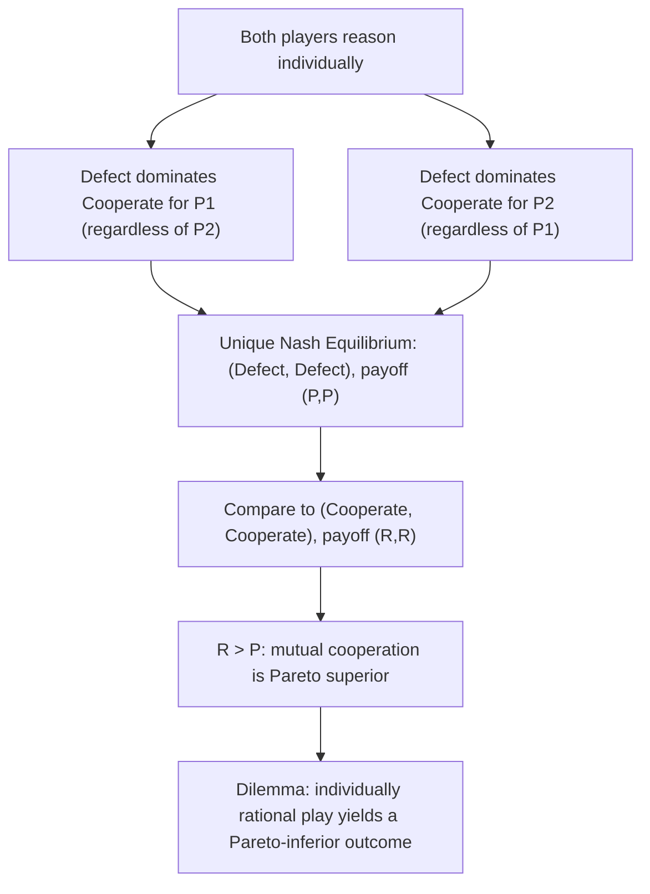

## The Prisoner's Dilemma

### Overview

The **Prisoner's Dilemma** is the single most studied game in all of game theory — a two-player, simultaneous-move game in which each player has a dominant strategy to defect, yet mutual defection yields a worse outcome for both players than mutual cooperation would. It is the canonical illustration of the tension between **individual rationality** and **collective (Pareto) efficiency**, and serves as the foundational model for a vast range of real-world phenomena involving cooperation, free-riding, and social dilemmas.

### Origin and Narrative Framing

The game was formulated in 1950 by Merrill Flood and Melvin Dresher while working at the RAND Corporation, with the now-standard "prisoner" narrative framing and name attributed to Albert W. Tucker, who used it in a lecture to illustrate the structure to a non-specialist audience. The canonical story: two suspects are arrested and interrogated in separate rooms, unable to communicate. Each can either **Cooperate** (with their partner, by staying silent) or **Defect** (betray their partner by confessing/testifying against them). Sentencing depends jointly on both suspects' choices.

### Formal Payoff Structure

Let $C$ denote Cooperate and $D$ denote Defect. The canonical Prisoner's Dilemma payoff matrix (using generic reward parameters) is:

| P1 \ P2 | $C$ | $D$ |
| --- | --- | --- |
| $C$ | $R, R$ | $S, T$ |
| $D$ | $T, S$ | $P, P$ |

where:

- $R$ = **Reward** for mutual cooperation
- $T$ = **Temptation** payoff for unilateral defection
- $S$ = **Sucker's payoff** for being unilaterally cooperative against a defector
- $P$ = **Punishment** for mutual defection

The defining structural condition of a Prisoner's Dilemma is the strict ordering:

$$T > R > P > S$$

This ordering ensures: (1) defection strictly dominates cooperation for each player individually (since $T > R$ and $P > S$), yet (2) mutual cooperation is strictly Pareto superior to mutual defection (since $R > P$). A common additional condition, particularly relevant for the **iterated** version of the game, is:

$$2R > T + S$$

This ensures that alternating between exploiting and being exploited (averaging $T$ and $S$) is not more efficient than sustained mutual cooperation, so that cooperation — rather than turn-taking exploitation — is the efficient benchmark to compare against in repeated play.

### Worked Numerical Example

Using concrete years-of-sentence-avoided payoffs (higher is better):

| P1 \ P2 | $C$ | $D$ |
| --- | --- | --- |
| $C$ | $-1, -1$ | $-3, 0$ |
| $D$ | $0, -3$ | $-2, -2$ |

Here $T = 0$, $R = -1$, $P = -2$, $S = -3$, satisfying $T > R > P > S$ ($0 > -1 > -2 > -3$).

**Dominance analysis for Player 1:**

- If Player 2 plays $C$: Player 1 gets $0$ from $D$ vs. $-1$ from $C$ → $D$ is better.
- If Player 2 plays $D$: Player 1 gets $-2$ from $D$ vs. $-3$ from $C$ → $D$ is better.

$D$ **strictly dominates** $C$ regardless of the opponent's action. By symmetry, the same holds for Player 2. The unique Nash Equilibrium — found purely via **iterated elimination of strictly dominated strategies**, requiring no best-response matrix analysis — is $(D, D)$ with payoff $(-2, -2)$, even though $(C, C)$ yielding $(-1, -1)$ is strictly better for both players.

### Diagram: Dominance and the Efficiency Gap

### Why This Is a "Dilemma": Individual vs. Collective Rationality

The Prisoner's Dilemma is the sharpest illustration in game theory of the divergence between **Nash Equilibrium** (the individually rational, self-enforcing prediction) and **Pareto efficiency** (the socially optimal outcome). Because $D$ strictly dominates $C$, rational self-interested play — under the standard assumptions of the game (no communication, no binding commitments, no repeated interaction, no reputational concerns) — leads unavoidably to the jointly worse outcome. This result holds **regardless of what each player believes about the other's rationality or intentions**, since dominance reasoning requires no assumptions about the opponent's strategy at all — it is the strongest form of solution concept precisely because it is belief-independent.

### Real-World Applications and Interpretations

The Prisoner's Dilemma structure recurs across a very broad range of applied domains:

- **Oligopoly and cartel pricing:** Firms in a cartel each have an individual incentive to secretly undercut the agreed cartel price (defect) even though joint adherence to high prices (cooperate) maximizes combined industry profit — the structural basis for cartel instability absent enforcement mechanisms.
- **Arms races and military strategy:** Each nation may prefer mutual disarmament to mutual arming, but each has a unilateral incentive to arm regardless of the other's choice, for fear of being left vulnerable.
- **Environmental and common-pool resource dilemmas:** Individual actors (firms, nations) may benefit from continuing to pollute or over-extract a shared resource even though collective restraint would be better for all, a structure closely related to the broader "Tragedy of the Commons" (though the Commons problem is technically an $n$-player generalization with additional structure, rather than an identical two-player game).
- **Public goods provision and free-riding:** Individuals benefit from a public good regardless of whether they personally contributed to it, creating an incentive to free-ride (defect on contribution) even when universal contribution (cooperation) would make everyone better off.
- **Advertising and R&D competition:** Firms may engage in costly advertising or defensive R&D spending that primarily reallocates market share rather than growing the overall market, mirroring a Prisoner's-Dilemma-like mutual-defection trap relative to a lower-spending equilibrium both would prefer.

### The Iterated Prisoner's Dilemma

When the game is played **repeatedly** between the same two players (finitely or infinitely), the strategic landscape changes substantially, since players can condition future play on past behavior — opening the door to reputation and reciprocity-based cooperation.

- **Finitely repeated, known horizon:** Via **backward induction**, if the number of repetitions is finite and commonly known, defection in the final round is dominant (no future to protect), which unravels backward — defection in the second-to-last round follows, and so on — leading, under strict application of subgame-perfect equilibrium reasoning, to defection in **every** round, including the first. This is sometimes called the "chain-store paradox" logic applied to the repeated Prisoner's Dilemma and is a frequently cited (and frequently empirically contradicted) theoretical prediction.
- **Infinitely repeated (or indefinite horizon with continuation probability):** The **Folk Theorem** shows that if players are sufficiently patient (discount factor $\delta$ close to 1), cooperative strategies sustained by the threat of future punishment — such as **Grim Trigger** (cooperate until any defection is observed, then defect forever) or **Tit-for-Tat** (mirror the opponent's previous move) — can be supported as subgame-perfect equilibria, making sustained cooperation individually rational when the shadow of the future is long enough.
- **Axelrod's tournaments (1980s):** Robert Axelrod's famous computer tournaments, pitting submitted strategies against each other in the iterated Prisoner's Dilemma, found that **Tit-for-Tat** — a simple strategy that cooperates first and thereafter mirrors the opponent's prior move — performed remarkably well, popularizing the idea that simple, "nice," retaliatory, and forgiving strategies can sustain cooperation in repeated interaction. [Inference] Subsequent research has identified strategies (e.g., more sophisticated evolutionary or "zero-determinant" strategies) that can outperform Tit-for-Tat under certain conditions, so Tit-for-Tat's tournament success is best understood as a historically influential and robust — but not universally dominant — empirical finding rather than a formal optimality result.

### Experimental and Behavioral Evidence

[Inference] A substantial body of experimental economics research has found that human subjects cooperate in one-shot and finitely repeated Prisoner's Dilemma games at rates notably higher than the pure dominant-strategy prediction of universal defection, particularly in early rounds or under conditions involving communication, reputational stakes, or social preferences (e.g., inequity aversion, reciprocity) — this remains an active empirical research area, and observed cooperation rates vary considerably depending on experimental design, stakes, and population studied, so no single universal cooperation rate should be treated as a fixed constant.

### Key Points

- The Prisoner's Dilemma has a unique Nash Equilibrium — mutual defection $(D,D)$ — found by strict dominance alone, requiring no assumptions about opponent rationality or beliefs.
- The defining payoff ordering is $T > R > P > S$, ensuring defection dominates individually while mutual cooperation is Pareto superior to mutual defection.
- The game is the canonical illustration of the gap between individually rational (Nash) outcomes and collectively efficient (Pareto optimal) outcomes.
- In the finitely repeated version with a known end, backward induction predicts universal defection throughout, including the first round — a theoretically robust but empirically frequently contradicted prediction.
- In the infinitely (or indefinitely) repeated version, sufficiently patient players can sustain cooperation as a subgame-perfect equilibrium via strategies such as Grim Trigger or Tit-for-Tat, per Folk Theorem logic.
- The structure recurs across oligopoly pricing, arms races, environmental commons problems, public goods provision, and competitive spending — making it one of the most widely applied models in the social sciences.

### Common Pitfalls

- **Assuming cooperation is "irrational":** Nash Equilibrium identifies the self-enforcing outcome under the game's stated assumptions (one-shot, no commitment, no communication); it does not imply cooperation is impossible or irrational under different, repeated, or reputational contexts — the repeated-game analysis materially changes the predicted outcome.
- **Conflating the one-shot and iterated versions' predictions:** The stark "always defect" prediction is specific to the one-shot (or finitely repeated, backward-induction) game; the infinitely/indefinitely repeated game supports a much wider range of equilibrium outcomes, including sustained cooperation, under the Folk Theorem.
- **Treating $2R > T+S$ as automatically satisfied:** This condition, relevant for iterated-game efficiency comparisons, does not follow automatically from $T > R > P > S$ alone and should be checked explicitly when analyzing whether sustained cooperation is more efficient than alternating exploitation.
- **Overgeneralizing the Tragedy of the Commons as "the same game":** While closely related in spirit (individual incentives conflicting with collective welfare), the Tragedy of the Commons is typically modeled as an $n$-player game with continuous extraction levels and congestion externalities, a distinct formal structure from the discrete two-player Prisoner's Dilemma, even though both illustrate the individual-vs-collective-rationality gap.

### Related Topics

- Defining Nash Equilibrium and Pure Strategy Nash Equilibrium
- Dominant and Dominated Strategies
- Repeated Games and the Folk Theorem
- Tit-for-Tat, Grim Trigger, and Reciprocity-Based Strategies
- Backward Induction and Subgame Perfect Equilibrium
- Tragedy of the Commons and Public Goods Games
- Oligopoly and Cartel Stability
- Behavioral and Experimental Game Theory