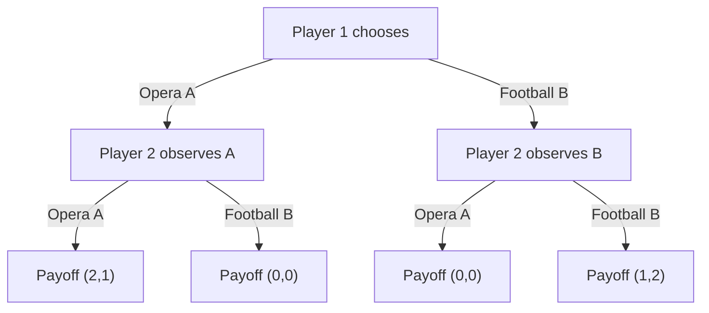

## Battle of the Sexes

### Overview

The Battle of the Sexes is a two-player, non-zero-sum coordination game in classical game theory. It models a situation where two players prefer to coordinate their actions over failing to coordinate, but disagree about which of two coordinated outcomes is preferable. It is a canonical example used to illustrate multiple Nash equilibria, coordination failure, and the limitations of pure strategy analysis in games lacking a dominant strategy.

### Origin and Narrative Framing

The game's traditional framing involves two partners deciding how to spend an evening together, historically labeled around a choice between attending a football/boxing event versus a ballet/opera, with one player favoring one option and the other player favoring the alternative. Both players prefer being together over being apart, but each has a distinct preferred venue. The specific narrative (football vs. opera, boxing vs. shopping, etc.) varies across textbooks; the underlying payoff structure is what defines the game.

### Formal Structure

**Players:** Two players, conventionally labeled Player 1 (Row) and Player 2 (Column).

**Strategies:** Each player chooses between two actions, denoted $A$ and $B$ (e.g., Opera and Football).

**Payoff Matrix (canonical form):**

|  | Player 2: Opera ($A$) | Player 2: Football ($B$) |
| --- | --- | --- |
| **Player 1: Opera ($A$)** | $(2, 1)$ | $(0, 0)$ |
| **Player 1: Football ($B$)** | $(0, 0)$ | $(1, 2)$ |

Here Player 1 prefers the $(A,A)$ outcome (payoff 2), while Player 2 prefers the $(B,B)$ outcome (payoff 2). Both players receive $0$ if they fail to coordinate.

### Key Points

- The game is **non-zero-sum**: total payoffs differ across outcomes, and both players benefit from coordination relative to miscoordination.
- The game exhibits **anti-coordination on preference but coordination on action**: players want to match actions but disagree on which match is best.
- There is no dominant strategy for either player; the optimal choice depends entirely on what the other player is expected to do.
- The payoff structure is symmetric in form but asymmetric in preference, distinguishing it from pure coordination games (e.g., Stag Hunt) where both players agree on the best outcome.

### Nash Equilibrium Analysis

The game has **three Nash equilibria**: two in pure strategies and one in mixed strategies.

**Pure Strategy Equilibria:**

1. $(A, A)$ — both choose Opera. Neither player can improve by unilaterally deviating: Player 1 gets 2 (best response to $A$), Player 2 gets 1 (best response to $A$, since deviating to $B$ yields 0).
2. $(B, B)$ — both choose Football. Symmetric reasoning applies.

Both pure equilibria are Pareto-efficient relative to the miscoordination outcomes, but they are not Pareto-rankable against each other, since each favors a different player.

**Mixed Strategy Equilibrium:**

Let Player 1 play $A$ with probability $p$ and Player 2 play $A$ with probability $q$. Player 2 must be indifferent between $A$ and $B$ given $p$, and Player 1 must be indifferent between $A$ and $B$ given $q$.

For Player 2's indifference:

$$p \cdot 1 + (1-p) \cdot 0 = p \cdot 0 + (1-p) \cdot 2$$

$$p = 2(1-p) \implies p = \frac{2}{3}$$

For Player 1's indifference:

$$q \cdot 2 + (1-q) \cdot 0 = q \cdot 0 + (1-q) \cdot 1$$

$$2q = 1-q \implies q = \frac{1}{3}$$

So the mixed equilibrium has Player 1 playing $A$ (Opera) with probability $\frac{2}{3}$ and Player 2 playing $A$ (Opera) with probability $\frac{1}{3}$.

**Expected payoffs in the mixed equilibrium:**

$$E[\pi_1] = pq(2) + p(1-q)(0) + (1-p)q(0) + (1-p)(1-q)(1)$$

Substituting $p = 2/3$, $q = 1/3$:

$$E[\pi_1] = \frac{2}{3}\cdot\frac{1}{3}\cdot 2 + \frac{1}{3}\cdot\frac{2}{3}\cdot 1 = \frac{4}{9} + \frac{2}{9} = \frac{6}{9} = \frac{2}{3}$$

By symmetry of the calculation, $E[\pi_2] = \frac{2}{3}$ as well. Both players receive strictly lower expected payoff ($\frac{2}{3}$) in the mixed equilibrium than in either pure equilibrium (1 or 2), illustrating that mixed equilibria in coordination games are typically **Pareto-inferior** to pure ones — coordination failure has a real cost even under equilibrium play.

### Strategic Paradox: The Coordination Problem

The core paradox is that rational players following individually optimal reasoning cannot, from the payoff structure alone, determine which pure equilibrium will be selected. This is known as the **equilibrium selection problem**. Unlike games with a unique Nash equilibrium or a dominant strategy, Battle of the Sexes requires an external coordinating mechanism — communication, convention, focal points (Schelling points), first-mover advantage, or repeated play history — to resolve which outcome occurs.

**[Inference]** In the absence of any coordinating device, if both players independently apply symmetric reasoning (e.g., each assumes the other reasons identically), they may default toward the mixed strategy equilibrium or toward miscoordination, since neither pure equilibrium is objectively "more rational" than the other without additional information.

### Variants

**Sequential Battle of the Sexes:** If one player moves first and the second observes this move before choosing, the game becomes one of perfect information. Using backward induction, the first mover can guarantee their preferred equilibrium, since the second mover's best response is always to match. This demonstrates the value of commitment and first-mover advantage in coordination games.

**Battle of the Sexes with Communication (Cheap Talk):** Allowing non-binding pre-play communication can help players coordinate on a pure equilibrium, though cheap talk does not always eliminate coordination failure, since messages are not binding and players may have incentive to misrepresent preferences.

**Repeated Battle of the Sexes:** Under repeated play, players may adopt turn-taking strategies (alternating between $(A,A)$ and $(B,B)$ across rounds) to approximate a fairer long-run payoff split, an outcome not achievable in the one-shot game.

**Battle of the Sexes with Incomplete Information:** A Bayesian variant where players are uncertain about the other's exact payoffs or type, studied in mechanism design and signaling contexts.

### Comparison to Related Games

| Game | Coordination Motive | Preference Alignment | Dominant Strategy |
| --- | --- | --- | --- |
| Battle of the Sexes | Yes | Conflicting | No |
| Stag Hunt | Yes | Aligned | No |
| Chicken (Hawk-Dove) | No (anti-coordination) | Conflicting | No |
| Prisoner's Dilemma | No | Aligned (mutual defection risk) | Yes |

Battle of the Sexes is distinguished from **Stag Hunt** by preference conflict over the coordinated outcome, and from **Chicken** by the fact that matching actions is preferred by both players (in Chicken, at least one player prefers an asymmetric outcome).

### Game Tree (Sequential Variant)

### Payoff Space Illustration (svg_diagram)

<svg xmlns="http://www.w3.org/2000/svg" viewBox="0 0 480 380">
<text x="240" y="24" font-size="16" font-weight="bold" text-anchor="middle" fill="#222">Battle of the Sexes Payoff Space (svg_diagram)</text>
<line x1="60" y1="320" x2="440" y2="320" stroke="#333" stroke-width="2" />
<line x1="60" y1="320" x2="60" y2="40" stroke="#333" stroke-width="2" />
<text x="440" y="340" font-size="13" text-anchor="middle" fill="#333">Player 1 Payoff</text>
<text x="30" y="40" font-size="13" text-anchor="middle" fill="#333" transform="rotate(-90 30 180)">Player 2 Payoff</text>
<circle cx="260" cy="140" r="6" fill="#2266cc" />
<text x="270" y="135" font-size="12" fill="#2266cc">(A,A) = (2,1)</text>
<circle cx="150" cy="230" r="6" fill="#cc4422" />
<text x="160" y="225" font-size="12" fill="#cc4422">(B,B) = (1,2)</text>
<circle cx="60" cy="320" r="6" fill="#555555" />
<text x="70" y="315" font-size="12" fill="#555555">(A,B)/(B,A) = (0,0)</text>
<circle cx="180" cy="200" r="5" fill="#22aa55" />
<text x="190" y="200" font-size="12" fill="#22aa55">Mixed Eq = (2/3,2/3)</text>
<line x1="260" y1="140" x2="150" y2="230" stroke="#999" stroke-dasharray="4,3" />
<text x="180" y="170" font-size="11" fill="#666">Pareto frontier</text>
</svg>

### Applications

- **Economics:** Modeling standards coordination (e.g., two firms choosing between competing technology standards where both prefer a shared standard but favor different ones).
- **Political Science:** Coalition formation where parties prefer joint governance over none, but differ on which coalition partner or policy platform to adopt.
- **Social Convention Formation:** Explaining how arbitrary conventions (e.g., driving side, communication protocols) emerge and stabilize through repeated coordination games.
- **Bargaining Theory:** Serves as a foundational example in the study of Pareto-efficient outcome selection under conflicting preferences, connecting to the Nash Bargaining Solution.

### Conclusion

The Battle of the Sexes demonstrates that mutual benefit from coordination does not eliminate strategic conflict when preferences over the coordinated outcome diverge. It highlights the equilibrium selection problem, the value of commitment devices, and the payoff cost of relying on mixed strategies when a coordinating mechanism is unavailable. Its multiple-equilibria structure makes it a foundational teaching example distinguishing pure coordination games from games requiring convention, communication, or sequential commitment to resolve efficiently.

**Related Topics**

- Stag Hunt and pure coordination games
- Schelling points and focal point theory
- Chicken (Hawk-Dove) game and anti-coordination
- Cheap talk and pre-play communication
- Correlated equilibrium (Aumann) as a resolution mechanism
- Repeated games and turn-taking strategies
- Nash Bargaining Solution
- Bayesian games and incomplete information variants