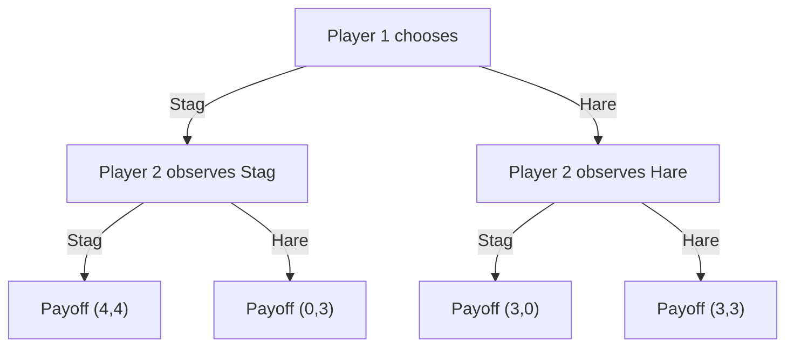

## The Stag Hunt

### Overview

The Stag Hunt is a two-player coordination game in classical game theory that models the tension between mutual cooperation for a high-value collective outcome and safer, individually secure but lower-value outcomes. Unlike the Prisoner's Dilemma, the Stag Hunt features a Pareto-dominant equilibrium that both players prefer, yet rational play does not guarantee its selection due to risk considerations. It is a foundational example in the study of social contract theory, trust, and risk-dominance versus payoff-dominance in equilibrium selection.

### Origin and Narrative Framing

The game derives its name from a thought experiment attributed to Jean-Jacques Rousseau in *A Discourse on Inequality* (1755), where two hunters can either cooperate to hunt a stag (requiring mutual commitment, yielding a large payoff shared between them) or individually hunt a hare (a lesser but guaranteed payoff obtainable alone). If one hunter defects to chase a hare while the other continues pursuing the stag, the stag hunt fails and the committed hunter gets nothing.

### Formal Structure

**Players:** Two players, conventionally labeled Player 1 (Row) and Player 2 (Column).

**Strategies:** Each player chooses between **Stag** ($S$) and **Hare** ($H$).

**Payoff Matrix (canonical form):**

|  | Player 2: Stag ($S$) | Player 2: Hare ($H$) |
| --- | --- | --- |
| **Player 1: Stag ($S$)** | $(a, a)$ | $(c, b)$ |
| **Player 1: Hare ($H$)** | $(b, c)$ | $(d, d)$ |

where the canonical payoff ranking is:

$$a > b \geq d > c$$

A common numerical instantiation:

|  | Player 2: Stag | Player 2: Hare |
| --- | --- | --- |
| **Player 1: Stag** | $(4, 4)$ | $(0, 3)$ |
| **Player 1: Hare** | $(3, 0)$ | $(3, 3)$ |

Here $a=4$ (mutual stag), $b=3$ (hare while other stags — the defector still secures a hare), $c=0$ (stagged alone, stag escapes), $d=3$ (mutual hare).

### Key Points

- The game is a **pure coordination game with risk asymmetry**: both players agree that $(S,S)$ is the best joint outcome, unlike Battle of the Sexes where preferences conflict.
- $(S,S)$ is **payoff-dominant** (Pareto-superior): it strictly maximizes both players' payoffs among equilibria.
- $(H,H)$ is **risk-dominant**: it is the safer choice under uncertainty about the other player's action, since Hare guarantees a payoff of $d$ regardless of the opponent's choice, while Stag risks the worst payoff $c$ if the opponent defects.
- The tension between payoff-dominance and risk-dominance is the central theoretical feature distinguishing the Stag Hunt from other 2x2 symmetric games.

### Nash Equilibrium Analysis

The game has **two pure-strategy Nash equilibria** and **one mixed-strategy equilibrium**.

**Pure Strategy Equilibria:**

1. $(S, S)$ — both hunt stag. Neither player benefits from unilateral deviation: switching to Hare while the other stays on Stag yields $b < a$ (using the numerical example, $3 < 4$).
2. $(H, H)$ — both hunt hare. Switching to Stag while the other stays on Hare yields $c < d$ ($0 < 3$).

Both are Nash equilibria, but they are **Pareto-rankable**: $(S,S)$ strictly dominates $(H,H)$ for both players, a key structural difference from Battle of the Sexes.

**Mixed Strategy Equilibrium:**

Let Player 1 play $S$ with probability $p$, Player 2 play $S$ with probability $q$. Using the numerical payoffs, Player 2's indifference condition:

$$p(4) + (1-p)(0) = p(3) + (1-p)(3)$$

$$4p = 3$$

$$p = \frac{3}{4}$$

By symmetry, $q = \frac{3}{4}$ as well. Each player hunts stag with probability $\frac{3}{4}$ and hare with probability $\frac{1}{4}$.

**Expected payoff in the mixed equilibrium:**

$$E[\pi_1] = pq(4) + p(1-q)(0) + (1-p)q(3) + (1-p)(1-q)(3)$$

Substituting $p=q=3/4$:

$$E[\pi_1] = \frac{9}{16}(4) + \frac{3}{16}(0) + \frac{3}{16}(3) + \frac{1}{16}(3) = \frac{36}{16} + \frac{9}{16} + \frac{3}{16} = \frac{48}{16} = 3$$

Both players receive an expected payoff of exactly $3$, matching the safe $(H,H)$ payoff and below the $(S,S)$ payoff of $4$ — again illustrating that mixed equilibria in coordination games typically underperform the payoff-dominant pure equilibrium.

### The Central Strategic Paradox: Payoff-Dominance vs. Risk-Dominance

The defining paradox of the Stag Hunt is that **rationality alone does not determine which equilibrium a rational player should select**.

- **Payoff-dominance reasoning** (associated with Harsanyi and Selten's general theory of equilibrium selection) argues players should coordinate on $(S,S)$ since it Pareto-dominates all other equilibria.
- **Risk-dominance reasoning** argues that absent certainty about the other player's rationality, trustworthiness, or intentions, a player minimizes potential loss by choosing Hare, since Hare guarantees payoff $d$ regardless of the opponent's action, while Stag's payoff depends entirely on correctly predicting the opponent's cooperation.

**[Inference]** This tension is often used to model real-world trust and cooperation failures: the socially optimal outcome may not emerge even though every player prefers it, purely because uncertainty about others' actions makes the safer, lower-payoff strategy individually rational to hedge toward.

Formally, risk-dominance can be assessed by comparing the products of the deviation losses. Player $i$'s strategy $H$ risk-dominates $S$ if:

$$(d-c) > (a-b)$$

Using the example values: $(3-0) = 3$ vs. $(4-3) = 1$. Since $3 > 1$, Hare is risk-dominant despite Stag being payoff-dominant — the numerical example is constructed specifically to separate the two solution concepts.

### Comparison to Related Games

| Game | Coordination Motive | Preference Alignment | Equilibria Pareto-Ranked? |
| --- | --- | --- | --- |
| Stag Hunt | Yes | Aligned | Yes |
| Battle of the Sexes | Yes | Conflicting | No |
| Chicken (Hawk-Dove) | No (anti-coordination) | Conflicting | No |
| Prisoner's Dilemma | No | Aligned (on defection risk) | No dominant coop. equilibrium |

The Stag Hunt is distinguished from the **Prisoner's Dilemma** in that mutual cooperation ($S,S$) is a Nash equilibrium in the Stag Hunt, whereas in the Prisoner's Dilemma mutual cooperation is not an equilibrium at all because defection is a dominant strategy for each player individually.

### Variants and Extensions

**N-Player Stag Hunt:** Extends the model to $n$ hunters, where successful stag hunting requires cooperation from all (or a threshold number of) participants. This variant is widely used in public goods and collective action literature, since the probability of achieving the payoff-dominant outcome decreases as the coordination requirement (number of required cooperators) grows.

**Stag Hunt with Communication:** Allowing pre-play signaling can shift play toward $(S,S)$ by reducing strategic uncertainty, though commitment credibility remains a factor.

**Assurance Game:** A closely related or synonymous framing emphasizing that cooperation depends on mutual "assurance" of the other's intent, used extensively in international relations theory to model arms-race avoidance and treaty compliance.

**Evolutionary Stag Hunt:** In evolutionary game theory, the basin of attraction for each equilibrium under replicator dynamics depends on the initial population share playing each strategy, with the risk-dominant equilibrium typically having a larger basin of attraction under standard best-response dynamics.

### Game Tree (Sequential Variant)

### Payoff-Dominance vs. Risk-Dominance Illustration (svg_diagram)

<svg xmlns="http://www.w3.org/2000/svg" viewBox="0 0 480 360">
<text x="240" y="24" font-size="16" font-weight="bold" text-anchor="middle" fill="#222">Stag Hunt: Payoff-Dominance vs Risk-Dominance (svg_diagram)</text>
<line x1="60" y1="300" x2="440" y2="300" stroke="#333" stroke-width="2" />
<line x1="60" y1="300" x2="60" y2="50" stroke="#333" stroke-width="2" />
<text x="440" y="320" font-size="13" text-anchor="middle" fill="#333">Player 1 Payoff</text>
<text x="25" y="50" font-size="13" text-anchor="middle" fill="#333" transform="rotate(-90 25 175)">Player 2 Payoff</text>
<circle cx="380" cy="80" r="7" fill="#2266cc" />
<text x="330" y="70" font-size="12" fill="#2266cc">(S,S)=(4,4) Payoff-Dominant</text>
<circle cx="240" cy="220" r="7" fill="#cc4422" />
<text x="250" y="240" font-size="12" fill="#cc4422">(H,H)=(3,3) Risk-Dominant</text>
<circle cx="60" cy="300" r="5" fill="#555555" />
<text x="70" y="295" font-size="11" fill="#555555">(S,H)=(0,3)</text>
<circle cx="150" cy="120" r="5" fill="#555555" />
<text x="160" y="115" font-size="11" fill="#555555">(H,S)=(3,0)</text>
<circle cx="212" cy="185" r="5" fill="#22aa55" />
<text x="220" y="205" font-size="12" fill="#22aa55">Mixed Eq = (3,3) expected</text>
<line x1="380" y1="80" x2="240" y2="220" stroke="#999" stroke-dasharray="4,3" />
</svg>

### Applications

- **Social Contract Theory:** Rousseau's original framing models the emergence of cooperative social institutions as contingent on mutual trust rather than pure self-interest.
- **International Relations:** Used to model arms control, alliance formation, and treaty compliance, where mutual disarmament (Stag) is preferred by all parties but unilateral disarmament risk deters cooperation absent verification mechanisms.
- **Economics of Technology Adoption:** Network effects and standards adoption, where a superior collective technology (Stag) requires critical mass, while individually safe legacy technology (Hare) persists due to coordination risk.
- **Evolutionary Biology and Cultural Evolution:** Studied as a model for the evolution of cooperative behavior and convention formation under selection dynamics.

### Conclusion

The Stag Hunt demonstrates that Pareto-superiority of an outcome does not guarantee its emergence under strategic uncertainty. Its central contribution to game theory is formalizing the distinction between payoff-dominance and risk-dominance as competing equilibrium selection criteria, providing a foundational model for trust, cooperation, and coordination failure in settings where all parties agree on the ideal outcome but differ in their assessment of risk.

**Related Topics**

- Payoff-dominance vs. risk-dominance (Harsanyi–Selten theory)
- N-player Stag Hunt and public goods games
- Assurance games in international relations
- Evolutionary game theory and replicator dynamics
- Battle of the Sexes (contrast: conflicting preferences)
- Prisoner's Dilemma (contrast: dominant defection)
- Focal points and coordination devices
- Trust games and social contract theory