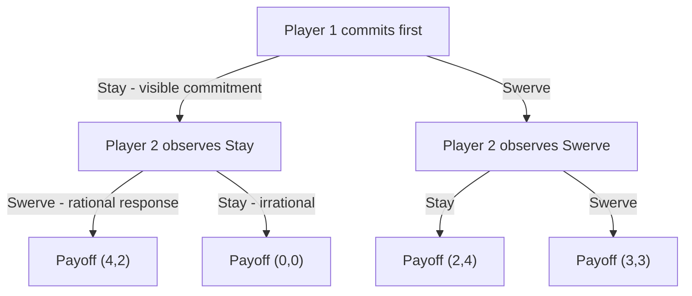

## The Game of Chicken

### Overview

The Game of Chicken (also called Hawk-Dove in evolutionary biology, or Snowdrift Game in ecology) is a two-player, symmetric, non-zero-sum game modeling anti-coordination under mutual threat of catastrophic loss. Unlike the Stag Hunt or Battle of the Sexes, both players prefer to take opposite actions rather than the same action, and the game is defined by an asymmetric, highly costly outcome when both players choose the aggressive strategy simultaneously.

### Origin and Narrative Framing

The canonical narrative involves two drivers heading toward each other on a collision course. Each can **Swerve** (yield) or **Stay** (continue straight, i.e., "dare"). If both swerve, neither loses face and both survive with a modest payoff. If one swerves and the other stays, the one who stays gains prestige ("wins") while the swerver is humiliated ("loses"). If both stay, they crash — the worst possible outcome for both. The name derives from the pejorative "chicken" applied to the driver who swerves.

### Formal Structure

**Players:** Two players, conventionally labeled Player 1 (Row) and Player 2 (Column).

**Strategies:** Each player chooses between **Swerve** ($D$, for Dove/Yield) and **Stay** ($H$, for Hawk/Dare).

**Payoff Matrix (canonical form):**

|  | Player 2: Swerve ($D$) | Player 2: Stay ($H$) |
| --- | --- | --- |
| **Player 1: Swerve ($D$)** | $(3, 3)$ | $(2, 4)$ |
| **Player 1: Stay ($H$)** | $(4, 2)$ | $(0, 0)$ |

The canonical payoff ranking for each player is:

$$\text{Stay while other Swerves} > \text{Both Swerve} > \text{Swerve while other Stays} > \text{Both Stay}$$

i.e., $4 > 3 > 2 > 0$ in the example above. The defining structural feature is that mutual defection ($H,H$) yields the **worst** outcome for both players — this is what distinguishes Chicken from the Prisoner's Dilemma, where mutual defection, while bad, is not the worst possible joint outcome for the defector.

### Key Points

- The game is **anti-coordination**: each player's best response to the opponent's strategy is the *opposite* strategy. Best response to Swerve is Stay; best response to Stay is Swerve.
- There is **no dominant strategy** for either player — optimal play depends entirely on a correct prediction of the opponent's action.
- The $(H,H)$ outcome represents **mutual catastrophic loss**, which is strictly worse for both players than any other cell, making this game a canonical model of brinkmanship and escalation risk.
- Unlike the Stag Hunt (where equilibria are Pareto-ranked) or Battle of the Sexes (where equilibria are payoff-symmetric but preference-conflicting), Chicken's pure equilibria are **asymmetric in payoff distribution** — one player always does strictly better than the other.

### Nash Equilibrium Analysis

The game has **two pure-strategy Nash equilibria** and **one mixed-strategy equilibrium**.

**Pure Strategy Equilibria:**

1. $(H, D)$ — Player 1 stays, Player 2 swerves. Player 1 gets 4, Player 2 gets 2. Neither wants to deviate: Player 1 switching to Swerve yields 3 < 4; Player 2 switching to Stay yields 0 < 2.
2. $(D, H)$ — Player 1 swerves, Player 2 stays. Symmetric reasoning, with payoffs reversed (2, 4).

Both are Nash equilibria, but they favor different players — this asymmetry creates a **distributional conflict** even though both players agree on avoiding $(H,H)$.

**Mixed Strategy Equilibrium:**

Let Player 1 play $H$ with probability $p$, Player 2 play $H$ with probability $q$. Player 2's indifference condition (payoffs from Player 2's perspective, column player):

$$q(3) + (1-q)(4) = q(2) + (1-q)(0)$$

Wait — correctly setting up Player 1's indifference between $D$ and $H$ given Player 2's mixing probability $q$:

$$\underbrace{q(3) + (1-q)(2)}_{\text{Player 1 plays } D} = \underbrace{q(4) + (1-q)(0)}_{\text{Player 1 plays } H}$$

$$3q + 2 - 2q = 4q$$

$$q + 2 = 4q$$

$$q = \frac{2}{3}$$

By symmetry, $p = \frac{2}{3}$ as well. Each player **stays** with probability $\frac{1}{3}$ and **swerves** with probability $\frac{2}{3}$.

**Expected payoff in the mixed equilibrium:**

$$E[\pi_1] = pq(0) + p(1-q)(4) + (1-p)q(2) + (1-p)(1-q)(3)$$

Substituting $p=q=1/3$:

$$E[\pi_1] = \frac{1}{9}(0) + \frac{1}{3}\cdot\frac{2}{3}(4) + \frac{2}{3}\cdot\frac{1}{3}(2) + \frac{2}{3}\cdot\frac{2}{3}(3)$$

$$= \frac{8}{9} + \frac{4}{9} + \frac{12}{9} = \frac{24}{9} = \frac{8}{3} \approx 2.67$$

Both players receive expected payoff $\frac{8}{3}$, which is **below** either player's payoff in either asymmetric pure equilibrium for the "winning" role (4) but above the "losing" role (2) — the mixed equilibrium represents a symmetric compromise, and critically there is a nonzero probability $pq = 1/9$ of mutual catastrophe $(H,H)$ occurring even under equilibrium play.

### Strategic Paradox: Brinkmanship and the Value of Commitment

The central paradox of Chicken is that **appearing irrational or removing one's own options can be strategically advantageous** — a result formalized by Thomas Schelling's theory of credible commitment. If Player 1 can credibly and visibly commit to Stay before Player 2 moves (e.g., by publicly throwing away the steering wheel, a device Schelling used illustratively), the game becomes sequential rather than simultaneous, and Player 2's only rational response is to Swerve, guaranteeing Player 1 the (4,2) outcome.

**[Inference]** This dynamic is frequently invoked to explain escalation behavior in geopolitical brinkmanship (e.g., nuclear deterrence standoffs, labor strikes, trade wars), where publicly reducing one's own flexibility — rather than preserving it — can serve as a rational strategic tool, inverting the usual intuition that more options are always better.

A related paradox is that **mutual awareness of the catastrophic $(H,H)$ payoff does not eliminate the risk of its occurrence**, since correlated misjudgment, incomplete information about the opponent's resolve, or simultaneous commitment attempts by both players can still produce the worst-case outcome — this is a key model for analyzing crisis instability.

### Comparison to Related Games

| Game | Coordination Motive | Preference Alignment | Worst Outcome |
| --- | --- | --- | --- |
| Chicken (Hawk-Dove) | No (anti-coordination) | Conflicting | Mutual aggression $(H,H)$ |
| Battle of the Sexes | Yes (coordination) | Conflicting | Miscoordination |
| Stag Hunt | Yes (coordination) | Aligned | Miscoordination |
| Prisoner's Dilemma | No | Aligned on risk | Mutual defection (but not worst possible for defector) |

The critical distinction from the **Prisoner's Dilemma** is that in Chicken, Stay (the aggressive strategy) is not a dominant strategy — its payoff depends on the opponent's action — whereas in the Prisoner's Dilemma, Defect dominates regardless of the opponent's choice.

### Variants and Extensions

**Hawk-Dove Game (Evolutionary Biology):** The same payoff structure applied to animal conflict over a contested resource, developed by Maynard Smith and Price. Used to derive the concept of the **Evolutionarily Stable Strategy (ESS)**, where the mixed-strategy equilibrium corresponds to a stable polymorphic population mix of Hawk and Dove phenotypes, or equivalently a stable mixed strategy adopted by each individual.

**Snowdrift Game (Ecology/Sociology):** A cooperation-focused reframing where "cooperation" (Swerve-analog) yields a shared benefit even under unilateral action, often used to model public goods provision with partial free-riding tolerance.

**Chicken with Incomplete Information:** Bayesian variants where players are uncertain of the opponent's payoffs or resolve, central to formal crisis bargaining and deterrence models in international relations (e.g., work building on Schelling and later formalized in the international relations literature).

**Repeated Chicken:** Under repetition, players may develop reputations for resolve or use tit-for-tat-style alternation to distribute the (4,2)/(2,4) outcomes fairly over time, similar to repeated Battle of the Sexes.

### Game Tree (Sequential/Commitment Variant)

### Payoff Structure and Equilibria Illustration (svg_diagram)

<svg xmlns="http://www.w3.org/2000/svg" viewBox="0 0 480 380">
<text x="240" y="24" font-size="16" font-weight="bold" text-anchor="middle" fill="#222">Game of Chicken: Payoff Space (svg_diagram)</text>
<line x1="60" y1="320" x2="440" y2="320" stroke="#333" stroke-width="2" />
<line x1="60" y1="320" x2="60" y2="50" stroke="#333" stroke-width="2" />
<text x="440" y="340" font-size="13" text-anchor="middle" fill="#333">Player 1 Payoff</text>
<text x="25" y="50" font-size="13" text-anchor="middle" fill="#333" transform="rotate(-90 25 185)">Player 2 Payoff</text>
<circle cx="150" cy="140" r="7" fill="#22aa55" />
<text x="160" y="135" font-size="12" fill="#22aa55">(D,D)=(3,3) Both Swerve</text>
<circle cx="380" cy="200" r="7" fill="#2266cc" />
<text x="330" y="185" font-size="12" fill="#2266cc">(H,D)=(4,2) Eq 1</text>
<circle cx="200" cy="80" r="7" fill="#cc4422" />
<text x="210" y="75" font-size="12" fill="#cc4422">(D,H)=(2,4) Eq 2</text>
<circle cx="60" cy="320" r="8" fill="#000000" />
<text x="70" y="315" font-size="12" fill="#000000">(H,H)=(0,0) Catastrophe</text>
<line x1="380" y1="200" x2="200" y2="80" stroke="#999" stroke-dasharray="4,3" />
<text x="270" y="130" font-size="11" fill="#666">Pareto frontier (asymmetric eq.)</text>
</svg>

### Applications

- **International Relations / Deterrence Theory:** Nuclear brinkmanship, military standoffs, and crisis bargaining, where mutual escalation risks catastrophic outcomes worse than any unilateral concession — foundational to Schelling's *The Strategy of Conflict* (1960).
- **Evolutionary Biology:** The Hawk-Dove model explains stable polymorphic strategies in animal contests over territory or mates without resorting to group-selection arguments.
- **Labor and Trade Negotiations:** Strikes, lockouts, and trade wars, where both parties incur losses if neither concedes, but conceding first carries reputational cost.
- **Corporate Strategy:** Price wars and market-entry standoffs, where simultaneous aggressive commitment by competing firms can destroy value for both.

### Conclusion

The Game of Chicken formalizes the strategic logic of brinkmanship: anti-coordination games where the worst outcome arises from mutual escalation, and where credible commitment — counterintuitively, the deliberate removal of one's own flexibility — can secure a favorable equilibrium. It complements the Stag Hunt and Battle of the Sexes as a canonical 2x2 game, uniquely illustrating how rational actors can be locked into strategic environments where restraint is punished and unilateral resolve is rewarded, at the systemic risk of catastrophic mutual loss.

**Related Topics**

- Schelling's theory of credible commitment and brinkmanship
- Hawk-Dove game and Evolutionarily Stable Strategy (ESS)
- Snowdrift game and public goods provision
- Nuclear deterrence and crisis bargaining models
- Battle of the Sexes (contrast: coordination vs. anti-coordination)
- Stag Hunt (contrast: aligned vs. conflicting preferences)
- Correlated equilibrium and mixed-strategy risk
- Incomplete information games and Bayesian Nash equilibrium