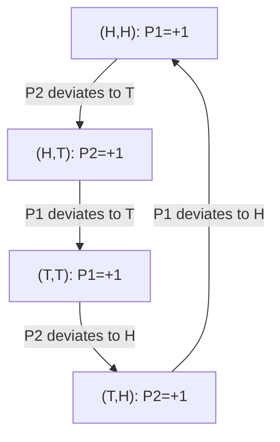

## Matching Pennies

### Overview

Matching Pennies is a two-player, zero-sum game in classical game theory that serves as the canonical example of a game with **no pure-strategy Nash equilibrium**, requiring mixed strategies to resolve. It models strictly opposed interests — one player wants outcomes to match, the other wants them to differ — and is foundational for illustrating strict competition, minimax reasoning, and the necessity of unpredictability in optimal play.

### Origin and Narrative Framing

Two players, conventionally called the **Matcher** and the **Mismatcher** (or simply Player 1 and Player 2), each simultaneously choose to show a coin as **Heads** ($H$) or **Tails** ($T$). If the coins match (both Heads or both Tails), Player 1 wins Player 2's penny. If the coins differ, Player 2 wins Player 1's penny. The name reflects this literal coin-matching wager.

### Formal Structure

**Players:** Two players, Player 1 (Row, the Matcher) and Player 2 (Column, the Mismatcher).

**Strategies:** Each player chooses between $H$ (Heads) and $T$ (Tails).

**Payoff Matrix (canonical zero-sum form, Player 1's payoff shown; Player 2's payoff is the negative):**

|  | Player 2: $H$ | Player 2: $T$ |
| --- | --- | --- |
| **Player 1: $H$** | $(+1, -1)$ | $(-1, +1)$ |
| **Player 1: $T$** | $(-1, +1)$ | $(+1, -1)$ |

This is a **strictly competitive (zero-sum) game**: for every outcome, $\pi_1 + \pi_2 = 0$. Player 1 gains exactly what Player 2 loses, and vice versa.

### Key Points

- The game has **no pure-strategy Nash equilibrium**. For any pure strategy pair, at least one player has a profitable unilateral deviation, so no cell in the matrix is stable.
- The game is **zero-sum**, making it strictly competitive: there is no scope for mutual gain or coordination, unlike Battle of the Sexes, Stag Hunt, or Chicken.
- Optimal play requires **randomization**: any predictable pattern can be exploited by the opponent, so unpredictability itself has strategic value.
- The game is **symmetric in structure** but **completely adversarial in interest** — the two players' preferences over outcomes are perfectly opposed at every cell.

### Nash Equilibrium Analysis

**Why no pure equilibrium exists:**

Consider $(H, H)$: Player 1 gets $+1$. Player 2, however, would prefer to deviate to $T$, gaining $+1$ instead of $-1$. So Player 2 deviates, moving to $(H, T)$. But now Player 1 prefers to switch to $T$, gaining $+1$ instead of $-1$, moving to $(T, T)$. Player 2 then prefers to switch back to $H$, and the cycle continues indefinitely — this cyclical best-response pattern is the signature of a game lacking a pure equilibrium.

**Mixed Strategy Equilibrium:**

Let Player 1 play $H$ with probability $p$, Player 2 play $H$ with probability $q$.

Player 2's expected payoff from playing $H$: $p(-1) + (1-p)(1) = 1 - 2p$

Player 2's expected payoff from playing $T$: $p(1) + (1-p)(-1) = 2p - 1$

Player 2 is indifferent when:

$$1 - 2p = 2p - 1 \implies p = \frac{1}{2}$$

By the symmetric argument applied to Player 1's indifference condition over Player 2's mixing probability $q$:

$$q = \frac{1}{2}$$

The unique Nash equilibrium is $p = q = \frac{1}{2}$: **each player randomizes uniformly between Heads and Tails**.

**Expected payoff in equilibrium:**

$$E[\pi_1] = pq(1) + p(1-q)(-1) + (1-p)q(-1) + (1-p)(1-q)(1)$$

Substituting $p=q=1/2$:

$$E[\pi_1] = \frac{1}{4}(1) + \frac{1}{4}(-1) + \frac{1}{4}(-1) + \frac{1}{4}(1) = 0$$

The expected payoff to both players is exactly $0$ — consistent with the zero-sum structure and reflecting that neither player has any advantage under optimal play.

### Minimax Theorem and Strategic Equivalence

Matching Pennies is the textbook illustration of **von Neumann's Minimax Theorem** (1928), which guarantees that every finite two-player zero-sum game has a solution in mixed strategies where the maximin value equals the minimax value — the **value of the game**.

For Matching Pennies, this value is $0$, meaning the game is **fair** in the sense that neither player has an inherent advantage when both play optimally. Formally:

$$\max_p \min_q E[\pi_1(p,q)] = \min_q \max_p E[\pi_1(p,q)] = 0$$

The mixed-strategy Nash equilibrium in a zero-sum game **coincides exactly** with the minimax/maximin solution, a special property of zero-sum games not guaranteed in general (non-zero-sum) games such as Battle of the Sexes or Stag Hunt.

### Strategic Paradox: The Necessity of Unpredictability

The core conceptual insight of Matching Pennies is that **optimal strategy requires deliberate randomization, not deterministic reasoning**. In contrast to games with dominant strategies or Pareto-improvable coordination points, here any deterministic rule a player commits to — no matter how sophisticated — can in principle be anticipated and exploited by a sufficiently informed opponent.

**[Inference]** This generalizes to a broader class of adversarial real-world settings (security patrols, penalty kicks in soccer, auditing strategies, cybersecurity intrusion detection) where the theoretically optimal policy is characterized by an unpredictability constraint rather than a single "best" deterministic action — sometimes referred to as the **principle of strategic indifference**, since in equilibrium each player is exactly indifferent between their pure strategies, which is precisely what sustains the randomization as an equilibrium.

### Empirical Note

**[Unverified]** Experimental studies of human play in repeated Matching Pennies-type games (e.g., in laboratory settings and professional sports contexts such as soccer penalty kicks) have been used to test whether real subjects approximate the minimax mixed-strategy prediction; findings on the degree of convergence to exact 50/50 randomization vary across studies and populations, and specific quantitative results should be treated as context-dependent rather than universal.

### Comparison to Related Games

| Game | Sum Type | Pure Equilibrium? | Interests |
| --- | --- | --- | --- |
| Matching Pennies | Zero-sum | No | Strictly opposed |
| Battle of the Sexes | Non-zero-sum | Yes (2 pure + 1 mixed) | Conflicting but coordination-seeking |
| Stag Hunt | Non-zero-sum | Yes (2 pure + 1 mixed) | Aligned |
| Chicken | Non-zero-sum | Yes (2 pure + 1 mixed) | Conflicting, anti-coordination |
| Rock-Paper-Scissors | Zero-sum | No | Strictly opposed (3-strategy generalization) |

Matching Pennies is the simplest possible representative of the broader class of zero-sum games lacking pure equilibria; **Rock-Paper-Scissors** is its natural three-strategy generalization, sharing the cyclical best-response structure.

### Variants and Extensions

**Asymmetric (Biased) Matching Pennies:** Altering the payoffs so matches and mismatches are not equally valuable changes the equilibrium mixing probabilities away from $\frac{1}{2}$, but the game remains zero-sum and still lacks a pure equilibrium provided the cyclical best-response structure is preserved.

**Repeated Matching Pennies:** Under repetition with observed history, deviation from uniform randomization by one player can, in principle, be exploited by an opponent tracking patterns — motivating study of adaptive learning algorithms (e.g., fictitious play) and their convergence properties in zero-sum settings.

**Matching Pennies with Correlated Devices:** Introducing a public randomization device does not change the equilibrium value in a two-player zero-sum game (unlike in Battle of the Sexes, where correlated equilibria can improve on the mixed Nash outcome), since there is no scope for mutual gain to exploit.

**O'Neill's Card Game:** A four-strategy extension of Matching Pennies developed by Barry O'Neill (1987), used as one of the first controlled experimental tests of minimax play with human subjects.

### Game Tree / Best-Response Cycle

### Payoff Space and Equilibrium Illustration (svg_diagram)

<svg xmlns="http://www.w3.org/2000/svg" viewBox="0 0 480 380">
<text x="240" y="24" font-size="16" font-weight="bold" text-anchor="middle" fill="#222">Matching Pennies: No Pure Equilibrium (svg_diagram)</text>
<line x1="240" y1="340" x2="240" y2="50" stroke="#333" stroke-width="2" />
<line x1="60" y1="200" x2="440" y2="200" stroke="#333" stroke-width="2" />
<text x="440" y="220" font-size="12" text-anchor="middle" fill="#333">Player 1 Payoff</text>
<text x="255" y="55" font-size="12" fill="#333">Player 2 Payoff</text>
<circle cx="330" cy="130" r="7" fill="#2266cc" />
<text x="340" y="125" font-size="12" fill="#2266cc">(H,H)=(+1,-1)</text>
<circle cx="150" cy="270" r="7" fill="#cc4422" />
<text x="90" y="290" font-size="12" fill="#cc4422">(H,T)=(-1,+1)</text>
<circle cx="330" cy="270" r="7" fill="#22aa55" />
<text x="340" y="290" font-size="12" fill="#22aa55">(T,T)=(+1,-1)</text>
<circle cx="150" cy="130" r="7" fill="#996600" />
<text x="90" y="120" font-size="12" fill="#996600">(T,H)=(-1,+1)</text>
<circle cx="240" cy="200" r="6" fill="#000000" />
<text x="248" y="195" font-size="12" fill="#000000">Mixed Eq (1/2,1/2)</text>
<text x="248" y="210" font-size="11" fill="#000000">Value = 0</text>
</svg>

### Applications

- **Security and Patrol Games:** Optimal randomized patrol scheduling to prevent predictable exploitation by adversaries, directly modeled on the minimax logic of Matching Pennies (e.g., Stackelberg security game extensions used in airport and infrastructure protection).
- **Sports Strategy:** Penalty kicks in soccer (kicker's shot direction vs. goalkeeper's dive direction) are widely used as a natural real-world analogue for testing mixed-strategy equilibrium predictions.
- **Cryptography and Adversarial Systems:** Randomized protocols where predictability constitutes a security vulnerability draw directly on the same unpredictability logic.
- **Auditing and Enforcement:** Tax audits, quality inspections, and compliance-checking strategies where the auditee's incentive to violate rules depends on the auditor's (ideally unpredictable) inspection strategy.

### Conclusion

Matching Pennies establishes the essential game-theoretic principle that not every strategic interaction admits a stable deterministic solution — some games are resolved only through calculated randomization. As the simplest zero-sum game without a pure-strategy equilibrium, it directly motivates the Minimax Theorem and demonstrates that in purely adversarial settings, unpredictability is not a failure of rational planning but its optimal expression.

**Related Topics**

- Von Neumann's Minimax Theorem
- Rock-Paper-Scissors and cyclical best-response games
- Zero-sum game theory and linear programming duality
- Mixed-strategy equilibrium computation
- Stackelberg security games
- Fictitious play and learning in zero-sum games
- O'Neill's card game (experimental minimax testing)
- Correlated equilibrium (contrast: no benefit in zero-sum games)