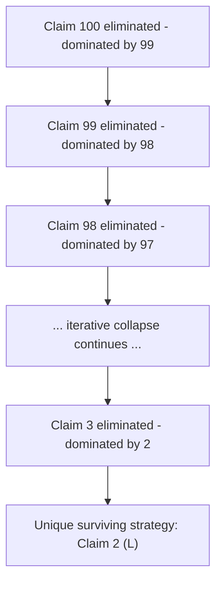

## The Traveler's Dilemma

### Overview

The Traveler's Dilemma is a two-player simultaneous-move game introduced by economist Kaushik Basu in 1994. It is a canonical example in behavioral and theoretical game theory illustrating a sharp divergence between the unique Nash equilibrium prediction and empirically observed human behavior, and is frequently cited as a paradox challenging the descriptive adequacy of backward induction and iterated dominance reasoning.

### Origin and Narrative Framing

Two travelers have identical antiques damaged by an airline and must independently claim a repair cost between two fixed bounds (e.g., $2 and $100). The airline does not know the true value, so it institutes a rule: if both travelers claim the same amount, both are reimbursed that amount. If the claims differ, both are reimbursed the **lower** of the two claims, with a small bonus $R$ added to the lower claimant and the same amount subtracted from the higher claimant — creating an incentive to undercut the other player.

### Formal Structure

**Players:** Two travelers, Player 1 and Player 2.

**Strategy space:** Each player simultaneously names an integer claim $s_i \in [L, H]$, typically $[2, 100]$.

**Payoff function**, given claims $s_1, s_2$ and bonus/penalty parameter $R$ (commonly $R = 2$):

$$\pi_i =
\begin{cases}
s_i & \text{if } s_1 = s_2 \\
\min(s_1, s_2) + R & \text{if } s_i < s_j \\
\min(s_1, s_2) - R & \text{if } s_i > s_j
\end{cases}$$

The player who claims the **lower** amount receives that amount plus the bonus $R$; the player who claims the **higher** amount receives the lower amount minus the penalty $R$. Equal claims are simply paid at face value.

### Key Points

- The game has a **unique Nash equilibrium in dominant strategies**: both players claim the **lowest possible value**, $L$ (e.g., $2), regardless of the bonus/penalty size $R$.
- This equilibrium is reached via **iterated elimination of dominated strategies**: claiming $H$ (100) is dominated by claiming $H-1$ (99), which is dominated by $H-2$ (98), and so on recursively down to $L$.
- Despite the sharp theoretical prediction, **experimental behavior consistently deviates dramatically**, with human subjects frequently claiming amounts near the maximum $H$, especially when $R$ is small — a well-documented empirical anomaly in behavioral game theory.
- The size of the penalty/bonus parameter $R$ has a **strong and counterintuitive effect on real-world deviation from equilibrium**: smaller $R$ values are empirically associated with claims closer to $H$, even though the Nash equilibrium remains $L$ regardless of $R$'s magnitude (as long as $R > 0$).

### Nash Equilibrium and Iterated Dominance Analysis

**Step-by-step elimination:**

Suppose Player 1 believes Player 2 might claim $H = 100$. Player 1's best response is to claim $H - 1 = 99$, since undercutting by 1 guarantees the reward $R$ rather than matching at 100. This reasoning applies symmetrically to Player 2.

Since claiming 100 is now **strictly dominated** by claiming 99 for both players (99 weakly or strictly outperforms 100 against every possible opposing claim), rational players eliminate 100 from consideration. But once 100 is eliminated, the same logic applies to 99 relative to 98, and so on, iteratively collapsing the strategy space until only $L$ remains.

Formally, this is a demonstration of **iterated elimination of strictly dominated strategies (IESDS)** converging to a unique surviving strategy profile — the hallmark of a dominance-solvable game.

**Nash Equilibrium:** $(s_1^*, s_2^*) = (L, L)$, e.g., $(2, 2)$, yielding a payoff of $L$ to both players — a strikingly low payoff compared to the Pareto-optimal outcome of both claiming $H$, which would yield $H$ to both.

### The Central Paradox: Equilibrium vs. Empirical Behavior

The Traveler's Dilemma is significant precisely because its **game-theoretically "rational" solution is Pareto-dominated by nearly every other feasible outcome**, and extensive experimental evidence shows humans do not converge to it.

**[Unverified]** Experimental studies (notably by Capra, Goeree, Gomez, and Holt, 1999, and subsequent replications) have found that when the penalty/reward parameter $R$ is small relative to the claim range, subjects predominantly claim values close to $H$, achieving payoffs far exceeding the Nash prediction; when $R$ is large, observed claims shift closer to the equilibrium value $L$. Exact quantitative findings (specific average claims, convergence rates) vary across studies, experimental populations, and stake sizes, and should be treated as illustrative rather than universally fixed figures.

This creates a genuine theoretical puzzle: classical game theory predicts a unique, sharp outcome via a valid and seemingly airtight logical chain (iterated dominance), yet this prediction is one of the most robustly falsified equilibrium predictions in experimental economics. The game is frequently used to motivate and test alternative solution concepts, including:

- **Level-$k$ reasoning models**, where players are assumed to perform only a bounded number of iterations of strategic reasoning rather than the full iterated dominance chain.
- **Quantal Response Equilibrium (QRE)**, developed by McKelvey and Palfrey, which models players as noisy best-responders rather than perfect optimizers, and fits observed Traveler's Dilemma data substantially better than the strict Nash prediction.
- **Social preference / altruism-based models**, positing that deviation reflects preferences for mutual benefit or trust rather than reasoning failure.

**[Inference]** The gap between the dominance-solvable equilibrium and observed play is often interpreted as evidence that strict common knowledge of rationality — an assumption underlying iterated dominance — is a poor descriptive model of actual strategic cognition, rather than as evidence that the equilibrium derivation itself is flawed.

### Sensitivity to the Penalty Parameter $R$

A notable structural feature is that the **equilibrium claim is invariant to $R$** (always $L$, for any $R > 0$), while **experimentally observed claims are highly sensitive to $R$**. This dissociation between the theoretical prediction's parameter-invariance and the empirical result's strong parameter-dependence is itself a widely cited illustration of the limits of pure Nash equilibrium analysis for predicting real-world strategic behavior, and has motivated substantial work in behavioral and experimental game theory.

### Comparison to Related Games

| Game | Equilibrium Type | Pareto-Optimality of Equilibrium | Empirical Fit |
| --- | --- | --- | --- |
| Traveler's Dilemma | Unique (dominance-solvable) | Poor (equilibrium is worst outcome) | Poor — strong deviation |
| Prisoner's Dilemma | Unique (dominant strategy) | Poor (mutual defection) | Moderate — some cooperation observed |
| Matching Pennies | Unique (mixed) | N/A (zero-sum) | Reasonably consistent with minimax |
| Stag Hunt | Multiple (2 pure + mixed) | Payoff-dominant equilibrium exists | Depends on risk/trust framing |

The Traveler's Dilemma is often described as a "more paradoxical" cousin of the **Prisoner's Dilemma**: both have equilibria that are Pareto-dominated by cooperation, but the Traveler's Dilemma equilibrium is reached via *iterated* dominance across a large (or continuous) strategy space rather than single-step dominance, making the divergence from intuitive cooperative behavior even more pronounced and the underlying logical chain more fragile to bounded rationality.

### Variants and Extensions

**Continuous Traveler's Dilemma:** Using a continuous claim interval $[L, H]$ rather than integers preserves the same qualitative equilibrium structure and dominance-solvability.

**Traveler's Dilemma with Bounded Reasoning (Level-k models):** Assumes players perform only $k$ rounds of iterated best-response reasoning from an initial anchor (often the maximum claim $H$), generating predictions that more closely match experimental data than full common-knowledge-of-rationality models.

**Asymmetric Traveler's Dilemma:** Variants with asymmetric penalty structures or asymmetric claim bounds between the two players, used to study robustness of the qualitative dominance-solvability result.

**Traveler's Dilemma in Mechanism Design:** Basu's original framing was partly a critique of mechanism design approaches that rely on strict dominant-strategy implementation, illustrating that theoretically "optimal" mechanisms can produce poor real-world outcomes if agents do not reason via full iterated dominance.

### Iterated Dominance Collapse Diagram

### Payoff Function Illustration (svg_diagram)

<svg xmlns="http://www.w3.org/2000/svg" viewBox="0 0 480 360">
<text x="240" y="24" font-size="16" font-weight="bold" text-anchor="middle" fill="#222">Traveler's Dilemma: Equilibrium vs Observed Claims (svg_diagram)</text>
<line x1="60" y1="300" x2="440" y2="300" stroke="#333" stroke-width="2" />
<line x1="60" y1="300" x2="60" y2="50" stroke="#333" stroke-width="2" />
<text x="440" y="320" font-size="12" text-anchor="middle" fill="#333">Claim Value (2 to 100)</text>
<text x="25" y="50" font-size="12" text-anchor="middle" fill="#333" transform="rotate(-90 25 175)">Payoff</text>
<circle cx="75" cy="285" r="7" fill="#cc4422" />
<text x="85" y="280" font-size="12" fill="#cc4422">Nash Equilibrium (2,2) = payoff 2</text>
<circle cx="410" cy="90" r="7" fill="#2266cc" />
<text x="330" y="80" font-size="12" fill="#2266cc">Pareto-optimal (100,100) = payoff 100</text>
<rect x="200" y="150" width="140" height="40" fill="#e8f4ea" stroke="#22aa55" />
<text x="270" y="175" font-size="11" text-anchor="middle" fill="#22aa55">Observed human claims</text>
<text x="270" y="188" font-size="10" text-anchor="middle" fill="#22aa55">cluster near high end (small R)</text>
<line x1="60" y1="300" x2="440" y2="90" stroke="#999" stroke-dasharray="4,3" />
<text x="350" y="230" font-size="10" fill="#666">Equal-claim payoff line</text>
</svg>

### Applications

- **Behavioral Economics Testing Ground:** One of the most frequently replicated experiments demonstrating systematic departure from Nash equilibrium predictions, used extensively in teaching to motivate bounded rationality models.
- **Mechanism Design Critique:** Basu's original motivation was to caution against mechanisms relying purely on dominant-strategy/iterated-dominance implementation without accounting for real agent cognition.
- **Auction and Procurement Design:** Analogous undercutting dynamics appear in sealed-bid procurement settings, informing caution around mechanisms with unbounded incentive to undercut.
- **Level-k and Cognitive Hierarchy Modeling:** Serves as a primary testbed for calibrating bounded-reasoning models used more broadly in behavioral game theory and experimental auction design.

### Conclusion

The Traveler's Dilemma demonstrates that a logically valid, uniquely determined Nash equilibrium derived through iterated dominance can be strikingly poor at predicting actual human strategic behavior, particularly when the equilibrium is far from the Pareto-optimal outcome and the punishment for deviation is small. It stands as one of the most cited paradoxes bridging classical equilibrium theory and behavioral/experimental game theory, motivating solution concepts such as level-$k$ reasoning and Quantal Response Equilibrium that better accommodate bounded rationality.

**Related Topics**

- Iterated elimination of strictly dominated strategies (IESDS)
- Level-k reasoning and cognitive hierarchy models
- Quantal Response Equilibrium (McKelvey & Palfrey)
- Prisoner's Dilemma (contrast: single-step vs. iterated dominance)
- Behavioral game theory and experimental economics methodology
- Mechanism design and dominant-strategy implementation
- Bounded rationality in strategic reasoning
- Basu's original 1994 formulation and subsequent literature