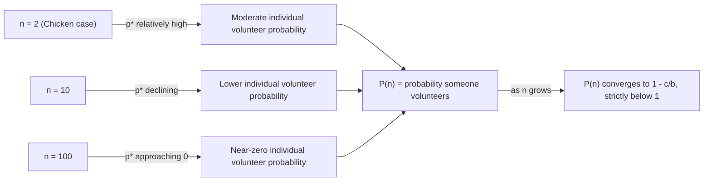

## The Volunteer's Dilemma

### Overview

The Volunteer's Dilemma is an $n$-player game modeling situations where a public good is provided if and only if at least one individual incurs a private cost to "volunteer," while all others benefit regardless of whether they contribute. Introduced formally by Andreas Diekmann in 1985, it generalizes the two-player Game of Chicken to arbitrary group sizes and is a foundational model in the study of collective action, bystander behavior, and diffusion of responsibility.

### Origin and Narrative Framing

The canonical narrative involves a group of $n$ individuals who each observe a shared problem requiring action (e.g., calling emergency services after witnessing an incident, one neighbor fixing a shared piece of broken equipment, or a single firm absorbing a regulatory compliance cost that benefits the whole industry). If at least one person volunteers (incurs a fixed cost $c$), everyone receives the benefit $b$. If no one volunteers, everyone receives nothing. Diekmann developed the model partly to formalize the bystander effect documented in social psychology, notably the Kitty Genovese case discussed by Latané and Darley.

### Formal Structure

**Players:** $n \geq 2$ players.

**Strategies:** Each player simultaneously chooses to **Volunteer** ($V$) or **Not Volunteer** ($N$).

**Payoffs:**

$$\pi_i =
\begin{cases}
b - c & \text{if player } i \text{ volunteers} \\
b & \text{if player } i \text{ does not volunteer, but at least one other player does} \\
0 & \text{if no one volunteers}
\end{cases}$$

where $b > c > 0$ (the benefit exceeds the cost, so volunteering by someone is always socially efficient, but the benefit obtained by free-riding, $b$, strictly exceeds the net payoff from volunteering, $b - c$).

**Two-player special case:** With $n=2$, this payoff structure is formally equivalent to the Game of Chicken, with Volunteer corresponding to Swerve and Not Volunteer corresponding to Stay.

### Key Points

- The game has **no symmetric pure-strategy Nash equilibrium** when players are treated as needing to follow the same strategy, but it has **multiple asymmetric pure-strategy equilibria**: any profile where exactly one player volunteers and all others free-ride is a Nash equilibrium.
- The unique **symmetric equilibrium is in mixed strategies**, where each player volunteers with the same probability $p^*$.
- The central paradox is that **individual probability of volunteering, and the group's overall probability that someone volunteers, both decrease as group size $n$ increases** — the formal game-theoretic counterpart of the **bystander effect**.
- Unlike Prisoner's Dilemma, cost-benefit parameters here ($b > c$) mean that volunteering is always jointly efficient; the inefficiency arises purely from strategic under-provision due to free-riding incentives, not from a dominant "defect" strategy.

### Nash Equilibrium Analysis

**Asymmetric Pure Strategy Equilibria:**

Any profile where exactly one player $i$ volunteers and the remaining $n-1$ players do not volunteer is a Nash equilibrium. Player $i$'s payoff is $b-c$; deviating to Not Volunteer would yield $0$ (since no one else volunteers), and $b - c > 0$, so $i$ has no incentive to deviate. Each non-volunteering player receives $b$; deviating to Volunteer would reduce their payoff to $b-c < b$, so they also have no incentive to deviate. There are $n$ such asymmetric equilibria (one for each possible volunteer), but the game provides no mechanism to select which player takes on the cost — an equilibrium selection problem structurally related to that in Battle of the Sexes.

**Symmetric Mixed Strategy Equilibrium:**

Let each player volunteer independently with probability $p$. A given player is indifferent between volunteering and not volunteering when the expected payoff from not volunteering equals the guaranteed payoff from volunteering.

The probability that **none** of the other $n-1$ players volunteer is $(1-p)^{n-1}$. A player who does not volunteer receives $b$ if at least one other volunteers, and $0$ otherwise:

$$E[\pi_i \mid N] = b\left[1-(1-p)^{n-1}\right]$$

Setting this equal to the guaranteed volunteering payoff $b - c$:

$$b\left[1-(1-p)^{n-1}\right] = b - c$$

$$1-(1-p)^{n-1} = 1 - \frac{c}{b}$$

$$(1-p)^{n-1} = \frac{c}{b}$$

$$p^* = 1 - \left(\frac{c}{b}\right)^{\frac{1}{n-1}}$$

This is the **individual equilibrium probability of volunteering** as a function of group size $n$ and the cost-benefit ratio $\frac{c}{b}$.

### The Central Paradox: Diffusion of Responsibility

**Probability that at least one person volunteers**, denoted $P(n)$:

$$P(n) = 1 - (1-p^*)^n = 1 - \left(\frac{c}{b}\right)^{\frac{n}{n-1}}$$

**[Inference]** As $n \to \infty$, the exponent $\frac{n}{n-1} \to 1$, so $P(n) \to 1 - \frac{c}{b}$, a constant strictly less than 1 whenever $c > 0$. Critically, $P(n)$ is **decreasing in $n$**: larger groups are, in equilibrium, *less* likely to produce a volunteer overall, even though more potential volunteers are present. This is the formal game-theoretic derivation of the **bystander effect**: the mixed-strategy Nash equilibrium predicts that individual probability of helping decreases sharply with group size, and the aggregate probability of anyone helping also declines, contradicting a naive intuition that "more witnesses means someone is more likely to act."

Simultaneously, each individual's own equilibrium probability of volunteering $p^*$ strictly decreases as $n$ increases (since $\left(\frac{c}{b}\right)^{1/(n-1)}$ increases toward $1$ as $n$ grows, making $p^* = 1 - (\cdot)$ shrink toward $0$), formalizing **diffusion of responsibility**: each individual becomes less willing to shoulder the cost as the pool of potential alternative volunteers grows, reasoning that someone else is increasingly likely to step in — yet in aggregate this individually rational restraint compounds into a lower overall probability that the good is provided at all.

### Comparison to Related Games

| Game | Players | Equilibrium Structure | Core Phenomenon |
| --- | --- | --- | --- |
| Volunteer's Dilemma | $n \geq 2$ | Asymmetric pure + symmetric mixed | Diffusion of responsibility |
| Chicken (Hawk-Dove) | 2 | Asymmetric pure + symmetric mixed | Brinkmanship (n=2 special case) |
| Public Goods Game | $n \geq 2$ | Free-riding (often unique) | Continuous contribution free-riding |
| Stag Hunt | 2 (or $n$) | Multiple pure, Pareto-ranked | Trust and payoff- vs. risk-dominance |

The Volunteer's Dilemma differs from the standard linear **Public Goods Game** in that provision is a **step function** (the good is provided in full if even one person contributes, with no additional benefit from multiple volunteers), rather than a continuous, additive contribution mechanism — this discreteness is what produces the sharp free-riding-driven decline in $P(n)$ as $n$ grows, rather than the smoother under-provision typically modeled in linear public goods settings.

### Variants and Extensions

**Volunteer's Dilemma with Heterogeneous Costs:** Players face different costs $c_i$ of volunteering; equilibrium analysis shows the player with the lowest cost is most likely to volunteer in asymmetric equilibrium refinements, connecting to models of comparative advantage in collective action.

**Repeated Volunteer's Dilemma:** Under repetition, groups may develop implicit rotation norms or reputational mechanisms to distribute the volunteering cost more evenly over time, partially mitigating the single-shot under-provision result.

**Volunteer's Dilemma with Incomplete Information:** Bayesian variants where players are uncertain of others' costs or the true value of $b$, used to study more realistic bystander scenarios where the severity of the situation itself is uncertain.

**Threshold Public Goods / Volunteer's Dilemma:** Generalizes the "at least one volunteer" condition to "at least $k$ volunteers required," interpolating between the Volunteer's Dilemma ($k=1$) and standard public goods provision.

### Comparative Statics: Probability of Volunteering vs. Group Size

### Bystander Effect Illustration (svg_diagram)

<svg xmlns="http://www.w3.org/2000/svg" viewBox="0 0 480 360">
<text x="240" y="24" font-size="16" font-weight="bold" text-anchor="middle" fill="#222">Volunteer's Dilemma: Group Size vs Probability (svg_diagram)</text>
<line x1="60" y1="300" x2="440" y2="300" stroke="#333" stroke-width="2" />
<line x1="60" y1="300" x2="60" y2="50" stroke="#333" stroke-width="2" />
<text x="440" y="320" font-size="12" text-anchor="middle" fill="#333">Group Size (n)</text>
<text x="25" y="50" font-size="12" text-anchor="middle" fill="#333" transform="rotate(-90 25 175)">Probability</text>
<path d="M 90 100 Q 200 220 420 260" stroke="#2266cc" stroke-width="2" fill="none" />
<text x="300" y="230" font-size="11" fill="#2266cc">Individual p* (declining)</text>
<path d="M 90 130 Q 200 150 420 165" stroke="#cc4422" stroke-width="2" fill="none" />
<text x="300" y="150" font-size="11" fill="#cc4422">P(n) at least one volunteers</text>
<line x1="60" y1="165" x2="440" y2="165" stroke="#999" stroke-dasharray="3,3" />
<text x="70" y="160" font-size="10" fill="#666">Asymptote: 1 - c/b</text>
</svg>

### Applications

- **Bystander Intervention Research:** Direct formal grounding for the psychological "bystander effect" documented by Latané and Darley, providing a rational-choice complement to purely psychological explanations.
- **Emergency Response and Public Safety:** Modeling why larger crowds can paradoxically reduce the likelihood of any individual calling for help or intervening.
- **Corporate Governance and Regulatory Compliance:** Explaining under-provision of costly whistleblowing or compliance actions in large organizations where any single employee could act but each expects another to do so.
- **Open-Source Software and Volunteer Communities:** Modeling why critical but costly maintenance tasks (e.g., security patching) in large contributor communities can be under-provided despite many capable potential contributors.

### Conclusion

The Volunteer's Dilemma formalizes how individually rational free-riding incentives in a discrete, step-function public goods setting produce the counterintuitive result that larger groups are less likely — not more likely — to generate a needed volunteer. It bridges game theory and social psychology by providing a rigorous equilibrium derivation of the bystander effect and diffusion of responsibility, and generalizes the two-player Game of Chicken to arbitrary group sizes with an explicit, testable formula for how volunteering probability scales with group size and the cost-benefit ratio.

**Related Topics**

- Bystander effect and diffusion of responsibility (Latané & Darley)
- Game of Chicken (two-player special case)
- Public goods games and free-riding
- Threshold public goods models
- Diekmann's original 1985 formulation
- Heterogeneous-cost volunteer models
- Collective action problems (Olson)
- Bayesian games and incomplete information extensions