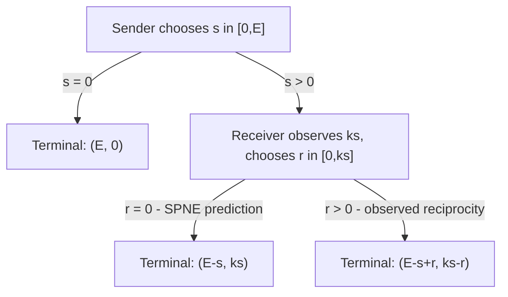

## The Trust Game

### Overview

The Trust Game (also known as the Investment Game) is a two-player sequential game introduced by Berg, Dickhaut, and McCabe in 1995, designed to formally model and experimentally measure trust and trustworthiness as distinct from pure altruism or risk preferences. It is a canonical example in experimental and behavioral game theory illustrating the divergence between subgame-perfect equilibrium predictions and observed human cooperative behavior in sequential settings with monetary stakes.

### Origin and Narrative Framing

Two players are assigned asymmetric roles: the **Sender** (Trustor, Player 1) and the **Receiver** (Trustee, Player 2). The Sender is endowed with an initial sum of money (e.g., $10) and chooses how much, if any, to send to the Receiver. The amount sent is multiplied by a fixed factor $k$ (commonly $k=3$) before reaching the Receiver, representing a genuine surplus-generating investment. The Receiver then chooses how much of the multiplied amount, if any, to return to the Sender. The game is played once, with no future interaction, isolating trust and reciprocity from repeated-game reputation effects.

### Formal Structure

**Players:** Sender (Player 1, moves first) and Receiver (Player 2, moves second, after observing the Sender's choice).

**Parameters:** Initial endowment $E$ (e.g., $10), multiplier $k$ (e.g., $k=3$).

**Sender's move:** Chooses an amount $s \in [0, E]$ to send. Sender retains $E - s$.

**Multiplication:** The Receiver receives $ks$.

**Receiver's move:** Chooses an amount $r \in [0, ks]$ to return to the Sender.

**Final Payoffs:**

$$\pi_{\text{Sender}} = (E - s) + r$$

$$\pi_{\text{Receiver}} = ks - r$$

This is a **sequential game of perfect information** with a continuous strategy space at each node, distinguishing it structurally from the simultaneous-move games (Battle of the Sexes, Stag Hunt, Chicken, Matching Pennies) typically analyzed earlier in this chapter.

### Key Points

- The game is **not zero-sum**: the multiplier $k$ creates genuine social surplus, meaning full cooperation ($s = E$, followed by an equal split of the proceeds) is strictly Pareto-superior to the subgame-perfect equilibrium outcome.
- The unique **subgame-perfect Nash equilibrium (SPNE)** under standard self-interested preferences is $(s^*, r^*) = (0, 0)$: the Sender sends nothing, anticipating the Receiver will return nothing.
- This equilibrium is derived via **backward induction**, the same solution technique underlying the Sequential Battle of the Sexes and Sequential Chicken variants discussed elsewhere in this chapter.
- Empirically, the game is one of the most robustly replicated demonstrations that **observed behavior substantially and systematically departs from the SPNE prediction**, motivating models of social preferences, reciprocity, and trust as a distinct psychological/economic construct.

### Backward Induction and Subgame-Perfect Equilibrium

**Step 1 — Receiver's optimal response (final move):**

At any terminal node where the Sender has sent amount $s > 0$, the Receiver faces a pure allocation decision over $ks$. Under the standard assumption of self-interested, monotonic preferences (more money is strictly preferred to less, with no weight placed on the Sender's payoff), the Receiver's payoff-maximizing choice is:

$$r^*(s) = 0 \quad \text{for all } s$$

Since returning any positive amount strictly reduces the Receiver's own payoff with no offsetting benefit under pure self-interest, the dominant action at this final node is to return nothing.

**Step 2 — Sender's optimal response (anticipating Step 1):**

Anticipating that $r^*(s) = 0$ regardless of $s$, the Sender's payoff simplifies to:

$$\pi_{\text{Sender}}(s) = (E - s) + 0 = E - s$$

This is strictly decreasing in $s$, so the Sender's optimal choice is:

$$s^* = 0$$

**Subgame-Perfect Nash Equilibrium:** $(s^*, r^*) = (0, 0)$, yielding payoffs $(E, 0)$ — the Sender keeps the full endowment and the Receiver receives nothing, forgoing the entire potential surplus of $(k-1)s$ that cooperative play would generate.

### The Central Paradox: Rational Backward Induction vs. Observed Trust and Reciprocity

The SPNE prediction of $(0,0)$ is **Pareto-dominated by nearly any outcome involving a positive send and partial return**. If the Sender sends the full endowment $E$ and the Receiver returns exactly half of the resulting $kE$, both players receive $\frac{kE}{2}$, which for any $k > 2$ strictly exceeds the SPNE payoff of $E$ for the Sender and dramatically exceeds the Receiver's SPNE payoff of $0$.

**[Unverified]** The original Berg, Dickhaut, and McCabe (1995) experiment and numerous subsequent replications have found that Senders typically send a substantial positive fraction of their endowment (commonly cited as roughly half, though exact figures vary considerably across replications, stake sizes, and subject populations), and Receivers frequently return positive amounts, though on average often less than what would be required to make sending profitable in strict expected-value terms for the Sender. Specific quantitative benchmarks should be treated as context-dependent rather than fixed universal constants.

This creates a structural parallel to the paradox identified in the **Traveler's Dilemma**: a logically valid backward-induction/dominance argument yields a sharp, Pareto-inefficient prediction that is systematically contradicted by experimental behavior, motivating the same broad class of explanatory frameworks — social preference models, bounded rationality, and departures from common knowledge of pure self-interest.

**[Inference]** The Trust Game is generally interpreted as jointly measuring two distinct constructs: the **amount sent** is typically interpreted as a behavioral measure of trust (willingness to place oneself at risk of exploitation for potential mutual gain), while the **fraction returned relative to the amount received** is typically interpreted as a measure of trustworthiness or reciprocity, though isolating trust cleanly from risk preference or social-image concerns remains a methodological challenge noted throughout the experimental literature.

### Theoretical Explanations for the Trust-SPNE Gap

- **Social/Other-Regarding Preferences:** Models such as inequity aversion (Fehr–Schmidt) or reciprocity-based utility functions (Rabin) modify the Receiver's payoff function to include a term for the Sender's outcome or for perceived kindness, which can rationalize positive returns within a modified equilibrium framework.
- **Reputation and Image Concerns:** Even in one-shot anonymous play, subjects may act as if reputational or self-image consequences exist, sometimes termed "as-if" repeated-game reasoning.
- **Risk vs. Trust Confound:** Sending money is partly a risk-taking decision; experimental designs (e.g., comparing the Trust Game to an equivalent individual risk-taking task) attempt to disentangle genuine interpersonal trust from generic risk tolerance.
- **Level-k / Bounded Reasoning:** Analogous to the Traveler's Dilemma, Senders and Receivers may not perform full backward induction, instead using heuristics anchored on fairness norms (e.g., equal-split conventions).

### Comparison to Related Games

| Game | Move Structure | Solution Concept | Equilibrium Pareto-Efficient? |
| --- | --- | --- | --- |
| Trust Game | Sequential | Subgame-Perfect Nash Equilibrium | No — (0,0) dominated |
| Traveler's Dilemma | Simultaneous | Iterated dominance | No — equilibrium is worst outcome |
| Prisoner's Dilemma | Simultaneous | Dominant strategy | No — mutual defection |
| Ultimatum Game | Sequential | Subgame-Perfect Nash Equilibrium | Efficient but empirically rejected |
| Stag Hunt | Simultaneous | Multiple Nash | Payoff-dominant equilibrium exists |

The Trust Game is closely related to the **Ultimatum Game** (also a sequential bargaining game with a robustly falsified SPNE prediction) but differs structurally in that the Ultimatum Game's SPNE is technically Pareto-efficient (the full surplus is allocated, just asymmetrically), whereas the Trust Game's SPNE actively destroys the potential surplus $(k-1)s$ entirely, making its inefficiency even starker.

### Variants and Extensions

**Repeated Trust Game:** Introducing repeated interaction between the same Sender-Receiver pair allows reputation-based cooperation to be sustained as an equilibrium via folk-theorem-style logic, fundamentally changing the strategic structure relative to the one-shot game.

**Trust Game with Intentions/Control Treatments:** Experimental variants replacing the Receiver's choice with a random or computerized allocation isolate whether the Sender's willingness to send reflects genuine interpersonal trust versus mere risk tolerance, and whether the Receiver's return reflects reciprocity toward a perceived intentional act of trust versus simple redistribution preferences.

**Multi-Round / Escalating Trust Game:** Allows repeated back-and-forth sending and returning within a single interaction, modeling gradually escalating trust relationships (e.g., as used in some neuroeconomic and organizational trust studies).

**Trust Game with Communication:** Allowing pre-play or interim cheap-talk communication, analogous to communication variants of Battle of the Sexes, generally increases sent and returned amounts in experimental settings.

### Sequential Game Tree

### Backward Induction Payoff Illustration (svg_diagram)

<svg xmlns="http://www.w3.org/2000/svg" viewBox="0 0 480 360">
<text x="240" y="24" font-size="16" font-weight="bold" text-anchor="middle" fill="#222">Trust Game: SPNE vs Cooperative Outcome (svg_diagram)</text>
<line x1="60" y1="300" x2="440" y2="300" stroke="#333" stroke-width="2" />
<line x1="60" y1="300" x2="60" y2="50" stroke="#333" stroke-width="2" />
<text x="440" y="320" font-size="12" text-anchor="middle" fill="#333">Sender Payoff</text>
<text x="25" y="50" font-size="12" text-anchor="middle" fill="#333" transform="rotate(-90 25 175)">Receiver Payoff</text>
<circle cx="90" cy="285" r="7" fill="#cc4422" />
<text x="100" y="280" font-size="12" fill="#cc4422">SPNE (0,0): payoffs (E, 0)</text>
<circle cx="330" cy="90" r="7" fill="#2266cc" />
<text x="200" y="75" font-size="12" fill="#2266cc">Cooperative (E, kE/2): payoffs (kE/2, kE/2)</text>
<rect x="150" y="150" width="150" height="40" fill="#e8f4ea" stroke="#22aa55" />
<text x="225" y="175" font-size="11" text-anchor="middle" fill="#22aa55">Observed: partial send</text>
<text x="225" y="188" font-size="10" text-anchor="middle" fill="#22aa55">and partial return</text>
<line x1="90" y1="285" x2="330" y2="90" stroke="#999" stroke-dasharray="4,3" />
</svg>

### Applications

- **Experimental and Behavioral Economics:** The single most widely used laboratory instrument for eliciting a monetary, incentive-compatible measure of interpersonal trust and trustworthiness across economics, psychology, and neuroeconomics.
- **Organizational Trust and Contracting:** Informs models of principal-agent relationships, venture investment decisions, and delegation under incomplete contracts where formal enforcement of reciprocity is unavailable.
- **Cross-Cultural and Institutional Economics:** Widely deployed across countries and demographic groups to study how trust levels correlate with institutional quality, social capital, and economic development outcomes.
- **Neuroeconomics:** Used in neuroimaging studies examining neural correlates of trust, betrayal aversion, and reciprocity (e.g., oxytocin-related research on trusting behavior).

### Conclusion

The Trust Game demonstrates that a rigorous backward-induction argument under standard self-interest assumptions predicts complete unraveling of cooperation and total forgone surplus, yet this prediction is one of the most consistently and robustly contradicted results in experimental economics. It provides both a formal theoretical benchmark and a widely validated empirical instrument for studying trust and reciprocity, illustrating — alongside the Traveler's Dilemma — those the limits of pure rationality-based equilibrium concepts as descriptive (rather than strictly normative) models of real human strategic behavior in sequential settings.

**Related Topics**

- Subgame-perfect Nash equilibrium and backward induction
- Ultimatum Game and bargaining under rejection
- Berg, Dickhaut, and McCabe (1995) original experimental design
- Fehr–Schmidt inequity aversion and social preference models
- Traveler's Dilemma (parallel: equilibrium vs. observed behavior)
- Repeated games and reputation-based cooperation
- Risk preference vs. trust disentanglement in experimental design
- Neuroeconomics of trust and reciprocity