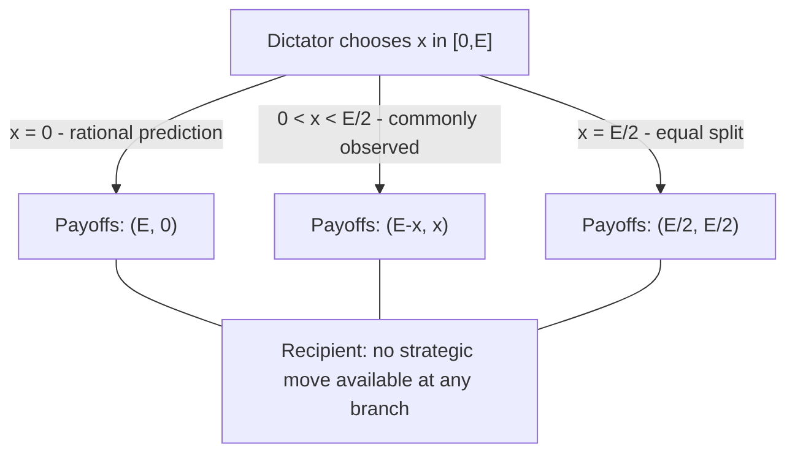

## The Dictator Game

### Overview

The Dictator Game is a two-player, single-move game in experimental economics in which one player — the **Dictator** — unilaterally decides how to divide a fixed endowment between themselves and a passive second player, the **Recipient**, who has no strategic role whatsoever. Developed by Kahneman, Knetsch, and Thaler (1986) as a deliberate simplification of the Ultimatum Game, it isolates pure other-regarding preference (altruism, fairness concern, or social image concern) from any strategic considerations, since the Recipient cannot reject, retaliate, or influence the outcome in any way.

### Origin and Narrative Framing

The Dictator Game was originally constructed as a control condition for the Ultimatum Game, designed to test whether the positive offers observed in the Ultimatum Game were driven by genuine fairness preferences or purely by the Proposer's strategic fear of rejection. By removing the Recipient's ability to reject, the Dictator Game isolates the "pure altruism" component, since any allocation above zero can only be explained by factors other than strategic necessity.

### Formal Structure

**Players:** Dictator (Player 1, sole decision-maker) and Recipient (Player 2, passive).

**Endowment:** Fixed sum $E$ (e.g., $10), held entirely by the Dictator.

**Dictator's move:** Chooses an allocation $x \in [0, E]$ to give to the Recipient, retaining $E - x$.

**Recipient's move:** None. The Recipient has no strategy space and must accept whatever is allocated.

**Payoffs:**

$$\pi_{\text{Dictator}} = E - x, \qquad \pi_{\text{Recipient}} = x$$

This is technically a **single-agent decision problem** rather than a genuine multi-player strategic interaction, since only one player makes a consequential choice — a structural feature that distinguishes it sharply from every other game covered in this chapter (Battle of the Sexes, Stag Hunt, Chicken, Matching Pennies, Traveler's Dilemma, Volunteer's Dilemma, Trust Game), all of which involve mutual strategic interdependence.

### Key Points

- The **subgame-perfect / rational self-interest prediction is $x^* = 0$**: since the Recipient exerts no strategic pressure of any kind, a purely self-interested Dictator retains the entire endowment.
- Despite this stark theoretical prediction, **positive allocations are robustly and repeatedly observed experimentally**, making the Dictator Game one of the most cited pieces of evidence for genuine other-regarding preferences (as opposed to merely strategic fairness) in economic decision-making.
- Because the Recipient has no strategic role, the Dictator Game is used specifically as a **methodological baseline** to decompose observed generosity in richer games (like the Ultimatum Game or Trust Game) into a "strategic/fear-of-rejection" component and a "pure preference" component.
- Observed giving in the Dictator Game is **highly sensitive to procedural framing** — anonymity, social distance, effort-based endowment framing, and experimenter observation have all been shown in the literature to substantially affect allocations, making the game a key tool for studying context-dependence of prosocial behavior.

### Rational Choice Prediction vs. Empirical Behavior

**Standard rational self-interest prediction:**

Since the Dictator's payoff $\pi_{\text{Dictator}} = E - x$ is strictly decreasing in $x$, and the Recipient can impose no consequence regardless of the Dictator's choice, the payoff-maximizing allocation under pure self-interest is:

$$x^* = 0$$

This is not merely a Nash equilibrium concept (there being no genuine second strategic player) but simply the solution to a single-agent constrained optimization problem — the simplest possible "equilibrium" prediction in the chapter, yet also one of the most consistently violated.

**[Unverified]** The original Kahneman, Knetsch, and Thaler (1986) study and the very large subsequent replication literature have found that a substantial share of Dictators allocate a positive amount to the Recipient, with commonly cited (though methodology- and context-dependent) average allocations often falling in a range well below an even 50/50 split but clearly above zero; a nontrivial fraction of Dictators keep the entire endowment as the rational prediction suggests, while another fraction allocate amounts approaching or at an equal split. Precise figures vary substantially across study designs, stake sizes, cultural contexts, and framing manipulations, and no single number should be treated as a fixed universal constant.

### The Central Paradox: Positive Giving Absent Any Strategic Incentive

The Dictator Game's defining theoretical significance is that it **eliminates every standard strategic explanation for generosity simultaneously**: there is no threat of rejection (unlike the Ultimatum Game), no possibility of reciprocity or future interaction (unlike the Trust Game or repeated games generally), and no reputational consequence in fully anonymous, single-shot implementations. Any positive allocation observed under such conditions cannot be explained by classical game-theoretic strategic reasoning at all, which is precisely what makes the result theoretically important.

**[Inference]** This has driven the development of formal social preference models that modify the standard self-interested utility function directly, rather than merely reinterpreting strategic incentives, including:

- **Inequity aversion models** (Fehr–Schmidt, Bolton–Ockenfels), in which a player's utility depends negatively on both disadvantageous and advantageous payoff inequality relative to the other player, providing a direct utility-theoretic rationale for positive $x$.
- **Warm-glow / pure altruism models** (building on Andreoni's work on charitable giving), in which giving itself enters the utility function as a source of positive value independent of the recipient's identity or any social consequence.
- **Social image / experimenter-demand explanations**, positing that even nominally anonymous laboratory settings retain residual self-presentation or experimenter-observation concerns that partially motivate giving — a hypothesis directly tested via "double-blind" experimental protocols.

### Sensitivity to Procedural Manipulations

A substantial portion of the Dictator Game literature is devoted to demonstrating that measured "generosity" is **not a fixed preference parameter** but is highly sensitive to implementation details, including:

- **Social distance/anonymity:** Double-blind protocols (where neither the experimenter nor the Recipient can identify the Dictator's specific choice) have been used to test whether giving is driven by genuine preference or by concern for being observed.
- **Earned vs. windfall endowments:** Framing the endowment as earned through effort or a prior task, rather than as an unearned windfall, has been studied as a moderator of allocation generosity.
- **Framing of the action:** Presenting the decision as "how much to take" from an initial equal split versus "how much to give" from full Dictator control can shift observed allocations, illustrating a reference-point-dependent framing effect.
- **Recipient identity and neediness:** Allocations to a charity, an anonymous stranger, or an identified individual in need have all been compared as moderators of giving behavior.

**[Inference]** This sensitivity is often interpreted as evidence that the Dictator Game measures a context-dependent social norm of appropriate sharing rather than a single stable "altruism parameter," complicating simple utility-theoretic interpretations of the observed positive allocations.

### Comparison to Related Games

| Game | Strategic Structure | Recipient's Role | Rational Prediction | Empirical Deviation |
| --- | --- | --- | --- | --- |
| Dictator Game | Single-agent decision | None (passive) | $x=0$ | Large — positive giving common |
| Ultimatum Game | Sequential, 2-player | Accept/Reject | Minimal positive offer | Moderate — rejections of low offers common |
| Trust Game | Sequential, 2-player | Return decision | $(0,0)$ | Large — partial send/return common |
| Traveler's Dilemma | Simultaneous, 2-player | Symmetric strategic | Lowest claim | Large — high claims common |

The Dictator Game's principal methodological role is as the **control condition** for the Ultimatum Game: comparing average Dictator Game giving to average Ultimatum Game offers allows researchers to decompose Ultimatum Game generosity into a portion attributable to strategic fear of rejection versus a portion attributable to the same underlying other-regarding preferences that persist even without any rejection threat.

### Variants and Extensions

**Dictator Game with Earned Endowments:** The Dictator (and sometimes the Recipient) earns their initial stake through a prior task or performance, testing whether perceived entitlement reduces giving relative to a windfall endowment.

**Taking Dictator Game:** The Dictator's action set is reframed as taking from an initial equal split rather than giving from full control, used to test framing/reference-point effects on effectively identical final allocation possibilities.

**Dictator Game with Costly/Efficient Giving:** The exchange rate between the Dictator's sacrifice and the Recipient's gain is varied (e.g., every $1 given costs the Dictator only $0.50, or costs $2), used to estimate the price elasticity of prosocial giving.

**Double-Blind Dictator Game:** Procedures ensuring neither the experimenter nor any other party can link a specific Dictator to a specific allocation, used to isolate genuine preference-driven giving from image-motivated giving.

**Charitable Dictator Game:** The Recipient is replaced with a real charitable organization, used extensively in the economics of charitable giving literature.

### Decision Structure Diagram

### Rational Prediction vs. Observed Distribution Illustration (svg_diagram)

<svg xmlns="http://www.w3.org/2000/svg" viewBox="0 0 480 340">
<text x="240" y="24" font-size="16" font-weight="bold" text-anchor="middle" fill="#222">Dictator Game: Predicted vs Observed Allocations (svg_diagram)</text>
<line x1="60" y1="290" x2="440" y2="290" stroke="#333" stroke-width="2" />
<line x1="60" y1="290" x2="60" y2="50" stroke="#333" stroke-width="2" />
<text x="440" y="310" font-size="12" text-anchor="middle" fill="#333">Amount Given to Recipient (x)</text>
<text x="25" y="50" font-size="12" text-anchor="middle" fill="#333" transform="rotate(-90 25 170)">Frequency of Dictators</text>
<rect x="80" y="90" width="40" height="200" fill="#cc4422" />
<text x="100" y="305" font-size="10" text-anchor="middle" fill="#333">x=0</text>
<text x="100" y="80" font-size="10" text-anchor="middle" fill="#cc4422">Rational prediction</text>
<rect x="150" y="220" width="40" height="70" fill="#2266cc" />
<text x="170" y="305" font-size="10" text-anchor="middle" fill="#333">Low x</text>
<rect x="220" y="150" width="40" height="140" fill="#2266cc" />
<text x="240" y="305" font-size="10" text-anchor="middle" fill="#333">Moderate x</text>
<rect x="290" y="240" width="40" height="50" fill="#2266cc" />
<text x="310" y="305" font-size="10" text-anchor="middle" fill="#333">Near-equal x</text>

<text x="250" y="120" font-size="11" fill="`#22aa55`">Observed distribution spreads well above x=0</text>

</svg>

### Applications

- **Isolating Pure Altruism:** The primary methodological tool across experimental economics and psychology for measuring other-regarding preference independent of strategic incentive.
- **Charitable Giving Research:** Used extensively to study the determinants and elasticity of voluntary donation behavior.
- **Public Policy and Redistribution Attitudes:** Applied to study spontaneous preferences for equitable division absent institutional or legal compulsion, informing models of voluntary redistribution.
- **Cross-Cultural Fairness Norms:** Deployed in large-scale cross-cultural studies (e.g., work associated with the "Big Five" societies field experiments led by Henrich and colleagues) to compare sharing norms across small-scale and market-integrated societies.

### Conclusion

The Dictator Game reduces strategic interaction to its theoretical minimum — a single unconstrained choice with no possibility of retaliation, reciprocity, or reputational consequence — and thereby provides the cleanest available experimental test of whether generosity reflects genuine other-regarding preference rather than strategic necessity. Its robust finding of positive giving under a rational prediction of zero has been foundational to the development of social preference theory in behavioral economics and serves as the essential methodological baseline against which strategic games such as the Ultimatum Game and Trust Game are interpreted.

**Related Topics**

- Ultimatum Game and strategic vs. pure fairness decomposition
- Fehr–Schmidt inequity aversion model
- Andreoni's warm-glow giving model
- Trust Game (contrast: reciprocity under strategic interdependence)
- Double-blind experimental protocols in behavioral economics
- Framing effects: giving vs. taking Dictator Game variants
- Cross-cultural experimental economics (Henrich et al.)
- Charitable giving and donation elasticity research