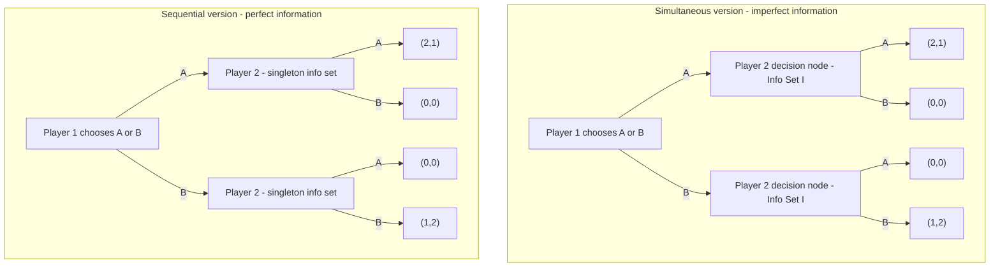

## Game Trees and Information Sets

### Overview

Game trees and information sets are the foundational formal apparatus of **extensive form** representation in game theory, providing a graph-based framework for modeling sequential decision-making, timing, and the informational state of players at each point in a game. Unlike the normal (strategic) form matrices used earlier in this chapter's sibling material, the extensive form explicitly encodes the order of moves, what each player knows when they move, and the role of chance, making it the necessary framework for analyzing sequential games such as the Trust Game and sequential variants of Chicken and Battle of the Sexes.

### Formal Definition of a Game Tree

A **game tree** is a directed graph $T = (N, E)$ with the following components:

- **Nodes ($N$):** Represent decision points or outcomes. Nodes are partitioned into:
  - **Decision nodes:** Points where a player (or Nature/Chance) must choose an action.
  - **Terminal nodes:** End points of the game, each associated with a payoff vector $(\pi_1, \pi_2, \ldots, \pi_n)$ for all $n$ players.
- **Edges ($E$):** Represent available actions at each decision node, connecting a parent node to its children.
- **Root node:** The unique starting node of the tree, with no incoming edges.
- **Player assignment function:** Maps each decision node to the player (or Nature) who moves at that node.

Formally, a game tree must satisfy the properties of a **rooted tree**: every non-root node has exactly one immediate predecessor, and there are no cycles — ensuring the game has a well-defined sequential structure without the possibility of infinite regress or returning to a previously visited state.

### Key Points

- Game trees encode **sequence and timing** explicitly, information entirely absent from normal-form payoff matrices, which is why sequential variants (e.g., commitment/first-mover analysis in Chicken, backward induction in the Trust Game) require the extensive form.
- **Information sets** formally encode what a player knows (and does not know) at the moment of choice, distinguishing games of **perfect information** from games of **imperfect information**.
- Every extensive-form game can, in principle, be converted to an equivalent normal-form representation, but this transformation **discards timing and information-revelation structure**, which is why extensive-form analysis (e.g., subgame-perfect equilibrium) can rule out non-credible strategies that pure normal-form Nash equilibrium analysis cannot.
- The **choice of information set structure** — not merely the payoff structure — determines whether a simultaneous-move game like Matching Pennies or a sequential game like the Trust Game is the appropriate model for a given strategic situation.

### Information Sets: Formal Definition

An **information set** for player $i$ is a collection of decision nodes, all assigned to player $i$, that are **indistinguishable to player $i$** at the moment of choice — meaning player $i$ does not know which specific node within the set they currently occupy when selecting an action.

**Formal requirements for a valid information set** $I_i = \{x_1, x_2, \ldots, x_k\}$:

1. All nodes in $I_i$ must belong to the same player $i$.
2. All nodes in $I_i$ must have the **same set of available actions** (since the player cannot condition their action choice on information they do not possess, they cannot face a different menu of choices at different nodes within the same information set).
3. No node in $I_i$ can be a predecessor (ancestor) of another node in $I_i$ (a player cannot simultaneously be uncertain about which node they are at while one of those nodes is reachable only by having already passed through another node in the same set).

**Singleton information sets** (containing exactly one node) represent situations where the player has complete, unambiguous knowledge of the game's history up to that point.

### Perfect vs. Imperfect Information

A game is one of **perfect information** if and only if **every information set in the game is a singleton** — every player, at every decision point, knows precisely the full history of moves that preceded it.

A game exhibits **imperfect information** if at least one information set contains more than one node, meaning some player must act without knowing certain prior moves (typically because moves were simultaneous, or because an earlier move was hidden).

**Illustrative mapping to games covered in this chapter:**

| Game | Information Structure | Information Set Property |
| --- | --- | --- |
| Trust Game | Perfect information | All information sets are singletons (Receiver observes Sender's exact choice) |
| Matching Pennies | Imperfect information | Player 2's information set contains both of Player 1's possible prior moves |
| Battle of the Sexes (simultaneous) | Imperfect information | Same structure as Matching Pennies |
| Sequential Battle of the Sexes | Perfect information | Second mover's information set is a singleton |

Simultaneous-move games are represented in extensive form using **non-singleton information sets**: the second-moving player's decision nodes (one for each possible action the first player could have taken) are grouped into a single information set, formally capturing that the second player cannot distinguish which prior action actually occurred, even though the tree structure nominally shows the first player moving "first" in a drawing sense.

### Perfect Recall

A game satisfies **perfect recall** if no player ever forgets information they previously knew, including their own past actions. Formally, if two decision nodes belong to the same information set for player $i$, then the sequence of player $i$'s own past actions and information sets visited must be identical along the paths to both nodes. Perfect recall is a standard simplifying assumption in most applied game-theoretic analysis (including all games covered elsewhere in this chapter), and its violation (**imperfect recall**) introduces substantial technical complications for defining consistent behavioral strategies, arising in specialized models such as the "absent-minded driver" problem.

### Nature (Chance) Nodes

Many extensive-form games incorporate a special pseudo-player, **Nature** (sometimes denoted $N$ or $c$), representing exogenous randomness — for example, a card draw, a weather outcome, or a privately known type in a Bayesian game. Nature's "moves" are governed by fixed, commonly known (or type-dependent) probability distributions rather than strategic choice, and Nature's own payoff is undefined/irrelevant. Games incorporating Nature nodes with information sets that hide Nature's realized move from some players are the foundation of **Bayesian games** and **games of incomplete information**.

### Strategies in Extensive Form

A **pure strategy** for player $i$ in extensive form is a complete contingent plan: a specification of exactly one action to take at **every information set** belonging to player $i$, including information sets that would not actually be reached given the player's own earlier choices. This "complete contingency plan" requirement — specifying behavior even off the eventually-realized path of play — is essential for defining subgame-perfect equilibrium via backward induction, since it requires evaluating optimality at every node, not merely the nodes visited in equilibrium play.

A **behavioral strategy** instead specifies, at each information set, a probability distribution over the available actions, generalizing pure strategies and coinciding with mixed strategies under perfect recall (a result formalized by Kuhn's Theorem).

### Subgames and the Basis for Refinement

A **subgame** of an extensive-form game is a subset of the game tree that:

1. Begins at a single decision node (not part of a larger information set — i.e., a node where the history up to that point is common knowledge),
2. Includes all successor nodes of that starting node,
3. Does **not** split any information set (no information set has some nodes inside the subgame and others outside it).

This definition is the structural basis for **subgame-perfect Nash equilibrium**, the refinement used to derive the Trust Game's $(0,0)$ prediction via backward induction: a strategy profile is subgame-perfect if it induces a Nash equilibrium in **every** subgame, not merely in the game as a whole, which is precisely what rules out non-credible threats or promises off the equilibrium path.

### Converting Between Extensive and Normal Form

Any extensive-form game can be converted to normal form by enumerating each player's full set of pure strategies (complete contingency plans across all their information sets) and computing the resulting payoff for every strategy profile combination. This conversion is always possible but is **not information-preserving**: the resulting normal-form matrix has the same Nash equilibria as the original extensive-form game, but normal-form analysis alone cannot distinguish credible from non-credible equilibrium strategies, since the matrix representation discards the sequential/subgame structure entirely — this is precisely why extensive-form-specific refinements like subgame perfection are necessary.

### Example Game Tree: Simultaneous vs. Sequential Representation of Battle of the Sexes

The critical structural difference is that in the simultaneous version, nodes $N1a$ and $N1b$ belong to a **single information set** (Player 2 cannot tell which node they are at), whereas in the sequential version, $N2a$ and $N2b$ are each **singleton information sets**, since Player 2 has directly observed Player 1's move.

### Information Set Notation Illustration (svg_diagram)

<svg xmlns="http://www.w3.org/2000/svg" viewBox="0 0 480 360">
<text x="240" y="24" font-size="16" font-weight="bold" text-anchor="middle" fill="#222">Game Tree with Information Set (svg_diagram)</text>
<circle cx="240" cy="60" r="8" fill="#2266cc" />
<text x="255" y="55" font-size="12" fill="#2266cc">Root: Player 1</text>
<line x1="240" y1="60" x2="140" y2="150" stroke="#333" />
<text x="170" y="100" font-size="11" fill="#333">Action A</text>
<line x1="240" y1="60" x2="340" y2="150" stroke="#333" />
<text x="300" y="100" font-size="11" fill="#333">Action B</text>
<circle cx="140" cy="150" r="8" fill="#cc4422" />
<text x="80" y="140" font-size="11" fill="#cc4422">Player 2, node x1</text>
<circle cx="340" cy="150" r="8" fill="#cc4422" />
<text x="350" y="140" font-size="11" fill="#cc4422">Player 2, node x2</text>
<ellipse cx="240" cy="150" rx="130" ry="35" fill="none" stroke="#22aa55" stroke-width="2" stroke-dasharray="6,4" />
<text x="240" y="200" font-size="12" text-anchor="middle" fill="#22aa55">Information Set I = {x1, x2}</text>
<line x1="140" y1="150" x2="90" y2="260" stroke="#333" />
<line x1="140" y1="150" x2="190" y2="260" stroke="#333" />
<line x1="340" y1="150" x2="290" y2="260" stroke="#333" />
<line x1="340" y1="150" x2="390" y2="260" stroke="#333" />

<text x="70" y="280" font-size="10" fill="#333">(2,1)</text>

<text x="180" y="280" font-size="10" fill="#333">(0,0)</text>

<text x="280" y="280" font-size="10" fill="#333">(0,0)</text>

<text x="390" y="280" font-size="10" fill="#333">(1,2)</text>

</svg>

### Applications

- **Auction and Mechanism Design:** Extensive-form modeling with information sets is essential for representing sealed-bid versus open-outcry auction formats, where information revelation timing critically affects strategic behavior.
- **Legal and Regulatory Bargaining:** Sequential negotiation and litigation models rely on game trees to represent offer/counteroffer sequences and the information available at each stage.
- **Computer Science and AI Game Playing:** Game trees are the direct computational basis for algorithms such as minimax search and alpha-beta pruning in perfect-information games (e.g., chess, Go), while imperfect-information variants require extensions such as counterfactual regret minimization.
- **Corporate Strategy and Sequential Market Entry:** Modeling entry-deterrence and first-mover scenarios (related to the commitment analysis discussed under the Game of Chicken) fundamentally requires the extensive-form apparatus to capture credible versus non-credible threats.

### Conclusion

Game trees and information sets constitute the essential structural language for representing sequential and information-differentiated strategic interactions, extending beyond what simultaneous-move normal-form matrices can capture. The formal distinction between singleton and non-singleton information sets precisely delineates perfect from imperfect information, and the subgame concept built on this foundation enables equilibrium refinements — most notably subgame-perfect Nash equilibrium — capable of ruling out non-credible strategies that normal-form Nash equilibrium analysis alone cannot detect.

**Related Topics**

- Subgame-perfect Nash equilibrium and backward induction
- Perfect vs. imperfect recall (Kuhn's Theorem)
- Bayesian games and Nature/Chance nodes
- Behavioral strategies vs. mixed strategies
- Sequential Trust Game and credible commitment (Game of Chicken)
- Minimax search and game tree algorithms in AI
- Extensive-form to normal-form conversion
- Incomplete information and Harsanyi transformation