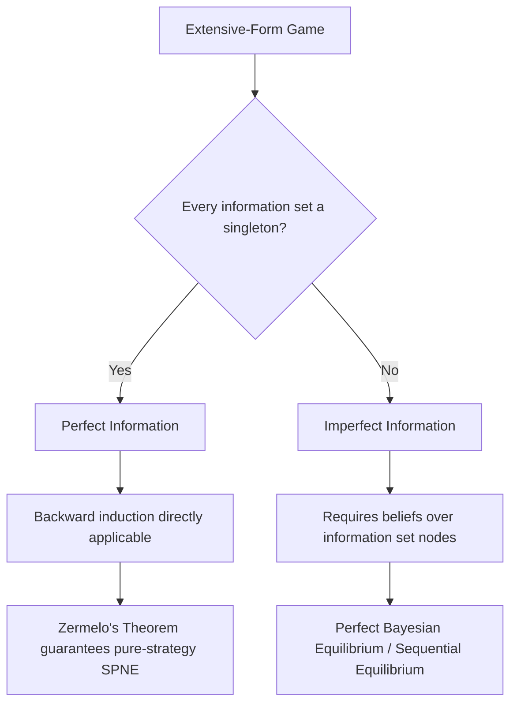

## Perfect and Imperfect Information

### Overview

Perfect and imperfect information describe the two fundamental classes of extensive-form games distinguished by whether players observe the complete history of prior moves before acting. This distinction is one of the central organizing dichotomies in extensive-form game theory, directly determining which solution concepts and analytical techniques (backward induction versus other equilibrium refinements) apply, and connects the abstract information-set formalism to the specific strategic games analyzed elsewhere in this chapter.

### Formal Definitions

**Perfect Information:** A game exhibits perfect information if and only if **every information set in the game consists of exactly one decision node** (a singleton). Equivalently, at every point where a player must move, that player knows with certainty the complete sequence of all prior moves by all players (and by Nature, if present) that led to the current node.

**Imperfect Information:** A game exhibits imperfect information if **at least one information set contains more than one decision node**. At least one player, at some point, must act without knowing precisely which node in the game tree they currently occupy — typically because an earlier move (by another player, or by Nature) was not observed.

These definitions are stated directly in terms of the information-set formalism: a game's information classification is not an independent primitive but a **derived property** of how its information sets are constructed.

### Key Points

- Perfect information requires **every** decision node to be a singleton information set; a single non-singleton information set anywhere in the tree is sufficient to classify the entire game as one of imperfect information.
- **All simultaneous-move games are, by construction, games of imperfect information** when represented in extensive form, since the second-moving player's decision nodes (one per possible first move) must be grouped into a single information set to reflect that the actual prior move is unobserved at the moment of choice.
- Perfect information games admit a uniquely powerful and always-applicable solution technique — **backward induction** — that guarantees existence of at least one subgame-perfect Nash equilibrium in pure strategies (a direct consequence of Zermelo's Theorem for finite games).
- Imperfect information does **not** imply incomplete information: these are distinct concepts. Imperfect information concerns *not observing moves already made* within a fully specified game; incomplete information concerns *not knowing the structure of the game itself* (e.g., an opponent's payoffs or type), addressed separately through Bayesian games and the Harsanyi transformation.

### Perfect Information: Structural Properties and Backward Induction

In a perfect information game, since every information set is a singleton, the game tree can be solved via **backward induction**: starting from terminal nodes and working toward the root, each player's optimal action at each node is determined by assuming subsequent play will be optimal, given full knowledge of the preceding history.

**Zermelo's Theorem (1913):** Every finite, perfect-information game with no chance moves has at least one subgame-perfect Nash equilibrium in pure strategies, obtainable by backward induction. If no player is ever indifferent between outcomes at any decision node, this equilibrium is unique.

**Games from this chapter exhibiting perfect information:**

| Game | Perfect Information Structure |
| --- | --- |
| Sequential Battle of the Sexes | Second mover observes first mover's choice before acting |
| Sequential Game of Chicken (commitment variant) | Second mover observes the committing player's action |
| Trust Game | Receiver directly observes the Sender's chosen amount $s$ before choosing $r$ |

In each case, backward induction was the analytical technique used to derive the equilibrium prediction — most notably yielding the SPNE of $(0,0)$ in the Trust Game and the first-mover-favorable outcome in the sequential Chicken/Battle of the Sexes commitment analyses.

### Imperfect Information: Structural Properties and Analytical Consequences

Because at least one player cannot distinguish between multiple possible histories at the moment of choice, **backward induction in its simple node-by-node form cannot be directly applied** within a non-singleton information set — the player must instead choose a single action (or a single probability distribution over actions, under a behavioral strategy) that is optimal *given a belief* about which node within the information set they are actually at.

**Games from this chapter exhibiting imperfect information:**

| Game | Imperfect Information Structure |
| --- | --- |
| Matching Pennies | Player 2 cannot observe Player 1's coin choice before acting |
| Simultaneous Battle of the Sexes | Neither player observes the other's choice before acting |
| Simultaneous Game of Chicken | Neither driver observes the other's action before committing |
| Volunteer's Dilemma ($n$-player) | No player observes others' volunteer/not-volunteer choices before acting |

**[Inference]** The requirement to form and act on beliefs about unobserved history within an information set is what motivates equilibrium refinements more general than subgame perfection — most notably **Perfect Bayesian Equilibrium** and **Sequential Equilibrium**, which explicitly require players to hold well-defined probabilistic beliefs over the nodes within each information set and to choose sequentially rational actions given those beliefs, extending the logic of backward induction to settings where it cannot be applied directly node-by-node.

### The Perfect Information / Imperfect Information Boundary in Practice

A single game can often be represented in **either** a perfect-information or an imperfect-information extensive form depending on the underlying real-world timing being modeled, as demonstrated directly by the Battle of the Sexes and Chicken examples in this chapter: the *simultaneous* version (imperfect information, both players choose without observing the other) and the *sequential/commitment* version (perfect information, the second mover observes the first mover's binding choice) share the same normal-form payoff structure but produce **different equilibrium predictions**, precisely because the underlying information structure differs. This is a central illustration of why extensive-form modeling choices — not merely payoffs — are consequential for equilibrium analysis.

### Perfect Information vs. Related Distinctions

It is important to distinguish perfect/imperfect information from two related but analytically separate dichotomies:

| Distinction | Concerns | Example Contrast |
| --- | --- | --- |
| Perfect vs. Imperfect Information | Whether prior *moves* are observed | Sequential vs. simultaneous Chicken |
| Complete vs. Incomplete Information | Whether the *game structure itself* (payoffs, types) is known | Standard Trust Game vs. a Bayesian Trust Game with unknown Receiver trustworthiness |
| Perfect vs. Imperfect Recall | Whether a player forgets their *own* past information/actions | Standard games (perfect recall) vs. "absent-minded driver" style problems |

**[Inference]** A game can simultaneously be one of perfect information (all moves observed) and incomplete information (payoffs/types unknown), or imperfect information and complete information (payoffs known, but simultaneous moves unobserved) — the two dichotomies are logically independent and address different sources of strategic uncertainty.

### Solution Concept Applicability by Information Structure

### Information Structure Comparison Illustration (svg_diagram)

<svg xmlns="http://www.w3.org/2000/svg" viewBox="0 0 480 340">
<text x="240" y="24" font-size="16" font-weight="bold" text-anchor="middle" fill="#222">Perfect vs Imperfect Information Trees (svg_diagram)</text>

<text x="120" y="55" font-size="13" font-weight="bold" text-anchor="middle" fill="`#2266cc`">Perfect Information</text>

<circle cx="120" cy="80" r="6" fill="`#2266cc`" />

<line x1="120" y1="80" x2="70" y2="140" stroke="#333" />

<line x1="120" y1="80" x2="170" y2="140" stroke="#333" />

<circle cx="70" cy="140" r="6" fill="`#cc4422`" />

<circle cx="170" cy="140" r="6" fill="`#cc4422`" />

<text x="70" y="160" font-size="9" text-anchor="middle" fill="#333">singleton</text>

<text x="170" y="160" font-size="9" text-anchor="middle" fill="#333">singleton</text>

<text x="120" y="190" font-size="10" text-anchor="middle" fill="`#2266cc`">Every node fully known</text>

<text x="360" y="55" font-size="13" font-weight="bold" text-anchor="middle" fill="`#cc4422`">Imperfect Information</text>

<circle cx="360" cy="80" r="6" fill="`#2266cc`" />

<line x1="360" y1="80" x2="310" y2="140" stroke="#333" />

<line x1="360" y1="80" x2="410" y2="140" stroke="#333" />

<circle cx="310" cy="140" r="6" fill="`#cc4422`" />

<circle cx="410" cy="140" r="6" fill="`#cc4422`" />

<ellipse cx="360" cy="140" rx="70" ry="22" fill="none" stroke="`#22aa55`" stroke-width="2" stroke-dasharray="5,3" />

<text x="360" y="190" font-size="10" text-anchor="middle" fill="`#cc4422`">Nodes indistinguishable</text>

<line x1="240" y1="60" x2="240" y2="280" stroke="#999" stroke-dasharray="3,3" />
</svg>

### Applications

- **Auction Design:** Open (English) auctions are modeled as perfect-information sequential games, while sealed-bid (first-price/second-price) auctions are modeled as simultaneous-move, imperfect-information games — the information structure directly shapes optimal bidding strategy analysis.
- **AI and Computational Game Solving:** Perfect-information games (chess, Go, checkers) are amenable to direct minimax/backward-induction search algorithms; imperfect-information games (poker, many negotiation settings) require fundamentally different computational approaches such as counterfactual regret minimization.
- **Corporate Entry Deterrence:** Modeling whether a potential entrant observes an incumbent's capacity investment before deciding to enter (perfect information, favoring commitment strategies) versus simultaneous strategic investment decisions (imperfect information).
- **Legal Procedure Design:** Sequential disclosure rules in litigation and negotiation are explicitly designed to shift a strategic interaction from imperfect to perfect information at specific stages, altering equilibrium bargaining behavior.

### Conclusion

The perfect/imperfect information distinction, defined precisely through the singleton property of information sets, determines whether backward induction can be applied directly to solve a game or whether more general belief-based equilibrium refinements are required. The chapter's own sequential-versus-simultaneous variants of Chicken and Battle of the Sexes directly demonstrate that this is not a mere technical classification but a modeling choice with substantive equilibrium consequences, making the accurate identification of a strategic situation's true information structure a prerequisite for correct game-theoretic analysis.

**Related Topics**

- Backward induction and Zermelo's Theorem
- Subgame-perfect Nash equilibrium
- Perfect Bayesian Equilibrium and Sequential Equilibrium
- Complete vs. incomplete information (Harsanyi transformation)
- Perfect vs. imperfect recall
- Sequential vs. simultaneous variants of Chicken and Battle of the Sexes
- Minimax search in perfect-information AI game-playing
- Counterfactual regret minimization for imperfect-information games