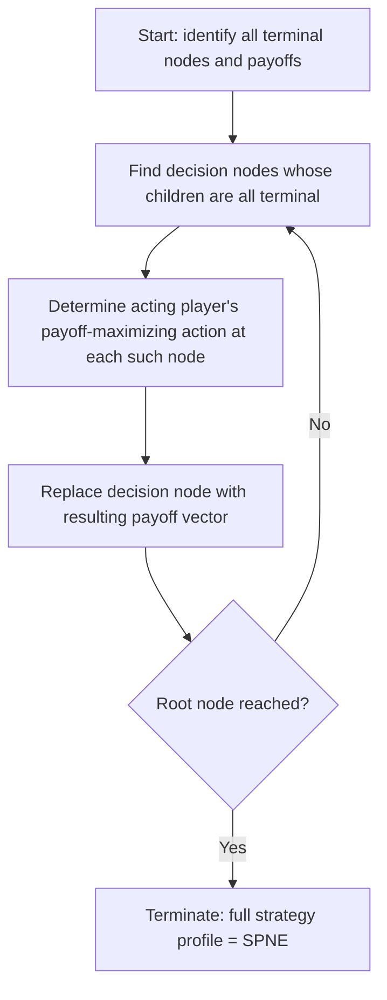

## Backward Induction

### Overview

Backward induction is the fundamental solution technique for extensive-form games of perfect information, proceeding by reasoning from the terminal nodes of the game tree back toward the root, determining optimal play at each decision node under the assumption that all subsequent play will itself be optimal. It is the mechanical procedure underlying subgame-perfect Nash equilibrium, and has already been applied directly in this chapter's analysis of the sequential Game of Chicken, the sequential Battle of the Sexes, and the Trust Game.

### Formal Procedure

Given a finite extensive-form game of perfect information (every information set a singleton, per the prior topic in this chapter), backward induction proceeds as follows:

1. **Identify all terminal nodes** and their associated payoff vectors.
2. **Locate the decision nodes whose immediate successors are all terminal nodes** ("last-mover" nodes).
3. **At each such node, determine the acting player's optimal action** — the one maximizing that player's own payoff among the available terminal outcomes reachable from that node.
4. **Replace each such decision node with the payoff vector resulting from the identified optimal action**, effectively "pruning" the tree by collapsing that subgame to its induced outcome.
5. **Repeat the process** on the reduced tree, treating newly exposed "last-mover" nodes at each iteration, continuing until the entire tree collapses to the payoff vector at the root.

The sequence of optimal actions identified at each node, taken together, constitutes a complete strategy profile — and this profile is guaranteed to be a **subgame-perfect Nash equilibrium (SPNE)**.

### Key Points

- Backward induction is applicable **only to games of perfect information** (or, with the Nature-node extension, games where all non-Nature information sets are singletons); non-singleton information sets block direct node-by-node backward reasoning, which is why Matching Pennies and simultaneous Battle of the Sexes/Chicken cannot be solved this way.
- **Zermelo's Theorem** guarantees that any finite perfect-information game with no chance moves has at least one pure-strategy SPNE derivable via backward induction, and this equilibrium is unique if no player is ever indifferent between outcomes at any node.
- Backward induction produces a **complete contingency plan** at every node, including nodes that will never actually be reached given the equilibrium play identified at earlier nodes — this is precisely what distinguishes subgame-perfect equilibrium from a merely Nash equilibrium restricted to the observed path of play.
- Backward induction can produce equilibrium predictions that are **starkly counterintuitive or empirically falsified**, as directly demonstrated by the Trust Game's $(0,0)$ prediction elsewhere in this chapter — the procedure is logically valid given its assumptions, but its assumptions (common knowledge of rationality at every node, including counterfactual ones) are demanding.

### Worked Example: Trust Game Revisited

The Trust Game (covered earlier in this chapter) provides a direct worked illustration of backward induction with a continuous strategy space:

**Step 1 (last mover — Receiver):** At any node reached with Sender's choice $s > 0$, the Receiver chooses $r$ to maximize $\pi_{\text{Receiver}} = ks - r$. Since this is strictly decreasing in $r$, the payoff-maximizing choice is $r^*(s) = 0$ for every $s$.

**Step 2 (collapse the tree):** Every branch following a Sender choice $s$ is replaced with the payoff vector $(E-s, ks)$ evaluated at $r=0$, i.e., $(E-s, 0)$.

**Step 3 (first mover — Sender):** The Sender's problem reduces to maximizing $\pi_{\text{Sender}} = E - s$ over $s \in [0, E]$, which is maximized at $s^* = 0$.

**Result:** The backward induction solution is $(s^*, r^*(\cdot)) = (0, r^*(s)=0 \text{ for all } s)$, yielding the SPNE outcome $(E, 0)$ — matching the result derived directly in the Trust Game's own analysis.

### Worked Example: Sequential Game of Chicken

Recall the Sequential/Commitment variant of Chicken from earlier in this chapter, where Player 1 credibly commits to Stay or Swerve before Player 2 moves.

**Step 1 (last mover — Player 2):** If Player 1 has committed to **Stay**, Player 2 compares Swerve (payoff 2) versus Stay (payoff 0); Player 2's optimal response is **Swerve**. If Player 1 has committed to **Swerve**, Player 2 compares Stay (payoff 4) versus Swerve (payoff 3); Player 2's optimal response is **Stay**.

**Step 2 (collapse the tree):** The branch following Player 1's Stay collapses to $(4,2)$; the branch following Player 1's Swerve collapses to $(2,4)$.

**Step 3 (first mover — Player 1):** Comparing the two collapsed outcomes, Player 1 strictly prefers $(4,2)$ from committing to Stay over $(2,4)$ from committing to Swerve.

**Result:** The unique SPNE is Player 1 commits to Stay, Player 2 responds with Swerve, yielding $(4,2)$ — confirming the first-mover/commitment advantage identified qualitatively in the Chicken analysis earlier in this chapter.

### Subgame-Perfect Nash Equilibrium as the Formal Output

Backward induction is the **constructive procedure**; subgame-perfect Nash equilibrium (SPNE) is the **solution concept** it produces. Formally, a strategy profile is subgame-perfect if it constitutes a Nash equilibrium in every subgame of the original game (per the subgame definition introduced under Game Trees and Information Sets), not merely in the game taken as a whole. In finite games of perfect information, backward induction and the requirement of subgame perfection are equivalent: every backward-induction solution is subgame-perfect, and (given no relevant ties) every SPNE of such a game is recoverable via backward induction.

**The critical refinement backward induction provides over plain Nash equilibrium** is the elimination of **non-credible threats or promises**. A Nash equilibrium of the normal-form-converted game may rely on an off-path action that would not actually be optimal for the player to carry out if that node were actually reached — backward induction rules these out by construction, since every node (on- or off-path) is independently checked for optimality.

### The Centipede Game: A Canonical Stress-Test of Backward Induction Logic

The **Centipede Game** (Rosenthal, 1981) is the standard illustration of backward induction's most philosophically contested implication. Two players alternate the choice to either "take" a growing pot of money (ending the game) or "pass" (increasing the pot but handing the decision to the other player), across a finite, commonly known number of rounds, with the pot's terminal value split favorably if it reaches the final round.

Backward induction dictates that the **last-moving player will always take** at the final node (since taking is strictly better than passing to a terminal payoff for them). Anticipating this, the second-to-last player should take at their node rather than pass into a certain unfavorable outcome, and this reasoning propagates all the way back to the **very first move**, predicting that the first player takes immediately, ending the game with the smallest possible pot — despite every player, at every node, having available a jointly wealth-increasing "pass" option.

**[Unverified]** Experimental studies of the Centipede Game (notably McKelvey and Palfrey, 1992, and subsequent replications) have consistently found that human subjects pass considerably further into the game than backward induction predicts, though the exact number of rounds typically passed and the sensitivity to stake size and pot-growth rate vary across studies. This finding parallels the Trust Game's empirical deviation from its own backward-induction prediction, and both are frequently cited together as evidence that strict common knowledge of rationality (which backward induction implicitly assumes must hold not just in fact, but in every player's counterfactual reasoning about every other node) is a demanding and often empirically inaccurate assumption about real strategic cognition.

### Limitations and Caveats

- **Requires perfect information:** Backward induction cannot be applied directly within non-singleton information sets; imperfect-information games require belief-based extensions (Perfect Bayesian Equilibrium, Sequential Equilibrium).
- **Infinite-horizon games:** Backward induction requires a well-defined finite terminal stage to begin the recursion; infinite-horizon extensive-form games (e.g., infinitely repeated games) require different equilibrium techniques such as the one-shot deviation principle applied to stationary strategies.
- **Ties/indifference:** When a player is indifferent between multiple actions at some node, backward induction may fail to deliver a unique prediction, potentially yielding multiple SPNE.
- **Epistemic fragility:** As the Centipede Game and Trust Game both illustrate, backward induction's logical validity does not guarantee descriptive accuracy, since the procedure requires assuming rationality (and common knowledge thereof) even at counterfactual nodes that a rational player's own equilibrium strategy implies will never be reached.

### Backward Induction Procedure Diagram

### Centipede Game Tree Illustration (svg_diagram)

<svg xmlns="http://www.w3.org/2000/svg" viewBox="0 0 500 260">
<text x="250" y="24" font-size="16" font-weight="bold" text-anchor="middle" fill="#222">Centipede Game: Backward Induction Collapse (svg_diagram)</text>
<circle cx="60" cy="120" r="7" fill="#2266cc" />
<text x="60" y="105" font-size="10" text-anchor="middle" fill="#2266cc">P1</text>
<line x1="60" y1="120" x2="140" y2="120" stroke="#333" />
<circle cx="140" cy="120" r="7" fill="#cc4422" />
<text x="140" y="105" font-size="10" text-anchor="middle" fill="#cc4422">P2</text>
<line x1="140" y1="120" x2="220" y2="120" stroke="#333" />
<circle cx="220" cy="120" r="7" fill="#2266cc" />
<text x="220" y="105" font-size="10" text-anchor="middle" fill="#2266cc">P1</text>
<line x1="220" y1="120" x2="300" y2="120" stroke="#333" stroke-dasharray="3,3" />
<text x="330" y="120" font-size="11" fill="#666">... continues to final round</text>
<line x1="60" y1="120" x2="60" y2="190" stroke="#333" />
<text x="60" y="210" font-size="10" text-anchor="middle" fill="#333">Take: (1,0)</text>
<text x="30" y="150" font-size="9" fill="#cc4422">chosen first</text>
<line x1="140" y1="120" x2="140" y2="190" stroke="#999" />
<text x="140" y="210" font-size="10" text-anchor="middle" fill="#999">Take: (0,2)</text>
<line x1="220" y1="120" x2="220" y2="190" stroke="#999" />
<text x="220" y="210" font-size="10" text-anchor="middle" fill="#999">Take: (3,1)</text>

<text x="250" y="245" font-size="11" fill="`#22aa55`">Backward induction: unravels to immediate "Take" at the very first node</text>

</svg>

### Applications

- **Bargaining and Negotiation Theory:** The Rubinstein alternating-offers bargaining model relies fundamentally on backward induction (in its infinite-horizon stationary form) to derive unique equilibrium division predictions.
- **Corporate Finance and Real Options:** Sequential investment decisions under certainty are frequently analyzed via backward induction across decision trees representing staged capital commitments.
- **AI Game-Tree Search:** Minimax search algorithms (with alpha-beta pruning) in perfect-information games such as chess and Go are direct computational implementations of backward induction over enormous game trees.
- **Legal and Regulatory Sequencing:** Modeling multi-stage litigation, appeals processes, or regulatory approval sequences where each stage's outcome depends on rational anticipation of subsequent stages.

### Conclusion

Backward induction provides the constructive, always-terminating procedure for solving finite games of perfect information, yielding subgame-perfect Nash equilibria that eliminate non-credible off-path threats and promises. Its application throughout this chapter — in the Trust Game and the sequential Chicken and Battle of the Sexes variants — demonstrates both its analytical power and, via the Centipede Game and the Trust Game's own empirical record, its principal limitation: the procedure's logical rigor rests on an assumption of rationality holding at every node, including ones a player's own equilibrium strategy implies will never be reached, an assumption experimental evidence frequently contradicts.

**Related Topics**

- Subgame-perfect Nash equilibrium (formal definition and subgames)
- Zermelo's Theorem and existence of pure-strategy equilibria
- Centipede Game and empirical deviations from equilibrium
- Perfect vs. imperfect information (applicability boundary)
- Rubinstein bargaining model and alternating offers
- Trust Game and sequential Chicken (worked applications)
- One-shot deviation principle for infinite-horizon games
- Minimax search and alpha-beta pruning in AI