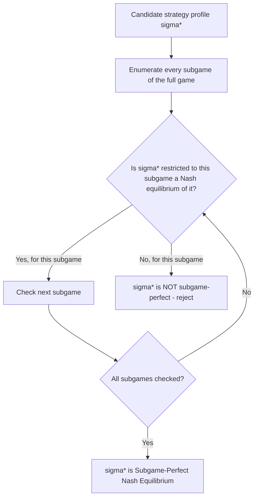

## Subgame Perfect Nash Equilibrium

### Overview

Subgame Perfect Nash Equilibrium (SPNE) is the central equilibrium refinement for extensive-form games, strengthening the ordinary Nash equilibrium concept by requiring optimality not merely across the game as a whole but within **every subgame**, including those off the equilibrium path. Introduced by Reinhard Selten (1965), SPNE is the formal solution concept that backward induction constructively produces in finite perfect-information games, and it is the refinement responsible for eliminating non-credible threats and promises that ordinary Nash equilibrium analysis cannot rule out.

### Motivation: Why Nash Equilibrium Alone Is Insufficient

Converting any extensive-form game to its normal (strategic) form and finding its Nash equilibria is always possible, but this conversion — as established earlier in this chapter — discards the sequential structure entirely. A strategy profile can be a Nash equilibrium of the normal-form game purely because a player's threatened off-path action, if actually called upon, would never rationally be carried out, yet the mere existence of that (non-credible) threat still deters the other player from deviating in equilibrium.

**Illustrative case (Sequential Game of Chicken):** Suppose Player 1 (first mover) considers committing to Swerve. If Player 2's strategy specifies "Stay regardless of what Player 1 does," this could support a Nash equilibrium in the converted normal form, since Player 1's best response to an unconditional Player 2 "Stay" is indeed Swerve. But this requires Player 2 to also commit to Stay even in the counterfactual branch where Player 1 stays — a branch in which Player 2's own payoff-maximizing action is actually to Swerve (yielding 2) rather than Stay (yielding 0). The threat "I will Stay no matter what you do" is **not credible**, because Player 2 would not actually carry it out if that node were reached. SPNE is precisely the refinement that eliminates such equilibria by requiring the strategy to be optimal in **every** subgame, not just along the path actually taken.

### Formal Definition

A strategy profile $\sigma^* = (\sigma_1^*, \sigma_2^*, \ldots, \sigma_n^*)$ is a **Subgame Perfect Nash Equilibrium** of an extensive-form game $\Gamma$ if, for every subgame $\Gamma'$ of $\Gamma$ (per the subgame definition established under Game Trees and Information Sets — a subset of the tree beginning at a singleton decision node, containing all its successors, and not splitting any information set), the restriction of $\sigma^*$ to $\Gamma'$ constitutes a Nash equilibrium of $\Gamma'$.

Equivalently, SPNE requires:

$$\sigma^*|_{\Gamma'} \in \text{NE}(\Gamma') \quad \text{for every subgame } \Gamma' \text{ of } \Gamma$$

Since the entire game $\Gamma$ is trivially a subgame of itself, **every SPNE is automatically a Nash equilibrium of the full game** — SPNE is a strict refinement (a subset) of the set of Nash equilibria, never a disjoint or broader concept.

### Key Points

- SPNE is a **refinement**, not an alternative theory: every subgame-perfect equilibrium is a Nash equilibrium, but not every Nash equilibrium is subgame-perfect. The refinement's entire purpose is to discard the subset of Nash equilibria sustained by non-credible off-path behavior.
- In **finite games of perfect information**, SPNE is exactly the set of strategy profiles obtainable via backward induction (established in the prior topic), and by Zermelo's Theorem, at least one such equilibrium always exists in pure strategies.
- In games with **imperfect information**, SPNE remains well-defined (since the subgame concept only requires singleton starting nodes, not that the entire game be one of perfect information), but backward induction cannot be applied directly within non-singleton information sets, motivating further refinements (Perfect Bayesian Equilibrium, Sequential Equilibrium) for those portions of the tree.
- SPNE requires specifying behavior at **every** decision node, including counterfactual ones that equilibrium play itself implies will never be reached — this "complete contingency plan" requirement is what allows the refinement to evaluate credibility of even hypothetical threats.

### Worked Re-Derivation: Trust Game

Applying the formal SPNE definition (rather than the backward-induction procedure directly) to the Trust Game confirms the same result derived earlier in this chapter. The game has, for every $s \in [0,E]$ chosen by the Sender, a distinct subgame beginning at the Receiver's decision node. For $\sigma^*$ to be subgame-perfect, the Receiver's strategy $r^*(s)$ must constitute a Nash equilibrium (here, simply a payoff-maximizing choice, since the Receiver is the only mover) in **every one of these subgames**, not merely the one actually reached in equilibrium. Since $\pi_{\text{Receiver}} = ks - r$ is strictly decreasing in $r$ at every possible $s$, the unique optimal choice in every such subgame is $r^*(s) = 0$. Given this, the subgame beginning at the root (the full game) requires the Sender's choice to be a best response to $r^*(\cdot) \equiv 0$, yielding $s^*=0$. The profile $(s^*=0, r^*(s)=0 \ \forall s)$ is subgame-perfect precisely because optimality was verified in *every* subgame, including the many $s>0$ subgames that are never reached given $s^*=0$.

### Distinguishing SPNE from Non-Subgame-Perfect Nash Equilibria: A Formal Contrast

Consider a simplified sequential game where Player 1 first chooses between ending the game immediately (payoff $(3,1)$) or continuing to a subgame where Player 2 then chooses between two actions yielding $(4,0)$ or $(0,5)$.

**Non-subgame-perfect Nash equilibrium:** Player 1 plays "End," Player 2's strategy specifies "would choose $(4,0)$ if the subgame were reached." Player 1's payoff of 3 (from ending) exceeds the 4 they'd get from continuing only if Player 2's stated response were $(0,5)$ instead — so this particular combination is not actually an equilibrium unless Player 2's off-path action deters Player 1 correctly. Suppose instead Player 2's strategy is "would choose $(0,5)$ if reached" — then Player 1's best response is indeed to End (3 > 0), and this can be a Nash equilibrium of the normal form **even if $(0,5)$ is not actually Player 2's payoff-maximizing choice within that subgame** (suppose Player 2 actually prefers $(4,0)$, i.e., a payoff of 4 over 5 is impossible by construction here, but in general non-credible off-path commitments of this kind are exactly what can sustain non-subgame-perfect Nash equilibria).

**Subgame-perfect refinement:** SPNE requires checking Player 2's actual optimal choice **within the continuation subgame directly** (here, whichever of $(4,0)$ or $(0,5)$ actually gives Player 2 the higher payoff — 0 vs. 5, so Player 2 would truly choose the action yielding 5), and only strategy profiles consistent with that genuinely optimal subgame choice can be subgame-perfect. This directly illustrates why SPNE is a strictly stronger requirement than Nash equilibrium: it forces off-path commitments to be independently verified as truly optimal within their own subgame, not merely accepted as given.

### SPNE in Imperfect Information Games

Because a subgame must begin at a **singleton** decision node (one not part of a larger information set), games of imperfect information typically have **fewer subgames** than the full node-by-node structure might suggest — often only the entire game itself qualifies as a subgame, if no other singleton nodes exist deeper in the tree. In such cases, SPNE **reduces to ordinary Nash equilibrium** of the full game, since the only subgame requiring equilibrium verification is the game as a whole. This is precisely why SPNE provides no additional refinement power for purely simultaneous-move games like Matching Pennies or the simultaneous Battle of the Sexes/Chicken — the refinement's discriminating power is specifically tied to the presence of proper (non-trivial) subgames, which arise from perfect-information segments of a game tree.

**[Inference]** This limitation motivates further refinements — Perfect Bayesian Equilibrium and Sequential Equilibrium — for extensive-form games that mix perfect- and imperfect-information segments (e.g., a sequential move followed by a simultaneous-move subgame, or games with Nature nodes revealing private information), since SPNE alone cannot discipline behavior within non-singleton information sets that do not themselves constitute proper subgames.

### Existence and Uniqueness

- **Existence:** By Zermelo's Theorem, every finite extensive-form game of perfect information has at least one pure-strategy SPNE. For games with imperfect information (or infinite strategy spaces, as in the Trust Game's continuous send/return amounts), existence generally requires additional conditions (e.g., continuity and compactness of strategy spaces, as satisfied in the Trust Game example) but is not automatically guaranteed by the SPNE definition alone.
- **Uniqueness:** SPNE is unique whenever backward induction never encounters a tie (no player is ever indifferent between two or more actions at any decision node encountered during the recursive procedure). Ties can produce multiple subgame-perfect equilibria, as can games with multiple proper subgames each admitting multiple equilibria independently.

### SPNE Verification Procedure Diagram

### Non-Credible Threat Illustration (svg_diagram)

<svg xmlns="http://www.w3.org/2000/svg" viewBox="0 0 500 320">
<text x="250" y="24" font-size="16" font-weight="bold" text-anchor="middle" fill="#222">SPNE Rules Out Non-Credible Threats (svg_diagram)</text>
<circle cx="120" cy="70" r="8" fill="#2266cc" />
<text x="120" y="55" font-size="11" text-anchor="middle" fill="#2266cc">Player 1</text>
<line x1="120" y1="70" x2="60" y2="150" stroke="#333" />
<text x="70" y="110" font-size="10" fill="#333">End</text>
<line x1="120" y1="70" x2="220" y2="150" stroke="#333" />
<text x="200" y="110" font-size="10" fill="#333">Continue</text>

<text x="60" y="175" font-size="11" text-anchor="middle" fill="#333">(3,1)</text>

<circle cx="220" cy="150" r="8" fill="#cc4422" />
<text x="220" y="135" font-size="11" text-anchor="middle" fill="#cc4422">Player 2 subgame</text>
<line x1="220" y1="150" x2="170" y2="230" stroke="#333" />
<line x1="220" y1="150" x2="270" y2="230" stroke="#333" />
<text x="170" y="250" font-size="11" text-anchor="middle" fill="#333">(4,0)</text>
<text x="270" y="250" font-size="11" text-anchor="middle" fill="#22aa55">(0,5) - actual optimum</text>
<rect x="150" y="270" width="240" height="35" fill="#e8f4ea" stroke="#22aa55" />
<text x="270" y="292" font-size="10" text-anchor="middle" fill="#22aa55">SPNE verifies Player 2's true choice within subgame directly</text>
</svg>

### Applications

- **Industrial Organization and Entry Deterrence:** SPNE is the standard tool for analyzing whether an incumbent firm's threatened price war against entrants is credible, versus a non-credible threat that a subgame-perfect analysis would discard.
- **International Relations and Deterrence:** Formal crisis bargaining models use SPNE to distinguish credible deterrent threats from bluffs, building directly on the commitment logic explored in the Game of Chicken.
- **Labor Negotiation and Strike Threats:** Analyzing whether a union's or firm's threatened hardline bargaining position would actually be carried out if called upon, versus collapsing once the relevant subgame is reached.
- **Legal Contract Design:** Structuring enforceable contractual remedies and penalty clauses so that specified off-path punishments remain genuinely credible (subgame-perfect) rather than merely nominal.

### Conclusion

Subgame Perfect Nash Equilibrium refines ordinary Nash equilibrium by requiring optimality within every subgame of an extensive-form game, not merely along the path of play, thereby eliminating equilibria sustained by non-credible threats or promises. It formalizes the solution concept that backward induction constructively delivers in finite perfect-information games — as demonstrated throughout this chapter in the Trust Game and sequential Chicken/Battle of the Sexes analyses — while also extending, at least in definition, to games of imperfect information, where its discriminating power is more limited and further refinements become necessary.

**Related Topics**

- Backward induction (constructive procedure for finite perfect-information SPNE)
- Zermelo's Theorem and existence of pure-strategy equilibria
- Non-credible threats and commitment devices (Game of Chicken)
- Perfect Bayesian Equilibrium and Sequential Equilibrium
- Subgames and information sets (structural prerequisites)
- Trust Game and sequential Battle of the Sexes (worked applications)
- Multiplicity of equilibria under indifference/ties
- Reinhard Selten's original 1965 formulation