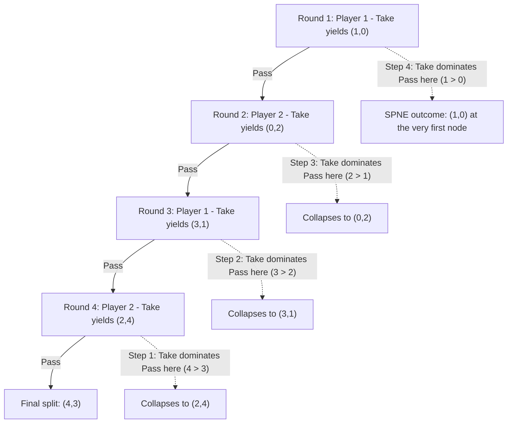

## The Centipede Game

### Overview

The Centipede Game is a finite, alternating-offer extensive-form game introduced by Robert Rosenthal (1981), specifically constructed to expose the most philosophically contested implication of backward induction: that a logically valid, uniquely determined equilibrium prediction can require players to forgo mutually beneficial cooperation at the very first opportunity. It is the canonical stress-test of subgame-perfect equilibrium reasoning already introduced in this chapter, and one of the most heavily replicated games in experimental economics.

### Formal Structure

**Players:** Two players, alternating moves across a finite, commonly known number of rounds (the "legs" of the centipede, giving the game its name from the branching tree's visual resemblance to a many-legged creature).

**Moves:** At each decision node, the acting player chooses between **Take** (ending the game immediately and claiming a specified split of the current pot) or **Pass** (declining the current split, growing the pot, and handing the decision to the other player).

**Payoff growth:** Each successive "Pass" increases the total pot available, typically by a fixed multiplicative or additive factor, with the acting player who eventually "Takes" receiving the larger share of the then-current pot.

**Canonical numerical example** (a common textbook instantiation with alternating moves and payoffs growing in the pot):

| Round | Mover | Take payoff (Mover, Other) | Pass leads to... |
| --- | --- | --- | --- |
| 1 | Player 1 | $(1, 0)$ | Round 2 |
| 2 | Player 2 | $(0, 2)$ | Round 3 |
| 3 | Player 1 | $(3, 1)$ | Round 4 |
| 4 | Player 2 | $(2, 4)$ | Final split |
| Final | — | — | $(4, 3)$ if both pass throughout |

(Specific payoff schedules vary across textbook and experimental instantiations; the qualitative structure — alternating Take/Pass decisions with a growing pot, terminating in a fixed final split — is what defines the game.)

**Termination:** The game has a fixed, finite horizon: if both players pass at every opportunity, the game ends automatically at the final round with a predetermined terminal split.

### Key Points

- The Centipede Game is a game of **perfect information** (every decision node is a singleton, per the classification developed earlier in this chapter), making it directly amenable to backward induction.
- Backward induction yields a **unique, sharp prediction**: the first-moving player takes immediately, at the very first node, ending the game with the smallest possible payoff to both players relative to what continued cooperation would have generated.
- This prediction is **Pareto-dominated by nearly every other feasible outcome**, since passing further into the game strictly grows the total pot available to be split — the equilibrium outcome is, structurally, close to the worst possible result for both players jointly.
- The Centipede Game is one of the **most robustly replicated demonstrations of empirical deviation from backward-induction/SPNE predictions** in experimental economics, motivating extensive theoretical work on bounded rationality and epistemic assumptions underlying backward induction.

### Backward Induction Solution

Applying the backward induction procedure formalized earlier in this chapter, worked through the canonical example above:

**Step 1 (final decision node — Player 2, Round 4):** Comparing Take $(2,4)$ against Pass (leading to the fixed final split $(4,3)$), Player 2 compares their own payoff: $4$ from Taking versus $3$ from Passing. Player 2's optimal choice is **Take**.

**Step 2 (Round 3 — Player 1):** Anticipating Player 2 will Take in Round 4 (yielding Player 1 a payoff of $2$), Player 1 compares Take $(3,1)$ — giving Player 1 a payoff of 3 — against Pass, which leads into Round 4 and (given Step 1) collapses to a payoff of $2$ for Player 1. Player 1's optimal choice is **Take**.

**Step 3 (Round 2 — Player 2):** Anticipating Player 1 will Take in Round 3 (yielding Player 2 a payoff of $1$), Player 2 compares Take $(0,2)$ — giving Player 2 a payoff of 2 — against Pass, which collapses (per Step 2) to a payoff of $1$ for Player 2. Player 2's optimal choice is **Take**.

**Step 4 (Round 1 — Player 1, the root):** Anticipating Player 2 will Take in Round 2 (yielding Player 1 a payoff of $0$), Player 1 compares Take $(1,0)$ — giving Player 1 a payoff of 1 — against Pass, which collapses (per Step 3) to a payoff of $0$ for Player 1. Player 1's optimal choice is **Take**.

**Result:** The unique SPNE prescribes **Take at every single node**, including all three nodes that are never actually reached once Player 1 takes at the very first opportunity. The equilibrium outcome is $(1,0)$ — the smallest possible payoff to Player 1 among all terminal nodes, and zero to Player 2, despite a jointly available terminal payoff of $(4,3)$ reachable through mutual passing.

### The Central Paradox: Full Backward Unraveling of Cooperation

The Centipede Game's defining theoretical significance is that the backward-induction/SPNE prediction requires **immediate defection at the very first node**, even though every single decision point in the game offers a "Pass" option that would grow the total available surplus. Unlike the Trust Game (where at least the Sender retains their full endowment under the SPNE prediction) or the Traveler's Dilemma (where the equilibrium claim is merely low rather than the theoretical minimum-of-minimums), the Centipede Game's equilibrium collapses the entire game to essentially its opening move, discarding nearly all potential surplus.

**[Inference]** The logical chain is unimpeachable given its premises (each player, at each node, choosing to maximize their own payoff, under common knowledge that every other player will do the same at every subsequent node, including nodes reached only through a deviation from the equilibrium path), yet the requirement of common knowledge of rationality holding even at these off-path, counterfactual nodes is precisely what critics have identified as the assumption doing the analytically heavy lifting — if a player Passes even once, this is technically evidence (from a strict backward-induction perspective) that the "common knowledge of rationality" premise has failed, raising a genuine philosophical question about how a rational player should update beliefs about an opponent after observing a single off-equilibrium Pass.

### Empirical Findings

**[Unverified]** The original experimental study by McKelvey and Palfrey (1992) and the substantial subsequent replication literature have consistently found that human subjects pass considerably further into the Centipede Game than the SPNE prediction of immediate first-move termination, with a meaningful share of games reaching several rounds or even the final node before termination; however, subjects also do not typically pass all the way to the end at a rate matching full cooperation either. Exact pass rates, round-by-round termination probabilities, and sensitivity to stake size, pot-growth structure, and number of rounds vary substantially across studies and experimental populations, and no single figure should be treated as a fixed, universal empirical constant.

**[Inference]** Commonly proposed explanations for the observed deviation from SPNE parallel those developed for the Trust Game and Traveler's Dilemma elsewhere in this chapter: **social/other-regarding preferences** (players may derive value from mutual payoff growth, not solely their own share), **bounded/level-$k$ reasoning** (players may not perform the full multi-step backward-induction chain), **noisy/quantal best response** (Quantal Response Equilibrium models fit observed termination patterns better than strict SPNE in much of this literature), and **strategic uncertainty about the opponent's rationality**, formalized in models where a small, commonly-known probability that the opponent is a "cooperative" or "altruistic" type can rationally sustain passing for many rounds even among otherwise purely self-interested players (an application of reputation-formation logic related to the Gang of Four / chain-store paradox literature).

### Comparison to Related Games in This Chapter

| Game | Structure | SPNE Outcome | Degree of Surplus Destroyed |
| --- | --- | --- | --- |
| Centipede Game | Finite alternating perfect-information | Immediate Take at first node | Severe — nearly all potential surplus forgone |
| Trust Game | Two-move sequential | $(0,0)$ send/return | Moderate — Sender retains endowment, but multiplier surplus fully lost |
| Traveler's Dilemma | Simultaneous, dominance-solvable | Both claim minimum $L$ | Severe — but arises from simultaneous iterated dominance, not sequential backward induction |
| Sequential Chicken/BoS | Two-move sequential | First-mover-favorable asymmetric split | Minimal — surplus is largely preserved, just distributed asymmetrically |

The Centipede Game is distinguished from the Trust Game specifically by its **multi-round alternating structure**, which causes the backward-induction unraveling to propagate through several rounds of counterfactual reasoning rather than a single application of "last mover optimizes, first mover anticipates" — making it a sharper and more extended illustration of the same underlying logical mechanism.

### Variants and Extensions

**Constant-Sum vs. Growing-Pot Centipede:** Variants differ in whether the total pot grows at a constant additive rate or a multiplicative rate with each Pass, affecting the magnitude of surplus at stake in observed deviations from SPNE.

**Centipede Game with Incomplete Information (Reputation Models):** Introducing a small commonly-known probability that a player is a non-standard "altruistic" or "commitment" type (following the logic of Kreps, Milgrom, Roberts, and Wilson's reputation-formation results) can rationally sustain passing for many rounds in a refined equilibrium, even among players who are otherwise purely self-interested, providing a rationalist (rather than purely behavioral) explanation for observed deviations.

**Six-Move / Longer Centipede Games:** Extending the number of rounds is used experimentally to test whether deviation from SPNE scales with the number of backward-induction steps required, informing bounded-rationality/level-$k$ calibration.

**One-Shot Deviation Principle Connections:** The Centipede Game is frequently used pedagogically to illustrate why the one-shot deviation principle (verifying no player wants to deviate at a single node, given all other nodes follow the candidate equilibrium) is equivalent to full subgame-perfection in finite games, since the entire SPNE derivation reduces to a sequence of single-node optimality checks.

### Backward Induction Unraveling Diagram

### Pot Growth vs. Backward Unraveling Illustration (svg_diagram)

<svg xmlns="http://www.w3.org/2000/svg" viewBox="0 0 500 340">
<text x="250" y="24" font-size="16" font-weight="bold" text-anchor="middle" fill="#222">Centipede Game: Growing Pot vs SPNE Collapse (svg_diagram)</text>
<line x1="60" y1="290" x2="440" y2="290" stroke="#333" stroke-width="2" />
<line x1="60" y1="290" x2="60" y2="50" stroke="#333" stroke-width="2" />
<text x="440" y="310" font-size="12" text-anchor="middle" fill="#333">Round Number</text>
<text x="25" y="50" font-size="12" text-anchor="middle" fill="#333" transform="rotate(-90 25 170)">Total Pot Value</text>
<path d="M 90 260 L 190 220 L 290 170 L 390 90" stroke="#2266cc" stroke-width="2" fill="none" />
<circle cx="90" cy="260" r="5" fill="#2266cc" />
<circle cx="190" cy="220" r="5" fill="#2266cc" />
<circle cx="290" cy="170" r="5" fill="#2266cc" />
<circle cx="390" cy="90" r="5" fill="#2266cc" />
<text x="390" y="75" font-size="11" fill="#2266cc">Pot grows if both keep passing</text>
<circle cx="90" cy="260" r="9" fill="none" stroke="#cc4422" stroke-width="3" />
<text x="90" y="245" font-size="11" fill="#cc4422">SPNE: Take here, Round 1</text>

<text x="250" y="330" font-size="10" text-anchor="middle" fill="`#22aa55`">Observed play typically passes several rounds beyond SPNE prediction</text>

</svg>

### Applications

- **Epistemic Game Theory:** The Centipede Game is a primary vehicle in the philosophical and formal literature on common knowledge of rationality, used to probe exactly how much epistemic robustness backward induction actually requires and what happens to rational belief updating after an off-path deviation is observed.
- **Reputation and Trust-Building in Repeated Business Relationships:** Modeling escalating-commitment negotiations or supply-chain relationships where each party could unilaterally end a mutually profitable arrangement at any stage, informing why real-world relationships sustain cooperation longer than naive backward induction would predict.
- **Legislative and Multi-Stage Bargaining:** Sequential approval processes (e.g., multi-reading legislative votes, phased contract negotiations) with escalating stakes and an option to "cash out" at each stage share the Centipede Game's structural logic.
- **Behavioral and Experimental Economics Methodology:** Serves alongside the Trust Game and Traveler's Dilemma as one of the three most heavily cited benchmark games for calibrating bounded-rationality and social-preference models against strict equilibrium predictions.

### Conclusion

The Centipede Game demonstrates, in its starkest form, that valid backward-induction reasoning can require abandoning nearly all available mutual gain at the very first strategic opportunity, and that this prediction — while a direct and correct implication of standard rationality and common-knowledge assumptions — is one of the most consistently and dramatically contradicted results in experimental game theory. Alongside the Trust Game and Traveler's Dilemma, it anchors the broader chapter-spanning theme that logically sound equilibrium concepts (Nash equilibrium, iterated dominance, subgame perfection) do not automatically constitute accurate descriptive models of real strategic behavior, motivating the extensive development of bounded-rationality, social-preference, and reputation-based alternative frameworks.

**Related Topics**

- Backward induction and subgame-perfect Nash equilibrium (direct application)
- Common knowledge of rationality and epistemic game theory
- Trust Game and Traveler's Dilemma (parallel equilibrium-vs-behavior paradoxes)
- Reputation formation under incomplete information (Kreps–Milgrom–Roberts–Wilson)
- Quantal Response Equilibrium (McKelvey & Palfrey)
- One-shot deviation principle
- Level-$k$ and cognitive hierarchy models
- McKelvey and Palfrey's original 1992 experimental design