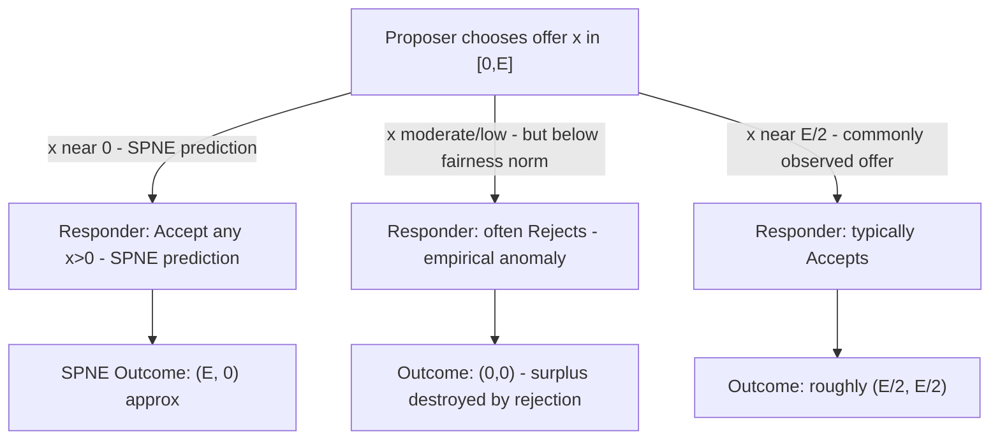

## The Ultimatum Game

### Overview

The Ultimatum Game is a two-player, single-round sequential bargaining game in which one player proposes a division of a fixed sum and the other player can either accept or reject it, with rejection destroying the entire sum for both players. Introduced by Güth, Schmittberger, and Schwarze (1982), it is among the most extensively replicated games in experimental economics and, alongside the Trust Game and Centipede Game covered elsewhere in this chapter, stands as one of the sharpest documented divergences between subgame-perfect equilibrium prediction and observed human behavior.

### Formal Structure

**Players:** Proposer (Player 1, moves first) and Responder (Player 2, moves second, after observing the Proposer's offer).

**Fixed sum:** A pie of size $E$ (e.g., $10), known to both players.

**Proposer's move:** Chooses an offer $x \in [0, E]$, proposing to keep $E - x$ and give $x$ to the Responder.

**Responder's move:** After observing $x$, chooses to **Accept** or **Reject**.

**Payoffs:**

$$(\pi_{\text{Proposer}}, \pi_{\text{Responder}}) =
\begin{cases}
(E - x, \ x) & \text{if Accept} \\
(0, \ 0) & \text{if Reject}
\end{cases}$$

This is a **game of perfect information** (per the classification developed earlier in this chapter): the Responder's decision node for any given offer $x$ is a singleton, since the Responder directly observes the exact offer made. It is directly amenable to the backward induction procedure introduced in this chapter.

### Key Points

- The unique **subgame-perfect Nash equilibrium**, under standard self-interested preferences, has the Proposer offering the **smallest possible positive amount** (approaching $x=0$, or exactly the smallest currency unit in discrete formulations) and the Responder **accepting any offer $x \geq 0$**.
- This SPNE is derived via backward induction: since **any** positive payoff exceeds the $0$ payoff from rejecting, a purely self-interested Responder accepts any offer $x > 0$ (and is indifferent at $x=0$); anticipating this, the Proposer offers the minimum amount that secures acceptance.
- Unlike the Trust Game and Centipede Game, the Ultimatum Game's SPNE is **technically Pareto-efficient** (the full pie $E$ is allocated with no surplus destroyed), but the prediction is nonetheless robustly contradicted experimentally — the empirical anomaly here concerns the *distribution*, not the destruction, of surplus.
- The Responder's rejection option gives this game its defining structural feature relative to the Dictator Game covered earlier in this chapter: the Ultimatum Game isolates the **strategic** component of fair-offer behavior (fear of rejection), whereas the Dictator Game isolates the **pure preference** component, since the Dictator Game's Recipient has no comparable veto.

### Backward Induction Solution

**Step 1 (Responder's optimal response, last mover):** For any offer $x$, the Responder compares Accept (payoff $x$) against Reject (payoff $0$). Under standard self-interested, monotonic preferences, Accept is weakly optimal for all $x \geq 0$, and strictly optimal for all $x > 0$.

**Step 2 (Proposer's optimal response, anticipating Step 1):** Since any $x > 0$ will be accepted, the Proposer's payoff $\pi_{\text{Proposer}} = E - x$ is maximized by choosing the smallest offer that still secures acceptance — formally $x^* \to 0^+$ in a continuous strategy space, or $x^* = $ the smallest available monetary unit (e.g., one cent, or one chip) in a discretized formulation.

**Result:** The SPNE prediction is an essentially minimal offer, accepted by the Responder, yielding payoffs approximately $(E, 0)$ — an extreme, maximally unequal division that is nonetheless individually rational for both players under the equilibrium logic.

### The Central Paradox: Efficient but Empirically Rejected Equilibrium

The Ultimatum Game's theoretical significance lies in a subtlety distinct from the Trust Game and Centipede Game: its SPNE **does not destroy any surplus** (the full pie $E$ is always allocated in equilibrium), yet the prediction is nonetheless overwhelmingly contradicted by experimental behavior on **both sides** of the interaction.

**[Unverified]** The extensive experimental literature beginning with Güth, Schmittberger, and Schwarze (1982) and replicated across dozens of subsequent studies and cultural contexts (including the large-scale cross-cultural work associated with Henrich and colleagues, also referenced under the Dictator Game) has consistently found that (a) Proposers typically offer substantially more than the minimal SPNE prediction, with offers frequently clustering near, though usually somewhat below, an equal 50/50 split, and (b) Responders frequently **reject** offers perceived as unfairly low, even though rejection is strictly payoff-dominated by acceptance for any positive offer under standard self-interested preferences. Exact average offer levels and rejection-rate thresholds vary considerably across studies, stake sizes, and cultural/institutional contexts, and specific quantitative figures should be treated as illustrative rather than fixed universal constants.

**[Inference]** The Responder's willingness to reject low offers — sacrificing a strictly positive guaranteed payoff purely to deny the Proposer a highly unequal gain — is generally interpreted as direct behavioral evidence for **inequity aversion** or a preference for punishing perceived unfairness, even at direct personal cost, a phenomenon often labeled **costly punishment** or **altruistic punishment** in the broader behavioral economics literature. This differs qualitatively from the Trust Game and Centipede Game anomalies, which primarily concern departures from equilibrium via excessive *cooperation*; the Ultimatum Game anomaly is distinctive in that it is sustained by the Responder's willingness to actively destroy value in response to a perceived unfair offer.

### Relationship to the Dictator Game: Decomposing Strategic vs. Pure Fairness Motives

The Ultimatum Game and Dictator Game (covered earlier in this chapter) are frequently deployed **together** as a matched experimental pair specifically to decompose observed Proposer/Dictator generosity into two components:

$$\underbrace{\text{Ultimatum Offer}}_{\text{strategic + pure preference}} \ \text{vs.} \ \underbrace{\text{Dictator Allocation}}_{\text{pure preference only}}$$

**[Inference]** Since the Dictator Game removes any possibility of rejection, any generosity observed there cannot be attributed to strategic fear of rejection. The empirical finding that Ultimatum offers are typically **higher on average** than Dictator Game allocations is generally interpreted as evidence that a meaningful portion of Ultimatum Proposer generosity is indeed strategically motivated (anticipating possible rejection of low offers), while the generosity that persists even in the Dictator Game reflects a genuine, non-strategic other-regarding preference component — this decomposition is one of the primary methodological contributions of using the two games in tandem.

### Theoretical Models Accommodating the Rejection Anomaly

- **Inequity Aversion (Fehr–Schmidt, Bolton–Ockenfels):** Modifying the Responder's utility function to penalize disadvantageous inequality directly rationalizes rejection of sufficiently unequal offers as utility-maximizing given the augmented preferences, while preserving the standard game-theoretic equilibrium apparatus (the SPNE prediction simply shifts to reflect the modified utility function).
- **Reciprocity/Intentions-Based Models (Rabin, and later Dufwenberg–Kirchsteiger):** Model Responder utility as depending on perceived kindness or unkindness of the Proposer's offer relative to some reference point, rather than purely on the final monetary allocation itself.
- **Level-$k$/Bounded Reasoning Models:** Posit that Proposers may not perform full backward induction and instead anchor on a fairness norm (e.g., a roughly equal split) directly, independent of a fully rationalized fear-of-rejection calculation.
- **Quantal Response Equilibrium:** As with the Traveler's Dilemma and Centipede Game elsewhere in this chapter, QRE-style noisy best-response models have been used to fit observed offer and rejection distributions more closely than the strict SPNE prediction.

### Comparison to Related Games in This Chapter

| Game | Sequential Structure | SPNE Outcome | Surplus Destroyed at SPNE? | Primary Empirical Anomaly |
| --- | --- | --- | --- | --- |
| Ultimatum Game | 2-move: offer, accept/reject | Minimal offer, accepted | No — full pie allocated | Rejection of low offers; higher-than-minimal offers |
| Dictator Game | 1-move: allocate | Allocate $0$ | No — full pie allocated | Positive giving absent any strategic pressure |
| Trust Game | 2-move: send, return | $(0,0)$ send/return | Yes — full multiplier surplus lost | Positive sending and reciprocal returning |
| Centipede Game | Multi-round alternating | Immediate Take at first node | Severe — nearly all surplus lost | Passing well beyond the first node |

The Ultimatum Game's closest structural relative in this chapter is the **Trust Game**: both are two-move sequential games solved via a single backward-induction step, and both are robustly contradicted experimentally. The key distinguishing feature is that the Ultimatum Game's anomaly is driven substantially by the **second mover's** willingness to reject (actively destroying value), whereas the Trust Game's anomaly is driven by **both** movers deviating toward more cooperative behavior than the SPNE prescribes.

### Variants and Extensions

**Mini-Ultimatum Game:** The Proposer's offer set is restricted to a small number of discrete options (often just two, e.g., a "fair" 50/50 split versus a specific unequal split), used to more cleanly isolate the Responder's rejection behavior from strategic Proposer offer-selection dynamics.

**Random/Impunity Ultimatum Game:** The Responder's rejection destroys only the Responder's own payoff (not the Proposer's), used to test whether rejection is motivated by pure spite/inequity aversion toward the Proposer specifically, or by a more general aversion to accepting low payoffs.

**Multi-Responder / Competitive Ultimatum Game:** Multiple Responders compete to accept a single Proposer's offer (the first to accept receives the offer; others get nothing), typically driving offers down toward the SPNE prediction far more effectively than the standard two-player version, illustrating how the introduction of Responder-side competition restores something closer to the standard equilibrium logic.

**Ultimatum Game Across Cultures:** Large cross-cultural studies (again, notably associated with Henrich and colleagues) have found substantial variation in both average offers and rejection thresholds across societies with differing market integration and cooperative norms, informing debates about whether fairness preferences are a universal human trait or substantially shaped by social and economic context.

### Backward Induction and Rejection Anomaly Diagram

### Offer Distribution and Rejection Threshold Illustration (svg_diagram)

<svg xmlns="http://www.w3.org/2000/svg" viewBox="0 0 500 340">
<text x="250" y="24" font-size="16" font-weight="bold" text-anchor="middle" fill="#222">Ultimatum Game: Offers and Rejection Zone (svg_diagram)</text>
<line x1="60" y1="290" x2="440" y2="290" stroke="#333" stroke-width="2" />
<line x1="60" y1="290" x2="60" y2="50" stroke="#333" stroke-width="2" />
<text x="440" y="310" font-size="12" text-anchor="middle" fill="#333">Offer Amount (x)</text>
<text x="25" y="50" font-size="12" text-anchor="middle" fill="#333" transform="rotate(-90 25 170)">Frequency</text>
<rect x="70" y="70" width="360" height="200" fill="#fbe8e8" stroke="none" />
<text x="120" y="90" font-size="10" fill="#cc4422">Rejection-likely zone (low offers)</text>
<rect x="80" y="250" width="30" height="40" fill="#cc4422" />
<text x="95" y="305" font-size="9" text-anchor="middle" fill="#333">SPNE (near 0)</text>
<rect x="150" y="200" width="30" height="90" fill="#996600" />
<rect x="200" y="150" width="30" height="140" fill="#996600" />
<rect x="250" y="90" width="30" height="200" fill="#2266cc" />
<text x="265" y="80" font-size="10" text-anchor="middle" fill="#2266cc">Modal offer near equal split</text>
<rect x="300" y="220" width="30" height="70" fill="#996600" />
<line x1="200" y1="70" x2="200" y2="290" stroke="#22aa55" stroke-width="2" stroke-dasharray="5,3" />
<text x="200" y="60" font-size="10" text-anchor="middle" fill="#22aa55">Typical rejection threshold</text>
</svg>

### Applications

- **Wage and Salary Negotiation:** Direct modeling of take-it-or-leave-it wage offers, where employer offers perceived as unfair can trigger reputational or relational costs analogous to Responder rejection.
- **Labor Relations and Strike Behavior:** Explaining why workers sometimes reject contract offers that are strictly better than the status quo, when those offers are perceived as unfairly low relative to a reference point.
- **Consumer Behavior and Pricing:** Studying consumer rejection of perceived "unfair" pricing or surcharge practices even when the transaction remains strictly beneficial in narrow monetary terms.
- **International Trade and Sanctions Negotiations:** Modeling why parties sometimes reject mutually beneficial settlement terms perceived as excessively favorable to the other side, connecting to costly-punishment and reciprocity-based bargaining theory.

### Conclusion

The Ultimatum Game demonstrates that even a Pareto-efficient subgame-perfect equilibrium prediction can be robustly and systematically contradicted by experimental behavior on both sides of a bargaining interaction: Proposers routinely offer more than the equilibrium prescribes, and Responders routinely reject offers perceived as unfair despite the strict payoff cost of doing so. Paired methodologically with the Dictator Game, it has been central to decomposing observed generosity into strategic and non-strategic components, and alongside the Trust Game and Centipede Game, it anchors this chapter's broader theme that logically valid backward-induction predictions frequently fail as descriptive models of real bargaining behavior, motivating the inequity-aversion and reciprocity-based theoretical frameworks now standard in behavioral game theory.

**Related Topics**

- Backward induction and subgame-perfect Nash equilibrium (direct application)
- Dictator Game (paired decomposition of strategic vs. pure fairness motives)
- Fehr–Schmidt inequity aversion and costly/altruistic punishment
- Trust Game and Centipede Game (parallel equilibrium-vs-behavior paradoxes)
- Cross-cultural experimental economics (Henrich et al.)
- Rabin's reciprocity and intentions-based fairness models
- Mini-Ultimatum and competitive multi-Responder variants
- Güth, Schmittberger, and Schwarze's original 1982 formulation