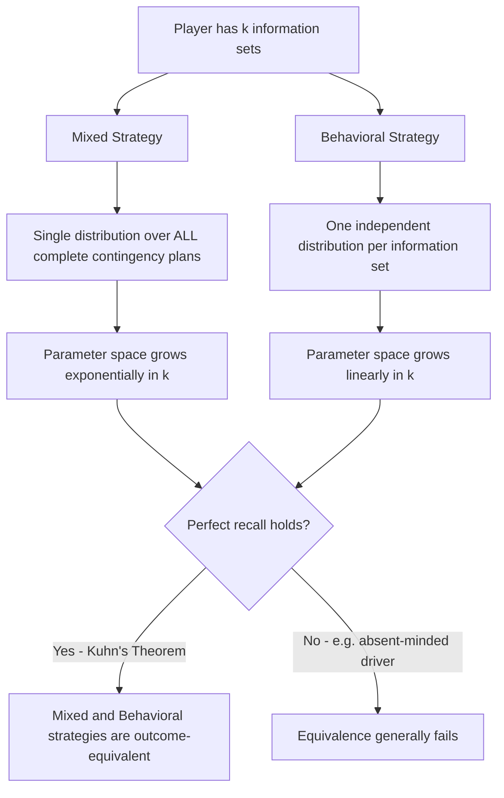

## Behavioral Strategies

### Overview

Behavioral strategies formalize randomization at the level of individual information sets in extensive-form games, in contrast to mixed strategies, which randomize over entire pure-strategy contingency plans. Introduced into modern usage largely through the work following Kuhn (1953), the behavioral strategy concept is essential for tractable analysis of extensive-form games with imperfect information, and its formal equivalence to mixed strategies under perfect recall — Kuhn's Theorem — is one of the foundational results connecting normal-form and extensive-form solution concepts covered throughout this chapter.

### Formal Definition

Recall from earlier in this chapter that a **pure strategy** for player $i$ in extensive form is a complete contingency plan: exactly one action specified at every information set belonging to player $i$.

A **behavioral strategy** for player $i$ instead specifies, at **each individual information set** $I_i$ belonging to player $i$, an independent probability distribution over the actions available at that information set:

$$\beta_i(I_i) \in \Delta(A(I_i))$$

where $A(I_i)$ denotes the set of actions available at information set $I_i$, and $\Delta(\cdot)$ denotes the set of probability distributions over that action set.

Critically, a behavioral strategy requires **one independent randomization per information set**, rather than a single randomization over the player's entire space of complete contingency plans. If player $i$ has $k$ information sets, a behavioral strategy is specified by $k$ separate probability distributions — one per information set — whereas a mixed strategy is a single probability distribution over the (typically much larger) set of all possible pure strategies.

### Key Points

- Behavioral strategies and mixed strategies are **conceptually distinct randomization devices**: a mixed strategy randomizes once, at the start of the game, over complete plans; a behavioral strategy randomizes independently, fresh, at each information set as it is reached.
- Under **perfect recall** (introduced earlier in this chapter under Game Trees and Information Sets), every mixed strategy has an **outcome-equivalent** behavioral strategy, and vice versa — this equivalence is **Kuhn's Theorem** (1953), one of the central bridging results between the mixed-strategy apparatus typically used in normal-form analysis and the behavioral-strategy apparatus natural to extensive-form analysis.
- For games with a **single information set per player** (i.e., simultaneous-move games such as Matching Pennies or the simultaneous Battle of the Sexes/Chicken), mixed and behavioral strategies **coincide exactly**, since there is only one information set over which to randomize either way.
- Behavioral strategies are the natural apparatus for defining and computing **Perfect Bayesian Equilibrium** and **Sequential Equilibrium**, the refinements introduced earlier in this chapter as extensions of subgame-perfect equilibrium logic to games of imperfect information.

### Outcome-Equivalence: Mixed vs. Behavioral Strategies

Two strategies (of any type) are **outcome-equivalent** if they induce the same probability distribution over terminal nodes (and hence the same expected payoffs for every player), for every possible strategy of the opponents.

**Kuhn's Theorem (1953):** In any finite extensive-form game with **perfect recall**, for every mixed strategy there exists an outcome-equivalent behavioral strategy, and for every behavioral strategy there exists an outcome-equivalent mixed strategy. Consequently, under perfect recall, **nothing is lost by restricting attention to behavioral strategies** when searching for or characterizing Nash equilibria (or refinements thereof) — a substantial practical simplification, since behavioral strategies require specifying far fewer numbers (one distribution per information set) than mixed strategies (one distribution over the entire, typically exponentially larger, space of pure strategies).

**Illustrative construction:** Given a mixed strategy $\sigma_i$ (a distribution over player $i$'s pure strategies), the outcome-equivalent behavioral strategy at information set $I_i$ is constructed by computing the conditional probability, under $\sigma_i$, that each available action at $I_i$ is taken **given that $I_i$ is reached** — this conditional-probability construction is precisely where the perfect recall assumption becomes necessary, since it requires that the player's own information about how they arrived at $I_i$ be well-defined and consistent across all pure strategies compatible with reaching that information set.

### Why Perfect Recall Matters: A Structural Necessity

Kuhn's Theorem's equivalence result **depends critically on perfect recall**. Without perfect recall (i.e., in games where a player may forget their own previous actions or information), mixed and behavioral strategies can fail to be outcome-equivalent, because the conditional-probability construction described above may not be well-defined or may produce systematically different outcome distributions.

**[Inference]** The canonical illustration in the literature is the **"absent-minded driver" problem** (Piccione and Rubinstein, 1997), a single-player decision problem in which the decision-maker faces the same decision node — and hence the same information set — at two distinct points along a single path through the tree, without being able to recall which visit they are currently experiencing. In such imperfect-recall settings, a behavioral strategy (a single randomization probability applied identically at both indistinguishable visits) generally cannot replicate the outcome distribution achievable by certain mixed strategies (which could, in principle, correlate the choices made at the two visits via a single upfront randomization), illustrating that the behavioral/mixed equivalence is a genuine consequence of the perfect recall assumption rather than a strategy-space triviality. All games covered substantively elsewhere in this chapter (Trust Game, Ultimatum Game, Centipede Game, sequential Chicken/Battle of the Sexes, and their simultaneous-move counterparts) satisfy perfect recall, so this equivalence issue does not arise in their standard analysis.

### Behavioral Strategies in Games Covered Elsewhere in This Chapter

| Game | Information Sets per Player | Behavioral Strategy Interpretation |
| --- | --- | --- |
| Matching Pennies | 1 (single simultaneous move) | Coincides exactly with the mixed strategy: randomize $H$/$T$ with probability $1/2$ each |
| Simultaneous Battle of the Sexes | 1 per player | Coincides with mixed strategy equilibrium ($p=2/3$, $q=1/3$) derived earlier |
| Trust Game | Multiple (one per possible $s$ for the Receiver) | A behavioral strategy specifies $r(s)$ — potentially a distribution — independently for every possible Sender amount $s$, even those never reached in equilibrium |
| Sequential Chicken/Battle of the Sexes | Multiple (singleton nodes for the second mover, one per first-mover action) | Behavioral strategy specifies an independent (possibly degenerate) distribution over the second mover's response to *each* possible first move |

The Trust Game example is particularly instructive: the Receiver's behavioral strategy $r^*(s) = 0$ for all $s$ (derived via backward induction elsewhere in this chapter) is already stated in exactly behavioral-strategy form — a complete specification of the (degenerate, since it happens to be a pure best response at each node) probability distribution over actions at **every** one of the Receiver's information sets, including the many values of $s$ that are never reached given the Sender's equilibrium choice of $s^*=0$. This is precisely the "complete contingency plan" requirement noted earlier in this chapter's coverage of subgame-perfect equilibrium, now expressed in its natural behavioral-strategy notation.

### Behavioral Strategies and Sequential Rationality

Behavioral strategies are the natural apparatus for expressing **sequential rationality** — the requirement, central to Perfect Bayesian Equilibrium and Sequential Equilibrium (introduced earlier in this chapter as extensions beyond SPNE for imperfect-information settings), that a player's action at each information set be optimal **given some specified belief** over which node in that information set has actually been reached, and given the specified continuation behavioral strategies of all players. Because a behavioral strategy already decomposes naturally into "one distribution per information set," it directly supports the node-by-node (or information-set-by-information-set) verification of sequential rationality required by these refinements, in a way that a single monolithic mixed-strategy randomization does not as naturally support.

### Computational and Representational Advantages

**[Inference]** Beyond their theoretical role in Kuhn's Theorem, behavioral strategies are typically the preferred representation in applied and computational game theory (e.g., algorithms for computing equilibria in large extensive-form games, such as those used in computer poker research) specifically because their parameter space grows **linearly** in the number of information sets, whereas the mixed-strategy parameter space grows **exponentially** in the number of information sets (since a pure strategy must specify an action at every information set simultaneously, and the number of such complete contingency plans multiplies combinatorially). This representational efficiency is a primary practical reason behavioral strategies, rather than mixed strategies, are the standard tool in modern computational approaches to solving large imperfect-information extensive-form games.

### Mixed vs. Behavioral Strategy Representation Diagram

### Randomization Structure Comparison Illustration (svg_diagram)

<svg xmlns="http://www.w3.org/2000/svg" viewBox="0 0 500 320">
<text x="250" y="24" font-size="16" font-weight="bold" text-anchor="middle" fill="#222">Mixed vs Behavioral Strategy Randomization (svg_diagram)</text>

<text x="120" y="55" font-size="13" font-weight="bold" text-anchor="middle" fill="`#2266cc`">Mixed Strategy</text>

<rect x="60" y="70" width="120" height="30" fill="`#e8eefc`" stroke="`#2266cc`" />

<text x="120" y="90" font-size="10" text-anchor="middle" fill="`#2266cc`">Single upfront randomization</text>

<line x1="120" y1="100" x2="80" y2="150" stroke="#333" />

<line x1="120" y1="100" x2="160" y2="150" stroke="#333" />

<circle cx="80" cy="160" r="6" fill="`#cc4422`" />

<circle cx="160" cy="160" r="6" fill="`#cc4422`" />

<text x="120" y="200" font-size="9" text-anchor="middle" fill="#333">Determines entire plan at once</text>

<text x="380" y="55" font-size="13" font-weight="bold" text-anchor="middle" fill="`#22aa55`">Behavioral Strategy</text>

<circle cx="380" cy="90" r="6" fill="`#22aa55`" />

<rect x="330" y="105" width="100" height="25" fill="`#e8f4ea`" stroke="`#22aa55`" />

<text x="380" y="122" font-size="9" text-anchor="middle" fill="`#22aa55`">Distribution at Info Set 1</text>

<line x1="380" y1="130" x2="340" y2="175" stroke="#333" />

<line x1="380" y1="130" x2="420" y2="175" stroke="#333" />

<circle cx="340" cy="185" r="6" fill="`#cc4422`" />

<circle cx="420" cy="185" r="6" fill="`#cc4422`" />

<rect x="310" y="200" width="100" height="25" fill="`#e8f4ea`" stroke="`#22aa55`" />

<text x="360" y="217" font-size="9" text-anchor="middle" fill="`#22aa55`">Independent dist. at Info Set 2</text>

<text x="380" y="250" font-size="9" text-anchor="middle" fill="#333">Fresh randomization at each info set</text>

</svg>

### Applications

- **Computer Poker and Imperfect-Information Game Solving:** Behavioral strategies (via counterfactual regret minimization and related algorithms) are the standard representation in computational systems for solving large-scale imperfect-information games, directly building on their linear-in-information-sets parameter efficiency.
- **Auction Theory:** Bidding strategies in multi-stage or dynamic auctions are naturally represented as behavioral strategies, specifying bid distributions conditional on the information revealed at each stage.
- **Repeated and Stochastic Game Analysis:** Behavioral (often called "Markov" or "stationary" in that literature) strategies are the standard representation for equilibrium analysis in repeated and stochastic games with evolving state and information.
- **Formal Epistemic Game Theory:** The mixed/behavioral distinction and its dependence on perfect recall are central to foundational work examining the philosophical assumptions underlying standard equilibrium concepts, connecting directly to the Centipede Game's epistemic puzzles discussed elsewhere in this chapter.

### Conclusion

Behavioral strategies provide the natural, information-set-localized randomization apparatus for extensive-form games, and Kuhn's Theorem establishes that — under the perfect recall assumption satisfied by every substantive game covered elsewhere in this chapter — they are fully outcome-equivalent to mixed strategies while requiring a dramatically more compact representation. This equivalence underlies the practical and theoretical convenience of expressing subgame-perfect, Perfect Bayesian, and Sequential equilibrium strategies directly in behavioral form, as already implicitly done in this chapter's backward-induction analyses of the Trust Game and sequential Chicken and Battle of the Sexes variants.

**Related Topics**

- Kuhn's Theorem and the perfect recall assumption
- Perfect Bayesian Equilibrium and Sequential Equilibrium
- Perfect vs. imperfect recall (absent-minded driver problem)
- Backward induction and subgame-perfect Nash equilibrium
- Mixed strategy equilibrium computation (Matching Pennies, Battle of the Sexes)
- Counterfactual regret minimization and computational game solving
- Sequential rationality and belief consistency
- Trust Game and sequential Chicken (behavioral strategy worked examples)