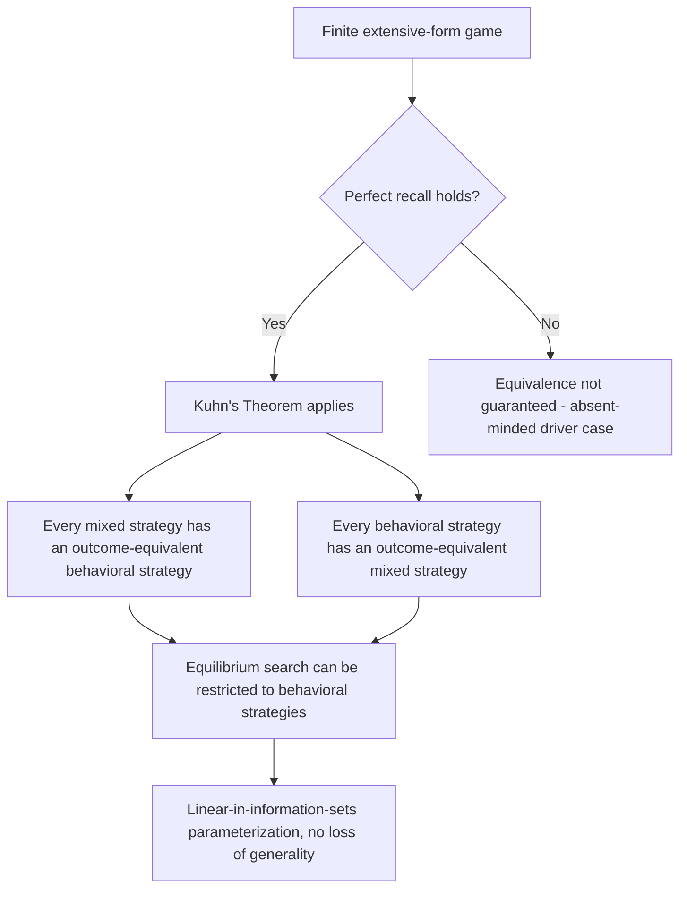

## Kuhn's Theorem

### Overview

Kuhn's Theorem, established by Harold W. Kuhn (1953), is the foundational result establishing that mixed strategies and behavioral strategies are outcome-equivalent in any finite extensive-form game satisfying perfect recall. It provides the formal justification for the behavioral-strategy apparatus introduced in the preceding topic of this chapter, and constitutes one of the central bridging results connecting the normal-form (strategic) and extensive-form perspectives on strategic interaction developed throughout this chapter.

### Statement of the Theorem

**Kuhn's Theorem:** In any finite extensive-form game with **perfect recall** (as defined earlier in this chapter — no player ever forgets information they previously possessed, including their own past actions), for every mixed strategy $\sigma_i$ of player $i$, there exists a behavioral strategy $\beta_i$ that is **outcome-equivalent** to $\sigma_i$, and conversely, for every behavioral strategy $\beta_i$, there exists an outcome-equivalent mixed strategy $\sigma_i$.

Two strategies are outcome-equivalent if, for every strategy profile of the remaining players, they induce the **identical probability distribution over terminal nodes** of the game tree — and hence identical expected payoffs for every player.

**Immediate corollary:** Under perfect recall, the set of Nash equilibria (and, by extension, subgame-perfect, Perfect Bayesian, and Sequential equilibria) of a game is unaffected by whether players are permitted to use mixed strategies, behavioral strategies, or both — searching over behavioral strategies alone is sufficient to characterize the full equilibrium set.

### Key Points

- Kuhn's Theorem is a **representation-equivalence result**, not a new solution concept: it does not introduce a new equilibrium notion, but rather establishes that two different formal randomization devices (mixed and behavioral strategies) yield exactly the same strategic possibilities under perfect recall.
- The theorem's **necessary condition is perfect recall**; without it, the equivalence generally fails, as illustrated by the absent-minded driver problem discussed in the prior topic of this chapter.
- The theorem provides the **formal license** for the standard practice — used implicitly throughout this chapter's analysis of the Trust Game, sequential Chicken, and sequential Battle of the Sexes — of specifying equilibrium strategies directly in behavioral form (one distribution per information set) rather than as unwieldy distributions over the full space of complete contingency plans.
- The **practical computational significance** of the theorem is substantial: since a player's pure-strategy space grows exponentially in the number of information sets while the behavioral-strategy parameterization grows only linearly, Kuhn's Theorem guarantees that this dramatic representational simplification comes at **no cost in strategic generality**, provided perfect recall holds.

### Proof Sketch and Intuition

**Constructing a behavioral strategy from a mixed strategy:** Given a mixed strategy $\sigma_i$ (a probability distribution over player $i$'s pure strategies), the outcome-equivalent behavioral strategy $\beta_i$ is constructed information-set by information-set: at information set $I_i$, define $\beta_i(a \mid I_i)$ as the conditional probability, under $\sigma_i$, that action $a$ is taken **given that** $I_i$ is reached (conditioning on the event that $I_i$ is reached, computed over the randomness of $\sigma_i$ together with any relevant strategies of other players and Nature needed to reach $I_i$).

This conditional-probability construction is well-defined precisely because perfect recall guarantees that the set of pure strategies of player $i$ consistent with reaching $I_i$ is well-structured: perfect recall ensures that a player's own action history is always known to them, so no two pure strategies that differ only in what the player would have done at nodes *outside* the information sets on the path to $I_i$ can create ambiguity about the conditional action distribution actually induced at $I_i$ itself.

**Constructing a mixed strategy from a behavioral strategy:** Conversely, given a behavioral strategy $\beta_i$ specifying independent distributions at each information set, the outcome-equivalent mixed strategy $\sigma_i$ assigns to each pure strategy (complete contingency plan) $s_i$ the probability:

$$\sigma_i(s_i) = \prod_{I_i} \beta_i\big(s_i(I_i) \mid I_i\big)$$

— the product, across all of player $i$'s information sets, of the behavioral-strategy probability assigned to the specific action that $s_i$ prescribes at each information set. This construction requires no perfect-recall assumption to be **well-defined** as a probability distribution, but establishing that it is genuinely **outcome-equivalent** to $\beta_i$ against arbitrary opposing strategies is where the perfect recall assumption becomes essential to the full equivalence claim.

**[Inference]** The deeper intuition for why perfect recall is necessary specifically for the mixed-to-behavioral direction is that, without perfect recall, a single "upfront" mixed-strategy randomization can in principle **correlate** a player's actions across multiple visits to the same (non-singleton, imperfect-recall) information set in a way that no independent, freshly-drawn behavioral-strategy randomization at that information set can replicate — this is exactly the mechanism exploited in the absent-minded driver problem discussed in the prior topic.

### Relationship to Other Results in This Chapter

Kuhn's Theorem underlies and formally justifies several results and practices already used elsewhere in this chapter:

- **Backward induction and subgame-perfect equilibrium:** The complete-contingency-plan strategies produced by backward induction (e.g., in the Trust Game and Centipede Game) are pure strategies, but when extended to settings requiring randomization (e.g., in a modified Trust Game where the Receiver might be indifferent and mix), Kuhn's Theorem guarantees that the natural behavioral-strategy specification of such mixing is fully general.
- **Simultaneous-move games as a degenerate special case:** For games with exactly one information set per player (Matching Pennies, simultaneous Battle of the Sexes/Chicken), mixed and behavioral strategies coincide trivially, since there is only one information set to condition on — Kuhn's Theorem's content is vacuous in this special case but becomes substantive precisely in multi-information-set sequential games like the Trust Game.
- **Perfect Bayesian and Sequential Equilibrium:** These refinements, introduced earlier in this chapter as extensions of subgame-perfect logic to imperfect-information settings, are standardly defined directly in terms of behavioral strategies plus a system of beliefs at each information set — a definitional choice made possible and fully general precisely because of Kuhn's Theorem.

### Historical and Theoretical Significance

**[Inference]** Kuhn's Theorem is frequently cited as one of the results that made the extensive-form apparatus developed by von Neumann and Morgenstern computationally and analytically tractable for subsequent game theorists, since it eliminated the need to reason directly about the combinatorially large space of complete pure strategies when analyzing equilibrium behavior in games with rich sequential structure. Its role in the historical development of extensive-form game theory is comparable to the role played by the Minimax Theorem (covered under Matching Pennies elsewhere in this material) in establishing the mixed-strategy equilibrium apparatus for zero-sum normal-form games — both results establish that a seemingly more general or complex strategic object (arbitrary correlation/randomization) reduces, under identified structural conditions, to a more tractable canonical form without loss of generality.

### Formal Statement Diagram

### Equivalence Mapping Illustration (svg_diagram)

<svg xmlns="http://www.w3.org/2000/svg" viewBox="0 0 500 300">
<text x="250" y="24" font-size="16" font-weight="bold" text-anchor="middle" fill="#222">Kuhn's Theorem: Equivalence Under Perfect Recall (svg_diagram)</text>
<ellipse cx="140" cy="150" rx="110" ry="70" fill="#e8eefc" stroke="#2266cc" stroke-width="2" />
<text x="140" y="140" font-size="13" text-anchor="middle" fill="#2266cc">Mixed Strategies</text>
<text x="140" y="160" font-size="10" text-anchor="middle" fill="#2266cc">(dist. over full plans)</text>
<ellipse cx="360" cy="150" rx="110" ry="70" fill="#e8f4ea" stroke="#22aa55" stroke-width="2" />
<text x="360" y="140" font-size="13" text-anchor="middle" fill="#22aa55">Behavioral Strategies</text>
<text x="360" y="160" font-size="10" text-anchor="middle" fill="#22aa55">(dist. per info set)</text>
<line x1="250" y1="130" x2="250" y2="130" stroke="none" />
<path d="M 250 130 L 250 130" stroke="none" />
<line x1="250" y1="140" x2="250" y2="140" stroke="none" />
<line x1="250" y1="150" x2="250" y2="150" stroke="none" />
<path d="M 250 135 Q 250 135 250 135" stroke="none" />
<line x1="250" y1="150" x2="250" y2="150" stroke="none" />
<path d="M 250 140 L 250 140" stroke="none" />
<line x1="250" y1="150" x2="250" y2="150" fill="none" stroke="none" />
<path d="M 250,140 L 250,160" stroke="none" />
<line x1="250" y1="150" x2="250" y2="150" stroke="none" />
<path d="M255 130 Q250 150 255 170" stroke="#cc4422" stroke-width="2" fill="none" marker-end="url(#arrow)" />
<path d="M245 170 Q250 150 245 130" stroke="#cc4422" stroke-width="2" fill="none" marker-end="url(#arrow)" />

<text x="250" y="120" font-size="11" text-anchor="middle" fill="`#cc4422`">Outcome-equivalent</text>

<text x="250" y="200" font-size="11" text-anchor="middle" fill="`#cc4422`">(requires perfect recall)</text>

</svg>

### Applications

- **Equilibrium Computation Algorithms:** All modern algorithms for computing equilibria in large finite extensive-form games (e.g., counterfactual regret minimization used in computer poker research, discussed in the prior topic) rely on Kuhn's Theorem to justify operating directly on the compact behavioral-strategy representation rather than the exponentially larger mixed-strategy space.
- **Definitional Foundations of Equilibrium Refinements:** Perfect Bayesian Equilibrium, Sequential Equilibrium, and related refinements are standardly defined using behavioral strategies plus belief systems, a formulation whose full generality (relative to mixed-strategy-based definitions) rests on Kuhn's Theorem.
- **Repeated and Stochastic Game Theory:** The use of "Markov" or stationary behavioral strategies as a canonical, tractable representation in repeated and stochastic game analysis is a direct extension of the same representational logic Kuhn's Theorem establishes for finite extensive-form games.
- **Epistemic and Foundational Game Theory:** The perfect-recall boundary condition of the theorem, and its failure in settings like the absent-minded driver problem, remain an active area of foundational research into the proper formal treatment of memory and information in strategic reasoning.

### Conclusion

Kuhn's Theorem establishes that, under the perfect recall assumption satisfied by every game analyzed in depth elsewhere in this chapter, mixed and behavioral strategies are fully outcome-equivalent, providing the formal justification for the standard practice of specifying and computing equilibria directly in the more tractable, information-set-localized behavioral-strategy form. As a foundational bridging result between the normal-form and extensive-form perspectives developed throughout this chapter, it underlies the validity of the backward-induction and subgame-perfect equilibrium constructions used in the Trust Game, Centipede Game, and sequential Chicken and Battle of the Sexes analyses, and remains the theoretical basis for modern computational approaches to solving large-scale extensive-form games.

**Related Topics**

- Behavioral strategies (formal definition and prior-topic foundation)
- Perfect vs. imperfect recall and the absent-minded driver problem
- Backward induction and subgame-perfect Nash equilibrium
- Perfect Bayesian Equilibrium and Sequential Equilibrium
- Von Neumann's Minimax Theorem (parallel reduction result for zero-sum games)
- Counterfactual regret minimization and computational game solving
- Harold Kuhn's original 1953 formulation
- Outcome-equivalence and strategic representation theory