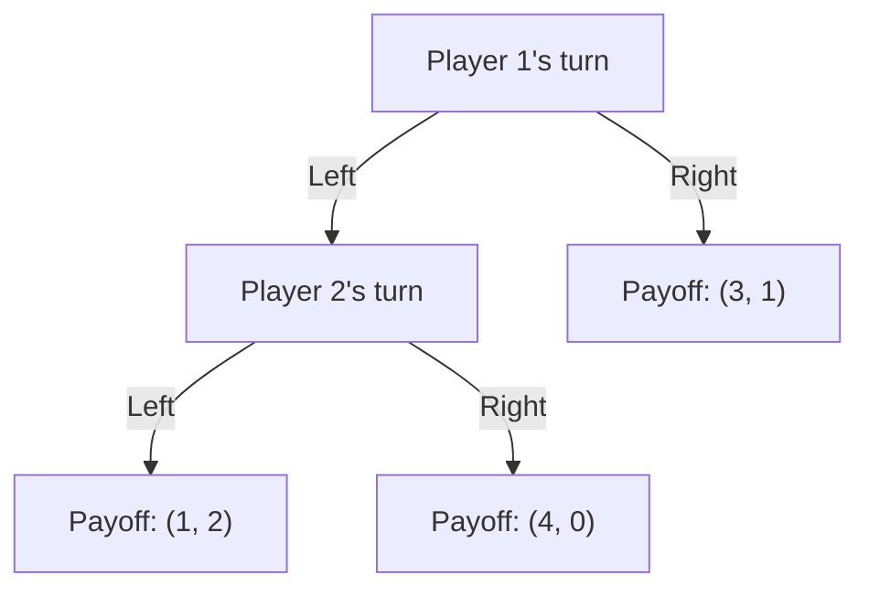

## Zermelo's Theorem

### Definition

Zermelo's Theorem is a foundational result in the theory of extensive form games. It states that in any finite two-player, zero-sum game of perfect information, one of the following must hold:

1. Player 1 has a winning strategy, or
2. Player 2 has a winning strategy, or
3. Both players have strategies guaranteeing at least a draw.

More generally (in the game-theoretic, non-win/draw/loss formulation), the theorem asserts that every finite extensive form game with perfect information has a **pure-strategy subgame perfect Nash equilibrium**, which can be computed by **backward induction**. The theorem is named after Ernst Zermelo, who presented the core argument in 1913 in the context of chess.

### Historical Context

Zermelo originally proved the result to answer a specific question about chess: whether, given enough time, it is theoretically determined whether White can force a win, Black can force a win, or both sides can force at least a draw. His 1913 paper, "Über eine Anwendung der Mengenlehre auf die Theorie des Schachspiels" ("On an Application of Set Theory to the Theory of the Game of Chess"), is widely regarded as one of the first works in formal game theory, predating von Neumann and Morgenstern's foundational 1944 text by several decades.

[Inference] Zermelo's original proof did not use the term "backward induction" and was framed in terms of set-theoretic reasoning about positions from which a player could force a win in a bounded number of moves; the modern presentation via backward induction is a later reformulation.

### Formal Statement

Consider a finite extensive form game $\Gamma$ with the following properties:

- **Perfect information**: every player, at every decision node, knows the full history of the game (all previous moves by all players).
- **Finite game tree**: the tree has finite depth (finite number of moves) and finite branching (finite number of choices at each node).
- **No chance moves** (in the classical formulation) — or, in extended versions, chance moves are permitted since Nature's randomization does not affect the existence argument.

Then:

$$\Gamma \text{ has at least one pure-strategy subgame perfect equilibrium.}$$

In the strict two-player zero-sum win/lose/draw version:

$$\exists \, s_1^* \in S_1 \text{ such that } s_1^* \text{ guarantees Player 1 at least a draw, OR } \exists \, s_2^* \in S_2 \text{ such that } s_2^* \text{ guarantees Player 2 a win}$$

and symmetrically for Player 2, exhausting all three mutually exclusive outcomes (P1 wins, P2 wins, draw is forceable by both).

### Key Assumptions

- **Finiteness**: The game tree must have a finite number of nodes. Without this, backward induction cannot "bottom out," and the theorem does not directly apply (infinite games require different tools, e.g., the Gale-Stewart theorem for infinite games with closed payoff sets).
- **Perfect information**: Every information set is a singleton; no player moves without observing all prior moves. Games with simultaneous moves or hidden information (imperfect information) are excluded from the classical statement.
- **No draws by infinite repetition**: In practice, games like chess require supplementary rules (e.g., threefold repetition, fifty-move rule) to guarantee finiteness, since without them the game tree could in principle be infinite.

### Proof Sketch (Backward Induction)

The proof proceeds by induction on the height of the game tree (the length of the longest path from root to a terminal node).

**Base case**: At terminal nodes, the outcome (payoff) is already defined, so no further reasoning is needed.

**Inductive step**: Assume every subgame of height $k$ has a determined value (an equilibrium outcome). Consider a node $v$ at height $k+1$, where it is player $i$'s turn to move. Each of $v$'s children is the root of a subgame of height $\leq k$, which by the inductive hypothesis already has a determined outcome. Player $i$, being rational, selects the action leading to the child subgame whose outcome is best for player $i$ (or, in the zero-sum win/lose/draw case, selects a winning move if one exists, else a drawing move if one exists, else concedes to losing).

By induction, every node in the tree — including the root — has a determined outcome, and the sequence of optimal choices at each node constitutes a subgame perfect equilibrium.

**Key Points**

- The proof is constructive: it does not merely assert existence but provides an algorithm (backward induction) to compute the equilibrium.
- The result relies on finite depth so that the induction terminates.
- The equilibrium found is in **pure strategies** — no randomization is required for existence, unlike in general finite games (per Nash's theorem, which guarantees mixed-strategy equilibria in non-perfect-information settings).

### Relationship to Backward Induction and Subgame Perfection

Zermelo's Theorem is the historical and logical precursor to the modern solution concept of **subgame perfect equilibrium (SPE)**, formalized by Reinhard Selten in 1965. Backward induction is the algorithmic method; SPE is the equilibrium concept it produces (in finite perfect-information games). Every backward induction solution is a subgame perfect equilibrium, and in finite games of perfect information with generic payoffs, backward induction identifies a unique SPE.

$$\text{Zermelo (1913)} \;\longrightarrow\; \text{Kuhn's Theorem (1953)} \;\longrightarrow\; \text{Selten's SPE (1965)}$$

Harold Kuhn's 1953 extension generalized the result to $n$-player, general-sum finite games of perfect information (not just two-player zero-sum), proving existence of a pure-strategy Nash equilibrium via the same backward induction logic.

### Worked Example: A Simple Extensive Form Game

Consider a simple two-player game tree with the following structure:

**Step 1 — Identify terminal payoffs:**

- Node C: $(3, 1)$
- Node D: $(1, 2)$
- Node E: $(4, 0)$

**Step 2 — Solve Player 2's subgame at node B:**

Player 2 compares payoffs at D $(1,2)$ and E $(4,0)$. Since Player 2's payoff is $2$ at D versus $0$ at E, Player 2 chooses **Left**, yielding outcome $(1, 2)$.

**Step 3 — Fold back to Player 1's decision at node A:**

Player 1 compares:

- Choosing **Left** → leads to B → Player 2 plays Left → outcome $(1, 2)$, so Player 1 gets $1$.
- Choosing **Right** → outcome $(3, 1)$, so Player 1 gets $3$.

Player 1 prefers $3 > 1$, so Player 1 chooses **Right**.

**Equilibrium path**: Player 1 plays Right; the subgame at B is never reached, but Player 2's strategy is still fully specified (Left, if reached). The subgame perfect equilibrium is $(\text{Right}, \text{Left})$ with outcome $(3, 1)$.

This illustrates Zermelo's Theorem directly: the finite, perfect-information tree yields a determined pure-strategy equilibrium via backward induction, with no need for randomization.

### Application to Chess and Combinatorial Games

Zermelo's original motivating question was: **is chess a "solved" game in principle?** The theorem guarantees that exactly one of the following is true:

- White has a strategy to force a win regardless of Black's play.
- Black has a strategy to force a win regardless of White's play.
- Both players have strategies to force at least a draw.

**Key Points**

- This is an *existence* result, not a *constructive* one for games of chess's size — the theorem does not tell us **which** of the three cases holds, nor does it provide a practically computable strategy, since the chess game tree, while finite, is astronomically large (estimated on the order of $10^{120}$ possible game paths, the Shannon number).
- The same logic underlies the theoretical solvability of games like tic-tac-toe (solved: forced draw with optimal play), checkers (solved in 2007: forced draw), and Connect Four (solved: first player win).
- [Unverified] The exact game-theoretic value of chess (win/lose/draw) remains unknown as of the current writing, since exhaustive search over the full game tree is computationally infeasible with present-day and foreseeable technology.

### Limitations and Extensions

- **Imperfect information**: Zermelo's Theorem does not apply when players cannot observe all prior moves (e.g., simultaneous-move games like Rock-Paper-Scissors, or card games with hidden information like poker). Such games generally require mixed strategies for equilibrium existence (Nash's theorem).
- **Infinite games**: For games with infinite horizons or infinite action spaces, determinacy is not automatic. The **Gale-Stewart Theorem** (1953) extends determinacy results to certain classes of infinite games with topologically closed (or open) winning conditions, but general infinite games can be non-determined (this connects to deep set-theoretic questions, e.g., the Axiom of Determinacy in descriptive set theory).
- **Stochastic (chance) moves**: When Nature/chance nodes are included (e.g., games with dice or random events), the existence of a subgame perfect equilibrium in pure strategies still holds by the same backward induction argument, provided the game tree remains finite — players simply maximize *expected* payoff at chance nodes instead of resolving a deterministic outcome.
- **Non-generic payoffs / ties**: When multiple actions at a node yield identical payoffs for the mover, backward induction may yield multiple equilibria; the theorem guarantees existence of at least one, not uniqueness.

### Distinguishing Zermelo's Theorem from Related Results

| Result | Scope | Guarantees |
| --- | --- | --- |
| Zermelo's Theorem (1913) | Finite, 2-player, zero-sum, perfect information | Win/Lose/Draw determinacy |
| Kuhn's Theorem (1953) | Finite, $n$-player, general-sum, perfect information | Existence of pure-strategy NE |
| Nash's Theorem (1950) | Finite, $n$-player, general (incl. imperfect info) | Existence of mixed-strategy NE |
| Gale-Stewart Theorem (1953) | Infinite, 2-player, zero-sum, closed payoff sets | Determinacy under topological conditions |

### Common Pitfalls

- **Conflating "determined" with "computable"**: A game being determined (per Zermelo) does not mean the winning strategy is known or practically findable — chess is determined in principle, but not solved in practice.
- **Applying the theorem to imperfect-information games**: A frequent student error is to assume any finite zero-sum game is determined; perfect information is a necessary hypothesis.
- **Assuming uniqueness of equilibrium**: Backward induction guarantees *existence*, but with tied payoffs at any decision node, multiple subgame perfect equilibria can coexist.

**Related Topics**

- Backward Induction
- Subgame Perfect Equilibrium (Selten, 1965)
- Kuhn's Theorem and Extensive Form Games with Imperfect Information
- Nash Equilibrium Existence Theorem
- Gale-Stewart Theorem and Infinite Games
- Combinatorial Game Theory (Sprague-Grundy Theory)
- Solved Games (Checkers, Connect Four, Tic-Tac-Toe)
- The Centipede Game (as a counterintuitive application of backward induction)
- Information Sets and Perfect vs. Imperfect Information