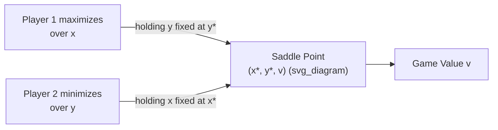

## The Minimax Theorem

### Definition

The Minimax Theorem, proven by John von Neumann in 1928, is the foundational existence result for two-player zero-sum games. It states that for any finite two-player zero-sum game, there exists a value $v$ (the **game value**) and mixed strategies for both players such that:

$$\max_{x \in \Delta_m} \min_{y \in \Delta_n} x^T A y = \min_{y \in \Delta_n} \max_{x \in \Delta_m} x^T A y = v$$

where $A$ is the $m \times n$ payoff matrix (from the row player's perspective), $x$ is a mixed strategy for the row player (a probability distribution over $m$ rows), $y$ is a mixed strategy for the column player (a probability distribution over $n$ columns), and $\Delta_m$, $\Delta_n$ are the corresponding probability simplices.

In words: the best outcome a player can guarantee by playing defensively (maximizing their minimum guaranteed payoff) equals the worst outcome the opponent can hold them to (minimizing the opponent's maximum achievable payoff). This common value $v$ is called the **value of the game**.

### Historical Context

Von Neumann proved the theorem in his 1928 paper "Zur Theorie der Gesellschaftsspiele" ("On the Theory of Parlor Games"), which is often cited as the founding document of modern game theory, predating even Zermelo's chess work's broader reception. Von Neumann's original proof relied on topological fixed-point-style arguments and was later simplified using linear programming duality (developed alongside George Dantzig in the late 1940s) and separating hyperplane arguments from convex analysis.

**Key Points**

- The theorem resolved a long-standing open question about whether rational, adversarial decision-making could always be reduced to a well-defined numerical value.
- It is the direct precursor to Nash's 1950 generalization to non-zero-sum and $n$-player games; the Minimax Theorem is a special case of Nash equilibrium existence restricted to two-player zero-sum settings.

### Formal Statement

**Setup**: A two-player zero-sum game is defined by an $m \times n$ payoff matrix $A$, where entry $a_{ij}$ is the payoff the row player (Player 1) receives from the column player (Player 2) when Player 1 plays pure strategy $i$ and Player 2 plays pure strategy $j$. Since the game is zero-sum, Player 2's payoff is $-a_{ij}$.

**Mixed strategies**: Player 1 selects $x = (x_1, \ldots, x_m) \in \Delta_m$; Player 2 selects $y = (y_1, \ldots, y_n) \in \Delta_n$. The expected payoff to Player 1 is:

$$E[\text{payoff}] = x^T A y = \sum_{i=1}^{m} \sum_{j=1}^{n} x_i a_{ij} y_j$$

**Theorem (von Neumann, 1928)**:

$$\max_{x} \min_{y} \, x^T A y = \min_{y} \max_{x} \, x^T A y$$

This common quantity is the value $v$ of the game. There exist optimal strategies $x^*$ and $y^*$ (each computable, generally requiring mixed/randomized play) such that:

$$x^{*T} A y \geq v \quad \forall y \in \Delta_n \qquad \text{and} \qquad x^T A y^* \leq v \quad \forall x \in \Delta_m$$

The pair $(x^*, y^*)$ forms a **Nash equilibrium** of the zero-sum game, and $(x^*, y^*, v)$ is often called a **saddle point** of the function $x^T A y$.

### Why Maximin ≤ Minimax Always (and Equality Is the Theorem's Content)

For *any* two-player zero-sum game (even without mixed strategies), the inequality

$$\max_{x} \min_{y} \, x^T A y \; \leq \; \min_{y} \max_{x} \, x^T A y$$

always holds trivially — guaranteeing a floor for yourself before your opponent responds is never better than letting your opponent commit first and then best-responding. The substantive content of the Minimax Theorem is that, **when mixed strategies are allowed**, this inequality becomes an **equality**. In pure strategies alone, strict inequality can occur (this is precisely when no pure-strategy equilibrium — no saddle point — exists), which is why randomization is essential to the result.

### Worked Example: Matching Pennies

Consider the classic zero-sum game **Matching Pennies**. Player 1 (Matcher) wins if both coins show the same face; Player 2 (Mismatcher) wins if they differ.

|  | P2: Heads | P2: Tails |
| --- | --- | --- |
| **P1: Heads** | $+1$ | $-1$ |
| **P1: Tails** | $-1$ | $+1$ |

**Step 1 — Check for a pure-strategy saddle point:**

For each of Player 1's rows, the column player will pick the column minimizing Player 1's payoff. Row "Heads" gives worst-case $-1$; Row "Tails" gives worst-case $-1$. So $\text{maximin (pure)} = -1$.

For each of Player 2's columns, the row player will pick the best response. Column "Heads" gives Player 1's best response payoff $+1$; Column "Tails" gives $+1$. So $\text{minimax (pure)} = +1$.

Since $-1 \neq +1$, **no pure-strategy saddle point exists** — this game requires mixed strategies.

**Step 2 — Solve for mixed-strategy equilibrium:**

Let Player 1 play Heads with probability $p$ and Tails with probability $1-p$. Player 2's expected payoff from playing Heads is $p(-1) + (1-p)(1) = 1 - 2p$; from Tails is $p(1) + (1-p)(-1) = 2p - 1$. Player 2 is indifferent (and Player 1's strategy is optimal) when these are equal:

$$1 - 2p = 2p - 1 \implies p = \frac{1}{2}$$

By symmetry, Player 2 also randomizes 50/50.

**Step 3 — Compute the value:**

$$v = p \cdot q \cdot (1) + p(1-q)(-1) + (1-p)q(-1) + (1-p)(1-q)(1) \Big|_{p=q=1/2} = 0$$

The game value is $v = 0$ — a fair game where neither player has an edge under optimal randomized play. This matches intuition: Matching Pennies is symmetric and offers no structural advantage to either side.

### Proof Sketch (via Linear Programming Duality)

The modern, standard proof recasts each player's optimization as a linear program (LP) and invokes **LP strong duality**.

**Player 1's problem** (maximize guaranteed payoff):

$$\max_{x, v} \; v \quad \text{s.t.} \quad \sum_i x_i a_{ij} \geq v \; \forall j, \quad \sum_i x_i = 1, \quad x_i \geq 0$$

**Player 2's problem** (minimize what they must concede), formulated as the dual:

$$\min_{y, w} \; w \quad \text{s.t.} \quad \sum_j a_{ij} y_j \leq w \; \forall i, \quad \sum_j y_j = 1, \quad y_j \geq 0$$

These two LPs are **dual to each other**. By the **LP Strong Duality Theorem**, if both LPs are feasible (which they always are here, since the simplex constraints are always satisfiable), their optimal objective values coincide: $v^* = w^*$. This shared optimum is exactly the minimax value, and the equality $v^* = w^*$ *is* the Minimax Theorem.

**Key Points**

- This LP-based proof also yields a **constructive method**: solving the two LPs (e.g., via the simplex algorithm) directly produces both players' optimal mixed strategies and the game value.
- [Inference] This duality-based proof is generally considered more accessible than von Neumann's original topological argument and is the version most commonly taught in modern game theory and optimization courses.

### Geometric Intuition: Saddle Points

The name "saddle point" comes from viewing $x^T A y$ as a surface over the joint strategy space. At the equilibrium $(x^*, y^*)$, the function achieves a maximum along the $x$-direction and a minimum along the $y$-direction simultaneously — resembling the shape of a horse's saddle.

<svg xmlns="http://www.w3.org/2000/svg" viewBox="0 0 640 320">
\<style\>
.lbl { font-family: sans-serif; font-size: 13px; fill: #222; }
.title { font-family: sans-serif; font-size: 15px; fill: #111; font-weight: bold; }
.ax { stroke: #555; stroke-width: 1.5; }
\</style\>
<text x="20" y="24" class="title">Saddle Point Geometry of x^T A y (svg_diagram)</text>
<line x1="80" y1="270" x2="580" y2="270" class="ax" />
<line x1="80" y1="270" x2="80" y2="40" class="ax" />
<text x="590" y="275" class="lbl">y (Player 2's mix)</text>
<text x="30" y="35" class="lbl">x (Player 1's mix)</text>
<path d="M 100 250 Q 200 200 320 190 Q 440 180 560 220" stroke="#2b6cb0" stroke-width="2.5" fill="none" />
<text x="480" y="215" class="lbl" fill="#2b6cb0">max over x (fixed y*)</text>
<path d="M 100 130 Q 200 160 320 190 Q 440 220 560 160" stroke="#c0392b" stroke-width="2.5" fill="none" />
<text x="440" y="150" class="lbl" fill="#c0392b">min over y (fixed x*)</text>
<circle cx="320" cy="190" r="7" fill="#111" />
<text x="330" y="185" class="lbl" font-weight="bold">Saddle point (x*, y*, v)</text>
</svg>

### Relationship to Nash Equilibrium

The Minimax Theorem is a **special case** of Nash's 1950 existence theorem, restricted to two-player, zero-sum games. Key distinctions:

| Aspect | Minimax Theorem (1928) | Nash Equilibrium (1950) |
| --- | --- | --- |
| Game class | 2-player, zero-sum | $n$-player, general-sum |
| Solution guarantee | Unique game value $v$ | Possibly multiple equilibria, no single "value" |
| Interpretation of equilibrium | Adversarial: minimize the max damage the opponent can do | Mutual best response, not necessarily adversarial |
| Computability | Linear programming (polynomial time) | PPAD-complete in general (no known polynomial algorithm) |

**Key Points**

- In zero-sum games, *any* Nash equilibrium yields the same value $v$ — this uniqueness of value (though not necessarily of the strategies achieving it) is special to the zero-sum case and does not generalize.
- Zero-sum games are computationally "easy" (solvable via LP in polynomial time) precisely because of this minimax structure, whereas general-sum Nash equilibria lack this tractable structure.

### Applications

- **Economics and auction theory**: modeling strictly competitive markets or bidding wars.
- **Security and adversarial robustness**: minimax formulations underpin robust optimization, where a defender minimizes worst-case loss against an adversary (e.g., adversarial machine learning, robust control theory).
- **Statistical decision theory**: minimax estimators, which minimize the worst-case risk over a class of possible true parameter values, directly generalize this framework (Abraham Wald's statistical decision theory, developed shortly after von Neumann's work).
- **Combinatorial game search**: the minimax algorithm used in AI game-playing (e.g., chess and checkers engines, often combined with alpha-beta pruning) is the deterministic-tree analogue of this theorem, though it operates on perfect-information game trees (connecting back to Zermelo's Theorem) rather than simultaneous-move matrix games.
- **Modern machine learning**: Generative Adversarial Networks (GANs) are explicitly framed as a minimax game between a generator and a discriminator, $\min_G \max_D V(D, G)$, directly invoking this same mathematical structure.

### Limitations and Extensions

- **Requires finiteness (or compactness) for guaranteed existence**: The classical theorem is stated for finite games; extensions to infinite/continuous strategy spaces require additional topological conditions (e.g., **Sion's Minimax Theorem**, 1958, which generalizes to convex-concave functions on compact convex sets and does not require the bilinear/matrix-game structure).
- **Zero-sum restriction**: The clean equality of maximin and minimax generally fails in non-zero-sum games; there, minimax and maximin values can differ, and multiple, non-equivalent Nash equilibria can coexist.
- **Behavioral critique**: [Speculation] Some experimental economics literature suggests real human play in zero-sum games (e.g., in sports penalty-kick studies) often deviates systematically from theoretical minimax mixed-strategy predictions, though aggregate behavior sometimes approximates it; this remains a subject of ongoing empirical debate and is not a flaw in the mathematical theorem itself.

### Common Pitfalls

- **Confusing minimax value with pure-strategy outcomes**: Students often look only at the pure-strategy payoff matrix and fail to check for a saddle point before concluding mixed strategies are unnecessary.
- **Assuming the optimal mixed strategy is always 50/50**: This is an artifact of symmetric games like Matching Pennies; asymmetric payoff matrices generally yield non-uniform optimal mixing probabilities (found by solving the indifference equations or the LP).
- **Applying zero-sum intuitions to general-sum games**: The clean "value of the game" concept and the tractable LP-solvability do not carry over once payoffs are not perfectly opposed.

**Related Topics**

- Nash Equilibrium and Existence Theorems
- Linear Programming Duality
- Saddle Points and Convex-Concave Optimization
- Sion's Minimax Theorem (generalization to infinite spaces)
- Alpha-Beta Pruning and Minimax Search in AI
- Mixed Strategy Equilibria and Indifference Conditions
- Statistical Decision Theory and Minimax Estimators
- Generative Adversarial Networks (GANs) as Minimax Games
- Zero-Sum vs. General-Sum Game Classification