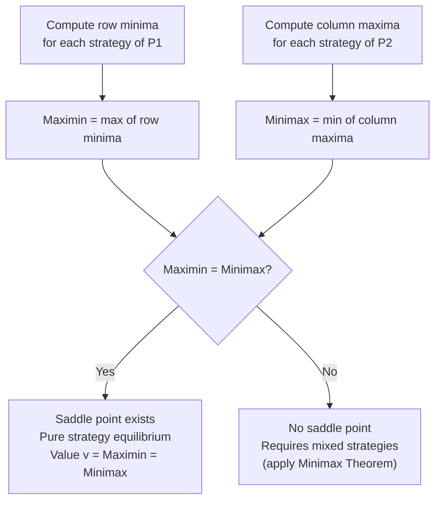

## Saddle Points and the Value of a Game

### Definition

A **saddle point** in a two-player zero-sum game is an entry $(i^*, j^*)$ in the payoff matrix $A$ that is simultaneously the minimum of its row and the maximum of its column. When a saddle point exists, its value is the **value of the game** $v$, and both players have optimal **pure strategies**: Player 1 plays row $i^*$, Player 2 plays column $j^*$, and neither player can unilaterally improve their outcome by deviating.

Formally, $(i^*, j^*)$ is a saddle point if:

$$a_{i^* j} \geq a_{i^* j^*} \geq a_{i j^*} \quad \forall i, j$$

meaning $a_{i^*j^*}$ is the largest value in its column $j^*$ (Player 1 cannot do better by switching rows) and the smallest value in its row $i^*$ (Player 2 cannot do better by switching columns).

### Relationship to the Minimax Theorem

Saddle points are the **pure-strategy special case** of the equilibrium guaranteed in mixed strategies by the Minimax Theorem. Recall that for any zero-sum game:

$$\underbrace{\max_i \min_j a_{ij}}_{\text{maximin value}} \; \leq \; \underbrace{\min_j \max_i a_{ij}}_{\text{minimax value}}$$

A **pure-strategy saddle point exists if and only if this inequality holds with equality** in pure strategies:

$$\max_i \min_j a_{ij} = \min_j \max_i a_{ij} = v$$

When this equality fails in pure strategies (as in Matching Pennies), no saddle point exists, and the Minimax Theorem guarantees the equality is restored only once mixed strategies are permitted. Thus, saddle-point analysis is the natural first step in solving any zero-sum game: check for a pure-strategy saddle point before resorting to mixed-strategy computation.

### The Maximin and Minimax Procedures

**Maximin (row player's security level)**: For each row $i$, find the minimum entry $\min_j a_{ij}$ (the worst case if Player 2 responds optimally against that row). Player 1 then selects the row maximizing this worst case:

$$\underline{v} = \max_i \left( \min_j a_{ij} \right)$$

**Minimax (column player's security level)**: For each column $j$, find the maximum entry $\max_i a_{ij}$ (the worst case for Player 2 if Player 1 responds optimally). Player 2 selects the column minimizing this worst case:

$$\overline{v} = \min_j \left( \max_i a_{ij} \right)$$

**Key Points**

- $\underline{v} \leq \overline{v}$ always holds (this is the general minimax inequality, true for any matrix).
- A saddle point exists **if and only if** $\underline{v} = \overline{v}$, in which case $v = \underline{v} = \overline{v}$ is the game's value.
- This procedure is purely mechanical and can be applied to any finite payoff matrix as a first diagnostic step.

### Worked Example: A Game with a Saddle Point

Consider the payoff matrix (row player's payoffs):

|  | P2: $C_1$ | P2: $C_2$ | P2: $C_3$ | Row Min |
| --- | --- | --- | --- | --- |
| **P1: $R_1$** | $4$ | $3$ | $5$ | $3$ |
| **P1: $R_2$** | $2$ | $6$ | $1$ | $1$ |
| **P1: $R_3$** | $3$ | $4$ | $2$ | $2$ |
| **Col Max** | $4$ | $6$ | $5$ |  |

**Step 1 — Compute row minima:** $R_1: 3$, $R_2: 1$, $R_3: 2$. Maximin: $\underline{v} = \max(3, 1, 2) = 3$, achieved at $R_1$.

**Step 2 — Compute column maxima:** $C_1: 4$, $C_2: 6$, $C_3: 5$. Minimax: $\overline{v} = \min(4, 6, 5) = 4$, achieved at $C_1$.

**Step 3 — Compare:** $\underline{v} = 3 \neq 4 = \overline{v}$. **No saddle point exists** in this matrix — Player 1 must randomize.

### Worked Example: A Game With a Saddle Point (Contrast Case)

Modify the matrix slightly:

|  | P2: $C_1$ | P2: $C_2$ | P2: $C_3$ | Row Min |
| --- | --- | --- | --- | --- |
| **P1: $R_1$** | $4$ | $3$ | $5$ | $3$ |
| **P1: $R_2$** | $2$ | $3$ | $1$ | $1$ |
| **P1: $R_3$** | $6$ | $3$ | $2$ | $2$ |
| **Col Max** | $6$ | $3$ | $5$ |  |

**Step 1 — Row minima:** $3, 1, 2$. Maximin $\underline{v} = 3$, at $R_1$.

**Step 2 — Column maxima:** $6, 3, 5$. Minimax $\overline{v} = 3$, at $C_2$.

**Step 3 — Compare:** $\underline{v} = \overline{v} = 3$. **A saddle point exists** at entry $(R_1, C_2) = 3$.

**Verification**: Check that $3$ is the minimum in row $R_1$ ($3, 3, 5$ — yes, tied minimum) and the maximum in column $C_2$ ($3, 3, 3$ — yes, tied maximum). Both players have a pure-strategy optimum: Player 1 plays $R_1$, Player 2 plays $C_2$, and the game value is $v = 3$.

Neither player benefits from deviating: if Player 1 switches to $R_2$ or $R_3$ (given Player 2 stays at $C_2$), payoff drops to $3$ or stays at $3$ (never improves above $3$); if Player 2 switches to $C_1$ or $C_3$ (given Player 1 stays at $R_1$), Player 2 faces a worse outcome ($4$ or $5$ paid out, worse than $3$).

### Properties of the Value of a Game

- **Uniqueness of value**: Even when multiple saddle points exist in the same matrix, they all share the **same value** $v$ (though the associated pure strategies, i.e., which rows/columns achieve it, may differ). This is a direct consequence of the equilibrium structure and mirrors the fact that all Nash equilibria of a zero-sum game yield the same payoff.
- **Interchangeability**: If $(i_1, j_1)$ and $(i_2, j_2)$ are both saddle points, then $(i_1, j_2)$ and $(i_2, j_1)$ are also saddle points, with the same value $v$. This is known as the **equilibrium interchangeability property** of zero-sum games.
- **Fair vs. biased games**: If $v = 0$, the game is termed **fair** (neither player has an inherent advantage under optimal play); if $v \neq 0$, one player has a guaranteed structural edge, quantified exactly by $|v|$.

**Key Points**

- The existence of a saddle point eliminates any strategic uncertainty: both players can announce their strategy in advance without risk, since no incentive to deviate exists (a property sometimes called **strategic stability**).
- This is in sharp contrast to games without a saddle point, where any fixed pure strategy can be exploited by an opponent who deduces it.

### Dominance and Simplification Before Searching for Saddle Points

Before manually computing row/column minima and maxima, matrices can often be simplified using **dominance**: if every entry in row $R_a$ is greater than or equal to the corresponding entry in row $R_b$ (with at least one strict inequality), row $R_b$ is **dominated** and can be eliminated (a rational Player 1 would never play a strictly worse row). The symmetric logic applies to columns from Player 2's minimizing perspective. Iteratively removing dominated rows/columns can shrink large matrices to a small residual matrix before saddle-point or mixed-strategy analysis, though this technique alone does not guarantee finding a saddle point if one doesn't exist.

### Geometric and Visual Intuition

<svg xmlns="http://www.w3.org/2000/svg" viewBox="0 0 640 300">
\<style\>
.lbl { font-family: sans-serif; font-size: 13px; fill: #222; }
.title { font-family: sans-serif; font-size: 15px; fill: #111; font-weight: bold; }
.cell { font-family: monospace; font-size: 14px; fill: #111; text-anchor: middle; }
.grid { stroke: #999; stroke-width: 1; fill: none; }
.hl { fill: #fde68a; }
\</style\>
<text x="20" y="24" class="title">Saddle Point in a Payoff Matrix (svg_diagram)</text>
<rect x="80" y="140" width="120" height="50" class="hl" />
<g class="grid">
<line x1="80" y1="60" x2="440" y2="60" />
<line x1="80" y1="110" x2="440" y2="110" />
<line x1="80" y1="160" x2="440" y2="160" />
<line x1="80" y1="210" x2="440" y2="210" />
<line x1="80" y1="60" x2="80" y2="210" />
<line x1="200" y1="60" x2="200" y2="210" />
<line x1="320" y1="60" x2="320" y2="210" />
<line x1="440" y1="60" x2="440" y2="210" />
</g>
<text x="140" y="85" class="cell">4</text><text x="260" y="85" class="cell">3</text><text x="380" y="85" class="cell">5</text>
<text x="140" y="135" class="cell" font-weight="bold">3</text><text x="260" y="135" class="cell" font-weight="bold">3</text><text x="380" y="135" class="cell">3</text>
<text x="140" y="185" class="cell">2</text><text x="260" y="185" class="cell">4</text><text x="380" y="185" class="cell">2</text>
<text x="260" y="240" class="lbl">Row min = col max = 3 → saddle point</text>
</svg>

### Extensions and Related Concepts

- **Larger matrices and dominance-reduced games**: For larger payoff matrices, iterated dominance can often reduce the problem to a $2 \times 2$ residual matrix, which is then easy to check for a saddle point or solve directly via the indifference-equation method for mixed strategies.
- **No pure saddle point → mixed strategies**: When maximin $\neq$ minimax in pure strategies, the Minimax Theorem guarantees existence in mixed strategies; solving typically involves setting up indifference conditions (as in the Matching Pennies example) or formulating the associated linear program.
- **Multiple saddle points**: A matrix can have several saddle points; per the interchangeability property, they are all guaranteed to carry the same value $v$, so a player is indifferent among their own saddle-point-achieving strategies against a rational opponent.
- **Connection to Zermelo's Theorem**: In sequential (extensive form) perfect-information games, backward induction always produces a form of "sequential saddle point" — this is the deeper structural link between zero-sum matrix games and Zermelo's determinacy result, though the mechanics (simultaneous matrix search vs. sequential backward induction) differ.

### Common Pitfalls

- **Assuming a saddle point always exists**: Many real matrices have no saddle point; the maximin/minimax check is mandatory before concluding pure strategies suffice.
- **Confusing "row minimum equals column maximum at that cell" with merely comparing overall maximin and minimax numerically**: Both checks must agree — the value equality check ($\underline{v} = \overline{v}$) confirms existence, but the *specific entry* must independently satisfy the local row-min/column-max saddle condition; in ties, verify the exact cell.
- **Forgetting ties in row/column extrema**: When multiple entries tie for a row minimum or column maximum, care is needed to check whether the saddle condition holds at any of the tied cells, not just the first found.
- **Behavior may vary with matrix conventions**: Depending on whether the payoff matrix is presented from the row player's or column player's perspective (and sign conventions for zero-sum payoffs), the direction of "maximizing" vs. "minimizing" can be reversed; always confirm matrix orientation before applying the procedure.

**Related Topics**

- The Minimax Theorem
- Mixed Strategy Equilibria in Zero-Sum Games
- Dominance and Iterated Elimination of Dominated Strategies
- Linear Programming Formulation of Zero-Sum Games
- Zermelo's Theorem and Backward Induction
- Fair Games and Symmetric Zero-Sum Structures
- Nash Equilibrium Interchangeability Property