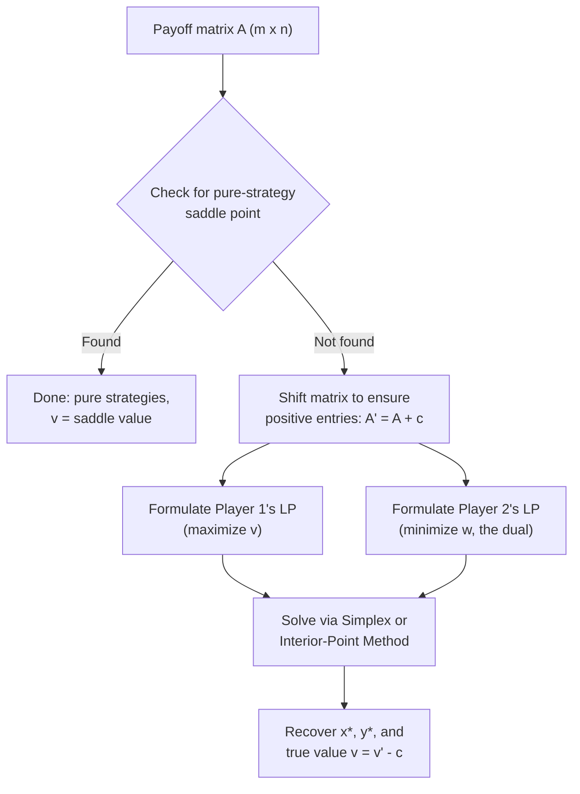

## Solving Games with Linear Programming


### Definition

Solving a zero-sum game with **linear programming (LP)** means reformulating each player's problem of finding an optimal mixed strategy as a linear optimization problem — a linear objective function subject to linear constraints — and solving it using standard LP methods (e.g., the simplex algorithm or interior-point methods). This approach provides a **constructive, computationally efficient** (polynomial-time) method for finding the value of the game and both players' optimal mixed strategies, directly operationalizing the existence guarantee of the Minimax Theorem.

### Why Linear Programming Applies

The Minimax Theorem guarantees that for a finite two-player zero-sum game with payoff matrix $A \in \mathbb{R}^{m \times n}$:

$$\max_{x \in \Delta_m} \min_{y \in \Delta_n} x^T A y = \min_{y \in \Delta_n} \max_{x \in \Delta_m} x^T A y = v$$

Both the outer maximization (over $x$) and the inner minimization (over $y$) — and vice versa — are linear in the respective strategy variables once the other player's strategy is fixed. This bilinearity, combined with the simplex constraints ($\sum x_i = 1$, $x_i \geq 0$), allows each player's optimization to be expressed entirely with linear objectives and linear (in)equality constraints — precisely the form required for linear programming.

### Formulating Player 1's LP (Row Player, Maximizer)

Player 1 wants to choose $x = (x_1, \ldots, x_m)$ to maximize the guaranteed expected payoff against any response by Player 2. Introduce an auxiliary variable $v$ representing the worst-case guaranteed value:

$$\begin{aligned}
\text{maximize} \quad & v \\
\text{subject to} \quad & \sum_{i=1}^{m} x_i a_{ij} \geq v \quad \text{for all } j = 1, \ldots, n \\
& \sum_{i=1}^{m} x_i = 1 \\
& x_i \geq 0 \quad \text{for all } i
\end{aligned}$$

**Interpretation**: The constraint $\sum_i x_i a_{ij} \geq v$ for every column $j$ ensures that no matter which pure strategy Player 2 selects, Player 1's expected payoff is at least $v$. Maximizing $v$ finds the highest such guaranteed floor.

### Formulating Player 2's LP (Column Player, Minimizer)

Symmetrically, Player 2 chooses $y = (y_1, \ldots, y_n)$ to minimize the worst-case payoff conceded to Player 1:

$$\begin{aligned}
\text{minimize} \quad & w \\
\text{subject to} \quad & \sum_{j=1}^{n} a_{ij} y_j \leq w \quad \text{for all } i = 1, \ldots, m \\
& \sum_{j=1}^{n} y_j = 1 \\
& y_j \geq 0 \quad \text{for all } j
\end{aligned}$$

**Key Points**

- These two LPs are **dual** to one another in the sense of linear programming duality.
- By the **LP Strong Duality Theorem**, since both LPs are always feasible and bounded (the simplex constraints guarantee this), their optimal values coincide: $v^* = w^*$. This equality *is* the Minimax Theorem, now derived as a corollary of LP duality rather than proven via topological fixed-point arguments.
- Solving either LP yields both the game's value and the corresponding player's optimal mixed strategy; the other player's optimal strategy can be recovered from the dual solution (complementary slackness).

### Handling Negative Payoffs

Standard LP solvers typically assume non-negative decision variables and sometimes prefer non-negative objective components. If the payoff matrix $A$ contains negative entries, a common transformation is to add a sufficiently large constant $c$ to every entry of $A$, forming $A' = A + c$, ensuring $v' = v + c > 0$. This does not change the strategic structure of the game (adding a constant to all payoffs shifts the value without altering optimal strategies), and after solving, the true value is recovered as $v = v' - c$.

### Worked Example: Formulating and Solving a 2×2 Game

Consider the payoff matrix (no pure-strategy saddle point, verified by maximin $\neq$ minimax):

|  | $C_1$ | $C_2$ |
| --- | --- | --- |
| **$R_1$** | $2$ | $-1$ |
| **$R_2$** | $-1$ | $3$ |

**Step 1 — Add a constant to remove negatives.** Add $c = 2$: $A' = \begin{pmatrix} 4 & 1 \\ 1 & 5 \end{pmatrix}$.

**Step 2 — Set up Player 1's LP.**

$$\begin{aligned}
\text{maximize} \quad & v \\
\text{s.t.} \quad & 4x_1 + 1x_2 \geq v \\
& 1x_1 + 5x_2 \geq v \\
& x_1 + x_2 = 1, \quad x_1, x_2 \geq 0
\end{aligned}$$

**Step 3 — Solve using the indifference principle** (valid for $2 \times 2$ games without a saddle point: the optimal mix makes the opponent indifferent between their two pure responses). Set the two constraints to equality and substitute $x_2 = 1 - x_1$:

$$4x_1 + (1 - x_1) = x_1 + 5(1 - x_1)$$


$$4x_1 + 1 - x_1 = x_1 + 5 - 5x_1$$


$$3x_1 + 1 = -4x_1 + 5$$


$$7x_1 = 4 \implies x_1 = \frac{4}{7}, \quad x_2 = \frac{3}{7}$$

**Step 4 — Compute the transformed value $v'$:**

$$v' = 4 \left(\frac{4}{7}\right) + 1\left(\frac{3}{7}\right) = \frac{16 + 3}{7} = \frac{19}{7}$$

**Step 5 — Recover the true value:** $v = v' - c = \frac{19}{7} - 2 = \frac{5}{7}$.

**Step 6 — Solve Player 2's LP analogously** (by symmetry / indifference for Player 1): $4y_1 + y_2 = y_1 + 5y_2 \implies y_1 = \frac{4}{7}, y_2 = \frac{3}{7}$ (the symmetric structure of this particular matrix makes both players' optimal mixes coincide numerically; this is a feature of this specific example, not a general rule).

**Result**: Player 1 plays $R_1$ with probability $4/7$ and $R_2$ with probability $3/7$; Player 2 plays $C_1$ with probability $4/7$ and $C_2$ with probability $3/7$; the game value is $v = 5/7$.

### The Simplex Method as a Solution Engine

For matrices larger than $2 \times 2$, the indifference-equation shortcut becomes unwieldy (too many simultaneous equations, and it's unclear a priori which strategies are used with positive probability at the optimum). The standard general-purpose approach is the **simplex algorithm**, which:

1. Converts each inequality constraint into an equality by introducing **slack variables**.
2. Starts from an initial basic feasible solution (a vertex of the feasible polytope).
3. Iteratively moves along edges of the polytope to adjacent vertices that improve the objective, using a pivoting rule (e.g., Dantzig's rule or Bland's rule to avoid cycling).
4. Terminates when no adjacent vertex improves the objective — this vertex is a global optimum (by LP convexity, local optimality at a vertex implies global optimality).

**Key Points**

- The simplex method has exponential worst-case complexity in principle, but performs efficiently in practice on typical instances, including sizable game matrices.
- **Interior-point methods** (e.g., barrier methods) offer polynomial worst-case time guarantees and are preferred for very large-scale game instances in modern solvers.
- [Behavior may vary]: exact runtime and numerical stability depend on the specific solver implementation, matrix conditioning, and degeneracy in the payoff structure.

### Algorithmic Workflow Summary



### Complexity and Practical Considerations

- **Polynomial-time solvability**: Because two-player zero-sum games reduce to LP, and LP is solvable in polynomial time (via interior-point methods, per Khachiyan's ellipsoid method and later Karmarkar's algorithm), finding Nash equilibria in zero-sum games is computationally tractable — a sharp contrast to general-sum games, where Nash equilibrium computation is PPAD-complete (believed intractable in the worst case).
- **Software tools**: In practice, zero-sum games are solved using standard LP solvers such as `scipy.optimize.linprog` (Python), `lpsolve`, `CPLEX`, `Gurobi`, or `GLPK`, rather than by hand-deriving the simplex tableau.
- **Degenerate games**: When a payoff matrix has ties or redundant strategies, multiple optimal solutions (alternative optima) can exist; the LP will return one such vertex solution, but it may not be unique — dominated or redundant strategies can sometimes receive zero probability inconsistently across equivalent optimal solutions.

### Pseudocode: General Procedure



```
function solve_zero_sum_game(A):
    m, n = dimensions of A
    if saddle_point_exists(A):
        return pure_strategy_solution(A)
    c = -min(A) + 1   # shift constant to ensure positivity
    A_shifted = A + c
    # Player 1's LP: maximize v s.t. x^T A_shifted >= v * ones(n), sum(x) = 1, x >= 0
    x_star, v_shifted = solve_LP_maximize(A_shifted)
    # Player 2's LP is the dual; solve directly or via complementary slackness
    y_star, w_shifted = solve_LP_minimize(A_shifted)
    v_true = v_shifted - c
    return x_star, y_star, v_true
```

**Key Points**

- This pseudocode reflects standard practice; exact implementation details (variable ordering, solver tolerances, handling of degenerate vertices) may vary by library and are not guaranteed identical across solvers.

### Applications Beyond Classical Game Theory

- **Robust optimization**: minimax LP formulations underpin worst-case-robust decision-making in operations research and finance (e.g., robust portfolio optimization against adversarial market scenarios).
- **Machine learning**: adversarial training and certain formulations of boosting algorithms (e.g., the connection between AdaBoost and the minimax theorem, established by Freund and Schapire) rely on this same LP duality structure.
- **Network and resource allocation games**: LP-based solution methods extend to certain classes of network flow games and security resource-allocation games (e.g., Stackelberg security games use related but distinct LP/MILP formulations building on this foundation).

### Common Pitfalls

- **Forgetting to check for a saddle point first**: Setting up and solving the full LP is unnecessary overhead if a pure-strategy saddle point already resolves the game.
- **Sign-handling errors**: Failing to correctly shift the matrix to handle negative payoffs (or forgetting to shift the recovered value back) is a frequent source of computational error.
- **Assuming a unique optimal strategy**: LP solvers return *a* vertex optimum; in degenerate cases, other optimal mixed strategies achieving the same value $v$ may also exist and are not necessarily surfaced by a single solver run.
- **Confusing this method with general-sum game solving**: This LP-duality approach is specific to two-player *zero-sum* games; it does not directly extend to general-sum or $n$-player games, which require different computational methods (e.g., the Lemke-Howson algorithm for two-player general-sum games).

**Related Topics**

- The Minimax Theorem
- Saddle Points and the Value of a Game
- Linear Programming Duality (Strong and Weak Duality)
- The Simplex Algorithm
- Complementary Slackness
- Computational Complexity of Nash Equilibria (PPAD-Completeness)
- The Lemke-Howson Algorithm for General-Sum Games
- Robust Optimization and Adversarial Machine Learning