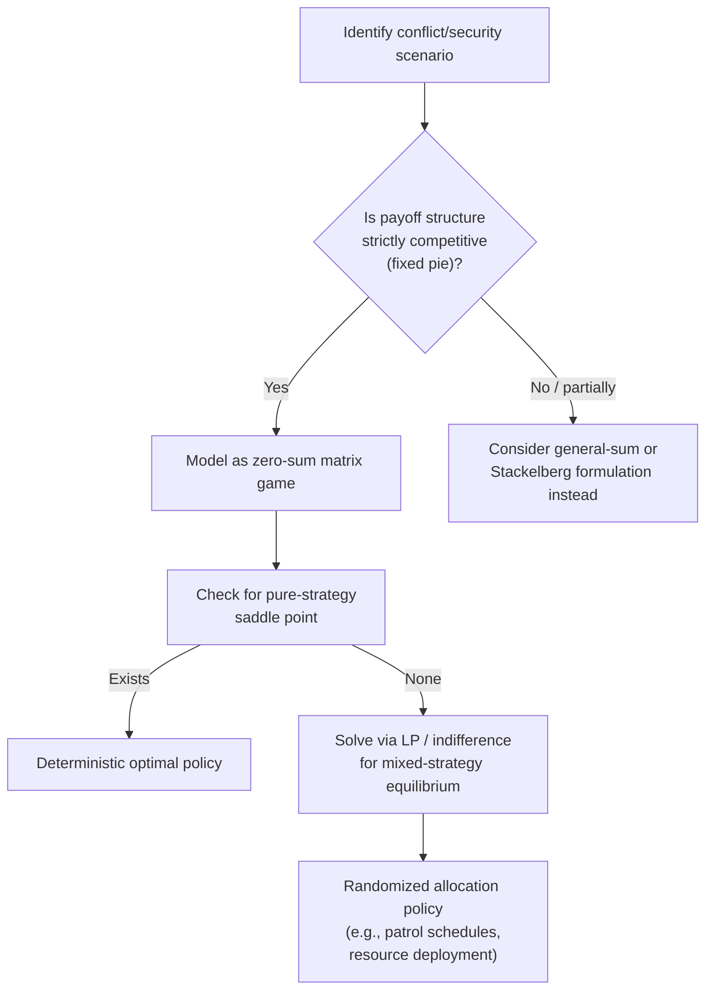

## Applications to Conflict and Security

### Overview

Zero-sum game theory has historically found its most vivid applications in modeling strictly competitive conflict — situations where one party's gain is exactly the other's loss, such as military strategy, arms races, resource contests, and adversarial security settings. This chapter item surveys how the mathematical machinery already established (the Minimax Theorem, saddle points, and LP-based solution methods) is applied to conflict and security domains, along with the important caveats about when the zero-sum assumption is (and is not) appropriate.

### Why Conflict and Security Motivate Zero-Sum Modeling

Many adversarial interactions have a natural strictly-competitive structure:

- **Military engagements**: territory or resources gained by one side are typically lost by the other.
- **Cybersecurity**: a successful intrusion is a direct loss for the defender and a direct gain (in terms of information or access) for the attacker.
- **Sports and competitive resource allocation**: a fixed prize (win/loss, market share) divided between exactly two competing parties.

**Key Points**

- The zero-sum framing is most defensible when there genuinely is a fixed "pie" being contested with no possibility of mutual gain or joint loss (e.g., a single battle for a fixed territory).
- [Inference] Many real conflicts (e.g., prolonged wars, cyber conflicts with escalation risk, arms races) are better modeled as general-sum games because both sides can simultaneously lose (e.g., through costly escalation) or, in principle, find mutually beneficial de-escalation — the zero-sum framing is a simplifying idealization that omits these possibilities.

### Classical Military Application: Colonel Blotto Games

The **Colonel Blotto game** is the archetypal zero-sum model of military resource allocation. Two commanders simultaneously allocate a fixed budget of troops across $n$ battlefields; on each battlefield, the side committing more troops wins that battlefield outright, and the overall winner is whoever wins a majority of battlefields (or accumulates the most battlefield-value).

**Formal setup**:

- Player 1 has budget $B_1$, Player 2 has budget $B_2$, allocated across $n$ fronts.
- On front $k$, the player allocating more resources wins the front's value $v_k$.
- Total payoff is the sum of values won, and since one side's win is the other's loss, the game is zero-sum.

**Key Points**

- The Colonel Blotto game generally has **no pure-strategy saddle point** — optimal play requires randomized allocation across fronts to avoid being predictably exploited, directly invoking the Minimax Theorem's necessity of mixed strategies.
- [Inference] Closed-form equilibrium solutions exist for the symmetric-budget, equal-value-front case (originally analyzed by Borel and later Gross and Wagner in the mid-20th century), but asymmetric-budget or asymmetric-value variants generally require numerical/LP-based solution methods.
- Modern extensions of Blotto-style models are used to study electoral campaign resource allocation, advertising budget competition, and cybersecurity resource deployment across multiple attack surfaces.

### Application: Search-and-Evasion / Pursuit Games

A classical security-relevant zero-sum model is the **search game** (or pursuit-evasion game): a hider (e.g., a submarine, a hidden asset, a fugitive) selects a hiding location or strategy, while a searcher simultaneously commits search effort across possible locations. The hider's payoff is the probability of evading detection; the searcher's payoff is the probability of detection — directly zero-sum (probabilities summing to 1).

**Key Points**

- These models were developed extensively during and after World War II (notably by Bernard Koopman's operations research work on anti-submarine warfare) and remain foundational to modern search theory.
- The equilibrium mixed strategy for the hider is typically to distribute hiding probability across locations in a way that equalizes the searcher's detection probability regardless of search allocation — a direct application of the indifference principle underlying mixed-strategy equilibria.

### Application: Network and Infrastructure Security

In cybersecurity and critical infrastructure protection, zero-sum-style models frame the interaction between a **defender**, who allocates limited protective resources (e.g., monitoring, patching, hardening) across a set of assets or attack surfaces, and an **attacker**, who selects a target to compromise.

**Simplified formalization**:

- Defender chooses a mixed strategy over which assets to protect (subject to a resource budget).
- Attacker chooses a mixed strategy over which asset to target.
- Payoff to the attacker (loss to the defender) depends on whether the targeted asset was adequately defended.

**Key Points**

- Pure zero-sum framing is a simplification: real-world security settings often involve the defender caring about multiple asset values differently than a purely adversarial attacker does, pushing toward general-sum or **Stackelberg security game** formulations rather than a strict simultaneous-move zero-sum matrix game.
- **Stackelberg Security Games (SSGs)**, used in real deployed systems such as airport patrol scheduling (the ARMOR system at LAX) and coast guard patrol allocation (PROTECT), extend this basic zero-sum intuition to a **leader-follower** structure (the defender commits first, publicly, and the attacker best-responds after surveillance) — this is a substantive departure from the simultaneous-move zero-sum setup and relies on different equilibrium concepts (Strong Stackelberg Equilibrium) rather than the minimax value directly.
- [Unverified] The exact algorithms and specific deployment details of contemporary security-game systems are proprietary or evolving; general architectural principles (mixed-integer linear programming formulations of the leader's optimal commitment) are well-documented in the academic literature, but current operational specifics should be verified against primary sources if precision is required.

### Worked Example: A Simplified Attacker-Defender Zero-Sum Game

Consider a defender protecting two assets, $A_1$ (high value) and $A_2$ (low value), with a single unit of defensive resource to allocate. The attacker chooses one asset to attack. Payoff to the attacker (loss to defender) is the asset's value if undefended, and a reduced value (successful defense) if defended.

| Attacker \ Defender | Defend $A_1$ | Defend $A_2$ |
| --- | --- | --- |
| **Attack $A_1$** | $2$ (defended, partial loss) | $10$ (undefended, full loss) |
| **Attack $A_2$** | $4$ (undefended, full loss) | $1$ (defended, partial loss) |

**Step 1 — Check for a pure-strategy saddle point.** Row minima (attacker's guaranteed floor per row): Attack $A_1$: $\min(2, 10) = 2$; Attack $A_2$: $\min(4, 1) = 1$. Maximin $= \max(2, 1) = 2$.

Column maxima (defender's worst case per column): Defend $A_1$: $\max(2, 4) = 4$; Defend $A_2$: $\max(10, 1) = 10$. Minimax $= \min(4, 10) = 4$.

**Step 2 — Compare.** $2 \neq 4$: no saddle point; both players must randomize.

**Step 3 — Solve via indifference** (this is the attacker's payoff matrix from the attacker/maximizer's perspective; the defender minimizes the attacker's expected payoff). Let the defender protect $A_1$ with probability $p$ and $A_2$ with probability $1-p$. Attacker's expected payoff from attacking $A_1$: $2p + 10(1-p)$; from attacking $A_2$: $4p + 1(1-p)$. Defender's optimal $p$ equalizes these:

$$2p + 10 - 10p = 4p + 1 - p \implies 10 - 8p = 1 + 3p \implies 9 = 11p \implies p = \frac{9}{11}$$

The defender should protect the high-value asset $A_1$ roughly $82\%$ of the time and $A_2$ about $18\%$ of the time — a direct, quantitative illustration of why security resource allocation should be randomized (and weighted toward higher-value assets) rather than following a fixed, predictable pattern.

### Diagrammatic Summary of the Conflict-Modeling Pipeline

### Real-World Caveats and Critiques

- **Escalation and mutual loss**: Genuine armed conflicts and cyber conflicts often carry costs to *both* sides (casualties, reputational damage, financial cost of cyberattacks even when "successful"), which zero-sum framing structurally cannot represent — general-sum game models or repeated-game frameworks with reputation and deterrence dynamics are frequently more appropriate for these richer strategic settings.
- **Nuclear deterrence and MAD**: [Inference] Cold War nuclear strategy is commonly discussed using game-theoretic language, but the relevant models (e.g., Chicken, Prisoner's Dilemma variants) are typically general-sum, not zero-sum, since mutual destruction represents a shared catastrophic loss rather than a one-sided win — this is a common point of popular confusion, since "game theory and the Cold War" is often loosely associated with the (zero-sum) Minimax Theorem despite the actual models used being non-zero-sum.
- **Information asymmetry**: Many real conflict/security settings involve imperfect or incomplete information (e.g., the attacker not knowing the defender's exact resource level, or vice versa), which requires **Bayesian game** extensions beyond the classical complete-information zero-sum framework covered here.

### Common Pitfalls

- **Over-applying the zero-sum label**: Not every adversarial interaction is zero-sum; misclassifying a general-sum conflict as zero-sum can lead to systematically wrong strategic recommendations (e.g., ignoring possible mutually beneficial de-escalation).
- **Ignoring the leader-follower distinction**: Applying simultaneous-move zero-sum equilibrium concepts to inherently sequential security settings (where a defender's policy is often observable or crackable by a patient attacker) understates the strategic advantage a committed public strategy can provide the defender under the Stackelberg framing.
- **Treating equilibrium mixed strategies as literal operational schedules without adaptation**: real deployed systems must also account for practical constraints (e.g., logistics, legal requirements, resource indivisibilities) beyond the idealized mathematical solution.

**Related Topics**

- The Minimax Theorem
- Colonel Blotto Games
- Stackelberg Games and Strong Stackelberg Equilibrium
- Search and Pursuit-Evasion Games
- Bayesian Games and Incomplete Information
- General-Sum Games (Prisoner's Dilemma, Chicken)
- Repeated Games and Deterrence Theory
- Solving Games with Linear Programming