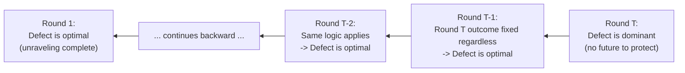

## Finitely Repeated Games

### Definition

A **finitely repeated game** consists of a **stage game** $G$ (a normal-form game played by the same set of players) that is played a fixed, commonly known number of times $T$. After each round, players observe the outcome of that round (typically the actions chosen) before proceeding to the next round. The overall payoff to each player is typically the (possibly discounted) sum of the stage-game payoffs across all $T$ rounds:

$$U_i = \sum_{t=1}^{T} \delta^{t-1} \, u_i(a^t)$$

where $a^t$ is the action profile played in round $t$, $u_i$ is player $i$'s stage-game payoff function, and $\delta \in (0, 1]$ is a discount factor (often set to $\delta = 1$ in the simplest finite-horizon treatments, since the horizon is finite and discounting is not needed to ensure convergence).

### Distinguishing Finitely vs. Infinitely Repeated Games

The defining feature of a finitely repeated game is that $T$ is **finite and common knowledge** to all players. This has profound strategic consequences that sharply distinguish it from the infinitely repeated (or indefinitely repeated) case:

| Feature | Finitely Repeated | Infinitely Repeated |
| --- | --- | --- |
| Horizon | Fixed, known $T$ | Infinite, or indefinite with continuation probability |
| Backward induction applicable? | Yes | No (no terminal round to anchor induction) |
| Cooperation sustainable via threats? | Often unravels (see below) | Yes, via folk theorems |
| Key solution technique | Backward induction / SPE | Trigger strategies, folk theorems |

**Key Points**

- The finite, known horizon means the game tree has a well-defined final round, which makes the entire repeated game itself amenable to backward induction, connecting directly back to Zermelo's Theorem and the general theory of extensive form games with perfect (or imperfect, depending on observability) information.
- This tractability is also the source of the most famous counterintuitive result in this area: the **unraveling problem**, discussed below.

### The Unraveling Problem: Finitely Repeated Prisoner's Dilemma

Consider the stage game **Prisoner's Dilemma**:

|  | Cooperate | Defect |
| --- | --- | --- |
| **Cooperate** | $(3, 3)$ | $(0, 5)$ |
| **Defect** | $(5, 0)$ | $(1, 1)$ |

This game has a unique Nash equilibrium (Defect, Defect), yielding $(1,1)$ — strictly worse for both players than mutual cooperation $(3,3)$, the defining tension of the Prisoner's Dilemma.

**Claim**: If this stage game is repeated a *finite*, commonly known number of times $T$, the **unique subgame perfect equilibrium** is to defect in every single round, regardless of how large $T$ is.

**Proof by backward induction**:

1. **Round $T$ (the last round)**: Since there is no future round to punish or reward behavior, each player's dominant strategy in the last round is exactly the stage-game Nash equilibrium: Defect. This holds regardless of the entire history of play up to round $T$.
2. **Round $T-1$**: Since both players know (by step 1) that Defect will be played in round $T$ *no matter what happens in round $T-1$*, there is no way to influence round $T$'s outcome through round $T-1$ behavior. Cooperation in round $T-1$ cannot be "rewarded" or "punished" via round $T$, so round $T-1$ collapses to the same one-shot logic: Defect is again optimal.
3. **Induct backward**: This argument recurses all the way to round $1$. At every round, because all *subsequent* rounds are already determined to be Defect–Defect regardless of current play, there is no strategic value to cooperating now.

**Conclusion**: The unique SPE outcome is **Defect in every round**, for any finite $T$, including very large $T$. This is often called the **chain-store paradox** in a related context (Selten, 1978) and represents one of the most striking demonstrations that backward induction, while formally rigorous, can produce predictions that seem to conflict sharply with observed real-world and experimental cooperative behavior.

### Diagram: Backward Induction Unraveling

### Key Points on the Unraveling Result

- **This result generalizes**: Any finitely repeated game whose stage game has a **unique Nash equilibrium** will have a unique subgame perfect equilibrium consisting of playing that stage-game Nash equilibrium in every round, by the identical backward induction argument.
- **The result depends critically on uniqueness of the stage-game equilibrium**: if the stage game has **multiple Nash equilibria**, cooperation *can* be sustained in earlier rounds, because players can credibly condition which of the multiple last-round equilibria will be played based on earlier behavior (this is sometimes called using equilibrium selection as an implicit "reward/punishment" mechanism), even though no explicit punishment beyond equilibrium play is used.
- [Inference] This multiple-equilibria escape route is the basis of a well-known result (Benoit and Krishna, 1985) showing that with sufficiently many stage-game Nash equilibria of different payoffs, cooperative behavior can be supported for most of a finite horizon, with defection concentrated only near the very end.

### Worked Example: Escaping Unraveling via Multiple Equilibria

Suppose the stage game has **two** pure Nash equilibria: $(1,1)$ (as before, "bad" equilibrium) and $(2,2)$ (a "good" equilibrium, perhaps corresponding to a different but still individually rational action profile). Players can adopt a strategy such as:

> "Cooperate in rounds $1$ through $T-1$. If both players cooperated in every prior round, play the good equilibrium $(2,2)$-supporting actions in round $T$. If anyone deviated at any point, play the bad equilibrium $(1,1)$-supporting actions in round $T$ (and in all subsequent rounds, if any)."

Since which last-round equilibrium is played is itself always a Nash equilibrium of the stage game (both are), this construction is **subgame perfect**: no player benefits from deviating early, because doing so triggers a switch to the worse last-round equilibrium — a credible, self-enforcing threat, unlike an off-equilibrium threat to simply "not play a Nash equilibrium," which would not be credible.

**Key Points**

- This illustrates that the pessimistic Prisoner's Dilemma unraveling result is a special case driven by the PD's **unique** equilibrium, not an inevitable feature of all finitely repeated games.
- [Inference] Constructing the precise incentive-compatible threshold for how much cooperation can be sustained (and for how many rounds before unraveling to the bad equilibrium near the endgame) generally requires careful case-by-case analysis of the specific payoff structure.

### Worked Example: Finitely Repeated Cournot Duopoly (Multiple Equilibria via Punishment)

Even without literally multiple stage-game Nash equilibria, some finite-horizon models sustain partial cooperation using a mix of trigger-strategy logic in early rounds and unraveling only near the very end. Consider a simplified two-firm quantity-competition game repeated $T = 10$ times, where firms could in principle collude at $q^{collude} < q^{Nash}$ for higher joint profit. Because the stage game (standard Cournot) has a **unique** Nash equilibrium, the same unraveling logic as the Prisoner's Dilemma applies in the strictest theoretical sense: full defection to $q^{Nash}$ is the unique SPE prediction in every round.

**Key Points**

- [Inference] In practice and in experimental economics, observed behavior in finitely repeated games with a unique stage-game equilibrium frequently shows cooperation persisting for a substantial portion of the game, only breaking down near the final rounds — a well-documented empirical divergence from the sharp theoretical prediction, often attributed to factors like bounded rationality, altruism/reciprocity preferences, or strategic uncertainty about the opponent's rationality, none of which are captured in the canonical backward-induction model.

### The Centipede Game: An Extreme Illustration

The **Centipede Game** is a related, starkly illustrative extensive-form example of unraveling logic. Two players alternate the choice to "pass" (grow a shared pot) or "take" (end the game, grabbing the larger share for the taker). Backward induction predicts the first player takes immediately at the very first opportunity, even though mutual passing for many rounds would yield a much larger total payoff for both. This result is frequently cited alongside finitely repeated Prisoner's Dilemma unraveling as a canonical demonstration of backward induction's sometimes counterintuitive bite, and it is heavily studied in experimental economics because real human subjects very rarely play the backward-induction prediction, often passing for several rounds.

### Practical and Behavioral Considerations

- **Experimental evidence**: [Inference] Laboratory experiments on finitely repeated Prisoner's Dilemma and Centipede games consistently find higher rates of cooperation/passing than the SPE prediction, particularly in early-to-middle rounds, with convergence toward the theoretical prediction typically only in the last one or two rounds — this is a robust empirical regularity across many studies, though specific magnitudes vary by experimental design and subject pool.
- **Bounded rationality and level-k reasoning**: Explanations for the observed gap between theory and behavior often invoke models where players do not perform unlimited levels of backward-induction reasoning (e.g., "level-k" thinking), or where players hold uncertain beliefs about whether their opponent is a purely rational payoff-maximizer versus a "cooperative type" (as in reputation models, discussed further under infinitely/indefinitely repeated games).
- **Applications**: Despite the stark unraveling prediction, finitely repeated game frameworks remain useful for analyzing real strategic settings with known end dates, such as end-of-season sports tournaments, contract negotiations with fixed deadlines, or auctions with a known final round, where "endgame effects" (increased defection or aggressive behavior near the deadline) are frequently observed and consistent with the theory's qualitative prediction, even if the very first round does not immediately unravel exactly as the sharpest theoretical case predicts.

### Common Pitfalls

- **Assuming repetition alone guarantees cooperation**: A common student misconception is that simply repeating a Prisoner's-Dilemma-like game enables cooperation; this is false for a *finite*, commonly known horizon with a unique stage-game equilibrium — the folk theorem's cooperative possibilities specifically require an *infinite* or *indefinite* horizon (covered separately).
- **Neglecting the "commonly known" requirement**: If the exact end date $T$ is uncertain (rather than fixed and known), the game behaves more like an indefinitely repeated game, and cooperation can be sustained — the sharp unraveling result depends critically on $T$ being common knowledge.
- **Overgeneralizing the unraveling result to all finitely repeated games**: As shown, stage games with multiple Nash equilibria can support substantial cooperation even under a finite, known horizon; the Prisoner's Dilemma result is a special (though very commonly cited) case.
- **Behavior may vary**: Real-world and experimental deviations from the SPE prediction are well documented, so this theoretical result should be applied with appropriate caveats when used to predict actual observed behavior rather than purely normative/rational benchmarks.

**Related Topics**

- Zermelo's Theorem and Backward Induction
- The Chain-Store Paradox (Selten, 1978)
- The Centipede Game
- Infinitely Repeated Games and the Folk Theorem
- Trigger Strategies and Grim Trigger
- Subgame Perfect Equilibrium
- Multiple Equilibria and Equilibrium Selection
- Bounded Rationality and Level-k Reasoning in Game Theory